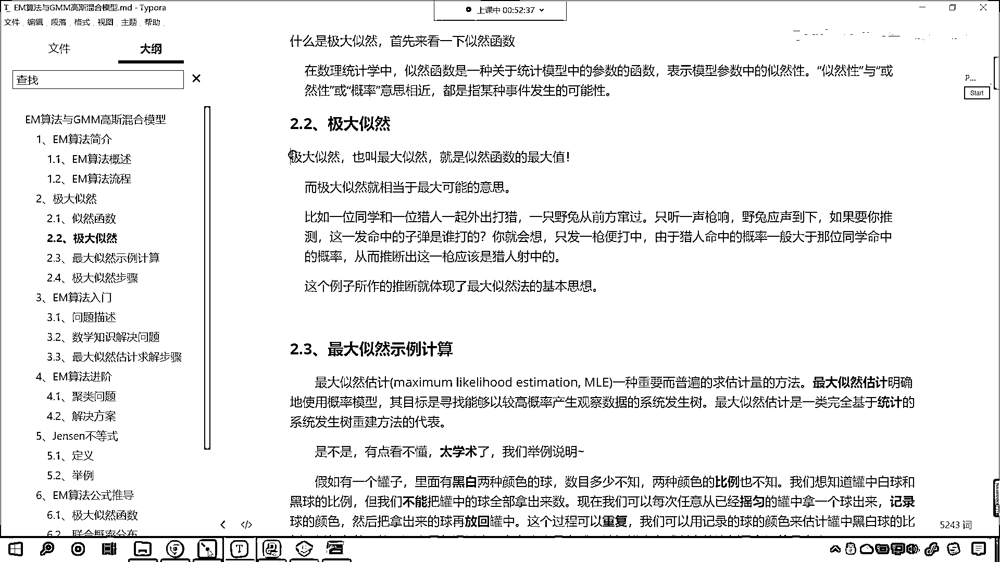
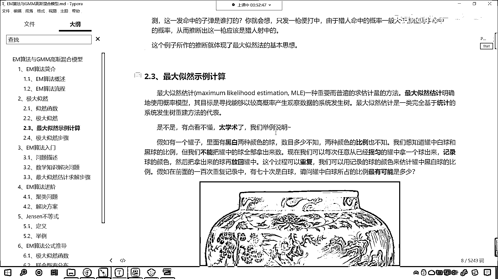
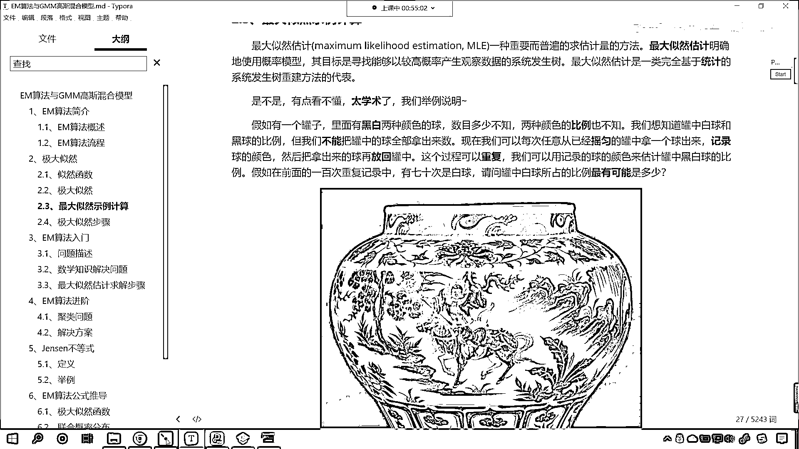
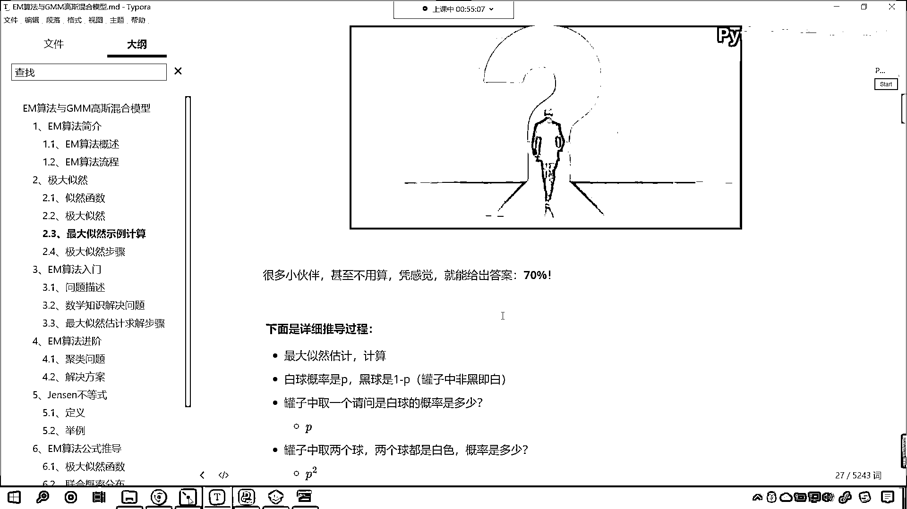
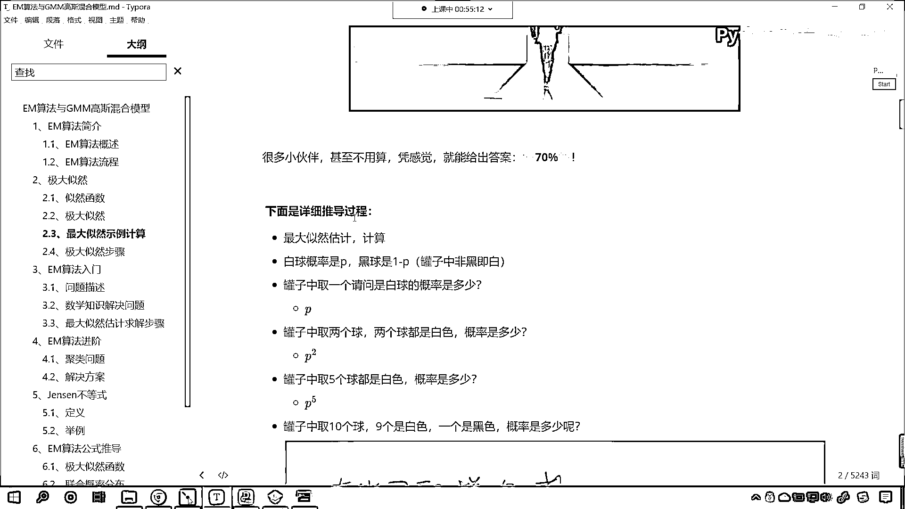
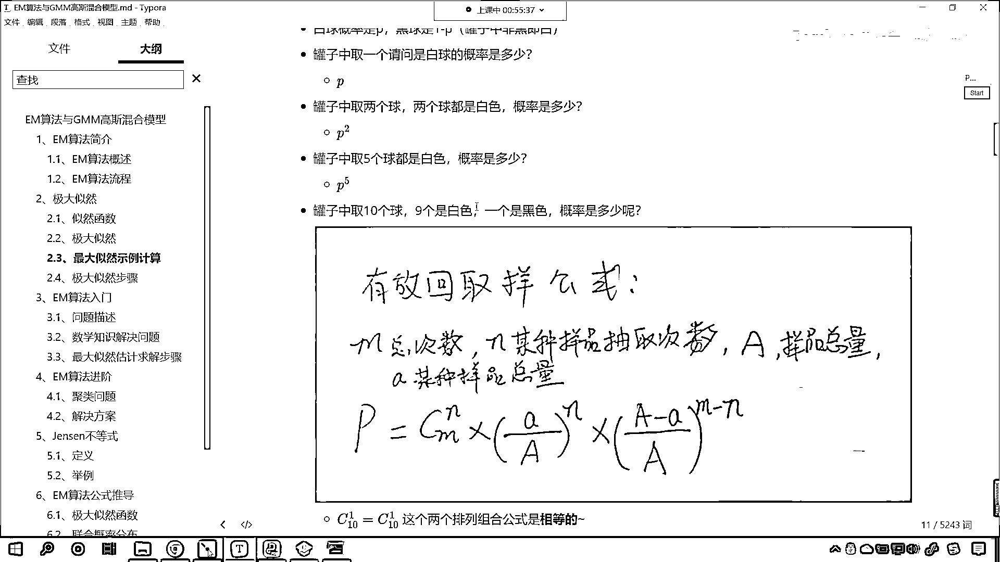
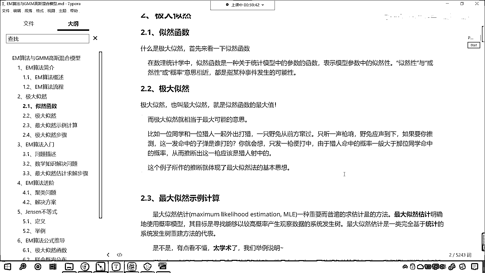

# 7天爆肝整理！AI量化交易-机器学习全套教程，从入门到项目实战保姆级教程！（数据挖掘分析／大数据／可视化／投资／金融／股票／算法） - P171：4-极大似然思想 - Python校长 - BV1KL411z7WA

來 現在咱們看一下什麼是極大自然，這個呢是咱們數理統計當中的一個概念，這個什麼是極大自然呢，就表示咱們模型當中的自然性 或然性 或概率的意思，極大自然呢也叫最大自然 就是自然函數的最大值。

比如說咱們舉這樣一個例子啊，一位同學和一位獵人一起外出打獵，一隻野兔從前方竄過，這個時候呢只聽見一聲槍響，野兔應聲倒下，如果你推測這一發命中的子彈是誰打的，你就會想只發一槍便打中。

由於獵人的命中率一般大於那位同學的命中率，從而呢我們就推斷出這一槍應該是獵人射中的 是不是啊，你看 你想我推測是學生打中的行不行啊，你看我推測是學生打中的行不行，你看讓你推測這一發子彈是誰打的 對吧。

有沒有同學推測是這位學生打的呀，誤打誤撞 瞎貓碰見死耗子 是不是啊，你看這兒呢大概率來說是獵人，你就像是吧，好比中國隊參加世界杯總決賽，我們碰到的是英國隊或者說德國隊。

那假設說是吧中國隊參加世界杯了啊總決賽，那請問誰可能會贏呢，到底是中國隊呀還是德國隊會贏呀，那我們都我們根據現在的這個水平，我們就推測大概率上來說應該是德國是不是贏得這個世界杯的比賽啊。

你知道每次在進行世界杯比賽的時候是不是都會有博彩呀，對不對，你看你如果要是買中國那就是一賠一百，啥意思呀，比如說你投了一萬塊錢，是吧，投了一萬塊錢，你就賭中國贏，假設說中國真給贏了。

那你最後就可以得到一百倍，如果說你要是賭德國贏，是吧，那這個時候呢，那可能就是這個一賠一，是吧，你賭贏了，是吧，你投了一萬塊錢，最後你只能得到一萬，我們的博彩思想當中，它是不是也是根據概率來進行的呀。

對吧，所以說那咱們舉的這個例子，如果各位小夥伴能夠明白，其實你就知道什麼叫極大自然了。

好，那麼這個最大自然估計，這一部分的內容呢，是我們之前講過的啊，你看我們還舉一個罐子當中黑白球的這個案例。

咱們先把這個問題描述一下，罐子當中有黑白兩種顏色的球，數目多少咱們不知道，兩種顏色的比例也不知道，我們想知道罐子當中白球和黑球的比例，但是呢，咱們不能把罐子當中的球全部拿出來來數一下。

但是我們可以每次任意從已經搖雲的罐子當中拿出一個球來數一下，咱們的記錄球的顏色，然後把拿出來的球再放回到罐子當中，是吧，這個過程可以重複，對咱們這個是介紹過的，這個就是在咱們之前線性回歸當中，是吧。

我們講過，那今天我們講到了EM這個算法，咱們現在呢，再大概的過一下，看看這個最大自然，他到底是怎麼回事，後面呢，我們這個推導EM算法的推導過程，我們呢都會用到咱們這個極大自然，好，那麼這個過程呢。

拿球的這個過程可以重複，我們呢，可以用記錄球的顏色來估計咱們罐子當中黑白球的比例是一個什麼樣的情況，假設說呢，我們重複了100次這樣的實驗，咱們就發現有70次是白球，那麼也就意味著有30次是黑球。

這個時候問你一個問題，請問罐子當中白球所佔的比例最有可能是多少，好，那麼我們有小夥伴搶答了，說這個比例是7比3，對不對，好，那麼7比3也就意味著咱們的白球所佔的比例，是不是就是70%呀，對吧，好。

那麼這個是怎麼算的呀，那我們不用算，咱們是不是通過感覺我們就能夠說出來呀，對不對呀，這是你大腦進化過程當中，是吧。

一點一點給你計算出來的一個比較靠譜的一個結果。

好，那麼到底是怎麼算的，是吧，你看就是70%。

這個是正確的啊，那下面就是詳細的推導過程。

我們令白球的概率是P，黑球是1-P，是吧，那如果你要取一個，是白球，它的概率就是P，罐子當中取兩個球，兩個球都是白色，那它的概率就是P的平方，如果我們罐子當中取五個球，五個都是白色。

那麼它的概率就是P的五次幂，是吧，那罐子當中取十個球，九個是白色。

一個是黑色，那這個概率該怎麼寫呢，那就是咱們C11，是吧，這個就是排列組合，然後P的九次幂乘以1-P的一次幂，是吧，那同樣的道理，如果說我們假設說，是吧，咱們罐子當中的球，是吧，取了100個。

70次是白球，30次是黑球，那這個概率呢，咱們就可以使用排列組合，加上咱們的概率乘法，是不是就可以用這個來表示呀，那麼最大自然的問題呢，就是球咱們的P，什麼時候最大，就是你這個概率啥時候最大呀，對不對。

啥時候，你這個白球的概率是多少的時候，最有可能出現，咱們70次是白球，30次是黑球，這種情況呢，是吧，那我們就求導唄，是吧，求導令導數為零，最後咱們公式化解，我們求解出來的答案，求解出來的結果。

這個P就是70，各位小夥伴還要仔細去看一下啊，咱們的推導過程，嚴謹的推導過程，就是從這到這，這個是數學的這個過程，那我們很多人呢，咱們憑感覺，我們就能夠得到70%，在這裡呢，我專門把推導的過程。

咱們用數學，邏輯嚴謹，咱們給他表示一下，你看這個就是數學，他的魅力，這就是數學的魅力，是吧，我們通過求導，咱們就得到了，那你想一下，你看咱們人類，現在是不是這個世界上進化的，最高等的文明呀，其實你想。

你的大腦當中到底是怎麼工作呀，你看你的大腦中，他的工作流程，就是這樣，你只不過你感覺不到，你的大腦當中，大概有1000億個腦細胞，知道吧，你的大腦當中有1000億個腦細胞，他的計算速度非常快。

比現在這個世界上，任何一個這個計算機，計算速度都要快，所以說，你一下子就感覺到了，是吧，你感覺出來的結果是70%，和我們使用數學公式去計算，得到的結果，那是一模一樣的，所以說，很多時候，你的感覺呢。

都有依據，知道吧，感覺都要都有依據，只不過呢，我們沒有一步一步的去經歷這個過程，所以說呢，我們感覺大腦好像沒有在工作一樣，其實大腦是相當複雜的，他是不是已經，巧無聲息的，把這份工作給我們做了，對不對。

好，那麼這個呢，就是我們極大自然，現在呢，我們又對這個知識點進行了回顧，EM算法，EM算法，他在執行第一步，計算期望的時候，計算期望的時候，他呢，進行了這個，最大自然估計，然後根據我們的最大自然估計呢。

去計算咱們的參數，計算了這個參數之後呢，又回到第一步，再去計算一下他的，最大自然估計，循環往復，形成了這個迭代算法，你越循環越接近，最後的話，你E步和M步這兩步，循環循環循環，最後，你的參數不再變化了。

那麼我們就找到最終的這個答案了，好，那麼，這一段知識呢，我们讲解了极大自然。。

