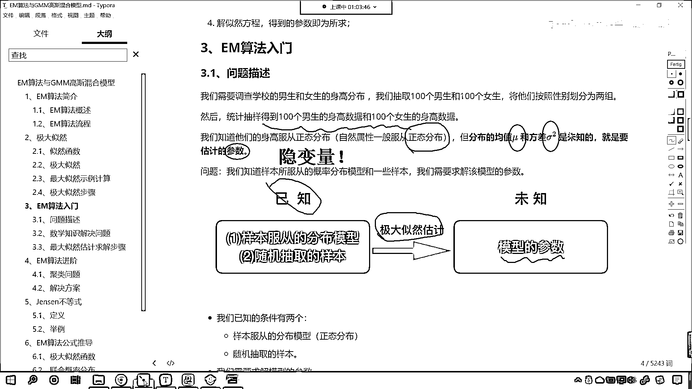
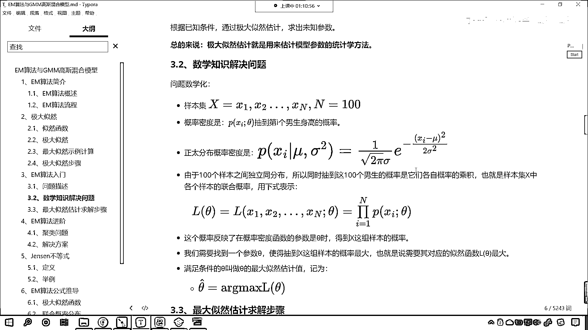
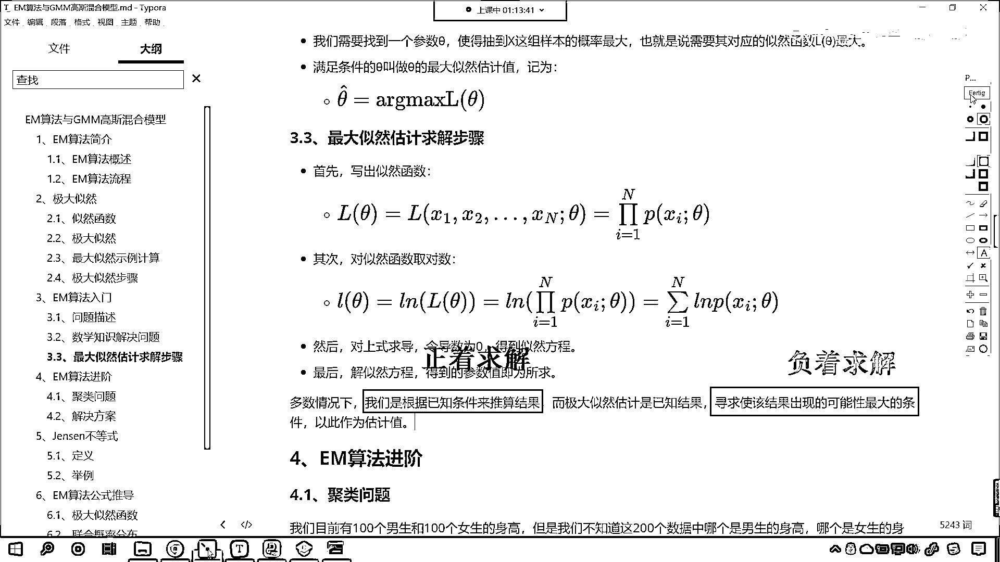
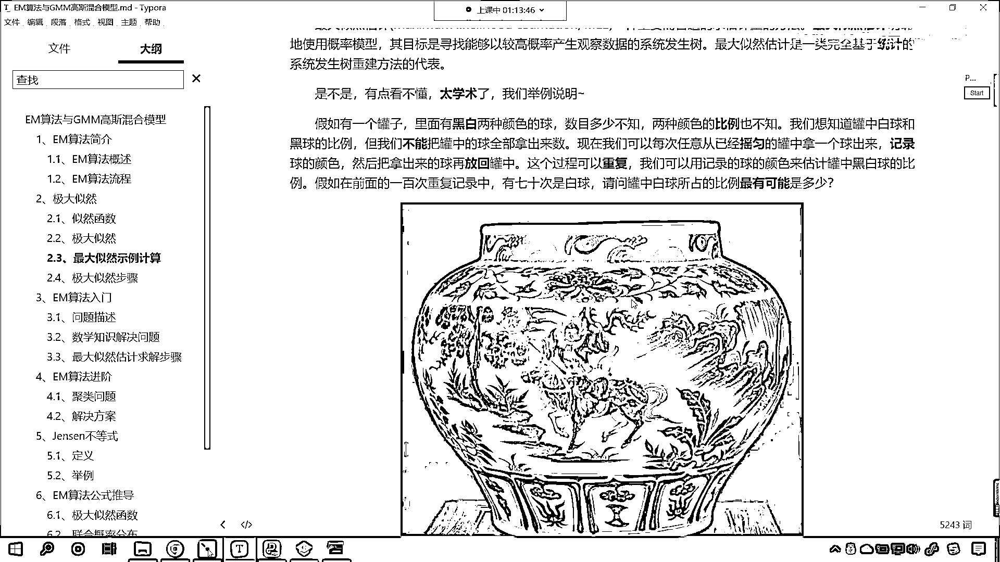
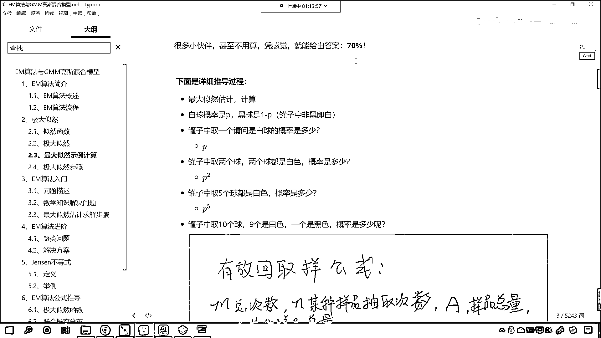
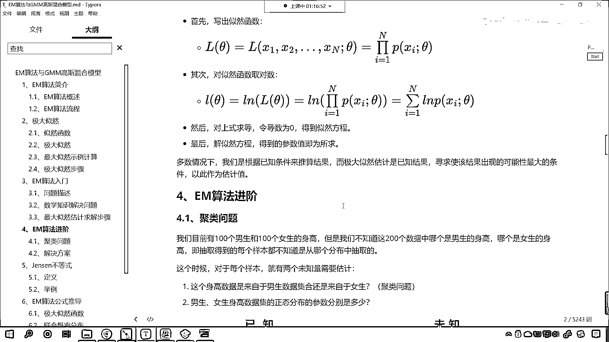

# 7天爆肝整理！AI量化交易-机器学习全套教程，从入门到项目实战保姆级教程！（数据挖掘分析／大数据／可视化／投资／金融／股票／算法） - P172：5-EM算法入门举例介绍 - Python校长 - BV1KL411z7WA

來各位小夥伴 接下來呢 我們繼續往下看，咱們看一下這個EM算法 是吧 它到底是怎麼回事，咱們呢 結合具體的問題 是吧 我們進行講解，比如說咱們學校呢 需要調查一下男生和女生的這個身高分佈。

我們呢 抽取100個男生和100個女生 咱們呢 將他們按照性別 我們劃分成兩組，然後呢 我們統計抽樣得到的100個男生的身高數據和100個女生的這個身高數據。

那我們知道 他們的身高肯定是服從正態分佈的 對不對，那如果要是正態分佈的話 那正態分佈是不是有一個概率密度公式啊，那這個概率密度公式當中呢 是由它的均值和方差來確定的。

我們往下滑 現在你就能夠看到 正態分佈 也就是高斯分佈，它的概率公式是不是這樣的 那這個公式是誰推導出來的，是不是就是高斯呀 這個就是高斯推導出來的一個概率的分佈公式。

對不對 這就是高斯推導出來的啊 這個當中的μ就是身高的平均值，這個當中的σ就是咱們身高的這個方差 就是身高的方差，好 現在呢 你看 咱們統計抽樣得到的100個男生的身高數據。

就是把他們的身高記錄一下 把女生的身高也記錄一下，那我們知道他們是服從正態分佈的 對吧，那就一定對應著一個均值和一個方差 就是我們要估計的參數，大家注意啊 這個μ和咱們的σ是我們要估計的參數。

這個是不是就是咱們上面所講到的隱含變量呀 對吧，這個就是隱變量啊 咱們在這說一下啊，這個就是隱 隱含的隱 這個就是咱們隱變量，這是我們要求解的 那有同學就說了。

你看 你不是有100個男生的身高數據和100個女生的身高數據，你直接求一下 這均值不就出來了嗎，你直接這個除一下 直接計算一下這個方差不就出來了嗎。

對不對 大家注意啊 咱們這抽樣取出來的是不是一個樣本啊，對不對 你看這是一個樣本 對不對，有可能你在抽的時候 你想是不是存在一定的偏差呀，對不對 你肯定存在一個偏差 對吧。

有的時候你可能抽的這個男生普遍這個身高他就偏高了，或者抽的時候咱們這個男生普遍身高偏低了，這都是有可能的啊 所以說我們在進行計算的時候，是吧 咱們使用什麼呢 咱們使用EM算法來去求解這個μ和這個σ。

那我們就根據這種思想 咱們來進行一個求解，你看已知的是什麼 樣本服從的分佈模型 那就是正態分佈了，還有就是咱們隨機抽樣的樣本 這個是已知的 對不對，那我們通過極大自然估計 咱們要求的是誰啊 模型的參數。

那我們已經知道這個模型是正態分佈了 對不對，那麼正態分佈他們的核心不就是μ和σ嗎 對吧，那就是這兩個是我們要求的 那看一下我們怎麼求呢 對吧。

已知的條件是樣本服從分佈的模型 正態分佈，另外呢就是咱們隨機抽樣的樣本，也就是說你這個每個人身高多少 咱們都是知道的，那我們要求的是模型的這個參數 咱們根據已知條件。

我們通過極大自然 咱們呢就可以求解出未知的參數，那總體來說呢 極大自然就是用來估計模型參數的統計學方法，大家注意啊 你看到這裡 咱們是不是就根據這個案例。

是不是就將這個極大自然它的作用是什麼 是不是進行了一個說明呀，它是不是就是用來估計咱們模型參數的統計學方法呀，好 那麼上面這個問題呢 上面這個問題 咱們將問題給引出來了。

那引出來之後 接下來咱們把它轉變成一個數學問題啊，看 轉變成一個數學問題 那我們把問題數學化，這個時候有樣本x1 x2一直到xn 咱們假設說這個是男生的數據。

那這個n是不是就是100呀 對不對呀 那我們的概率密度呢，看到了吧 就是咱們的p(x，i)c^2 這個當中有一個變量θ，這個θ表示什麼 你知道此處的θ表示什麼嗎。

此時的θ 大家注意啊 此時的θ代表咱們的μ和σ，θ呢就表示咱們的參數 知道嗎 這個θ就表示咱們要進行求解的參數，θ表示我們要進行求解的參數 它是這麼個意思，好 那麼你注意啊 你看我們是如何表示概率的呀。

咱們是不是這樣寫的呀 p(x，i)，然後是不是又給了個分號 分號後邊是不是給了個θ呀，那這個表示概率 它什麼意思呢，就是x，i這個樣本在咱們參數θ的情況下 它的概率是多少。

那高斯已經為我們推導出來了 正態分佈的這個概率，那就是後面這個公式 你想這個當中是不是就有一個μ和一個σ呀，由於100個樣本之間是獨立分佈的 所以同時抽到這100個男生的概率。

是由他們各自概率的乘積 對不對呀 是不是就是一個連乘呀，這個概率反映了在概率密度函數 參數是θ時得到的x這組樣本的概率，你看這個不就是極大自然嗎 我們希望它越大越好。

我們希望我用這個框框起來的這個越大越好，是不是呀 你看這不就是咱們的極大自然嗎 希望它越大越好，和咱們上面講解極大自然 黑球白球其實是不是一樣的呀。

對不對呀 我們需要找到一個參數θ 使得抽到x這組樣本的概率最大，也就是說對應的自然函數Lθ最大，那麼滿足條件的θ叫做θ的最大自然估計紀維。

現在你就能夠看到我們把最合適的那個值就叫做θ上面帶著一個向上的小餘號，這個就是滿足條件 滿足條件是不是就是最合適的那個值呀，對吧 你看我們把它記作這個 咱們把它記作這個。

那記作這個這不就求解出來了值嗎 那一般情況下這個值該如何求解呢，求導數令導數為零就可以了，好 現在你就能夠發現 咱們是不是將身高的這個問題，我們把它轉換成數學問題了呀 對不對。

那有同學就說了老師有必要這麼麻煩嗎，有必要這麼麻煩嗎 是吧 有了這100個人的數據，咱們直接求平均不就行了嗎 對 直接求平均是更簡單的方法，但是你看這em是什麼 你看這em是不是一個算法呀。

總有一些數據 總有一些數據 你呢是不知道它是什麼樣的一個分佈，總有一些數據 你呢不像咱們剛才提的這個問題這麼簡單，是吧 我們可以隨機抽樣 是不是。

你就好比 是吧 因為我們有男生女生 咱們隨機從班裡邊抽出來一些樣本，我們是可以計算的 對不對呀，那有一些問題你沒有辦法把它這個拿出來 是吧，你比如說這個股票的預測 是吧 或者說一些一些問題 是吧。

你沒有辦法去對它進行這個驗證，所以說呢 這個時候才有這個算法的問世 是吧，這個算法呢 也就出來了 我們根據極大自然對它進行一個求解，好 那麼咱們看一下 有了咱們上面把問題的這個數學化之後。

咱們呢就最大自然估計 按照這個步驟來進行求解，首先呢 我們寫出自然函數 這個自然函數其實就是概率的累乘，然後呢 我們對自然函數求對數 因為累乘不容易求 累加容易求。

這個時候呢 咱們就對它求對數 那它的單調性沒有發生變化，之前是單調遞增 求完對數之後 依然是單調遞增，所以說依然可以求 然後呢 咱們對於上是求導令導數為零，是不是就可以得到自然的方程了呀。

看了吧 你這個自然方程這個P有幾個參數呀，根據咱們上面最大自然 根據咱們上面個正態分佈的這個概率。

這個概率密度 裡邊是不是有一個μ 裡邊是不是還有一個σ呀，我們求導數令導數為零 是不是就可以求解出了這個值呀，對不對 你看令導數為零 不就有方程了嗎，有了方程 那這個μ是不是就可以進行求解呀 對不對。

最後呢 咱們解自然方程 咱們得到的這個參數值即為所求，在多數的情況下 我們是根據已知條件來推算咱們的結果，而極大自然是已知結果 尋求是該結果出現可能性最大的條件，以此作為估計 大家看啊 正好是相反的。

那我們把這句話呢 對它進行一個拆解，多數情況下 我們是根據已知條件來推測結果，就像咱們剛才說的那個簡單的做法，有了升高了 我們是不是可以求平均值呀，平均值 求了平均值不就是咱們的μ嗎。

有了升高數據了 咱們是不是可以計算它的方差呀，對吧 你看這都可以計算 是不是，有現成的數據 又有相應的公式去計算 這都沒問題呀，那麼極大自然是什麼呢 如果我們把前面當成一個正向的結果。

那麼極大自然呢 它是已知結果 咱們尋求的是什麼呀，已知結果 咱們尋求的是該結果出現的可能性最大的條件，那如果上面這個叫正著求解 咱們把上面這個叫做正著。

那這個呢就是正著求解 正負的正 這個呢就是正著去求解，那麼我們這個呢就是負著相反的方向去進行求解，那這個呢就是負著求解，反正你只要是合適的一個結果 那麼這個可能性一定是最大的。

你就好比咱們上面在介紹極大自然的時候。

你看為什麼它是70%呢 對不對。

為什麼是70%呢 因為這個P是70%的時候，這個P它是70%的時候 咱們這個概率是最大的。

你看這個概率是最大的，這個方程只有咱們的P是70%的時候 它才是最大的，那麼同樣你看同樣是吧 那我令它最大，看大家明白這個意思嗎 咱們現在呢進行一個說明，這是一種說法 這個P是70%的時候。

咱們前面的方程是最大的 這個大家能理解嗎，沒問題吧 你看我們再換一種說法，我們令前面的這個方程最大 那最大其實就是求導數對不對啊，然後呢你看那令前面方程最大 那就是導數為零唄。

那你導數要為零的話會怎麼樣，你看你導數為零的話 這個時候咱們求解的P它正好是70%，這就是咱們剛才EM算法所介紹到的，也就是說你P是70%這個方程是最大的。

那如果令這個方程最大求導數求解出來的P正好是70%，那如果說我們要把上面這個你看它是正著走，那下面這個呢你就可以認為它是反著走，是不是啊 你就像咱們在地球的遲到上。

一個人向東走 一個人向西走 最後這兩個人是不是依然會見面啊，對不對 他一直沿著遲到向東走 另一個人一直沿著遲到向西走，他們一定會會面對不對 所以說這就是咱們EM算法，看它這裡所說到的這個問題 是吧。

我們根據一致條件來推算結果 極大自然就是知道了這個結果，咱們尋找使該結果出現可能性最大的條件，這裡所說的條件其實就是求參數求方程，是吧 把我們需要找到的這個數據給他找到。

好 那麼這部分知識點呢是我們EM算法的入門。

