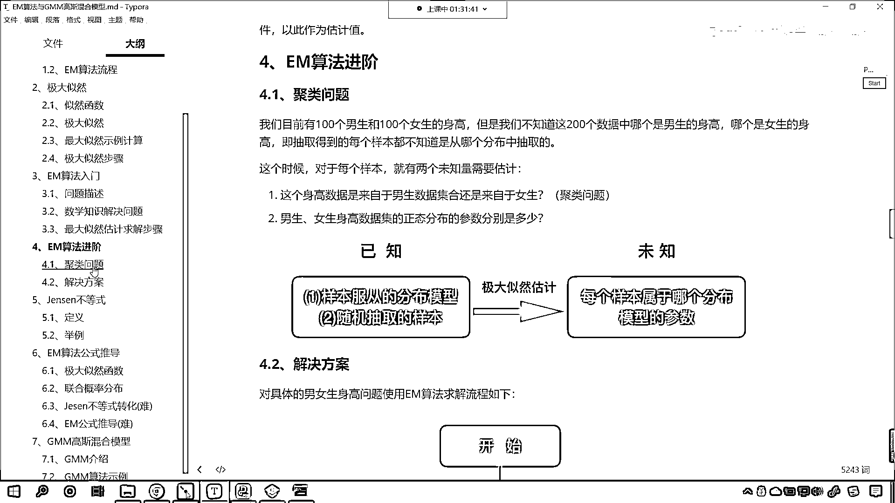

# 7天爆肝整理！AI量化交易-机器学习全套教程，从入门到项目实战保姆级教程！（数据挖掘分析／大数据／可视化／投资／金融／股票／算法） - P173：6-EM算法进阶举例介绍 - Python校长 - BV1KL411z7WA

來來各位小夥伴 接下來呢 我們再進一步啊，咱們看一下這個EM算法的進階，那麼這個時候呢 我們就碰到了一個巨類問題了，目前呢 咱們有100個男生 有100個女生。

但是呢 我們不知道這200個數據到底哪個是男生哪個是女生，那這個時候我們這個問題它就變得稍微復雜一點了，這個時候呢 有兩個位置量需要估計，就是這個身高數據 它屬於是男生還是女生。

哎 你看這個時候是不是就有點 你看是不是它就是一個巨類問題了，之前咱們在講K-means的時候 之前咱們在講DB-scan的時候，是吧 之前咱們在講分層巨類的時候，是不是也是給你一堆問題 給你一堆數據。

讓你對這個數據進行類別的劃分呀 對不對 之前也是這樣吧，是不是呀 好 那麼咱們現在所介紹到的這個高斯混合模型，那麼它呢 就可以用於巨類，那麼我們EM算法進階當中的第二個問題。

就是男生女生 她的身高數據及的正態分佈參數分別是多少，你看這個參數是不是又讓我們去計算它的μ，對不對呀 去計算一下μ 然後呢再去計算一下σ 是不是呀，所以說一個問題 兩個問題。

這個時候咱們這個就變得是不是稍微複雜一點了，那我們看一下咱們解決方案是什麼樣的，對於具體的男生女生身高問題 咱們呢就可以使用EM算法，我們進行一個流程的一個推導。

好 那麼現在你就能夠看 首先開始的時候咱們初始化參數，那這個初始化參數是什麼意思呀，我說話比較直接 其實就是瞎蒙 是吧，你這個男生的平均值 這個均值是多少 方差是多少。

咱們先瞎蒙一個 看這就是初始化 就是先瞎蒙一個，就是使用隨機數給他分配一個值，你想你不可能運氣那麼好 一分配他是不是就正好合適呀，對吧 就像咱們之前梯度下降一樣，我們一開始給的這個數值他就是最合適的嗎。

那不是 對不對呀 那隨著咱們梯度下降的進行，無論我們給的這個隨機參數是大一點還是小一點，梯度下降一點點是不是都靠近了最佳的答案呀，EM算法也一樣 你初始化的這個參數雖然是隨機給的。

但是呢 我們有一個 咱們有一個靶 知道嗎，咱們有一個靶底 咱們有一個目標 有一個方向 是吧，就像當年紅軍長征一樣 是不是，那是不是有了這個方向是不是就是翻山越嶺。

最後是不是這個星星之火可以燃圓呀 可以燎原 對不對，咱們這也一樣啊 那我們這個EM算法他的核心是什麼，看他的那個靶底是什麼 哎 就是極大自然呀。

我們一開始初始化這個參數 咱們就是讓這個概率極大自然越大越好，你不是最大的ok 那就一點一點去修改這個參數，好 那麼所以說這個Exception步呢 就是計算分布 是吧。

計算咱們的概率 然後咱們的Maximization那就是重新估計參數，這重新估計參數其實就是修改咱們的初始化參數，參數發生了改變 咱們再帶進去，那這一步是不是就是咱們的迭代呀 這一步就是迭代。

參數發生了變化迭代 那最後什麼時候退出呢，看最後什麼時候退出呢 當你這個參數發現不再變化了，這個時候呢我們就停止迭代，好 那麼大家要注意啊 你看咱們的男生和女生，有的時候這個身高是不是會有重合呀。

比如說有的男生比較矮 他可能是165 是不是，那165咱們在進行劃分的時候，這個男生到底被劃分到男生這一組還是女生這一組呀，那你想這是不是都有可能呀 對不對，我們在進行據類的時候 咱們在進行分類的時候。

難免會出錯 對不對 難免不可避免會出錯，五大郎是吧 身高就是矮 那這個有啥辦法 是不是，那誰也沒辦法 那這個朗平身高就是高 是吧，我相信朗平是吧 比咱們班裡邊大多數男生的身高都要高。

人家是打排球的 是不是 所以你不用擔心，就是咱們的這個算法對於這些特殊的數據，其實他也沒辦法 就是任何一個算法，就是你這個算法再高級 你只要一旦遇見特殊情況，那麼它就失效了 你看這個特斯拉的汽車。

或者說未來理想小鵬的汽車 在高速上開的好好的 是吧，一般情況下沒事 但是但凡遇見特殊的情況，你想他是不是就得車毀人亡呀，就無論特斯拉多高級 你只要遇見特殊的情況，那算法都沒用 是吧 因為這就是特例呀。

但是特例呢 它是小概率事件，我們的算法咱們都是通用的一個模型 是吧，我們不考慮異常的情況 對不對，你看咱不考慮異常的情況，你比如說你在高速公路上正開車呢 是吧。

這個時候出現了一個特殊的情況 出現了一個異常的情況，老天爺打雷了 正好把這個車給劈成兩半了 車毀人亡，你說存在不存在這種情況 那當然是存在的 是不是，這種時候呢 這就屬於是特例啊。

我們去學算法 它都是為了解決一般問題 知道嗎，都是為了解決一般問題，所以如果我們要考慮過多的 考慮這個異常情況如果要多的話，那這個時候就容易過 它呢就會出現過你和的這個情況。

所以說呢 200個數據 你就把它考慮成200個數據，這個男生和女生呢 它是比較明顯的 對吧，這個身高呢是有一定差距的，那麼這個算法 算法它就會把這個數據呢。

很好的為我們進行分開 男生的就劃歸到男生一組了，女生的就劃歸到女生一組了，當然肯定存在個別的情況 這個劃分錯誤，這個都是可以接受的 是不是，這個是可以接受的啊 所以你看。

那這種情況咱們的解決方案就出來了，是吧 我們初始化參數，比如說咱們先初始化男生身高的正態分佈的參數，均值是1。64 方差是6。0 這個都是隨機給的啊。

計算分佈 咱們計算每一個人更可能屬於是男生的分佈或女生的分佈，把它劃分一下 注意啊，那這個計算分佈如何來操作呢，看到了嗎 計算分佈如何來操作呀，只要這個數據它是正態分佈。

那我們是不是就有相應的正態分佈的公式呀，看到了吧 你看，這個是不是就是咱們正態分佈的概率密度公式呀，對不對 你看這個就是概率密度呀，男生是不是有一個身高 是不是有一個方差。

女生是不是也有一個方差 有一個身高呀，你想 你現在有200個樣本 是吧，我把這每一個樣本帶到男生的方程當中，是不是求解出來一個概率，帶到女生的概率方程當中是不是計算出來一個概率。

哪個大 那麼這個數據就被劃歸到那個類別當中，所以說你看這一步叫做計算分佈，咱們是不是就可以根據男生女生的概率密度函數，也就是正態分佈來進行計算呀，我們就可以給它初步來一個劃分，那麼有了這個劃分之後。

接下來呢咱們第三步就是重新估計參數，你看你現在 現在咱們不是分成了兩類嗎，分成了一個男生和女生 對吧，在這呢進行一個說明啊，這個計算分佈呢，也就是說咱們將男生和女生給它劃開了，劃開了之後 你分成兩類了。

這個時候是不是就可以重新估計參數了，對吧 我們重新估計參數，咱們是不是使用最大四然呀，你一旦使用最大四然計算，這個時候呢你原來聲明的這個均值和方差，它就會發生改變。

改變了之後咱們繼續根據改變的值再次計算分佈，根據改變的值再去計算分佈，這個時候是不是又得到一個男生的分佈和一個女生的分佈呀，然後再去重新估計參數，這個時候呢兩個分佈的這個概率也變了。

我們得需要重復步驟二和三，重復二和三直到參數不發生變化為止，如果它不發生變化了，這個時候說明最大四然，這個時候它是最大值，那是不是就說明我們把數據給分開了呀，你看是不是非常巧妙，你仔細琢磨一下啊。

你再琢磨一下，你看它是怎麼操作的，我們有兩百個數據，對不對，有兩百個數據，那我們知道這個裡面的數據要么是男生要么是女生，咱們要把它分成兩類，對不對，要把它分成兩類，好那麼這個時候男生和女生的身高數據。

我們假定它咱們知道它呢是一個這個正態分佈，正態分佈那這個時候就方便了，正態分佈的概率方程當中，一個是均值一個是方差，有了均值有了方差就可以計算概率，別看那個方程比較複雜。

其實裡邊都是除了這個均值方差之外都是常量，很容易就可以計算，那我們給男生看到了吧，咱們給男生一個均值一個方差，同時女生是不是也有一個均值一個方差呀，看到吧，女生也有知道嗎，女生也有均值和方差。

那有了男生女生的均值方差，咱們這個時候呢就可以計算分佈了，那麼計算分佈，那把200個數據帶到方程當中，誰的概率大，那就把它劃歸到哪一個類別，這個時候就分類了，分好類之後呢重新估計參數。

你分好的類不一定是最合適的，對不對，看不一定是最合適的，我們根據分好的類，然後呢重新來估計男生身高分佈的參數，重新進行計算，使用的就是最大自然概率公式，是吧，然後呢女生也按照相同的方式估計分佈。

估計出來更新分佈更新咱們的參數，最後是吧，重復二到三步，直到這個參數不發生改變，這就說明我們就求解了，所以你看這個呢是咱們EM算法進階，我們又舉了一個例子，來進行說明這個如何進行具類，那我們這個算法。

它叫做JMM高斯混合模型，咱們這個算法在進行應用的時候，它其實呢有一定的限制，也就是說我們的數據，最好是正態分佈的數據，那麼咱們使用高斯分佈模型，這個效果就會很好，知道吧，因為我們算法的推導。

咱們就是根據正態分佈來進行劃分的，所以正態分佈的數據，使用這個算法那效果就很好，而其他的這個分佈，其他類型的數據，比如說這個二項分佈，效果就不太好，比如說你投硬幣，出現的這個情況，是不是就是正面和反面。

只有這兩種情況呀，如果這個時候你使用高斯混合模型，來對數據進行具類分類，效果就不太好，大家要明白啊，因為這個算法推導，它是基於正態分佈，基於這個極大自然，所以說那也就限定了這個算法。

它的一個應用場景。

謝謝觀看。