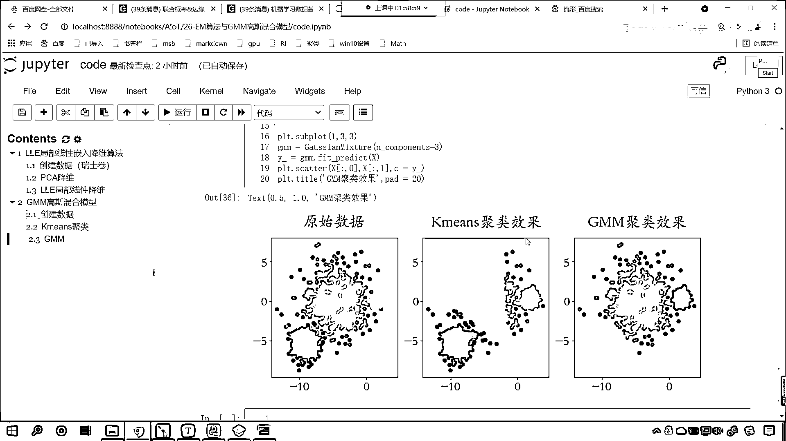

# 7天爆肝整理！AI量化交易-机器学习全套教程，从入门到项目实战保姆级教程！（数据挖掘分析／大数据／可视化／投资／金融／股票／算法） - P174：7-GMM高斯混合模型聚类使用代码举例 - Python校长 - BV1KL411z7WA

咱們接下來就使用一下高斯混合模型，咱們看一下它到底如何使用的 和之前學到的聚類算法有啥不一樣，高斯混合模型是一個用於聚類的概率模型，它使用了EM算法進行迭代。

那麼高斯混合模型假設每個處的數據都符合高斯分布，它這做了一個假設 假設這個數據是正態分布的，那最好你的數據就是正態分布的，你正好吻合了 你想一下你得到的結果是不是才是最合適的呀，分類的效果才是最好的。

那咱們就回到代碼當中，我們使用一下這個高斯混合模型，來回到咱們的代碼當中，現在我們往下滑 咱們在這來一個三級標題，這個叫做JMM高斯混合模型，咱們使用一下它，那麼此時我們先導一下包。

咱們import numpy as np from sklearn，咱們將數據集導進來 data sets，然後呢畫圖工具我們導一下。

import matplotlib piplot as prt from sklearn，咱們呢將模型導進來，我們先將k-means導進來，這個算法導進來，然後呢from sklearn。

咱們從mixture當中，咱們將今天的主角叫做高斯mixture導進來，那我們導進來這個呢，它就是高斯混合模型，大家要注意這個模型呢，它是使用EM算法進行的迭代優化，執行一下代碼，現在咱們就導包成功了。

然後呢我們就創建數據，咱們來一個4級標題，咱們在這呢去創建數據，好那麼咱們就使用data sets，調用一下其中的方法，咱們來一個make blobs，make blobs咱們可以生成三類點。

我們給一個nsample咱們1500個點，然後給一個cluster std，這個cluster std就是每一類點它的標準差，標準差不同，那麼它的這個有的呢更加聚集一些，有的呢更加分散一些。

咱們給一個1。0，給一個2。5，然後呢給一個0。5，這三者三類的這個數據是不一樣的，然後呢咱們再給一個random state，random state我們給一個170，數據咱們就創建好了。

前面接收一下那就是x和y，來此時呢咱們把這個數據給它畫出來，看一下它是什麼樣的啊，這個時候呢咱們就plot一點figure，我們給這個數據一個尺寸，咱們呢給一個figure size。

咱們給一個12和9，然後呢我們plot rcparams，咱們設置一下它相應的屬性，咱們給一個font family，我們在畫圖的時候咱們給它中文的這個標題，那想要中文的標題咱們給一個stcatty。

字體大小也設置一下，plot rcparams，中國號我們給一個font size，咱們讓它呢等於20，設置有了然後呢咱們就plot，這個時候呢咱們就調用scatter，scattr，在這個當中呢。

把我們生成的數據放進去，0表示橫坐標，1表示縱坐標，顏色呢我們給一個y，我們給它一個標題，那就是plot一點咱們調用title，那這個呢就是咱們的原始數據，我們給一個pad，pad就是間隔。

咱們讓這個間隔是20，你看我執行一下代碼，咱們報錯了，大家看這個就是咱們的語法錯誤，語法錯誤我們2。5和0。5之間應該是逗號，但是咱們書寫的時候不小心寫成底了，把這個底刪除，咱們來一個英文的逗號。

此時你看我一執行，來大家現在就能夠看到，我們這個數據是不是就出來了呀，看了吧這個圖片尺寸有點大，咱們調小一些好不好，咱們給一個4，這個時候你看我一執行，這個4和4就有點小，咱們給一個6和6執行一下。

來現在你來看，數據是不是就有了呀，看到了吧這分了三類啊，大家要注意咱們分了三類，黃色的是不是一類，紫色的是一類，綠色的是不是一類呀，你要注意啊，這個時候我們的小夥伴有沒有發現，咱們一些底你看到了吧。

這個底還有這個底，它是不是完全在，你看它是不是完全在咱們黃色這個區域當中呀，對不對，但是呢，這個綠色的底，它依然屬於綠色的這一類，我們發現綠色的這一類底，它是不是比較分散呀，看了吧它比較分散，那請問。

我們剛才給，它的這個cluster std的時候，在給這個標準差的時候，一個是1。0一個是2。5一個是0。5，那你告訴我，哪一類，哪一類底，它的這個，它的這個標準差是2。5呢，黃色的，還是咱們綠色的。

還是咱們紫色的，來我們在討論區裡邊，各位小夥伴，你回復一下這個問題啊，就是，咱們2。5，它對應哪一個是吧，對應哪一類底，ok，好那麼，我們各位小夥伴回答的都是綠色是吧，哎那說明呢你對於標準差。

是這個概念是理解的，這個標準差越大，這個數據呢就越離散啊，咱們剛才呢還要強調一個問題，也就是說咱們有一個綠色的底，你看好幾個綠色的底，是不是都被咱們的，黃色的底給覆蓋了，對不對你看它被黃色的底覆蓋了。

是不是，還有咱們綠色的底，看到了吧，它是不是也跑到咱們紫色的區域了，哎大家要注意啊，那我們這個生成的這個數據是吧，這個綠色的底，你看它確實屬於綠色這一類，即使呢，它和咱們黃色的底，在一起。

那麼也不能把它劃歸到黃色這一類，你就好比，咱們如咱們這個進行宿舍劃分的時候，我們是不是不能根據身高進行劃分啊，是吧那你那你像有的男生，身高比較矮，他只有1米6，那麼我們把它劃歸到女生宿舍裡邊，這合適嗎。

是不是不合適啊，對不對，所以說你看你這個綠色的這個底，是吧，那說明你的這個特徵，是吧，和它吻合，但是呢，你並不屬於藍色，並不屬於黃色這一類，好那麼大家看啊，咱們的數據有了，那麼我們就使用。

使用咱們的k-means，之前咱們就使用k-means，我們使用k-means算法，咱們使用具類，我們呢就看一下效果，k-means就等於，k-means，現在呢，咱們把它分成三類，分成三類。

然後呢咱們就k-means，此時我們就調用fit方法，x放進去，然後k-means點，咱們調用transform這個方法，是不是就可以將它的類別數據，給它拿到呀，得到的這個結果，我們起個名叫y-gut。

然後呢，我們把這個畫圖給它畫出來，來此時咱們畫圖畫出來，那就是plt點scatter，那我們將數據放進去，x0，這個是數據，x1，顏色呢咱們就用y-gut，此時呢我們也給一個標題，plt點title。

小括號，這個呢就是咱們k-means，具類的效果，然後逗號，我們也給一個pad，咱們讓它是20，此時來各位小夥伴來看一下，r-gb，數字b0-1，咱們看一下，咱們某一個地方給錯了，此時呢我們就發現。

看咱們這個plt這個地方，現在你就能夠看到，這個地方報錯了，是吧，看我們transform這個方法用錯了，咱們呢應該用predict，這個predict是不是就是預測它的類別呀，此時我們一執行。

來各位小夥伴你就能夠看到，咱們具類的效果是不是就出來了，看了吧，此時具類的效果出來了，沒問題啊，具類的效果出來了，出來之後我們發現啊，咱們你看這個藍色的這個，你看它變成什麼了，藍色的變成什麼了。

那其實我們具類的時候呢，咱們的顏色呢，可能是進行了一個翻轉，就是原來的時候，你看這個地方它是不是應該是，看原來的時候這個地方是什麼顏色，是不是黃色，中間這個是不是一個紫色呀，對吧，這個時候呢。

我們預測出來這個外值，它和咱們原來的這個外，在表現類別的形式上有點不一樣，你看咱們原來的外啊，是110，對吧，現在我們預測出來這個外呢，預測出來這個外是多少呀，咱們就發現啊，預測出來這個外。

是不是20呀，對吧，那這個時候我們就會發現，其實呢，是不是1和2進行了一個顛倒呀，看了吧，其實就是1和2進行了個顛倒，0是不是不變呀，那我們就可以這樣操作啊，為了咱們讓它的顏色能夠有一個對應。

你看咱們可以這樣，我們讓y-，等等多少呀，等等1，看這個作為條件1，然後呢，我們再來，Cond2，我們讓y-，咱們讓它等等2，你看這是不是兩個條件，有了這兩個條件。

咱們對於y-的1和2的數據進行一個反轉，Cond1呢，我們把它變成2，然後y-，Cond2，咱把它變成多少，變成1，也就是1和2，咱們進行一個顛倒，這個時候你看我一執行，我看一下啊。

這個時候顛倒過來之後呢，咱發現這個，還是不太對，是吧，大家看還是不太對，我看一下啊，這個變成紫色了，對吧，咱們，這個就變成黃色了，我們看一下咱們原來這個數據啊，看原來這個數據，黃色，綠色和紫色，是吧。

那等會啊，咱們再調一下啊，把這個變成0，我看看啊，y-等等0，反正我們是，咱們這樣，0，1，然後來一個Cond3，讓它y-，等等咱們的2，反正你是不是就是012啊，對不對，反正就是012，現在的話。

咱們將這個數據呢，我們給它，變換一下啊，y-中國號，Cond，咱們來一個Cond3，看我現在怎麼去調整一下它啊，調整完之後呢，我們希望這個顏色表示，是吧，它和原來的能夠對應上，那012，現在的話咱們就。

讓這個，讓它替換一下，這樣啊，咱們現在呢，給個0和1，好不好，就是把Cond2也變成0，0和1，此時呢，我執行一下，來現在各位小夥伴，你就能夠看到，如果說我們要兩個都是0的話，現在我們就發現。

你看這個顏色，是不是就全是紫色了，對不對，你看它就全是紫色了，那我們再我們再給它一個值啊，咱們看一下到底哪個是紫色啊，那我們就知道這個0肯定是紫色，對不對啊，那咱們知道右下角這個是不是應該是0啊。

現在呢我們再給個1啊，你看我再給個1，咱們再給個1的話，等會啊，我看一下啊，上面這個咱們給個1，下面這個呢，咱們給個2，後面給個0，我看看啊，調不過來了，是吧，等會啊，這個是，這個應該是紫色，綠色。

藍色，是吧，現在你看，沒有調過來，現在咱們發現，中間這兩個是不是沒調過來啊，那我們就看一下，中間這個是對應著哪個顏色啊，我們把這個調整成1，咱們看一下啊，這個調整成1之後呢，咱們就發現，是不是全變了。

如果要調整成2，看一下啊，調整成2，後面這個是0，後面這個是2，上面這個調整成0，看一下這個顏色的這個對應情況，執行一下，藍色，紫色，等會啊，我看中間的是綠色，是吧，咱們想辦法把中間給它調整成綠色啊。

哦，我明白了，咱們的k-means這個算法，你想它每次執行和每次執行，是不是都不太一樣呀，對不對，你看啊，來我們把這段代碼註掉啊，看咱們就這樣執行，看我們多執行幾次，你也會發現這個顏色呢。

它也會有一個不一樣的地方，看到了吧，這回是不是就這個就變成藍色了，你看我再執行一下，看了中間是不是就變成綠色了，看了再執行一下啊，你看再執行一下，再執行一下，咱們一定能夠出來這種效果，再執行一下。

就是現在的話，這個顏色是什麼樣的顏色，這個是無所謂的啊，咱們主要看一下據類的效果，為什麼咱們k-means在執行的時候，它這個顏色會發生一個變化呢，是不是因為咱們k-means的原理，大家仔細回想一下。

咱們的中心點是不是隨機選取的呀，對不對，這個中心點隨機選取，所以說就會導致什麼樣的一個情況呀，顏色是不是也是隨機的，但是咱們現在發現它是不是，也依然分成了三類呀，你看這個三類的效果。

你會發現這個k-means，是不是根據距離的遠近進行劃分的，所以我們就會發現，看啊，有一大批點，本來屬於是中間的，但是現在是不是都被劃歸到右側這一類了，是不是，看。

那也就是說咱們k-means是如何劃分的呀，看k-means，咱們是不是就是距離，是不是就是根據距離來進行劃歸類別呀，咱們的就是根據距離來劃歸類別，對不對，你想這個時候。

他有沒有考慮咱們樣本的分佈情況呀，沒有，對吧，很顯然你看，就是我們最右側紫色的這一處點，你看他們是不是僅僅的一處點呀，那你你想一下，你就上面這個點，看到了吧，離他是不是還挺遠的，對吧，那很顯然。

上面這個紫色的點和這一處紫色的點，他們不是一類，為什麼呀，如果你要是一類的話，如果你要是符合整個正態分佈的話，你是不是應該是在他的周周圍呀，對不對，但是這個就離得太遠了，但是呢我們根據什麼進行劃分的。

k-means，k-means他只根據距離，所以說，這個時候k-means劃分咱們所創建的這個數據，效果就不太好，那接下來咱們使用，接下來呢咱們就使用JMM高斯混合模型，我們使用這個，咱們呢來操作一下。

我們看一下效果怎麼樣，此時呢聲明JMM就等於Gaussian mixture，裡邊呢我們給一個n components，咱們呢把它分成三類，然後呢使用JMM點，咱們fit predict一步到位。

將咱們的數據x放進去，返回的結果我們依然叫y-，這個就表示類別，此時呢咱們畫圖畫出來啊，那就是plt點scatter，咱們將數據x放進去，0，橫坐標，x中框貌號1，縱坐標，然後我們給一個顏色。

顏色呢就是咱們高斯，他預測出來的這個數據，給他一個標題，plt。title，那這個標題呢就是JMM，咱們具類的一個效果，也給一個pad，讓他呢距離咱們的圖形有一個間隔，此時你看我一直行，來各位小夥伴。

你看各位小夥伴，你看一下咱們畫出來的這個，具類的這個效果，這個具類的效果，和比咱們上面使用k-means具類的效果，是不是就好多了呀，看咱們的原始數據啊，你看這是原始數據對不對，看了吧這是原始數據。

沒錯吧你看，這個是不是咱們k-means具類的效果，這個是不是高斯具類的效果，那我們具類的這個效果呢，咱們如果說要是給他調整一下尺寸，plt。figure，這個當中給一個figure size。

咱們也讓他是6和6，這個時候看起來呢就效果就好一些了，看到了吧，你看啊在這個當中有一個底，大家要仔細觀察一下，這個底，這個底你看，我們具類把它變成什麼顏色了，是不是中間這個黃色呀，強大嗎。

這個高斯混合模型強大嗎，如果要按照咱們k-means，那這個底一定是不是被劃歸到咱們，一定是不是被劃歸到這個，這個綠色這個區域啊，但是沒有，是吧，他是不是就變成黃色區域了，是吧，因為我們這三處底。

因為咱們這三類底，因為咱們的三類底，它是什麼分布呀，它是不是一個正態分布，所以說這個高斯，具類模型就很好地把這個數據進行了劃分，現在呢，咱們將這個三個圖劃到一起，我們進行一個對比啊，好，那麼這個時候呢。

咱們就plot點figure，我們給它一個尺寸，咱們給一個figure size，這個時候呢，咱們給一個12和4，寬度是寬度是12，高度是4，然後呢，plot點咱們調用subplot。

咱們給一個一行三列第一個，這個時候就有一個此時圖了，首先呢，我們繪製原始數據，往上滑，原始數據呢，來咱們呢，把原始數據的繪製呢，複製一下啊，放到這，這個就是原始數據，然後呢，plot點subplot。

咱們來一個一行三列第二個，這個呢，就是咱們使用k-means，據類得到的結果，往上滑，找見咱們k-means據類，這k-means據類在這呢，複製一下這兩行代碼，不僅要複製這兩行代碼。

同時咱們還需要把k-means這個算法複製一下，它預測的結果叫y-gau，也要複製，來那我們就在這粘貼一下，現在你看，這個繪製的就是k-means據類的效果，最後呢，plot點subplot。

添加此時圖，一行三列第三個，接下來咱們繪製就是高斯混合模型，複製一下這個代碼，在這來一個粘貼，此時我執行這個代碼，各位小夥伴你就能夠看到一個對比的情況了，那我們因為在這，繪製高斯這。

咱們給了一個figure，我們把它刪掉，我們讓高斯混合模型，繪到最右側的這個，這個此時圖當中，所以把這行代碼刪掉，現在你來看這個效果圖，現在你就發現，你看咱們使用高斯據類，得到的效果。

是不是和我們原始數據，這個是不是最像呀，看了吧像不像，是不是，大家要注意啊，你這個類別是吧，用理論一二表示，那到底哪一類，用哪個數字表示，這個是無關緊要的啊，好那麼k-means效果，是吧。

你看你想像一下，你只要能夠離，知道咱們k-means這個算法，原理是怎麼樣，那麼他得到的這個，結果是這樣的，你就不會感到吃驚和意外了，對不對，而高斯混合模型，你就能夠看到，他得到的數據。

和咱們原來的這個數據，是最最吻合的，看了吧，這就是高斯混合模型，這個算法，咱們呢給舉了一個這樣的例子，我們舉了一個這樣的特徵的數據，來為各位演示了一下，這樣你就知道，這不同的算法，不同的據類。

他呢適合不同的數據，對不對，這叫一物降一物，每個算法呢，對應著不同的數據，那以後呢，你再進行據類的時候，那你就得多使用幾種算法，進行綜合對比，因為你以後接觸的數據，你能知道這個數據長什麼樣嗎。

能知道這個數據內部結構是怎麼樣的嗎，你不能知道，是吧，很多時候你都不知道啊，我們給的數據比較簡單，咱們進行了可視化，以後你的數據有幾十個屬性，那是沒有辦法畫出來的，對不對，所以說呢。

不同的算法我們都要掌握，這樣的話咱們才可以對症下藥。

