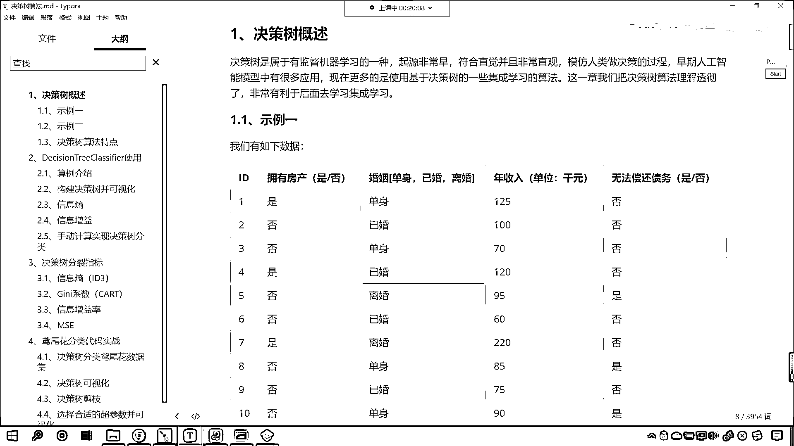

# 7天爆肝整理！AI量化交易-机器学习全套教程，从入门到项目实战保姆级教程！（数据挖掘分析／大数据／可视化／投资／金融／股票／算法） - P176：1-决策树概述示例一（债务偿还） - Python校长 - BV1KL411z7WA

咱們今天晚上要學習的內容是決策術，你在生活中是不是見過樹啊？，什麼是樹啊？是不是有樹幹？是不是有樹枝？，再往上的話是不是還有樹葉啊？，決策術是屬於有監督學習的一種，起源是非常早的，那麼它非常的形象直觀。

它模仿的是咱們人類做決策的一個過程，咱們早期人工智能模型當中，它是有很多應用的，現在更多的是使用決策術的一些集成學習算法，那後面我們會講到集成學習，這個集成學習簡單咱們在這裡提一句。

相當於是三個臭皮匠頂個諸葛亮，你聽過這個諺語對不對？，那這就是集成，這就是集體的力量，那集成的意思就是使用多個算法，咱們一起進行預測，最後的話咱們進行這個，把算法得到的這個結果咱們進行一個合併。

是吧最後投票，我們來做出最終的一個答案，你就像現在一些比較大的公司，他們是不是會有董事會呀，那一個公司在做重大決定的時候，其實大家都要投票，是不是得半數通過這個決議才能作效呀，好那麼這一章呢。

我們就把決策術算法理解透搞明白，對於我們以後呢進行集成學習呢，是非常有幫助的啊，那啥是決策術呀，咱們先看一個事例一，那我們有如下的數據，在這兒呢你就能夠看到，咱們這個數據呢是這樣的，這個擁有房產。

這個結婚與否，還有這個人年收入，最後呢大家就能夠看到，還有一個就是無法償還債務，你知道這個銀行呢，它喜歡呢把錢貸給是不是有能力償還的人呀，對不對這樣的話它可以掙到，這個一部分利息。

然後這個錢呢還可以回來對不對，好那麼我們在判斷一個人，他是否可以償還債務的時候，咱們都會從哪幾點對他進行考慮呢，你比如說一個人是吧，他的償還借貸的情況，你看我們償還借貸，一個人是否可以償還借貸。

你想那跟這個人跟他的特點，跟他的特徵是不是有很大的關系呀，你比如說這個人呢，他是北京戶口上了清華大學，是吧在國家單位工作，或者說在北京的這個互聯網大公司工作，像阿里巴巴呀像騰訊呀像這個百度呀。

那銀行根據他的這些條件，是吧那是不是就可以給他放款呀，對吧一下子給他放三十萬也沒有關系，因為這個人一定有能力把這個錢償還掉，那我們這個事例呢，咱們三個紅色的框，表示這個人的屬性特徵，最後這一列呢。

是他是否可以償還債務，你知道有的人是吧，這個借了錢是吧，他就沒打算還，這個叫做惡意的騙貸，銀行一定有壞賬是不是，好那麼比如說我們是否擁有房產婚否是吧，你想這個很多這個結婚和不結婚。

你的責任和義務是不一樣的，還有咱們的年收入，有的年收入高有的年收入低是不是，那年收入高的人，那你想他償還債務的可能性是不是就更大一些呀，對不對那最後一列呢，是咱們的這個目標值。

我們可以把前面這三列當成咱們的數據X，後面這一列呢，就是我們的目標值Y，X和Y之間大家想一下，他們是不是有一定的關系呀，對不對你比如說咱們的X，你是否擁有房產，是的擁有房產結婚了嗎，結婚年收入多少呢。

年收入五百萬，那你想這種人是吧，他是不是就特別優秀呀，他借了款他一定會還的啊，好那麼這是咱們舉例所提供的一個數據，那上表咱們是根據歷史數據，記錄已有的用戶是否可以償還債務，大家注意啊。

這個是咱們已有的數據，你想銀行做貸款業務，他是不是做了很多年呀，對不對那他會有很多數據，那咱們就可以根據這些數據來進行學習，找見一些規律，比如說我們看到的這個圖是吧，看到的這個圖他呢就總結了一些規律。

這第一個判斷條件呢，就是是否擁有房產，如果要是擁有房產的話，那麼這個人是可以償還債務的，那最後時代不行，我是不是可以把你的房子給你拍賣掉呀，對不對啊，你資不抵債是吧，沒有辦法償還了。

OK那拿你的房子來進行抵押，是不是還有那這個擁有擁有房產證，我們在這給了個否，否的話我們再看其他的條件，就是已婚還是未婚，是吧已婚的話，通常他們更容易償還債務，因為咱們說了這個有一個社會責任在這。

是吧很多已婚的是不是家裡都有小孩呀，有了小孩之後你就會發現你的工作幹勁，是吧就特別的積極了啊，好那麼已婚證是吧，這個已婚證有一個否證是吧，那否的話也就是說有的人已婚了，但是呢他沒有償還債務。

那沒有償還債務，我們再根據條件對他進行劃分，就是他的年收入是吧，那年收入如果要是大於等於八十可以償還，要是小於等於八十呢，這個就無法償還了，也就是說你雖然已婚了，但是呢你很窮呀。

那這個時候你的債務很有可能就償還不了了，這樣的話銀行在對你進行貸款的時候，那就會根據你的這些屬性條件來做一個判斷，我們現在都用支付寶都用微信支付對不對，那你就能夠發現在支付寶或者說在微信當中呢。

每一個人都每一個人都會有一個借款的額度是吧，根據你的這個根據你的一些屬性特徵，那這個是算法自動為你分配的，你查一查自己的支付寶上你的借備額度是多少，你的信用信用越好，那麼你的借備額度就越高，好大家看啊。

咱們上面這個圖我們就把它叫做決策數，看這個圖就叫決策數，好那麼我們根據這個決策數，咱們呢就可以判斷是否要進行放貸，比如說這個時候來了一個新用戶，大家看他的條件是這個樣的，他呢無房產，現在呢是單身。

他的年收入是55K，好那麼咱們根據上面的決策數，咱們就可以預測他呢無法償還債務，你現在就能夠看到根據這個條件，咱們呢就根據上面藍色的這個圖，擁有房產嗎，沒有，是不是就是藍色的這條線呀，結婚了嗎。

他是單身，那就是沒有結婚，年收入怎麼樣呀，年收入小於，大家看啊，咱們這個條件是小於80，你看55K是不是小於80呀，所以我們根據這個決策數，咱們得到的這個結論是無法償還，對不對，既然無法償還。

那你想銀行在對他進行放款借貸的時候，那這個是不是就會pass掉呀，是不是就會把它過濾掉呀，當然看這個算法，他預測的結果只是一個大概，那咱們說如果說這個某一個地區確實存在這樣，確實存在這樣的用戶。

你說是不是有一些用戶，他就講誠信呀，講信用對不對呀，雖然他的年收入是55K，那你想他是不是也有可能會償還債務呀，對不對，大家注意啊，咱們所構建的模型，咱們都是根據之前的數據，我們所構建出來的模型。

那大家呢不要太較真啊，不要太較真，你說無房產單身年收入55K就一定無法償還嗎，這個是不是不一定呀，對不對呀，你看啊這個無房產單身年收入55K，人家有可能信用特別好，是吧，砸鍋賣鐵也要把借的錢還上。

這種情況是不是依然存在呀，但是大家要注意，咱們的算法模型，永遠都是一個概率問題，明白嗎，永遠都是一個概率問題，那這個銀行呢，他是為了減少損失，所以說呢，他不願意去冒這個險，銀行呢。

根據自己之前數據庫當中，他的這個交易數據，他呢，就可以做出這樣的一個決斷，就是無房產單身年收入55K，這個呢，特別是這個低價值的用戶，咱們呢，就不跟他做生意了，免得呢，這個投資失敗。

是不是免得連本也回不來，那這樣的話，你看這就是這個銀行呢，這個他做的一個決策啊，好，那麼這就是上面，咱們根據決策數呢，把咱們新來的一個用戶，是不是進行了一個劃分呀，對不對，好，所以說這個呢。

我們借款業務，他呢，是有指導意義的，你看他是有指導意義的，那你想咱們銀行的貸款，肯定不能拍腦袋，是不是啊，就做決策，而是根據這個人的數據，好，那麼大家現在明白，什麼是決策數了吧，看到了吧，你看決策數啊。

咱們所看到的，是不是都是一個分叉的這個效果呀，那你想這個過程和什麼特別相似呀，是不是和咱們人類做決策的這個過程，非常相似呀，好，現在呢，我們所舉的這個勢力一，咱們呢就將決策數是什麼。

咱們進行了一個介紹。

