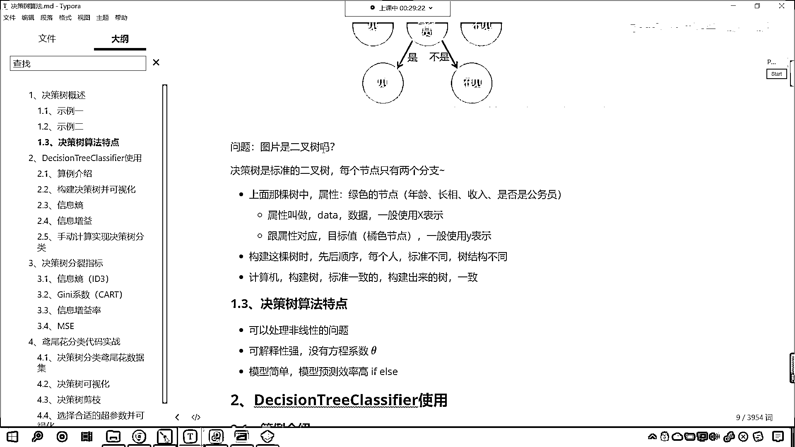

# 7天爆肝整理！AI量化交易-机器学习全套教程，从入门到项目实战保姆级教程！（数据挖掘分析／大数据／可视化／投资／金融／股票／算法） - P177：2-决策树概述示例二（找对象） - Python校长 - BV1KL411z7WA

來 接下來呢 咱們繼續往下看啊，咱們再給一個視力二 是吧，這個是大家都要 都要接觸的這個話題 都要遇到的情況，女孩的母親呢 要給他介紹對象 年齡是多少呢。

然後母親說24歲 長得帥嗎 挺帥的 收入高嗎 中等收入，然後這個女兒又問 是公務員嗎 母親說 是的，那女孩呢 就說 好 我去見見吧，你看 這個女孩是不是根據一定的條件做了相應的這個決策呀。

咱們呢 就根據這個男士的實力 我們呢 來構建一下決策數，哎 大家現在就能夠看到 你看，那在這個女孩的心當中，你看她是不是就有對於年齡 長相 收入和是否公務員，她是不是有自己的一個判斷呀 對吧。

那她心裏邊肯定有一個標準 是不是，那如果要是大於30歲 是吧，那咱就不見了 別浪費時間了，如果這個長相呢 要是醜 那也就不見了，這個長相是帥和中等 咱們見一見，還要看收入高不高 是吧。

這個收入要是高的話 是吧，那直接就去見，你的收入要是低 是吧，那就算了 還養 這個家裏邊還養活，這個還養不起狗 怎麼能夠養 怎麼能夠養得起我呢 是不是，所以說你這個收入呢 也是一方面的決定因素。

那收入如果要是中等的話 是吧，那就得看你是不是公務員了，是公務員見一見 不是公務員 那就算了，你看這個公務員是不是也是很好的一個工作呀 對不對呀，因為他的這個工作特別穩定 是不是可以持久的一直幹下去呀。

好 那麼大家看 這個就是一個決策數，那我現在問一個問題，這個決策數和咱們上面這個決策數，你進行一個簡單的對比，看一下它有什麼樣的區別 有什麼樣的不同呢 是吧。

大家 注意觀察啊 仔細觀察啊 看看有什麼樣的不同，有沒有觀察出來不同呀，看看上面，擁有房產已婚年收入，下面這個是年齡長相收入公務員，有沒有不同呀，好 現在呢 我把他的這個不同點。

我給你畫出來啊 咱們用框給你畫出來，你看一下這個框裡邊的 是吧，看一下這個框裡邊的有什麼樣不一樣 有什麼不同，當然 咱們除了金錢還有外貿人品前途 是不是啊，那這個有很多啊 咱們這個只是舉一個例子啊。

明白吧 只是舉一個例子，好 現在你就能夠看到 咱們剛才問了一個問題，我們說 咱們的勢力二當中，這顆決策數和勢力一當中的決策數，有什麼不一樣，你就能夠發現 你看，咱們這顆決策數的收入這 是吧。

它有高 中等和低，那我們在這 它是不是分了三類呀，看到了吧 你看，這個地方是不是分了三個類別，對不對 你看 咱們上面，這兒是分了三個類別，那你回想一下咱們上面那棵樹，咱們上面那棵樹，它是不是二分類呀。

對不對 二分類，所以說這個差別主要就是在這個地方，知道吧 差別主要就是在這個地方，那現在呢 我們給各位介紹一個，咱們決策數當中到底是如何劃分的，在咱們決策數當中呢，就是在咱們代碼當中的決策數。

咱們用的就是二分類 知道吧，咱們用的是這個二，我們這個二分類呢，這個說的是啥呢，說的是一個這個節點這個地方，它分成幾個差，咱們決策數呢，當然可以進行多分類了，這個二分類呢，咱們把它叫做二差數。

我們把它叫做二差數，好 那麼現在呢，你看 咱們這個圖片二是二差數嗎，就是咱們年齡長相收入公務員，它是二差數嗎，它不是 對不對呀，咱們的決策數是標準的二差數，每個節點呢 它只有兩個分支。

而咱們上面這棵樹當中呢，這個綠色的，我們把它叫做節點，綠色的叫節點，那對應著我們的數據，咱們把它叫做屬性，一般呢 咱們使用x來表示，那跟屬性對應的，就是咱們的目標值，就是咱們上圖當中橘色的節點。

一般情況下咱們使用y來表示，咱們構建這棵樹時，咱們構建這棵樹的時候，大家想一下，是不是會有先後順序呀，你看上面咱們在構建樹的時候，那這個女生先問的是年齡，那如果要換另一個人的話。

是不是有可能會更在意長相，是不是有可能會在意收入，是不是有可能會在意工作呀，也就是說，咱們現在這棵樹的樹頂是年齡，你想有沒有把公務員放到第一個的這種情況，有沒有把長相放到樹頂的這種情況。

有沒有將收入放到樹頂的情況，是不是都有呀，對不對呀，這個那就因人而異了，是不是啊，因人而異啊，好那麼，每個人的標準不同，所以說如果要是咱們人來進行劃分，那麼我們樹的結構是吧，那肯定就不一樣了，是吧。

你就像老師是吧，比較愛錢，是吧，那咱們就先看收入，是吧，你收入如果要跟馬雲一樣，是吧，這個長得好看不好看無所謂，是吧，有沒有臉都無所謂，好，但是呢，這是咱們人人和人的標準不一樣。

那現在的話我們看計算機啊，計算機，他是不是要根據屬性來幫助我們構建出這樣的一棵樹呀，對不對，你看計算機是不是要幫助我們構建這樣的一棵樹，好，那麼構建樹的時候，計算機的標準肯定是一致的，他構建出來的樹呢。

也是一致的，對不對，好那麼，這個時候呢，咱們就得問一下，那麼計算機，他到底是如何構建樹的呀，計算機到底是如何構建樹的，好，咱們就帶著這個疑問，是吧，咱們呢，就像咱們帶著這個疑問，我們就往下看啊，好。

那麼，最後呢，咱們講完決策數的概述之後呢，我們看一下決策數算法的這個特點，決策數呢，可以處理非線性的問題，可解釋性很強，他沒有方程系數C他，咱們之前講的線性回歸，邏輯思力回歸，支持線量機，他當中呢。

都有方程系數C他，那這個模型簡單，咱們的模型預測效率高，咱們的決策數呢，其實是不是就特別像咱們的義父，else這個條件判斷呀，對不對，你看就是說，如果你的年齡，小於30，那麼，如果你的長相是醜。

那麼咱們就不見了，對不對，所以說呢，這個是決策數的特點，他可以處理非線性的問題，可解釋性強，是吧，因為這個決策數的分類，和咱們人進行分類的時候，我們人是如何進行決策的，這個是差不多的。

你一定在電視上看過這樣的節目，這樣的娛樂節目，主持人問嘉賓，這個商品價格是多少，讓嘉賓去猜這個商品的價格，猜對了，那麼你就可以把這個商品搬回家，是吧，那主持人就說，那這個，嘉賓呢，就說這個900。

然後主持人就說價格低了，那你想嘉賓是不是會繼續向上猜這個價格，對吧，所以說這就是條件判斷，模型簡單，模型的預測效率很高，好，那麼這個呢，就是我們決策數概述，咱們又通過勢力二，對於絕對咱們決策數的結構。

我們又進行了一個講解，咱們的決策數，代碼當中的決策數，他都是二叉數，明白嗎，決策數都是二叉數。

