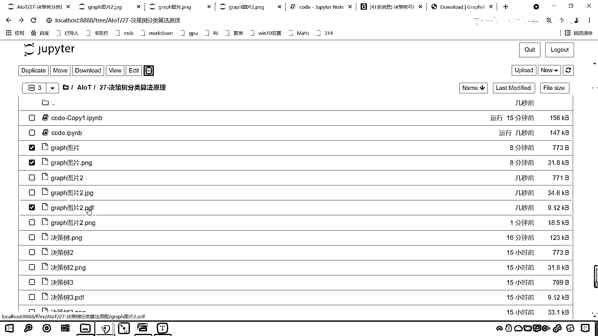
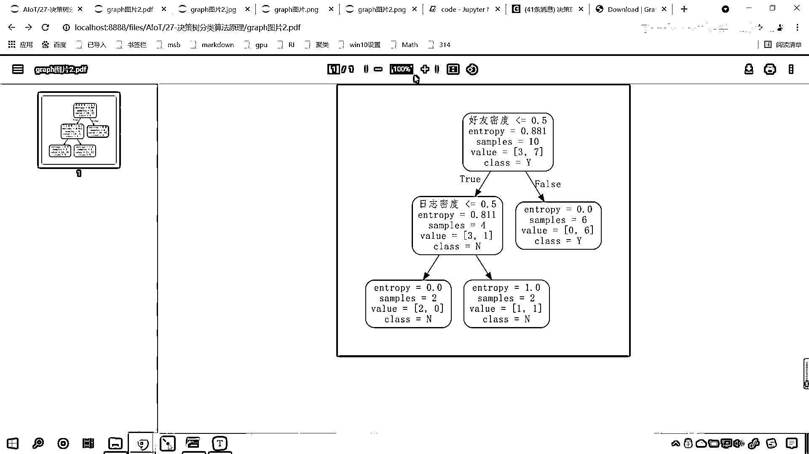
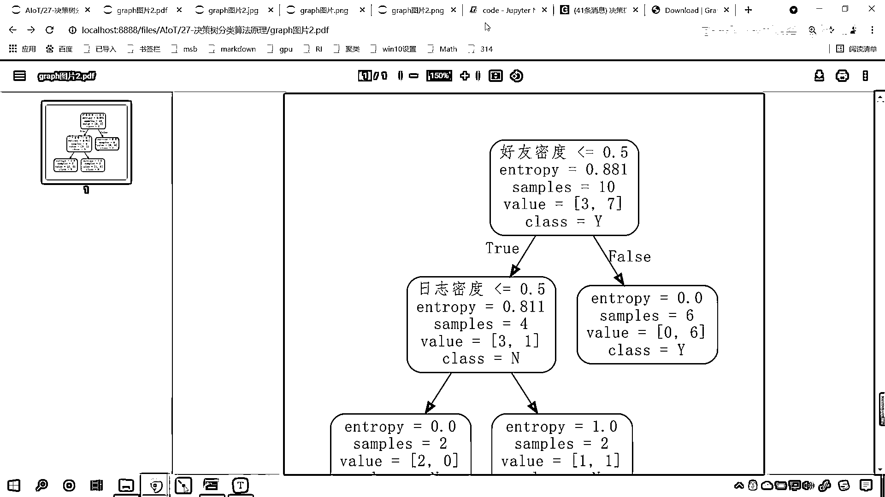
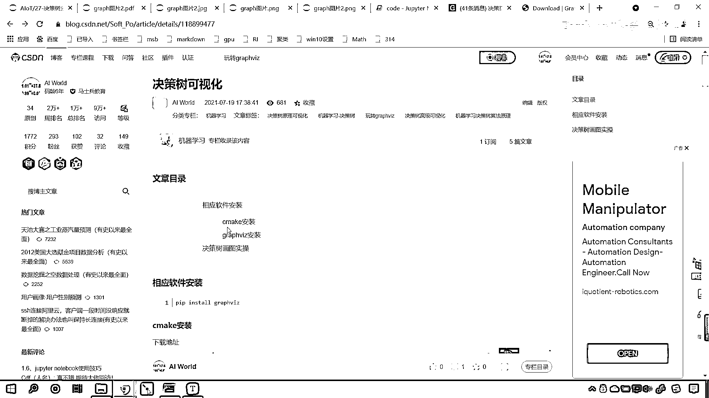
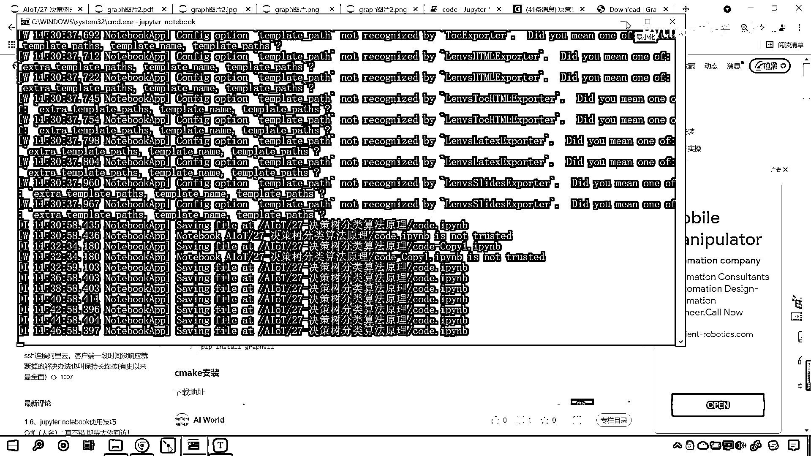
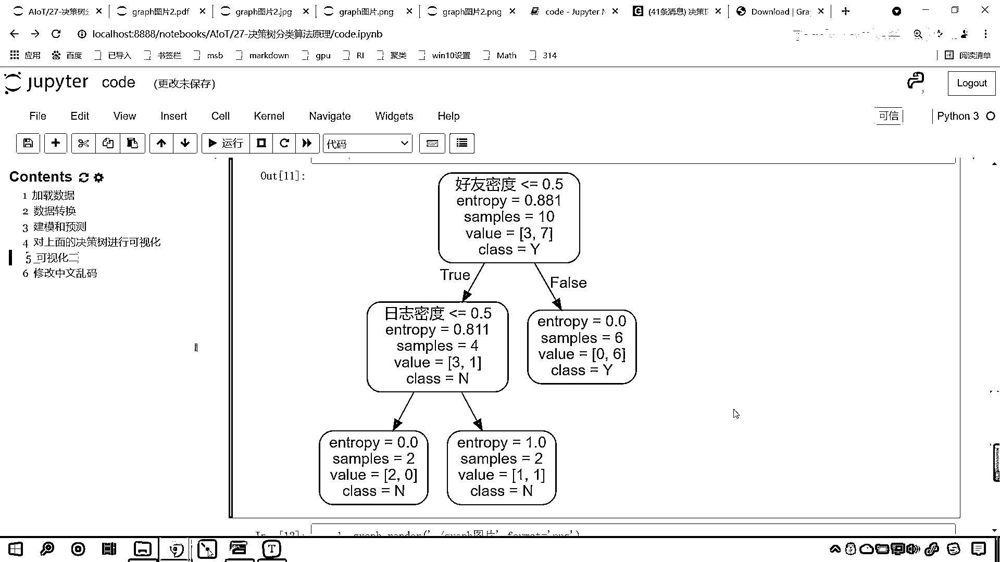

# 7天爆肝整理！AI量化交易-机器学习全套教程，从入门到项目实战保姆级教程！（数据挖掘分析／大数据／可视化／投资／金融／股票／算法） - P179：4-决策树graphviz安装与可视化 - Python校长 - BV1KL411z7WA

各位小伙伴，刚才呢，我们使用matplotlib对我们的决策数进行了一个可视化，各位小伙伴，你就能够看到这个就是我们的决策数，那我们就能够发现咱们的决策数是一个标准的二叉数，对不对。

决策数的可视化还有另外一种方式，那么另外一种方式呢，咱们使用的是graphviz，使用这个画出来的决策数，它更加的漂亮和美观，我给你看一下啊，你看这个就是咱们使用graphviz画出来的。

你看它可以设置圆角，更加的这个漂亮，丝润圆滑，那这个该如何操作呢？首先咱们得需要安装一下它的教程，那我们把这个链接打开，你看这个就是我写的这个博客啊，那我们安装相应的软件。

首先咱们要安装咱们的python库，大家看啊，叫pap-install-graphviz，你在命令行安装一下就可以了，光安装它还不够，那么它呢得需要相应的软件和它配合，那我们装CMake。

现在你就能够看到，我把下载的链接是不是都给你放到这了，好，那你点这个，那我们就可以进入到CMake的下载链接，那你在CMake下载链接这儿是吧，该怎么找呢？，找件你Windows64位是吧。

如果你要是Mac，那你就找Mac的，那我们Windows64位咱们就选择这个CMake相应的版本就行了，后缀是MSI，这个MSI呢，它其实就是EXE，也是一个可执行的文件，好，安装好，这个下载好之后呢。

咱们就进行安装，安装的过程当中，大家只需要在这个出现这一步导航的时候，我们把环境变量添加一下就可以了，你看你只需要做这个就行了啊，把这个勾选上之后，一路下一步就搞定了，这第一步就完成了。

接下来我们再来看，还得需要安装一下GraphViz，那这个该如何安装呢？，同样是不是有相应的这个下载页面啊，你进入下载页面，或者说你直接下载地址，你直接点这个软件就对应着这个下载地址，现在呢。

我进入这个下载页面给你看一下啊，咱们点继续，你看这也是一样的啊，咱们进入这个下载页面之后，那我们呢就找到Windows所对应的版本，现在咱们看刷新出来了吗？刷新出来了，第一个是Linux，是不是啊？

我们往下滑，看，找见Windows了吧，这第一个就是咱们的exe，把它下载下来就可以了，下载下来，双击是不是就可以安装，安装的过程当中，同样咱们把环境变量这个勾给它勾上，然后呢，你就一路下一步就可以了。

这个是咱们软件的安装和配置，接下来我们看一下它该如何使用啊，回到咱们的代码当中，现在的话，咱们在这儿给它添加一个标题，那这个呢，依然是三级标题，这个呢，就是咱们的可视化2，来，现在的话。

那我们就导一下包，此时呢，咱们就import graph。viz，把这个导进来，然后呢，使用tree，tree是SKlearn当中的模块，里边有一个方法叫export graph。viz，这个呢。

就是导出咱们决策数当中的数据，那我们导哪个决策数呢？model放进去，那就是model，这个model就是咱们的模型，然后呢，我们给一个field，field就表示颜色填充，现在呢，咱们接收一下。

这个就是咱们的数据，叫做dot data，dot它有节点的意思，data就是数据的意思，现在呢，我们把这个节点数据，使用咱们的graph。viz，咱们把它变成一个这个图形，那graph。

viz来一个source，咱们就将上面的dot data放进去，那我们就接收一下graph，现在你看就有一个图形了，我们显示一下这个图形，此时你看我一执行，来各位小伙伴。

你能够看到咱们这个数据是不是就有了呀，那我们这个参数当中呢，还可以有更多的设置，rawend我们来一个true，这个时候就是圆角，现在你就能够看到它的四个角是不是就圆滑了呀，四润了是不是四润圆滑有弹性。

然后接下来呢，我们再来，道号，咱们呢，再给一个feature names，这个feature names就是它的这个特征，就是你这个X1是什么样的特征呢，咱们把这个特征我们给一下啊，好。

那咱们的数据是不是上面的X呀，对不对，你看，执行一下，那特征都是什么，日志密度，还有密度，那现在的话，咱们获取一下它的这个特征，好，那这个时候呢，就是x。columns执行一下。

现在你发现看原来是不是X1呀，现在你看就变成了什么，是不是好有密度呀，这个时候我们就更加清晰啊，好，然后呢，道号咱们还可以给一个class name，那这个class name其实就是它的这个这个类别。

那我们的类别分哪两个呢，咱们给一个y，给一个np。unique，unique呢就是去虫，咱们把y放进去，这个时候大家仔细观察啊，你看我一运行，大家看这个class这个地方是不是就给了个y，给了个n呀。

那这个y它表示什么呀，这个y是不是就是表示咱们的这个账号是真实账号，n是不是就表示这个账号是是这个虚假账号呀，哎，大家看这个图形是不是就有了，那图形有了之后，接下来呢，我们再进行一个操作啊。

咱们可以把这个图形呢给它保存一下，那这个时候呢就是graph，咱们来一个点，调用方法render，这个时候呢，咱们就来一个小括号，那我们把它保存一下，咱们来一个点反斜杠，哎，这个时候呢。

咱们给它起个名啊，叫j叫做jraph，叫做graph图片，然后呢，逗号咱们可以给它格式叫format，就是保存图片，我们可以给png是不是还可以给jpg呀，咱们还可以给pdf。

现在咱们给一个png这种形式，那我执行这个代码，你看我一运行，现在这张图片是不是就保存成功了呀，咱们现在回到当前路径下，来，现在你能不能看到咱们刚刚保存的这个graph图片呀，我们打开看一下啊。

来各位小伙伴，你发现这张图片这怎么给乱码了呀，那这个是不是中文呀，对吧，那他为啥乱码了，那肯定是咱们的编码是不是有问题，咱们修改编码是不是就可以了，这是一个思路啊，好。

那么我们除了存了这个graph图片，我们是不是还存了一个graph呀，看到了吧，是还存了一个graph，这个是不是没有后缀，它是不是也是几秒钟之前存的，那这个是什么，咱们打开看一看来。

各位小伙伴你就能够看到这个是什么，是不是一个文本文件对不对，我们在进行数据保存的时候，各位你就能够发现，你看咱们使用tree，export graph。viz，这个是不是将咱们的数据导出。

我们这个数据是不是叫做dot data，这个dot呢，它有节点的意思，那这些节点，它是以怎样的形式表现的呀，你看咱们打开这个txt这个文件，你就能够发现看啊，这个地方是不是有一个label。

好友密度小于等于0。5，是不是啊，好，那么在这个文本文件当中，我们就发现这个地方是不是有一个font name，这个font name是不是就是字体，它这个字体不是咱们的中文字体。

所以我们保存的这个图片，那中文呢就没有很好的显示，那现在怎么办，来咱们回到代码当中，咱们去修改一下中文乱码，咱们呢，再来一个三级标题，这个呢，就是修改咱们的中文乱码，这个也很简单，好，那么现在的话。

我们文本文件当中的数据不匹配，那我们导入re，这个呢，就是咱们的正则表达式，然后呢，咱们将这个文件呢给它open一下，那来一个open，那就是点反斜杠，咱们找件graph图片这个文件，然后呢。

我们给它读出来数据，咱们给一个encoding编码，那就是UTF-8，好，现在这个文件咱们就加载进来了，那我们的文件操作永远是有了打开必须得关闭，所以说咱们忘了我们把这个文件关闭，咱们先给它关闭。

然后在开和关之间，咱们呢，对它进行相应的操作，那我们是不是要把这个数据给它读出来啊，对不对，那这个时候呢，咱们就读出这个数据吧，那我们就调用f。read，你看这个数据是不是就读出来了，读出来之后。

咱们用s来表示啊，这个就是咱们的文本，那我们对这个文本进行什么样的操作呢，那这个时候就是re。，咱们调用sub，re呢，是这个正则表达式sub就有替换的意思，咱们替换谁呢，替换s，s当中的数据。

那我们要把它当中的什么数据找出来啊，那就是font，内幕，我们让它等于多少，来咱们回到这个文件当中，你看是不是就是它选中复制一下，回到代码当中，咱们在这来一个粘贴，那要把它替换，替换成什么样呀。

中间是咱们要替换的数据，那就是font，内幕，这这个时候呢，咱们就给一个放送啊，来一个放送，好，那么这个时候咱们就替换了，好，那么替换的时候呢，我们前面给一个r，就是字符号上面前面给一个r。

是不是就是表示它是这个正则表达式的意思呀，好，那么你看这个文件就替换了，那这个文件替换了之后，咱们接受一下，依然把它叫做s2，现在呢，我们需要将s2保存到一个文件当中，这个时候呢，就是打开一个文件。

叫做位置Open，打开哪个文件呢，咱们新给他一个文件，这个时候咱们就来一个graph图片2，往这个文件当中去怎么样，写东西来一个w，然后呢，我们给一个编码encoding，我们让它是utf8，as。

as咱们的file，那有了它之后呢，现在咱们就像file当中，我们去write写东西是不是就可以了呀，咱们就将这个s2替换之后的这个数据写进去，那这个位置Open，咱们是不是这个代码执行结束。

这个文件是不是会自动的帮我们关闭呀，咱们就不需要关闭了，来此时咱们执行这个代码，代码执行了，那看一下我们当前路径下，是不是就多了一个graph2图片呀，看到了吗，graph2图片2，来咱们打开这个图片。

好，现在你就能够发现这个font name，是不是就变成了放送了，好，那变成了这个之后呢，和原来的是不是就不一样了，看到了吧，和原来的就不一样，来现在咱们在代码当中，我们把这个数据呢。

再用graphviz，我们去给它显示一下好不好，那这个时候呢，咱们就使用graphviz。source，然后。调用它的from file，我们修改之后的这个文件，是不是就是graph2图片呀，对不对。

好，那么来咱们接收一下啊，这个时候来一个graph，你看这个graph在咱们这个网页当中显示的时候，它呢是没问题的，看到了吗，它是没问题的，哎，现在你看咱们出现了一个错。

couldn't find 放送，那这个是怎么回事呢，是因为我们放送后面这个s，应该也是大写，咱们这个地方给了个小写，现在呢，我们把它调整过来啊，叫做放，这个这个o呢，我们应该写成a是吧。

咱们来一个放送啊，这个时候这个送到底是大写小写，咱们验证一下啊，来再来执行一下上面的代码运行，好，那么这个文件又被覆盖了，咱们重新再来执行，这个时候一执行。

大家现在就能够看到这个字体和刚才是不是就不一样呀，看到了吧，和刚才不一样，刚才长什么样，我给你看一下看到了，刚才这个字体是不是就这个黑一点啊，看到了粗一点是不是。

你看现在这个放送是不是轻描淡写的这种感觉就有了，哎，这个时候说明咱们的字体就写写对了啊，刚才不小心给写错了啊，看刚才写成什么了，是不是f o n g啊，是吧，哎，犯了一个低级的错误啊，好。

所以我们代码一报错，咱们是不是就把它改过来了，好，那么在在咱们这个网页当中，在咱们代码当中，我们显示是没问题的，对不对啊，你看上面他不是这个他，他是咱们的非中文字体，我们在代码当中显示也没问题。

但是我们什么时候出问题了，保存图片的时候出问题了，现在呢，我们把字体给他调整成放送了，咱们保存一下图片，我们看一下还有没有问题，这个时候呢，咱们就调用render来一个小括号来一个点反斜杠。

那这个时候呢，咱们给一个这个graph，graph图片2，然后呢，format我们给他调整一下，那这个format呢，就是png来咱们执行这个代码，此时你看我一运行保存成功了，回到咱们目录下。

咱们就看一下graph2这张图片，看看到底怎么样，来现在你就能够看到看好有密度是吧，呃，成功了吧，原来我们看原来咱们graph图，原来咱们的这个graph图片，你看他怎么样。

他是不是咱们的这个中文乱码了，现在你看这张图片没问题了吧，好，那么我们保存的png，咱们所看到的这个图片呢，他不太清楚是吧，咱们说了保存图片的时候，咱们是不是可以给相应的格式来。

咱们给一个gpg执行一下这个代码好，那么当前路径下就多了个gpg看到了吧，是不是来打开这个图片看一下，这是gpg的形式，那除了这种之外，咱们还可以给什么，还可以给pdf来咱们执行这个代码，好。

pdf格式，咱们就保存成功了，看当前路径下是不是就多了一个，graph图片2 pdf呀。

我们打开这个，哎，现在你就能够发现，你看使用pdf这个效果是不是要稍微好一点。

咱放大一些，是不是更清楚呀，所以说咱们的graph vaz保存的时候。

那我们就选择pdf这种格式，咱们保存的图片呢就非常清楚了，好，到现在为止，我呢为各位小伙伴演示了咱们，决策数可视化的第二种方式，是吧，就是咱们的graph vaz，大家要记着。

你的电脑上如果想要使用graph vaz，首先你得需要安装相应的库，对不对，咱们的教程就在这里，这个呢是我写的相应的这个博客非常清楚明白，你呢。

按照这个安装流程。

把它安装一下，然后呢，重启你的命令行，知道吗，安装之后呢，你把这个命令行关闭掉，然后重新打开这个时候呢。

你再进入咱们的主排列，notebook，你就可以使用这个简单的代码，使用这个简单的代码进行相应图形的绘制了，他画出来这个图形是很漂亮美观的，好。

这个就是咱们决策数的可视化的第二种方式。

格拉夫VAZ，謝謝觀賞。