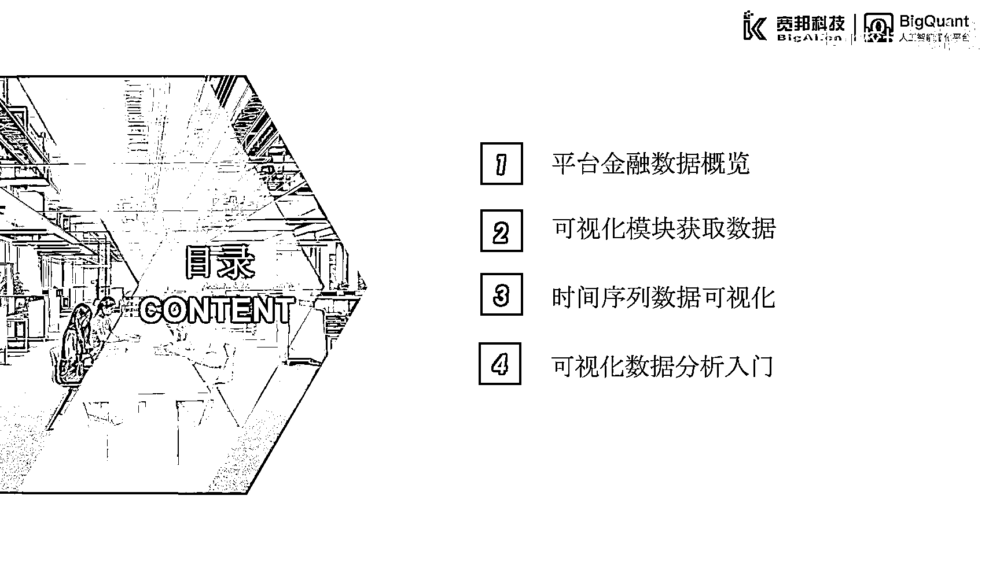
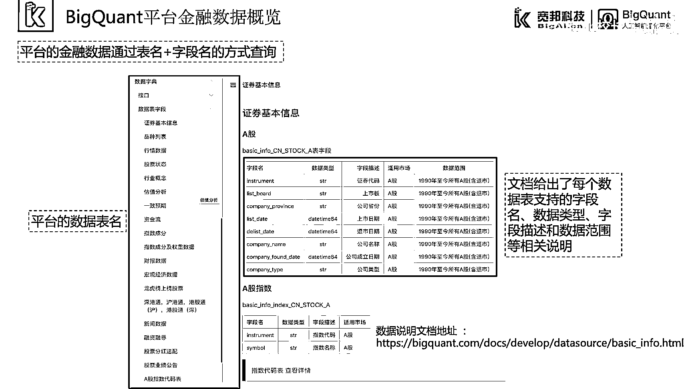
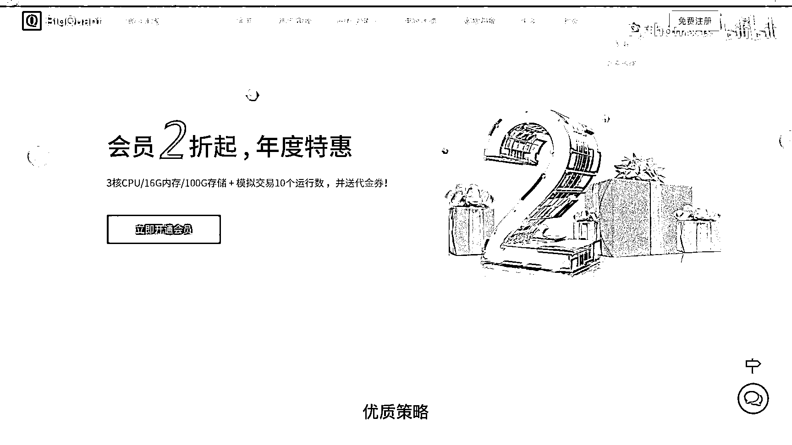
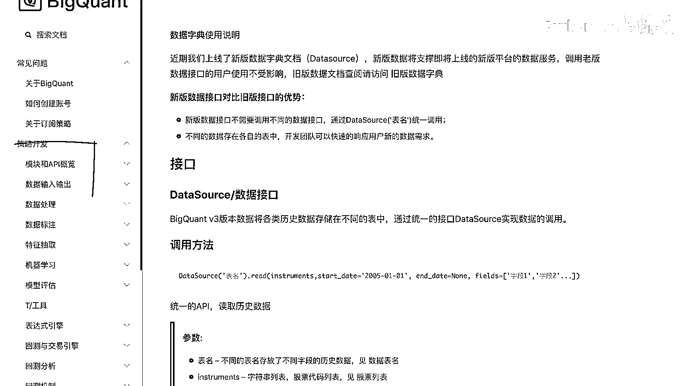
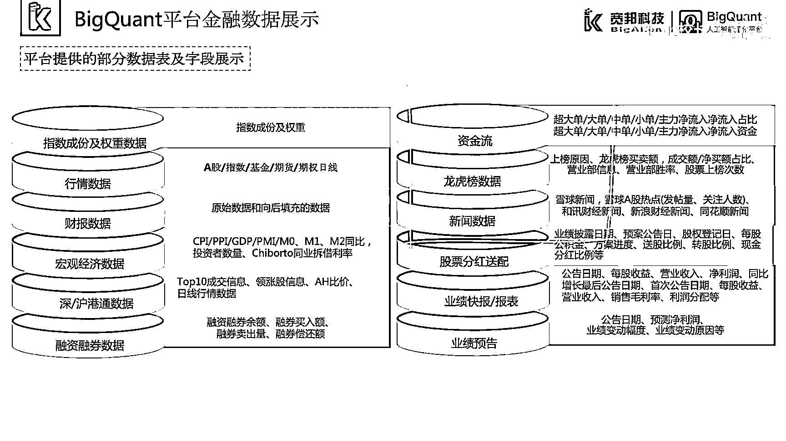
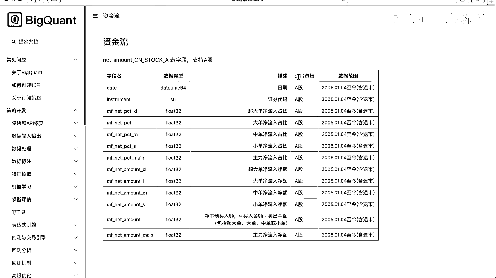

# 7天爆肝整理！AI量化交易-机器学习全套教程，从入门到项目实战保姆级教程！（数据挖掘分析／大数据／可视化／投资／金融／股票／算法） - P17：4.1.1-金融数据 - Python校长 - BV1KL411z7WA

这一章我们来介绍量化数据研究，本章主要介绍四个方面内容。

首先介绍Bakecoin平台金融数据概览，然后介绍可视化模块获取数据，紧接着我们会介绍时间序列数据的可视化分析。

最后我们会介绍一些可视化数据分析的入门知识。

第一小节平台金融数据概览，Bakecoin平台提供了大量的金融数据，我们可以在Bakecoin平台的文档中，查看Bakecoin平台提供的数据字典功能，在数据字典中提供了大量的数据表。

我们可以通过点击表名来查看对应的表信息，文档中给出了每个数据表所支持的字段名，数据类型、字段描述和数据范围等相关说明，例如证券基本信息表中A股证券基本信息。

它的表名为BasicInfoCNstock-A，它对应的字段包含了InstrumentListBoard，CompanyProvince等，对应的字段描述为证券代码、上市板、公司省份等。

平台中的金融数据都可以通过表名和字段名的方式进行唯一索引。

我们可以通过Bakecoin的网站主页中帮助中心文档。

点击进入Bakecoin的文档，可以看到首页上有数据字典相关链接，我们点击链接或点击左侧导航栏。

Bakecoin的平台提供了大量的金融数据，其中包括指数成分及权重数据、行情数据、财报数据、宏观经济数据、深户港股通数据、融资融券数据、股票分红送配数据、业绩快报、报表，以及业绩预告等基础金融数据。

此外还包括了资金流、龙虎榜、新闻等特色金融数据。

在帮助文档中，这些数据以表的形式存放并展示，例如资金流，该表中包含了资金流的表名以及字段名，所支持的市场使用范围和字段类型以及数据范围等信息。

