# 7天爆肝整理！AI量化交易-机器学习全套教程，从入门到项目实战保姆级教程！（数据挖掘分析／大数据／可视化／投资／金融／股票／算法） - P180：5-信息熵和信息增益概念和公式 - Python校长 - BV1KL411z7WA

好 咱們呢 該修理的這個字體呢 該調整的字體咱們已經調整了。

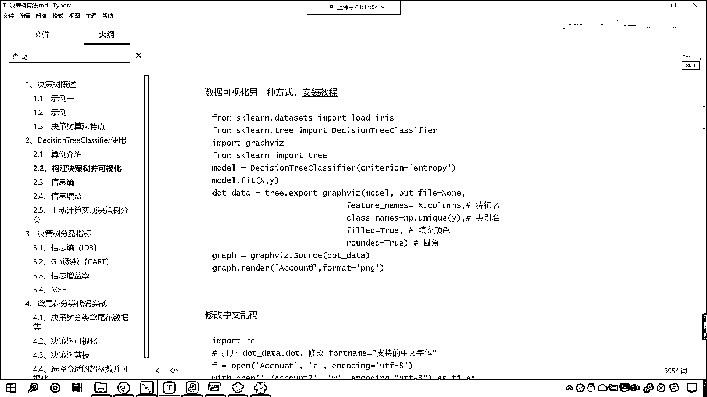

現在呢 還有一個疑問 就是咱們這個是如何 就是這個決策樹是吧 它是如何構建的呀。

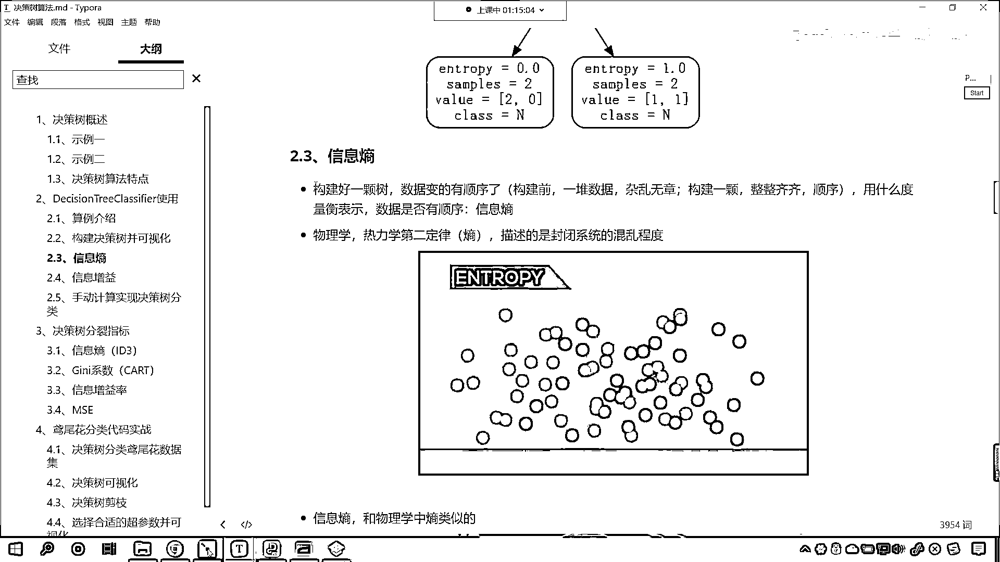

對吧 為什麼呀 你看為什麼第一個就選好友密度 對吧 而不選日誌密度，你在你的電腦上 你去執行這個結果 你和我執行的結果應該是一樣的，也就是說我們不會因為電腦不一樣 品牌不一樣 執行的結果不一樣。

那之所以能夠出來這個結果 它一定有一個標準 咱們說這個標準就叫做Entropy，什麼是Entropy呀 我們往下看 Entropy有商的意思。

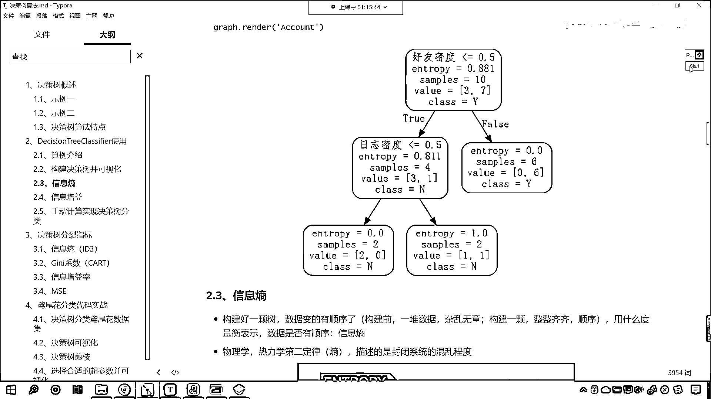

那麼在我們計算機裡邊有信息商 那麼它呢是構建好一棵樹，咱們的數據就變得有順序了 對不對 構建之前是一堆數據雜亂無章。

構建好之後 這個數據呢就整整齊齊。

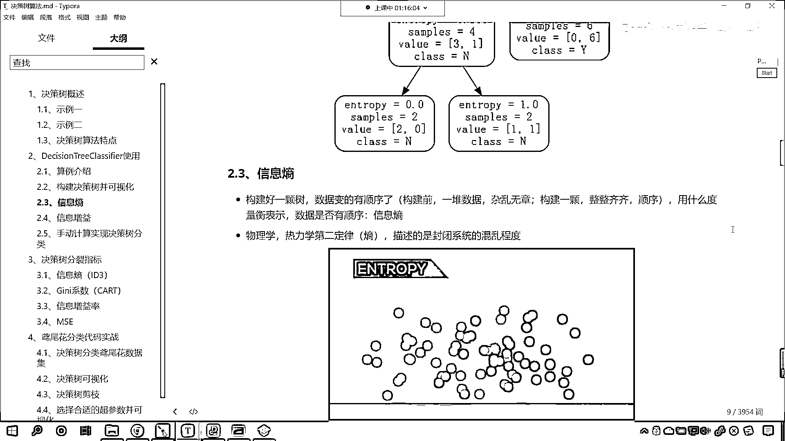

那麼咱們到底是用什麼樣的標準來構建的這棵決策樹呢，咱們用的就是信息商 什麼是信息商呀。

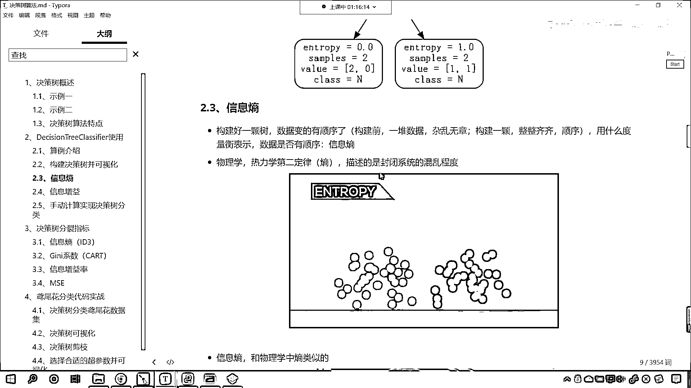

這是熱力學的第二定律 是吧 商 那什麼是商呢。

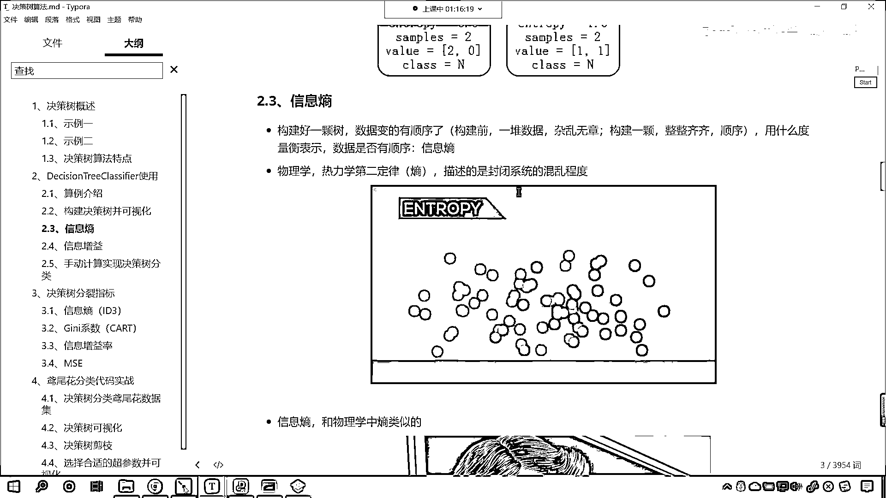

它物理的含義它是描述封閉系統它的混亂程度，在這裡你看我給了一個動圖 你就能夠發現，原來咱們是紅色的底和這個綠色的底 兩類，那麼只要你把它打亂順序 它們是不是就越來越混合 越來越混合呀。

原來的時候是一邊是紅色的一邊是綠色的 這個時候特別的規律，整整齊齊 隨著你把它打亂順序 是吧 越來越混亂，那麼這個混亂程度該用什麼去描述呢 你看我們長多高 咱們用身高來描述。

是不是啊 我們體重多少 咱們是不是用千克來描述呀，那麼一個封閉系統它的混亂程度用什麼來描述呢 就用商，商呢 它有相應的物理概念和它的計算公式。

好 那麼大家看啊 就是原來咱們這個系統是一邊是紅色的球一邊是綠色的球，你看到現在是吧 大家看啊 咱們畫一個圖啊。

你看現在是吧 它是不是就變得混亂了 這個混亂的多少大小就用商來表示。

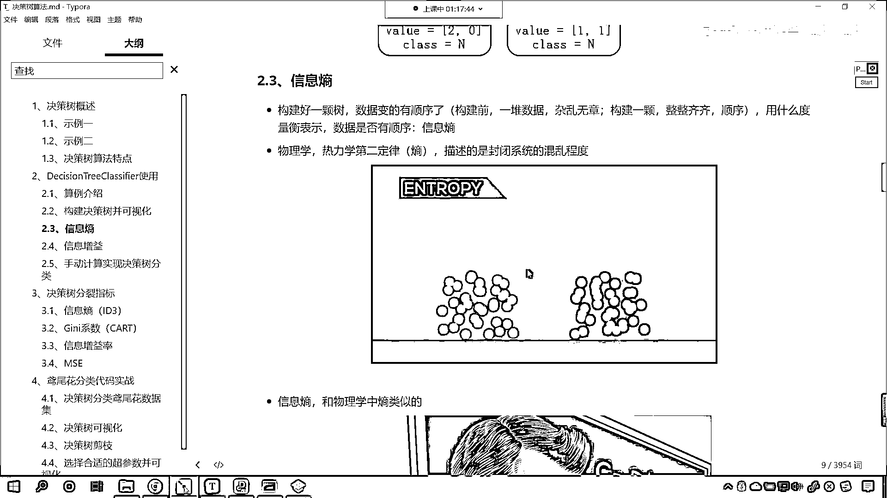

那麼什麼是信息商呢 這信息商和物理學當中的商是類似的。

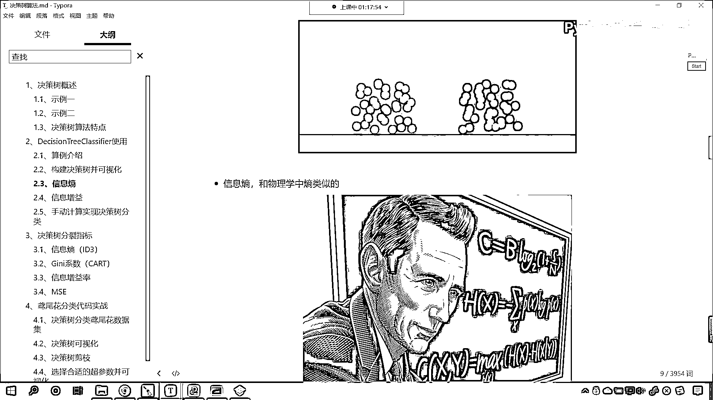

相農這個人他呢給信息商下了一個定義 同時呢他也給了相應的計算公式。

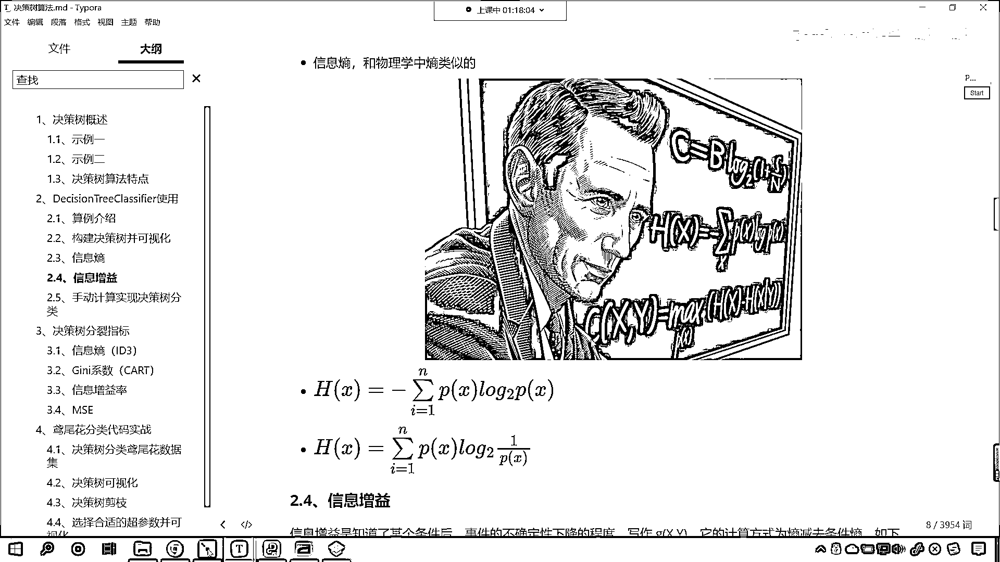

大家現在看到的這個公式就是咱們的商 看到了吧 看到的這個公式就是咱們的商，那我們對這個公式進行一個說明 這個公式是不是有一個求和符號呀，能明白吧 看到了吧 有一個求和符號 求和符號後面是不是有一個乘法。

看到了吧 是不是有一個乘法 這是誰和誰相乘呢 是PX乘以PX的以二為底的對數，簡單不簡單 看到了吧 就是PX乘以以二為底PX的對數，這就是相農這個人 是吧 他給的我們定義。

好 那麼我們把這個就叫做商 前面有一個符號 為什麼前面有一個符號呢，因為咱們的PX表示某一類的概率 咱們這個PX它呢表示概率，而概率的範圍你想一下是不是0到1之間呀 如果以二為底求0到1之間的數。

那麼log以二為底得到的這個結果是不是就是一個小數呀。

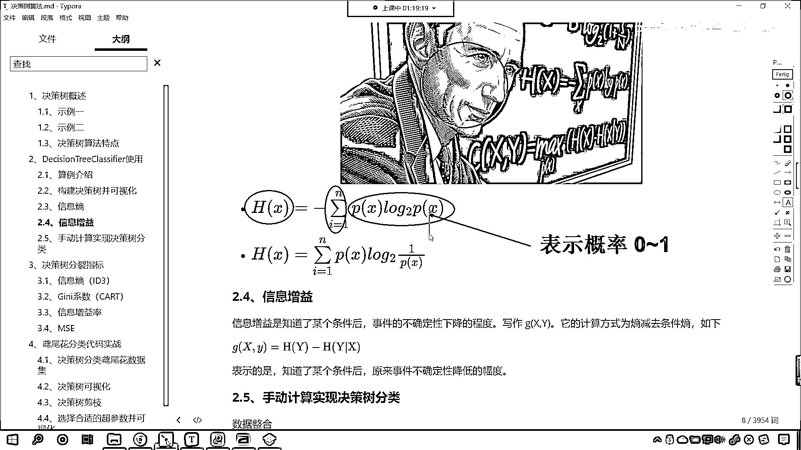

來 我在代碼當中給你演示一下 回到代碼當中，咱們np。log以二為底 如果我要給個1求解出來是多少 是不是0，如果我要給個0。5求解出來是多少 現在你能夠發現是不是負的1呀。

看到了吧 所以說咱們的PX它表示什麼 它表示概率，表示概率那麼它的範圍是多少 是0到1之間，既然它的範圍是0到1之間 我們以二為底求對數的時候，你想它是不是小於等於0呀 對不對 你看它一定是小於等於0。

所以說咱們這個公式怎麼樣 因為我們描述的這個數據一般情況下都是正的。

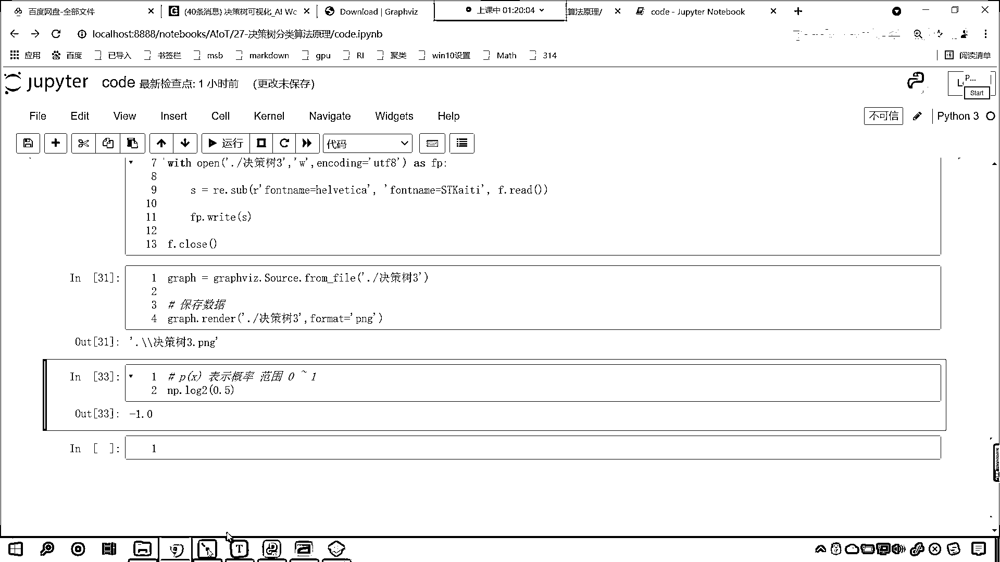

所以說它的前面咱們帶了個負號 這個負號是不是和咱們log一接觸，是不是就把它變成正數了 對不對，好 那麼我們對數有一個運算 你前面有一個負號 這個負號是不是可以寫到咱們log裡邊呀。

看到了吧 原來你是PX 現在是不是你就變成了PX分之一呀，看到了吧 這個負數給它挪進去 它就變了啊 這個就是商，來 各位小夥伴 各位小夥伴 你現在明白什麼是商了嗎。

在討論區裡邊你回復我一下啊 你知道什麼是商的這個概念了。

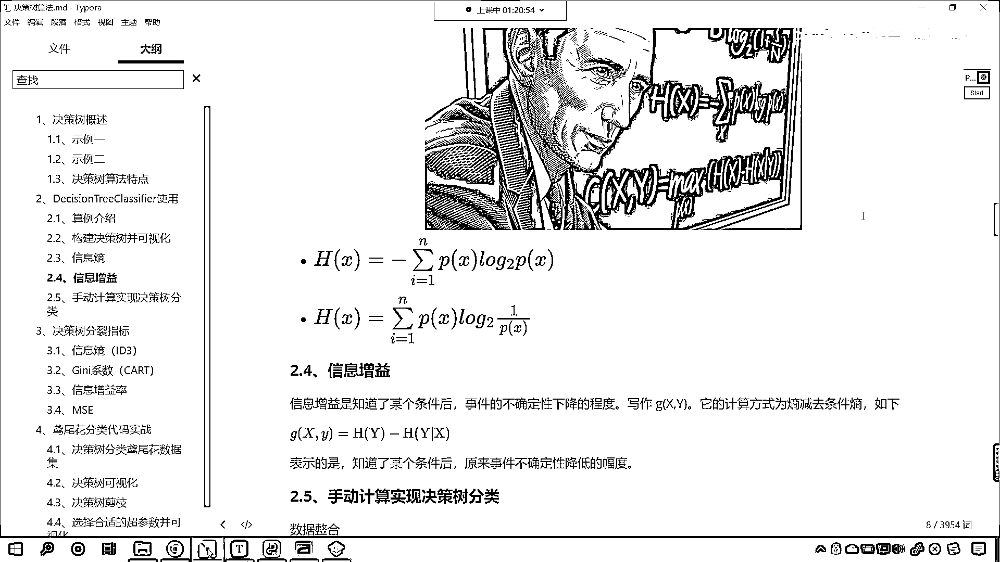

明白它的公式是怎麼樣的一個計算 那麼你在討論區裡邊回復一個1024啊。

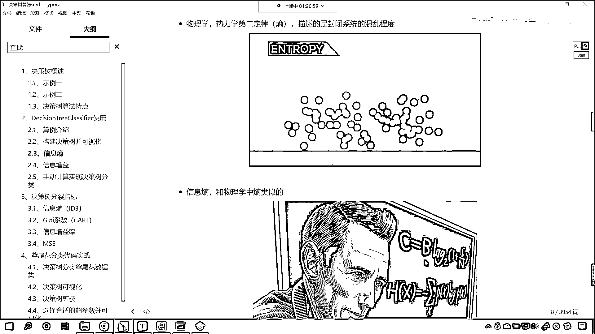

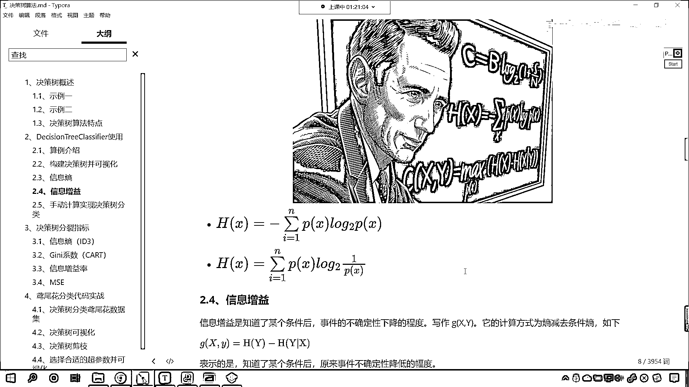

你看一下咱們這個動圖 大概呢就能夠明白一點，這個動圖呢 它是越來越混亂 那麼這個商呢就越來越大，那麼具體公式計算就是咱們這個公式 咱們說這個P它就表示概率。

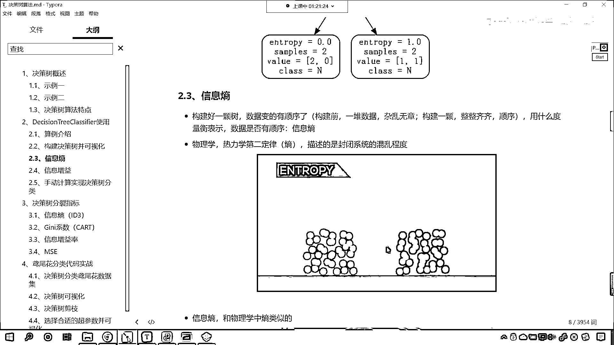

那麼現在呢 你不要問我說老師這個公式是怎麼推導出來的 是不是啊，咱們現在呢就能夠看懂這個公式，我們能夠看懂這個公式是怎麼回事 咱們能夠在代碼當中對它進行計算就可以了。

那到底香濃這個人是怎麼推導出來的 是不是啊，那你想 是吧 人家是偉大的數學家呀 對吧 他肯定是有一定的這個推導過程，咱們後面我們隨著這個決策術的這個講解的深入 咱們也會為各位講解這個商是怎麼回事啊。

為什麼這個商這麼計算 但是今天咱們不做過多的展開 你了解這個公式就可以了。

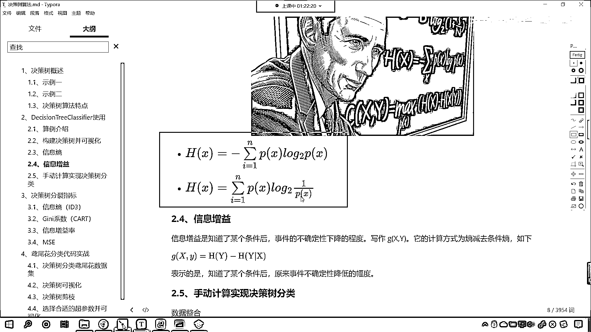

好 現在我們知道什麼是商了 那咱們呢再來一個概念叫做信息增益，這什麼是信息增益呢 看到了增就是增加 益是不是就是好處呀，信息增益呢就是知道了某個條件後 咱們是事件的不確定性下降的程度。

你看這句話說的是吧 各位小夥伴一定理解不了 看到了吧，你一定不能夠這個理解到底是什麼意思，就是信息增益就是知道了某個條件後 事件的不確定性下降的程度。

那咱們把它寫作什麼 gxy 它的計算方式為商減去條件商 看到了吧，就是商減去條件商 那就是jxy就等於hy-hy^x。

好 那麼這個到底是什麼意思呀 它表示的是知道了某個條件後 原來事件不確定性降低的幅度，那麼有可能大家對於信息增益還有一點模糊，我們在具體的代碼計算當中 咱們進行展示 你就明白這個信息增益是什麼意思了。

好 那麼這一部分呢 我們介紹了信息商和信息增益。

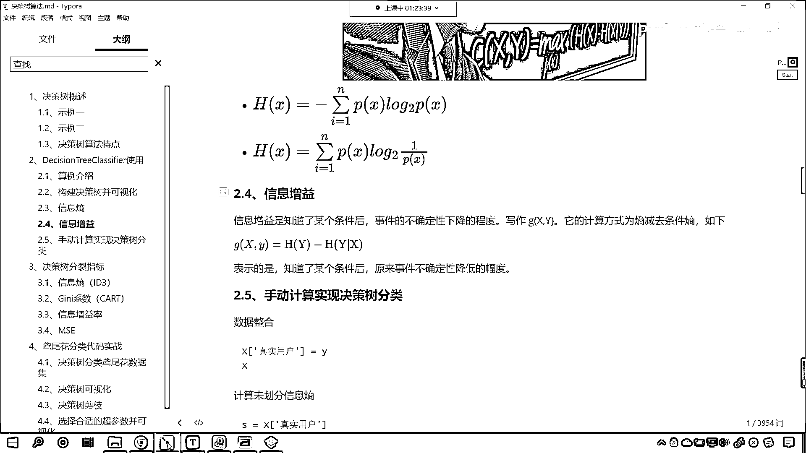