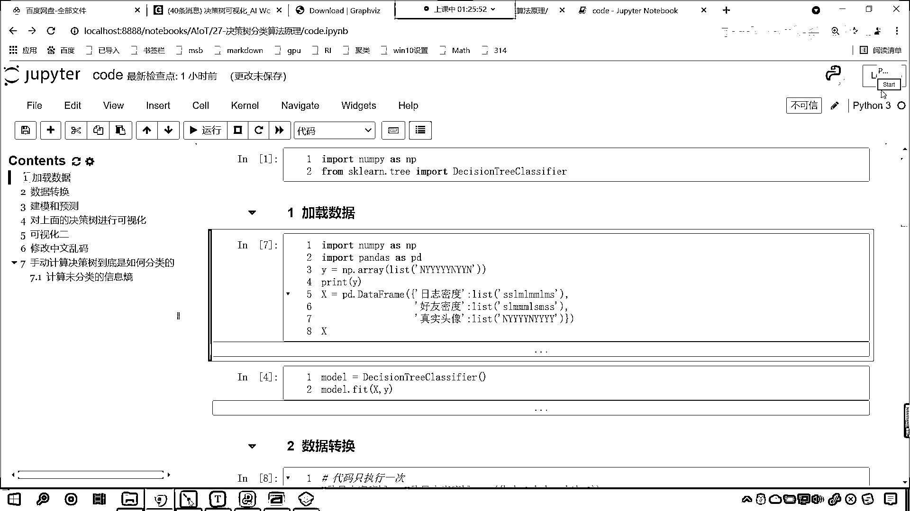
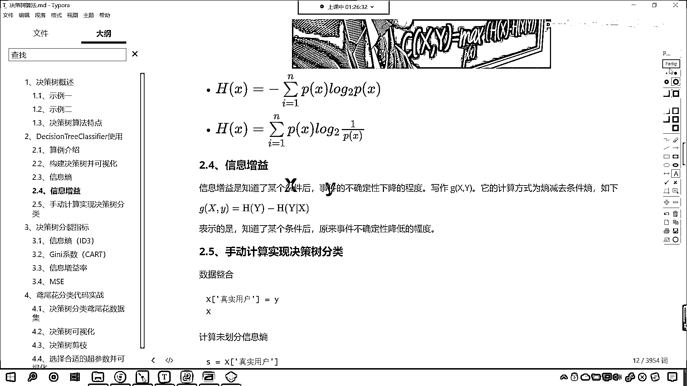
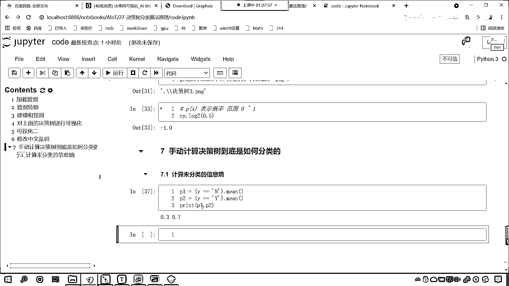
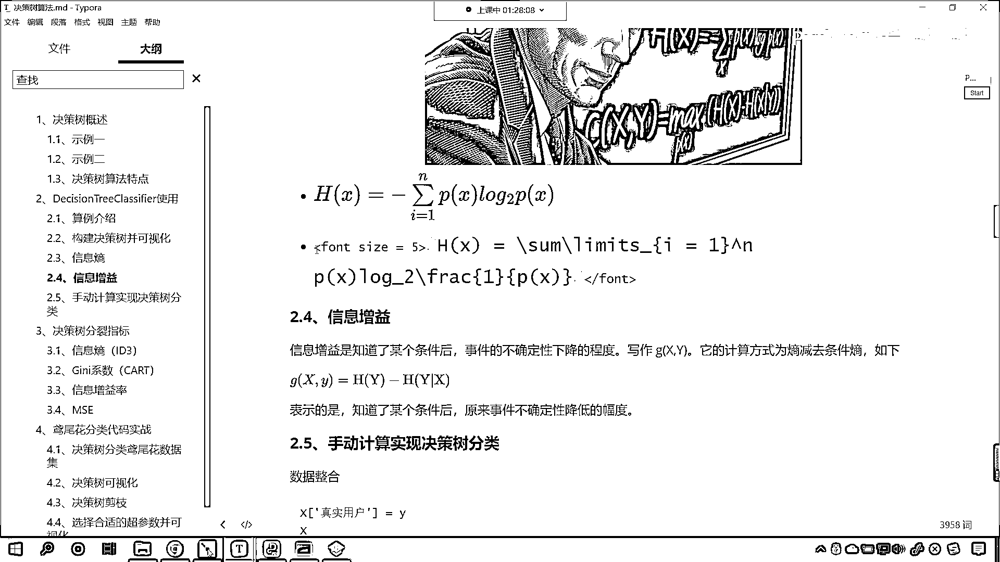
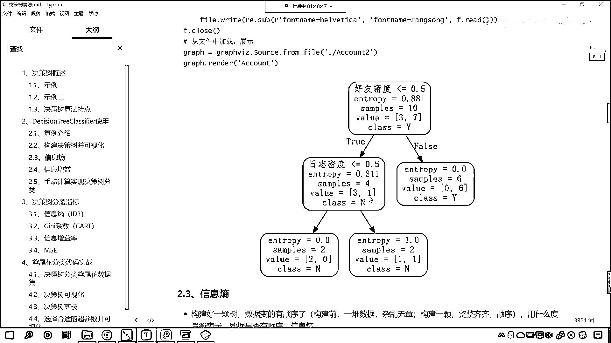
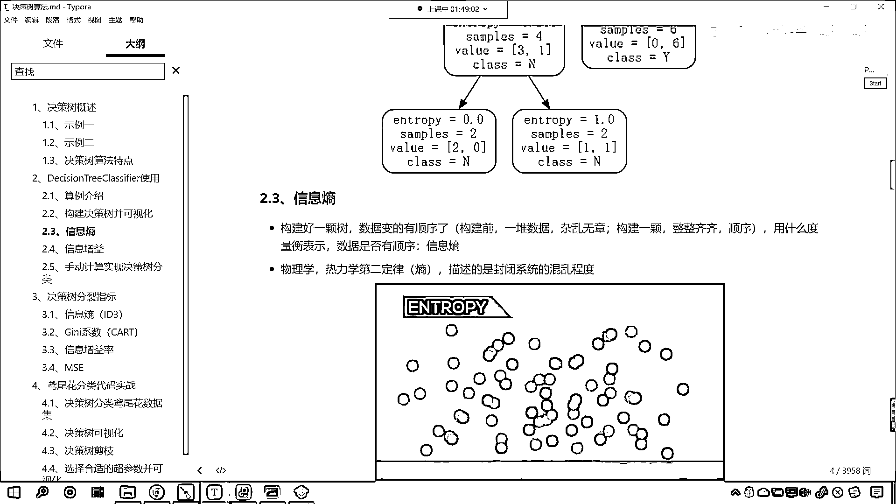
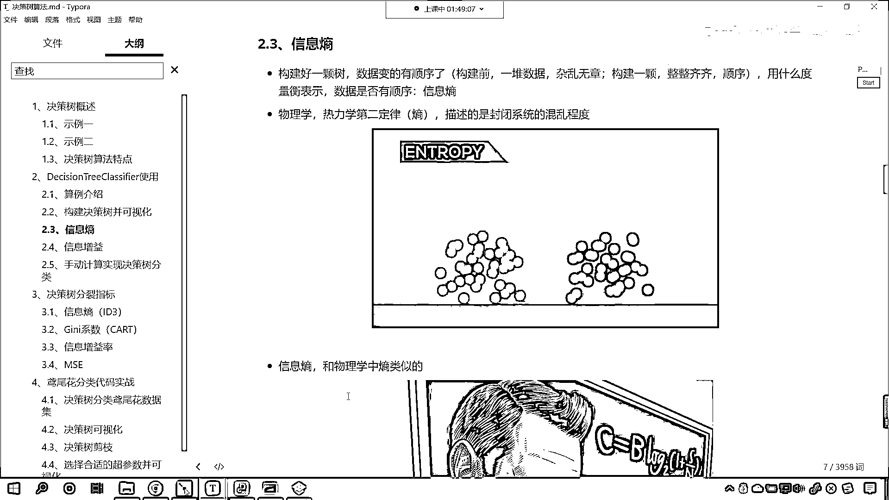
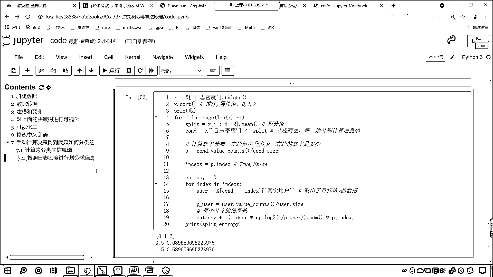

# 7天爆肝整理！AI量化交易-机器学习全套教程，从入门到项目实战保姆级教程！（数据挖掘分析／大数据／可视化／投资／金融／股票／算法） - P181：6-手写代码计算信息熵 - Python校长 - BV1KL411z7WA

各位小伙伴，現在我們終於要回答一個問題了，就是剛才對於我們的數據的劃分，剛才咱們說這個案例，好友密度，日之密度，它為什麼這樣劃分，為什麼我們這個entropy是0。811，看到了吧，為什麼它是0。

811，對吧，一開始的時候為什麼是0。811，對吧，那這個是不是都是算出來的呀，現在的話咱們計算一下，咱們來一個三級標題，好，那麼接下來我們就手動計算一下，咱們決策數到底是如何分類的，咱們手動計算。

咱們的決策數它到底是如何分類的，好，那麼首先咱們計算一下未劃分的信息商，首先咱們計算未分類的信息商，信息商是不是有他自己的公式呀，對不對，好，那麼對於我們的數據而言，往上滑，你看一下咱們的數據。

看一下咱們的數據，X是數據，那Y是什麼，Y是不是咱們的目標值呀，對吧，那這個Y當中既有N又有Y，它是不是表示這個人不是真實用戶，如果是Y的話是不是這個賬號是真實用戶呀，對不對，好，那麼你想X是條件。

X這個條件是不是可以將咱們的Y進行一個很好的劃分呀，想一想是不是。

咱們剛才在介紹的時候，這個信息增益這說了這樣的一個概念，信息增益呢就是知道了某個條件後，事件的不確定性下降的程度，事件的不確定性下降的程度，那麼某個條件就對應著咱們數據當中的X，這就是條件。

那麼事件的不確定性下降的程度，這個事件就對應著我們的Y，因為Y是目標值。

現在呢咱們回到代碼當中，我們就進行一個計算，在這兒你看咱們就計算未分類的信息商，那麼想要計算未分類的信息商，是不是就是咱們的Y呀，就是咱們的Y，現在你就能夠看到，那麼我們對於Y呢，咱們對它進行一個操作。

這個時候呢咱們的Y等等N，這個時候你想咱們是不是可以得到一個概率呀，那麼它的概率呢咱們看一下是多少，咱們來一個小括號，咱們點求一下密，這個時候你看它是不是0。3呀，對不對你看這個是0。3。

那我們把它叫做P1好不好，然後咱們再來一個P2，P2等於多少，Y我們讓它等等，Y點求一下密，咱們print輸出一下P1和P2，你看我一執行，是不是0。3和0。7呀，也就是說我們在未分類的時候。

你的這個P1和P2是0。3和0。7。

你還記得咱們的信息商公式是如何算的嗎，看是不是這種算法，來咱們把這個複製一下。

公式複製一下，回到咱們的代碼當中，來一個markdown，在這來一個粘貼，Ctrl+V，執行一下，你看這個PX，PX是不是就相當於咱們某一個類別的概率呀，你想你P1是不是表示N，它的概率是多少。

是不是0。3，P2是不是表示Y，它的概率是0。7，那咱們就根據這個公式計算一下吧，首先是來一個求和，對不對，好那麼我們就讓P1，乘以多少，乘以NP。log(2)為底，是不是1除以咱們的P1，然後再加上。

大家看然後再加上P2，乘以多少，NP。log(2)為底，是不是1除以P2，來各位小夥伴到這裡，各位小夥伴到這裡，你能夠明白這個公式是什麼意思吧，能夠明白的，咱們就是根據上面這個公式計算的。

你看我一執行它是多少，結果出來了，是多少，0。88129，咱們讓它保留三位小數，那後面這個290是不是就約掉了，其實它是不是就是0。881，對不對，0。881熟悉不熟悉，你在哪裡見過呀，看咱們可視化這。

你看，看啊，0。881，這個表示什麼，咱們在這要說明一下，看啊，在這要說明一下，你想這個是不是屬於我們的樹頂呀，對吧，就是在這還沒有開始劃分呢，對吧，那沒有劃分的時候，我們計算出來的信息商。

這個是為劃分，我們的信息商，咱們計算結果是多少，看，是不是0。881呀，它保留了三位小數，對不對，這是為劃分的，你看啊，你好友密度小於0。5，到下面是不是才有分支呀，那這還沒有分呢，那我們就發現這個0。

881，和咱們剛剛計算出來的是不是一樣，看到了吧，和剛剛計算出來的是不是一樣呀，哎，現在你就明白是怎麼回事了，對不對，然後呢，我們接下來繼續啊，看啊，這個是未分類的信息商，那麼我們就再進一步。

咱們呢就按照，咱們就按照日誌密度，咱們來進行劃分，好不好，接下來就是按照日誌密度來進行劃分，好，那麼我們這個日誌密度，咱們該如何對它進行操作呢，這個時候呢，因為我們的數據X，大家看啊，咱們這個數據X呢。

是日誌密度好友密度真實頭像，我們再給它增加一列，咱們再給它增加一列，咱們增加的這一列呢，就是真實用戶，就是咱們的目標值Y，打印輸出一下這個X，來，現在你就發現，是不是我們把目標值。

也加到咱們的數據X當中了，對不對，好，那麼我們把它加進去之後，這個就變成，data frame當中的一列，那麼我們在進行計算的時候，就會方便一些，看這就是咱們的目標值Y啊，前面這三列呢，是咱們的數據X。

現在我們把它增加進去了，好，那麼接下來呢，我們就按照日誌密度進行劃分，上面這個計算出來的0。881，這個是不是未分類的時候，是不是沒有條件的時候，咱們計算的信息商呀，接下來呢，我們按照日誌密度進行劃分。

咱們去計算信息商，咱們求一下信息商，好，那麼咱們該如何對它進行劃分呢，看這個時候呢，咱們把日誌密度的數據給它拿到，看那就是日誌密度，然後我們調用一下它的什麼呢，unique這個函數，你看我一執行。

你想你的日誌密度，一共有幾種情況呀，是不是012呀，對不對，看到了吧，012，那日誌密度咱們接受一下，我們起個名叫小寫的X，大家注意，我用小寫的X，你看咱們這個X，它有按照順序進行排列嗎，021。

它是不是沒有按照順序進行排列，那咱們在這個地方給它來一個Sort，在這呢，給它來一個排序，那麼排序之後，各位小夥伴你就能夠看到，我這麼一執行，是不是012呀，對不對，這個就是咱們排序之後的結果，然後呢。

咱們該如何劃分呢，我們就把它劃分成兩部分，你看該如何劃分，因為我們這個日誌密度，咱們是不是一共有三個特征呀，對不對，看日誌密度一共有三個特征，那麼咱們劃分的時候，你看我是不是可以這樣劃分。

就是從0和1之間劃分，是不是一種分類，從1和2這劃分，是不是又是一種分類呀，你想一下是不是，因為呢我們的日誌密度，它的屬性是不是一共分幾類呀，看咱們的日誌密度，它的屬性值，是不是是012，對不對。

那我如果要對這個特征，按照這個特征來進行劃分，那你想我能怎麼劃分呀，咱們是不是可以從這切一刀，可以不可以，就是你0這分成一類，1和2是不是分成一類呀，咱們還可以怎麼劃分，你看我還可以。

是不是從2這進行切一刀，然後0和1是一類，2是一類，對不對，我讓你看一下咱們可視化這個地方啊，你看咱們在這個地方是怎麼進行劃分的，那就是好友密度，如果要小於等於0。5，是不是把它歸到一個類別。

好友密度大於0。5，是不是把它歸到一個類別呀，是不是呀，好那麼問題是，看現在的問題是，你這個條件，計算機是怎麼找到的，日誌密度小於等於0。5，它是怎麼算出來的，怎麼找到的，你為啥不是2，為啥不是1。

為啥不是1。5，為什麼它就是0。5呢，你想知道嗎，計算機肯定是進行了計算對不對，現在呢，我們就按照日誌密度，咱們進行劃分，我們求一下信息商，好那我們日誌密度，你看它的屬性值是不是012。

咱們現在呢就對它進行一個便利啊，咱們來一個Full循環，來一個Full循環，那就是Full i in range，咱們來一個length x，我們讓它減1，然後來一個冒號。

接下來呢我們就計算一下列分標準，叫split就等於x中國號i冒號，咱們讓i+2，然後求一下密，我print輸出一下這個split，給你看一下它到底是多少，現在你來看0。5和1。5對不對。

咱們print一下x，因為我們的數據x，就是說這個日誌密度，它的屬性值是不是就是012，對不對我們對它進行了排序，那麼你既然是012，我如果想要把日誌密度，這個屬性進行劃分，你想咱們有幾種情況。

是不是就兩種情況，要麼從這切一刀，要麼是不是從這切一刀呀，對不對，那我們從0和1之間切的時候，咱們怎麼去找這個列分條件呀，那就是0和1相加除以2，得到的就是0。5，看咱們得到的就是0。5。

那如果要在1和2之間進行劃分，那就是1和2相加除以2，得到的就是1。5，所以說你看咱們日誌密度劃分條件，這個列分條件是不是就出來了，一個是0。5一個是1。5，好那麼我們進行了切分之後，咱們緊接著呢。

咱們就算一下它的這個概率分布，接下來咱們就算一下這個概率分布，那我們x中括號，咱們找見咱們的日誌密度，如果這個日誌密度它要是小於等於split，咱們是不是把它劃歸成一類呀，看到了嗎。

你小於等於split，是不是就是咱們左邊這個數據呀，那麼小於等於它是一個條件，咱們來一個cond，這個時候你看我print一下cond，你看我一執行，看到了吧，這是不是就是true和false呀。

看到了吧，true的話就是滿足，false是不是就是不滿足，對不對，那我們split咱們剛才看了，它的結果是什麼樣，所以說咱們就打印輸出去掉，有了這個cond，咱們緊接著呢。

咱們就去計算一下咱們的概率分布，那咱們就根據cond來進行計算，這個cond是一個series，咱們可以調用它的value，cond調用一下它的value，我同樣也給你打印輸出一下。

print我讓你看一下，這個到底是什麼，你看一執行，看什麼是value，也就是說這個false呢，是7個true是3個，那我們無論是按照哪種方式進行劃分，咱們都是7和3，看到了吧，這都是7和3。

cond是咱們根據這個列分條件，劃分得到的一個情況，就是說你是0。5的時候，咱們統計記了一下數，然後是1。5的時候，我們也記了一下數，那麼有了這個值之後呢，你看你不是7和3嗎，咱們再做一個除法。

我們除以cond。size，cond。size是它的長度，這個時候咱們就可以計算概率分布，我們叫p，print輸出一下p，你看我一執行，看咱們執行出來的結果是多少，看到了吧，這個p，是不是就是0。

7 0。3，咱們在這兒再進行一個說明，0。3它到底是怎麼算出來的，0。7到底是怎麼算出來的，好，回到咱們的數據這，來給你看一下，現在你就能夠看到，你看這是不是日誌密度，對不對，咱們的日誌密度。

咱們是根據什麼進行這個列分的，s是不是0，m是不是1，l是不是2，那你想，如果我們要根據s來進行，咱們其實這個條件，咱們這個split的這個條件，它其實呢就是0。5，那如果要是0。5的話。

根據咱們上面數據的對應關係，看s是不是0，如果要是0。5的話，其實就是三個s，對不對，那我們三個s，你算一下，看咱們數據當中有幾個s，看了吧，是不是有一個兩個，是不是有三個，對不對，那所以說。

咱們計算出來的概率是多少，看代碼當中計算出來的概率是多少，看了是不是一個是0。7，另一個是不是0。3，好，有了這個概率了，有了這個概率了，然後呢，咱們再獲取p。index，index，再獲取p。

index，那這個index是誰呢，indexes，這個indexes就是咱們的，就是咱們的false和true，就是false和true，有了它之後呢，咱們false循環，false index。

in咱們的index，咱們因為只要一列分，它是不是就分成兩邊，大家注意啊，咱們這個列分呢，它就會分成兩邊，它就會分成兩邊，然後呢，我們每一邊，咱們每一邊都要分別去計算，咱們要分別去計算，咱們的信息商。

好，那麼所以說，咱們true是一邊，false是一邊，那這個時候呢，咱們就獲取咱們用戶的數據，咱們就給一個user，就等於x中括號cund，我們讓它等等index，index。

這個cund是咱們上面計算出來的條件，等等index，這個index呢，它是什麼，它要麼是true，要麼是false，那然後呢，咱們再獲取真實，咱們再獲取真實的用戶，有了這個user之後呢。

咱們同樣的需要對user，進行一個計算，那就是user。valuecount，除以user。size，去計算一下每一邊的概率，咱們接收一下，叫做puser，這個就是概率，那麼有了概率之後，咱們現在呢。

就要去計算這個概率，所對應的信息商，那麼咱們就算一下，那就是puser，我們讓它乘以np。log，以2為底，小括號，1除以puser，你看這個是不是就是信息商呀，然後小括號給它擴起來。

咱們要求一下它的和，信息商最後是不是有一個和呀，來一個sum，然後呢，我們還要乘以，大家注意啊，這只是一邊的，是不是啊，這只是一邊的，咱們要計算一下，這一邊的概率是多少，pindex。

你看你上面這個p是什麼，是不是計算概率分佈呀，上面這個p呢，它計算的就是咱們的概率分佈，對不對，你看這個p計算的就是咱們的概率分佈，那麼這個index呢，是咱們分支裡面的，所以說呢，p。

index就是乘以它各自的概率，就像咱們在講解這個代碼的時候，你看我們這說了，現在你就能夠看到，你看你這個entropy明明不是1嗎，對不對，上面這個是不是0。811，這按道理來說。

咱們決策數在進行劃分的時候，它越劃分，它是不是純度就越高呀，看你越劃分純度越高，就像我們從上面0。881到0。811，是不是變小了，對吧，那到這怎麼從0。811到這變成了1。0呀，原因是這個啊。

你未劃分之前，你的數據是不是4個呀，看到了嗎，三合一，你的數據是4個，對不對，劃分之後，左邊是不是兩個，右邊是不是也是兩個，那你右邊兩個，你佔的比例是多少，那就是0。5，左邊兩個佔的比例是多少，也是0。

5，所以說這個商應該是怎麼算呀，這個商呢，就是1。0乘以咱們的0。5，應該是這樣算，所以我們的代碼當中，所以咱們的代碼當中，我們把這個商計算出來，然後再乘以它這部分的概率，那麼咱們得需要。

這個時候呢我們就得需要在，這個entropy這，我們聲明一個entropy，我們讓它等於0，就是在fault循環之前，咱們聲明一個entropy，那麼，在fault循環裡邊呢，咱們讓entropy加等。

咱們每一個分支計算出來的，這個時候呢咱們計算的是，每個分支的信息商，然後呢我們就打印輸出一下，回退一下咱們print，這個時候呢將咱們的列分放到這，split放到這，然後呢我們再將entropy放到這。

此時我執行一下這個代碼，咱們一運行，各位小夥伴你就能夠看到，這個信息商是不是就計算出來了，看到了吧，0。5，這個是0。68，1。5劃分，得到的信息商是不是也是0。689呀，看到了吧，那我們在沒有計算。

咱們在沒有進行分類的時候，咱們的信息商計算出來，計算出來的是多少，是不是0。881呀，咱們按照一個特定的條件進行劃分，求解出來的信息商是變大了還是變小了，是不是變小了呀，看咱們看咱們這個代碼當中決策數。

它的原理是什麼啊，看看我們的這個決策數，那咱們這個決策數，剛才咱們在進行講解的時候，這個決策數，它是不是根據某一個屬性進行劃分，那麼在進行劃分的過程當中。

它是怎麼樣了。

構建一顆決策數，這個數據是不是就變得有順序了呀，構造之前，我們認為這個構造之前的這個數據是雜亂無章的，咱們構建了一棵樹之後呢。

它就變得整整齊齊了。

就有順序了，那麼我們代碼當中展示的。

你看這個日誌密度，看到了嗎，它確實是不是就有順序了，0。68和原來相比，是不是就變小了呀，那麼啥叫信息增益，什麼叫信息增益，看信息增益，是不是就是知道了某個條件後，知道了某個條件後。

原來事件的不確定性降低的幅度呀，那在我們的代碼當中，你看在咱們的代碼當中，未進行劃分的時候，是不是0。881，所以咱們信息增益該怎麼算，咱們的信息增益是如何算的，那是不是就是0。881-。

咱們計算出來的0。68，0。6896呀，對不對，你看我一執行，這就是咱們信息增益，因為我們根據這個條件進行劃分，這是我們計算出來的，大家要注意啊，咱們在計算的時候，我們根據了日誌密度。

這個地方是不是有兩層貼循環呀，看到了吧，你要注意有兩層貼循環啊，這個代碼你要使勁的去理解一下，上面這個代碼是取它的為一值，這個比較簡單，然後呢，我們你看非常巧妙的，咱們進行切片，我們一切切兩個。

為啥要切兩個呀，是不是就是切完兩個之後求平均值，這個是不是就是咱們的列分值呀，這個是什麼，這個就是咱們的列分值，有了列分值之後，咱們是不是找見日誌密度，讓它小於等於它呀，那是不是就分成兩邊。

是不是一個是左邊一個是右邊呀，看到了吧，你看你根據某一個條件放到這，一個是左邊，看到了吧，一個是左邊對不對，另一個是不是就是咱們的右邊呀，是不是就分成兩類了，分成兩類之後咱們兩邊單獨算。

分成兩類之後然後兩邊單獨算，這個時候呢，我們使用value count，這個是計數，然後再做一個除法，是不是就把它概率分佈給計算出來了呀，你不是分成兩邊嗎，那就是你左邊的概率是多少，右邊的概率是多少。

這個就是咱們的P，那因為我們是邏輯運算，小於等於斯普利特，所以說呢，這個P的index，它其實就兩種，要麼是true要麼是false，那我們呢就再來一層false循環，再來一層false循環，你看啊。

我取出的這個數據，是不是對應著y啊，咱們取出了什麼，是不是目標值，y的數據，你看看是不是，咱們是根據什麼條件取出來的呀，是不是就是c，d等等index，看到了吧。

這個index要麼是true要麼是false，然後取出咱們，因為上面咱們說了是左邊的分佈，右邊的分佈，那我們就取出左邊的分佈和右邊的分佈，取出來這個之後，這個就是咱們的用戶user。

然後繼續對它計算一下，看到了，繼續對它進行一個計算，user。size，這就是它的概率，有了這個概率之後呢，咱們就去計算分支的它的這個信息商，然後最後呢，entropy加等，好這個是日誌密度的。

(字幕製作:貝爾)，後面那群就是朋友們 也就是我們這次在拍攝的時候的螢幕。

