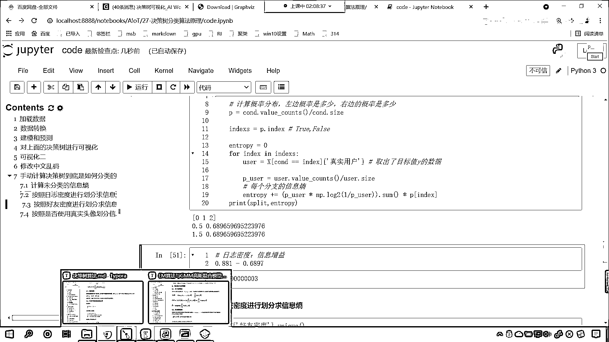

# 7天爆肝整理！AI量化交易-机器学习全套教程，从入门到项目实战保姆级教程！（数据挖掘分析／大数据／可视化／投资／金融／股票／算法） - P182：7-手写代码计算信息熵对比不同属性信息增益 - Python校长 - BV1KL411z7WA

那麼日誌密度咱們的信息增益出來了，代碼咱們就複製一下，在這來一個粘貼，上面插入一行，咱們來一個四級標題，在這呢，咱們就按照好友密度咱們進行劃分，我們求一下他的信息商，那麼如何算呢？代碼不用動。

咱把日誌密度給他改成好友密度就可以，好友密度，你這改成好友密度了，下面在進行列分的時候，這個地方是不是也改成好友密度呀，其他的地方都不用動，我執行一下，各位小夥伴你能看到。

咱們如果要根據好友密度進行劃分，因為好友密度是不是也是012呀，因為你的屬性值也是012，因為咱們好友密度呢，他也是sm和l，對不對，所以他對應的值也是012，那麼如果我們對於這三個值進行劃分。

你想咱們的拆分條件是不是要麼是0。5，對不對，要麼是多少，是不是要麼是1。5呀，對不對呀，你看要麼是0。5，要麼是1。5，沒錯吧，這個地方各位小夥伴你理解了，那你就回復一個1024，回復一個1024。

好，看來咱們各位小夥伴的悟性都很高啊，特別棒啊，那我們繼續往下講，好，那現在你就能夠發現，看到了吧，0。5，按照這個劃分，咱們的信息商是多少，0。324，那麼他的信息增益呢，咱們的信息增益是多少。

是不是0。881減去多少，是不是減去咱們的0。324呀，他的信息增益是多少，0。5569，誰大呀，咱們的日誌密度，按照日誌密度進行劃分，他的信息增益是不是0。1913呀，按照好友密度進行劃分。

他的信息增益是多少，0。56，0。5569，誰大，是不是按照好友密度進行劃分，他的信息增益更大呀，所以，我們進行劃分的時候，咱們是根據誰來劃分的，我們是根據誰來劃分的，是不是根據好友呀。

那咱們現在就算一下，咱們算出來的按照0。5劃分，我們的傷是不是0。324呀，那為什麼上面，為什麼上面這個傷是0。811呢，在這裡我告訴你為什麼，上面插入一行，咱們來算一下，咱們按照這個條件。

我們按照這個好友密度進行劃分，他是不是分成了兩部分，沒錯吧，右邊這部分這個傷是多少，0，不用算，因為他分純了，對不對，你這個傷越小越純，這個傷越小，咱們就越純，你看，這邊是不是全是Y，看到了吧，分純了。

全是Y，0和6，看到了吧，這是0和6，0呢就代表0個假用戶，6個真用戶，傷越小越純，那我們的物理上的傷是不是表示系統的混亂程度呀，你現在全是Y，是不是很純呀，對吧，是不是很單一呀。

那這一部分他的比例是多少，是不是0。6呀，對不對，看這一部分他的比例是0。6，我們看左邊這一部分，是不是一共4個數，他的比例是不是0。4，咱們這一部分的分支，他的傷是多少，看，他的傷是不是0。811呀。

我們讓0。4乘以0。811，然後再加上多少，加上0乘以0。6，因為你這兒的傷是0，比例是0。6，左邊的傷是0。811，你的比例是不是0。4呀，咱們就根據這個公式算一下，我讓你看一下，0。811。

咱們讓他乘以0。4，然後再加上0乘以0。6，你看我一執行，求解出來是多少，0。324，是不是，0。324，大家要注意啊，這個是算法，這個是咱們決策數算法計算出來的值，我們算出來的是多少，你看啊。

你仔細看，這個是決策數給我們返回的結果，對不對，這是決策數給我們返回的結果，我們算出來的是多少，往下滑，誒，各位小夥伴你看，各位小夥伴你看，我們算出來的是多少，是0。多少，0。324，看到了吧。

一樣不一樣，你告訴我一樣不一樣，一樣是不是，所以你就知道決策數到底是怎麼回事了吧，那現在呢，我再來一個打印輸出啊，咱們這樣啊，再來一個打印輸出，你看，這個地方不是加等嗎，對不對，看到了吧。

這個地方我是不是加等，沒錯吧，好，那麼我現在呢，把這個值呢，給它剪切一下，咱們用一個變量來接收一下，這個值呢，咱們起個名就叫e，是吧，然後加等e，那我們打印輸出一下，好不好，看啊，咱們打印輸出一下。

那就是print split，然後逗號，咱們將e放到這，然後咱們再將概率放到這，那這個概率呢，就是p中國號index，大家看啊，看我怎麼操作的啊，下面這個打印輸出咱們就不要了，先注視一下，看啊。

打印的時候呢，咱們來一個杠杠杠杠杠，看啊，一執行，看啊，一執行，咱們好有密度這，你看這個結果，是不是就，這個結果是不是就出來了，等會啊，咱們這個，因為咱們這個e這，是吧，它又成了一個p，那咱們這樣啊。

咱們呢，把這個詳細的結果給你打印輸出一下，複製一下，把這個e呢，替換一下，也就是說，我先不讓它成一比例，這個時候你看我一執行，來，各位小夥伴，各位小夥伴，現在呢，你睜大眼睛，因為我們放循環是進行了兩次。

是吧，咱們現在呢，給它來一個-2啊，執行一下，也就是說我們不讓它把所有的都便利，咱們只便利最優的那個條件，你看，看啊，0。5表示拆分條件，咱們這個0。5啊，也先不打印，看啊，0。6，0。4。

這個表示什麼，是不是表示比例啊，看啊，0。6對應的後面的商是多少，0，0。4對應的商是多少，0。811，看咱們的圖，你看啊，看咱們的圖，看啊，看咱們的圖，你看這個，這個是不是6，它所對應的比例是多少。

是不是就是0。6，它的商是多少，是不是0，左邊這個呢，比例是多少，0。4，它的商是多少，0。811，看到了嗎，我們計算出來的是多少，看咱們計算出來的是多少，0。811，保留三位小數是不是就是它啊。

所以只要這段代碼你能夠搞明白弄清楚，那麼決策數你是不是也可以代碼把它寫出來啊，對不對，好，那麼我們最後再看一個啊，那我們按照好友密度進行劃分了，按照日誌密度也進行劃分了，它倆一PK咱們就發現。

這個信息增益呢，是好友密度它的變化是不是比較大，看到了吧，它的變化大，我們說這個信息增益，誰比較大，誰是不是就比較好啊，看信息增益是知道了某個條件後，事件的不確定性下降的程度。

那我們這個數據按照好友密度劃分好，還是按照日誌密度劃分好，看到了嗎，按照好友密度劃分還是按照日誌密度劃分，來，討論區裡邊回復一下，是不是按照好友啊，你也想一下，你想。

一個假賬號是不是很有可能它會發表很多篇文章呀，是不是可能會發表很多篇這個博客呀，對吧，但是呢，如果說它是一個假的賬號，那麼它是不是就沒有太多的朋友呀，所以說這個好友是不是更加重要，這個是我們的常識。

那我們根據信息商計算出來的結果和常識是不是也吻合呀，那最後呢，咱們按照，最後呢，咱們就按照這個是否使用真實頭像，咱們來進行一個劃分，我們求一下信息商，好，那麼咱們將上面的代碼我們複製一下，Ctrl+A。

Ctrl+C，在這兒呢，來一個粘貼，那這個日誌密度咱們刪除，那這個時候呢，就是真實頭像，是吧，看一下咱們的數據X啊，那就是真實頭像，咱們就使用這個來操作，日誌密度改成真實頭像，你看我執行這個代碼，來。

各位小夥伴，你能夠看到，咱們按照真實頭像來進行劃分，求解出來的商是多少，是不是0。849呀，那我們未分類咱們的商是多少，是不是0。881，對吧，按照頭像進行劃分，有沒有效果，0。881。

咱們減去按照頭像劃分的0。849，你看，執行一下啊，0。849，你看，這個信息增益是多少，這個信息增益，幾乎沒有效果，對不對啊，但是它是有變化的啊，注意啊，這個不是0，只有它是0的時候。

你才能說完全沒效果，所以說，咱們這個真實頭像，是吧，這個真實頭像，它的信息增益是不是就比較小呀，所以說這個特徵就不重要，所以你網上聊天的時候，你能光看對方的頭像嗎，不能吧，你在交男女朋友的時候。

你能光看對方的長相嗎，是不是也不能呀，對不對，你看，馬雲的大學同學，現在有多少後悔的呀，當年要選馬雲就好了，余敏紅的大學同學，那時候班裡邊人，女生都瞧不上他，現在他是他們班混的最好的，所以說，你看啊。

這個就是咱們根據真實頭像，這個是最不靠譜的，是不是啊，所以說你這個以後，看到微信加你好友的時候，那個頭像特別漂亮，一般都是騙子，好，現在呢，我們就，根據這個信息增益，咱們就有了一定的認識了。

這是好友密度的信息增益，上面這個是日誌密度，它的信息增益，好，那麼咱們今天的主要內容，我們呢就講完了。

咱們看一下咱們的作業啊。

看一下咱們的作業。