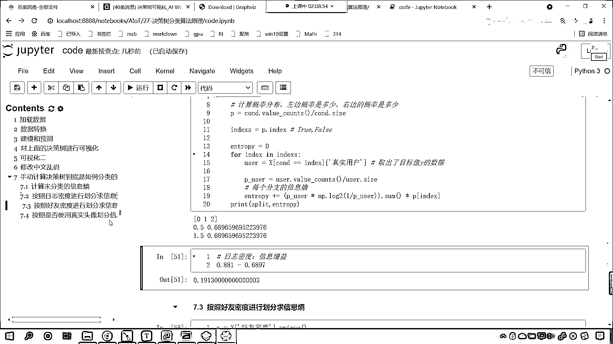
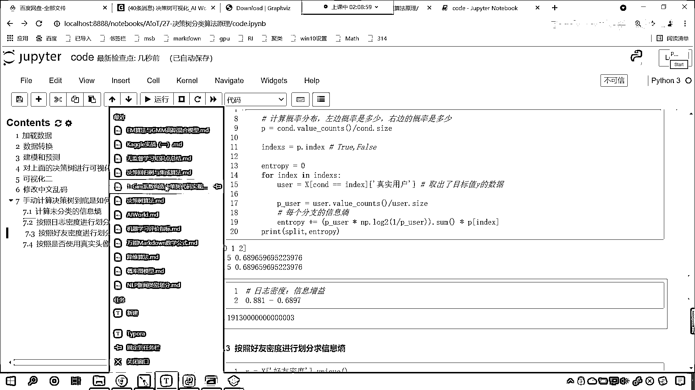
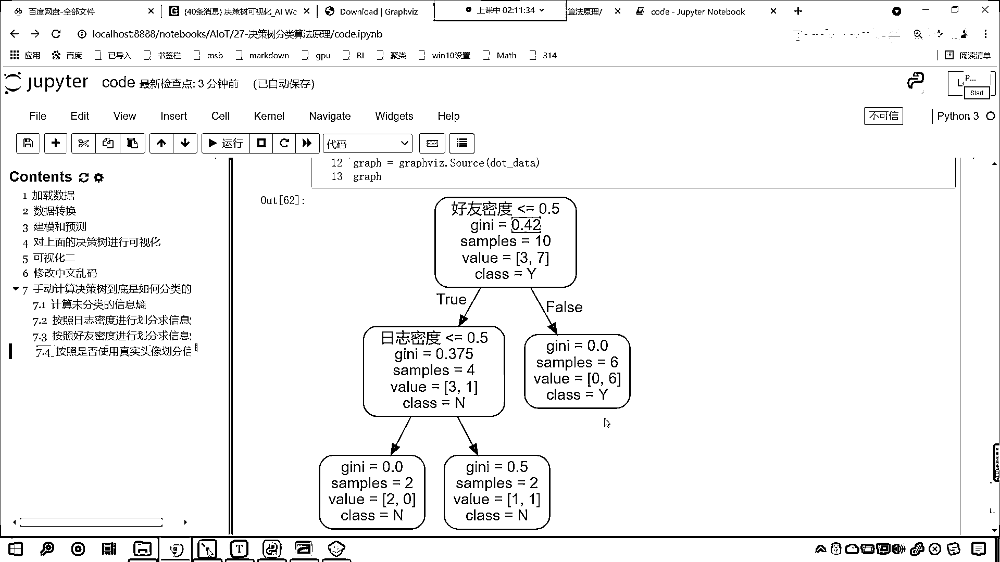

# 7天爆肝整理！AI量化交易-机器学习全套教程，从入门到项目实战保姆级教程！（数据挖掘分析／大数据／可视化／投资／金融／股票／算法） - P183：8-作业要求 - Python校长 - BV1KL411z7WA

接下来我们看一下咱们的作业。

咱们课堂上呢，我们完成了这个决策数代码的构建。

咱们是以信息商作为分裂条件，那么请你参考咱们上课的代码，根据基尼系数作为分裂条件，自己完成咱们的决策数代码，这回呢你要根据基尼系数了，啥意思呢，来我们往上滑动啊，看看这个代码啊，咱们这个代码呢。

它是咱们的信息商是不是，那我们的作业要求是这样的，咱们就创建一个model，就等于decision tree classifier，然后model。fit，咱们将x放进去，y放进去。

这个时候这个x呢因为它含有咱们的目标值y，所以说咱们来一个切片，就切到-1，这个时候你再来看，你看我一执行，你看这个时候是什么，是不是基尼系数啊，看到了吧，0。42，默认情况下它使用的是0。42。

这个基尼系数是不是0。375，那请问这个基尼系数是怎么算出来的，0。375是怎么算出来的，是吧，这个0。42是怎么算出来的，那我们上课的时候，咱们介绍了一下，是吧，这个信息商0。881怎么算的。

我是不是给各位算出来的，0。811怎么算的，我是不是也算出来了，对不对，好，现在咱们的作业就是，基尼系数怎么算，基尼系数怎么算，有相应的公式，看基尼系数，看到了吧，这个就是基尼系数的公式，简单不简单。

是吧，太简单了，看到了吧，其实就是pi乘以1-pi，是不是，简单吧，但是你想要理解咱们的决策数，到底是怎么构造的，那么你得需要把这个图算出来，知道吗，把这个图算出来，0。42和0。375。

这就是咱们今天的作业，好，那么我们今天的上课内容，咱们就到这里了。

