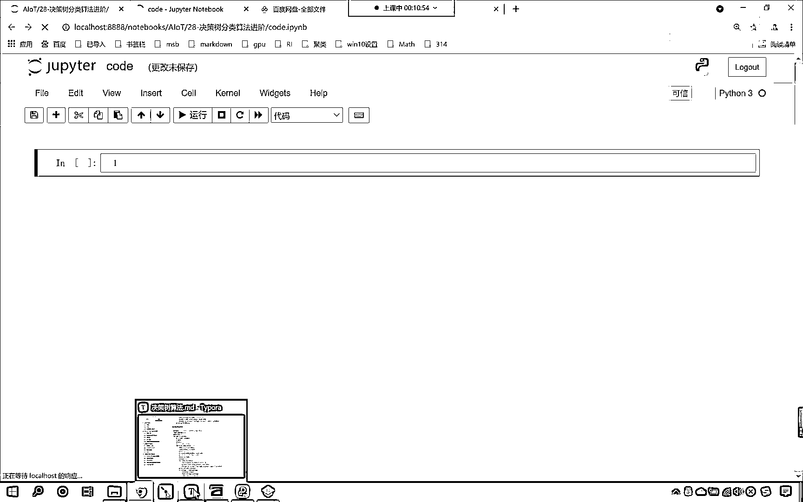
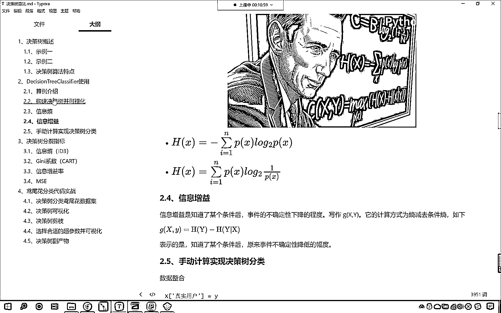
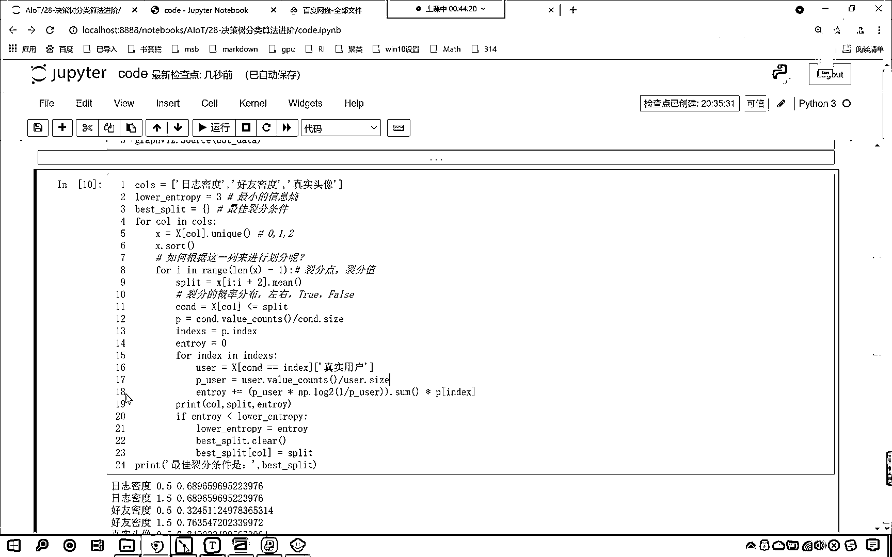

# 7天爆肝整理！AI量化交易-机器学习全套教程，从入门到项目实战保姆级教程！（数据挖掘分析／大数据／可视化／投资／金融／股票／算法） - P184：1-决策树原理：代码筛选决策树的根节点 - Python校长 - BV1KL411z7WA

现在我们做这样的一件事情，咱们知道决策数在进行列分的时候。

看决策数在进行划分的时候，我们是不是使用了好友密度，用这个属性作为根结点，那咱们的这个数的结构，它大概是什么样的呢，这里呢我们大概去描述一下，那么这个呢就是咱们的根结点，这是一棵树的根结点。

那么再往下看呢，就这一部分，大家看这一部分是我们树的子结点，这个是子结点，那么还有一部分，你看是不是这一部分呀，对不对，那这一部分和咱们黄色的这一部分，以及咱们蓝色的这一部分，它们呢都属于是叶结点。

你看叫做叶结点，我们知道一棵树是吧，它是从下向上长的对不对，那咱们一棵树呢是从下向上长，然后呢它开枝散叶对不对，而咱们算法当中，咱们的树是怎么长的呀，咱们是不是从上往下长呀，和咱们真实的树呢刚好相反。

那么在咱们决策树当中，在咱们决策树当中，咱们这个属于是叶结点，这个也属于叶结点，这一部分呢也属于是叶结点，那么最上面这个叫做根结点，这就像树根一样，那么这一部分日之密度，这个呢它叫做子结点。

咱们的结构呢都是按照这样的结构，来进行依次向下构建我们的决策树，那有可能咱们的属性要多了，咱们这个决策树可能会复杂一些，明白吗，如果这个数据多了，咱们的决策树可能会多一些，现在呢我们就带着一问。

来开始咱们今天的这个课程，咱们说了这个好友密度，是吧它到底是怎么来的呀，对吧，那然后接下来我们选了个日之密度是吧，那咱们现在呢就使用代码，咱们把这个呢给它再现一下，现在呢咱们就来一个综合的代码。

那么首先呢我们往上滑，咱们呢找到咱们的数据好不好，来我们复制一下这个代码，像这部分代码，咱们就没有必要再去手写了啊，因为这个是数据的创建，这个数据呢就是咱们看到的这个图，好那么咱们就回到我们的代码当中。

咱们在这呢给它来一个三级标题，这个呢就是咱们的条件筛选决策树的根节点，好那么我们control V，我们把数据给它创建一下，这个时候你看我一执行，大家看咱们的数据有了，此时咱们的数据呢它属于是字符串。

那这个字符串呢咱们没有办法进行运算，所以咱们紧接着需要把这个数据来一个映射，对它呢进行一个转换复制，咱们就用map方法来进行这个映射和转换，control V此时呢我执行一下。

这一部分代码咱们在上一节课当中呢，我们都有讲过，所以说呢咱们快速的来执行一下啊，经过咱们这个map映射，各位小伙伴能够看到咱们的数据是不是就有了呀，有了之后呢咱们导一下包，那我们就from。

咱们呢from sklearn，咱们从tree下边，from sklearn tree，我们从tree当中咱们import decision tree classifier。

然后呢我们声明一个模型model，那不仅要把咱们的分类算法导进来，同时呢我们，咱们from sklearn，咱们import咱们把tree这个模块导进来，然后呢咱们import graph vaz。

把这个也导进来执行一下这个代码，然后呢咱们声明这个算法，我们给他一个分类标准叫criteria，在这呢咱们给一个entropy，entropy，这个就是咱们的sum，然后咱们就使用model。

fit一下，我们将数据x和y放进去，此时大家要注意，咱们的x当中的第四列是不是咱们的目标值呀，x是一个data frame，其实它的前三列才是咱们的数据，所以这个时候我们要做的一件事情呢。

咱们就来一个i lock，咱们呢来一个切片，冒号冒号咱们给一个-1，这个时候，那么因为切片的时候是左逼右开，所以说最后一列呢就取不到，那这个时候这个模型咱们就训练好了，咱们把它可视化输出一下。

那就是trade。explot graph vaz，那在这个里边呢，咱们将model这个模型给它输出一下，我们给一个field，颜色要填充一下，然后呢我们给一个round，我们让它是圆角。

然后呢我们给一个feature names，就是是什么特征呀，是日志密度还是好友密度呀，那咱们来一个x。columns，columns的话它会一下子返回四个，所以这个时候咱们来一个切片，也来一个-1。

和咱们上面训练数据这个-1表示的含义是一样的，x。columns是eve的，所以这个时候呢咱们直接给eve的就行，而上面的这个x是我们的训练数据，它是一个data frame，它是二维的。

所以说咱们使用二维切片这种方式，我们来进行啊，这个时候你就能够看到，这是不是有一个逗号呀，逗号前面表示eve，逗号后面表示eve，逗号前面表示ha，逗号后面表示li，好那么这个时候呢。

咱们就获取了这个决策数，它的构建数据，这个时候呢咱们就来一个dot data，大家注意啊，你看我在命名的时候也非常讲究，这个dot它的意思呢就有点的意思，看到了吧这个dot就有点的意思。

那其实咱们在进行列分的时候，我们是不是就根据一个点，列分成了左边和右边呀，所以说咱们把返回的这个数据，我们起的名叫做dot data，其实在这里你想你起一个任意的名字，是不是也无所谓呀。

对不对但是我们为了让别人能够看懂我们的代码，然后呢咱们就使用graph，咱们就使用graph viz，我们调用一下source方法，。sour，咱们将这个dot data放进去，此时你看我一执行。

大家看咱们这个决策数就出来了，为什么好友密度它是咱们的根节点，而咱们的日志密度是我们的子节点，剩下的这个是咱们的叶节点呢，那么咱们现在呢就操作一下啊，首先呢我们是不是一共有三个特征呀。

那就是columns，那咱们这三个特征呢，分别是日志密度对不对，然后逗号，咱们呢再来一个叫做好友密度，接下来呢逗号再来一个单引号，这个时候大家要注意，咱们在操作的时候呢，我们要使用中英文切换。

这个呢就是真实的头像，那我们这个col呢，这三列到底选哪个条件作为列分呢，咱们放到一个列表当中，然后呢咱们就使用for循环，我们来对它进行便利，那就是for col in col s。

看这个时候是不是就有一个for循环便利了呀，然后呢咱们从x数据当中，根据这个col这一列的名称，咱们把它取出来，取出来之后，这个就是一个series，然后呢咱们调用它的unique这个函数。

那么这个函数呢会为我们返回去重之后的数据，那么接收一下，咱们用一个小x来接收，这个x就是它的特征值，大家要注意啊是它的特征值，那这个特征值有大有小，现在呢咱们对它进行一个排序，看啊我们来一个sort。

其实你想对于咱们日志密度，咱们的特征值是不是就是012呀，对不对呀很简单，是吧那sort之后咱们的顺序就是012了，好那么这个时候这个x就有了，好那么接下来呢咱们有一个问题，就是你得到了特定的一列。

那么我们如何根据这一列，咱们来进行划分呢，现在是不是有这样的一个问题啊，那接下来呢咱们就来一个for循环，for i in range，咱们来一个length x，我们让它减1。

这个时候你看我们为什么要减1呢，这个呢就是咱们的列分值，咱们要在这呢去获取它的列分点，大家要注意啊咱们要获取它的列分点，我们要获取列分值，我给你举一个例子，比如说咱们的数据是吧，咱们的数据是012。

我在这给你画一个，让你能够清清楚楚明明白白，比如说我们的数据是012，那么我们如何对这个数据进行划分呢，你想一下咱们在进行划分的时候，我们是不是会在0和1这切分一下，1和2这切分一下呀，对不对。

那我们在这0和1之间切分，那咱们的切分点该如何计算呢，最简单的方式就是计算0和1之间的平均值，那不就是0。5吗，那1和2之间的平均值切分点该如何计算呢，那就是1和2的平均值，是不是就是1。5呀。

看到了吧就是1。5，那至于这个地方咱们为什么给了个length x-1呀，你看我们为什么给了个length x-1呀，是因为咱们原来的数据是几个数呀，你看咱们的列表咱们的数据是不是三个数呀。

看到了吧我们列表的长度是三个，而咱们要获取的这个数据，你看咱们要获取的这个列分点，你看它是几个数值，三个数据咱们是不是可以得到两个列分点呀，在这咱们总结一下，你也想一想，如果说我们的列表长度它是3。

那么咱们的列分值对应的几个呀，是不是就是两个呀，所以说呢它是n-1，所以说这个里边咱们给了一个length x-1，那么有了这个Full循环，接下来咱们就要去计算这个0。5，接下来我们该如何操作了。

我们去计算这个0。5，我们去计算这个1。5，那该如何计算呢，此时呢咱们就在Full循环当中进行计算，这个列分的这个值咱们就定义成split，split呢就等于x中国号i，我们来一个冒号咱们来一个i+2。

你看为什么要来一个i+2呢，咱们在取数据的时候是不是一次就取两个呀，看到了吧取0和1然后再取1和2，所以说这个切片关系，我们是从i开始一直到i+2，对不对那取完这个之后咱们要怎么样，我们给它来一个点幂。

咱们去求一下它的平均值，这个时候我执行一下咱们print输出一下，咱们将这个split我们打印执行一下，那这个时候这个Full循环为了能够让各位看到一个效果，咱们这个cos是吧咱们不获取它的所有。

咱们怎么样呢来一个切片咱们让它到1，这个时候你看我执行这个代码，来各位小伙伴你能够看到，打印输出的这个split是多少，是不是0。5和1。5呀，那我们在Full循环，里层Full循环之前咱们打印一下x。

这个时候你能够看到咱们x的值是多少，是不是012呀对吧，我们如果要将这个012进行拆分，咱们刚才画图显示了一下，是不是就是0。5和1。5呀，那你看咱们这个Full循环，是不是刚好可以实现这个要求呀。

对不对好那么这个时候第六行代码呢，咱们就删掉啊不需要了，第九行代码呢咱们也删掉也就不需要了，我们看到了一个结果，好那么有了这个列分条件，你看有了列分条件了，咱们就根据列分条件对这个数据来进行拆分。

这个时候来一个大x，中国号来一个col，找见咱们这个条件，我们让它小于等于这个列分条件，好那么小于等于这个列分条件，这个时候咱们就得到一个cund，这个cund呢就是我们的条件。

那么我们把这个cund叫做什么，大家看啊这个就叫咱们的概率分布，因为你想x。col，这个是不是我们获取的这一列的数据呀，对不对这是一列的数据，有了这一列的数据咱们根据一个列分条件。

反正你的所有数据是不是要么大于它，是不是要么小于它呀，对不对那要么就是true要么就是false，所以说这个就是咱们的概率分布，咱们呢就把它分成了两份，那分开之后呢接下来呢咱们就进行一个计算啊。

好那么咱们就进行一个计算，我们计算它的概率是多少，咱们呢就来一个P，P呢就等于cund点儿我们调用value，Cunts叫value counts，value counts是对它的统计。

然后呢再除以cund点儿size，那么这个时候你可能不太知道是吧，这个求解出来的这个值到底是多少呢，来现在呢咱们就print输出一下，我们将这个P打印一下，给你看一下这个是多少，现在你能够看到。

看到了吧，那么我们false一个是0。7，那另一部分是不是就是0。3呀，如果true是0。7的话，那这个false是不是就是0。3，这个时候你看我们求解出来的P，是不是就是咱们概率分布呀。

也就是说你根据这个列分点儿，把咱们的数据是不是分成了两部分呀，那左边这部分，它的概率值，就是它的百分比是多少，右边这部分，它的百分比是多少，咱们就可以通过这个函数，我们来进行计算。

如果你要忘记了value counts，和cund点儿size是什么，那你一定要再去学习一下咱们的pandas，value counts它是统计，每一个值，它的这个个数。

count size是获取它的总长度，那么我们统计了每一部分，它的个数，然后再除以它的总数，咱们求得的是不是就是百分比呀，有了这个百分比，那么我们就方便了，咱们现在呢就从百分比当中。

咱们得到它的索引index，那我们这个索引要么是true，要么是false，你看要么是true，要么是false，现在呢咱们就接收一下，我们就叫做indexes，有了这个indexes，咱们接下来呢。

分别去计算它的左边和右边，那我们就计算一下它的左边吧，那就是false，indexes，印咱们的indexes，你看这个时候大家要注意啊，咱们是一层false循环，两层false循环。

这是不是咱们的第三层false循环呀，是吧稍微有点复杂啊，大家呢一定要把这个代码理解清楚，那这个代码理解清楚，那么你对于我们决策数，到底是怎么回事，那你就清楚明亮了，好那么这个时候呢。

咱们呢就在这个false循环里边，我们得到相应的数据，那就是x，咱们来一个中国号，那就是C und，你看这个就是它的条件，我们让它等等什么呢，咱们让它等等index，你看这个C und。

是不是就是咱们的这个概率分布呀，对不对，你看我们这个index是从哪里得到的，是不是从P里边得到的，P是从哪里得到的，P是不是从咱们C und当中得到的呀，所以说如果这个条件，你要是等等咱们这个索引。

那么我就获取相应的数据，咱们获取谁呀，这个时候呢咱们获取，真实用户，那这个时候咱们获取真实用户，那么有了真实用户之后呢，这个就是咱们的user，有了user之后，咱们紧接着呢。

咱们把user也给它转换成概率，那么如何转换成概率呢，那就是P user就等于user。value count，然后我们让它除以user，咱们来一个点，我们给一个size。

你看这个是不是就将它的概率计算出来了，好那么有了概率之后，咱们接下来呢，我们就根据信息商，它的计算公式，咱们呢来计算一下它的信息商，好那么这个时候呢就来一个小括号，咱们给一个P user。

我们让它乘以np。log，以2为底小括号，1除以P user，你看这个是不是就做了一个信息商的计算公式呀，那信息商计算公式最后有一个求和，所以我们也来一个sum，这个时候还没完，大家要注意啊。

你看此时你的user是如何获得到的，是不是通过cond等等index呀，那我们等等的这个index是不是咱们的一个分支呀，那大家注意啊，此时的user是我们的一个分支，那既然它是一个分支。

我们计算出了信息商，那你想一下，这部分分支是不是得需要乘以一下它的分支，它的这个概率呀，那这个概率该如何算，就是咱们上面计算出来的P，看到了吧，上面咱们计算出来的P，那这个P呢。

你看就是从cond当中计算的，我们的cond这个地方是不是夸叉一下子，我们给它进行了一个列分呀，对吧，这是概率分布，在这儿呢，咱们记笔记得更清楚一些，这个呢就是咱们列分的概率分布，那只要一列分。

那么它就分为左右了，对吧，左边你的概率是多少，右边你的概率是多少，在我们这个情况下，其实呢，咱们的左右呢，它是对应着true，或者说对应着false，那你看在这儿，咱们cond等等index。

咱们其实呢就是把这个true和false给它取出来了，大家要注意理解啊，你要注意理解，其实呢，咱们的这个index，你看这个index，它是谁呢，它就是咱们的true，false。

就是咱们这个true和false，你看这个不就对应着，这个就对应着，咱们这里所说的什么，index，index是不是，好，所以呀，那false，true和false，它就对应着，好像soin。

那也就是说，它其实就是true和false，而咱们在这个地方，我们又根据这个条件，是吧，进行了数据的筛选，筛选了这个数据之后，这个不就对应着咱们列分的概率分布吗，列分的概率分布，是吧，左右两边的，好。

那么所以这个时候，咱们在进行信息商的时候，我们得乘以，它自身的比例，那如何求比例呢，那咱们就来一个p中国号，咱们来一个index，好，那么这个时候呢，我们计算出来了，计算出来，但是呢。

它是在false循环里边的，所以咱们在false循环外面，我们呢，给它来一个entropy，记录一下，让它等于零，这个时候呢，咱们让咱们的entropy，我们让它加等，这个时候，你想咱们一个分支的。

咱们这一部分的这个信息商，咱们是不是就整体的这个信息商，咱们是不是就计算出来了呀，对不对，那这个时候呢，咱们还没有结束，这个时候咱们还没有结束，咱们为了从日志，好友密度和这个真实头像当中。

我们找到最优的条件，那么我们就需要在false循环之前，咱们呢，声明一些变量，首先呢，咱们声明一个叫lower，entropy，大家看这个lower entropy，是不是就是最小的信息商呀。

大家注意咱们在这呢，记录一下啊，这个呢就是最小的信息商，那现在你看我给的这个信息商是不是1呀，对不对，这个是最大的啊，我们一开始随机给了一下，你给个1也行，你给个3也行，这个都无所谓，因为呢。

我们用这个lower entropy，这个变量，咱们主要是为了和下面的这个entropy，咱们进行一个判断，然后呢，我们再声明一个变量，叫做best-split，这个best-split。

就是咱们最佳的裂分条件，大家看啊，这个是最佳的裂分条件，好，那么我们就在false循环当中，咱们呢就进行一个判断，最最里层这个false循环，咱们结束了，那我们回车一下，然后呢咱们回退一下啊。

大家注意啊，这个时候你要注意缩近，好，那么最里面这一层，咱们计算了他的这个信息商，那在这里呢，咱们就进行一个判断，看一下我们按照这个条件划分所求得的信息商，它和咱们的lower entropy。

它的大小关系是怎样的，那这个时候呢，如果咱们的entropy，它要是小于咱们的lower entropy，你看你小了，我们计算出来的小了，那这个时候咱们怎么办，咱们呢就记录一下好不好。

那lower entropy就等于entropy，你看这个时候进行了一个记录，对不对，好那么记录之后呢，咱们的best-split，是不是我们最佳的裂分条件呀，对不对，那这个时候呢。

咱们呢也计算一下咱们最佳的裂分条件，好那么最佳的裂分条件，这个时候我们best-split，咱们呢进行一个清空clear，因为最佳的裂分条件，你想一下是不是只有一个呀，所以说我们先给它清空。

然后呢把这个裂分条件，咱们给它放进去，那就是best-split，咱们来一个中国号，我们把col放进去，col放进去，这个col表示的是什么，col表示的是是不是咱们的裂索引呀，所以裂索引放进去。

那我们的best-split，它呢是一个字典，对不对，它是一个字典，所以说咱们把它放进去，然后它所对应的值，我们给一个什么呀，给一个split，这个呢就是咱们的分裂条件，这个就是咱们的分裂条件，好那么。

这个时候呢，到这儿，咱们就执行结束了，那么我们在执行的过程当中，咱们呢再来一个打印输出啊，我们在这个if上面，咱们来一个print，这个时候呢我们将col放进去，咱们呢将split放进去。

然后呢再将我们计算出来的信息商放进去，好那么此时，这个代码咱们就写完了，最后一行，那放循环结束最后一行，咱们来一个print，这个时候呢，我们给一个叫做最佳的裂分条件式冒号。

咱们将上面声明的这个best-split放进去，此时你看我的代码一共写了多少行，咱们把空格的部分删掉，大家注意啊空格的部分删掉，此时呢咱们是不是已经总共写了24行代码呀，此时我执行一下这个代码。

来大家现在就能够看到，大家现在就能够看到咱们最佳的裂分条件是日志密度是吧，0。5那这个时候呢不太对啊，因为我们最佳的裂分条件是哪个呀，看咱们最佳的裂分条件是不是好有密度呀，而我们这个算法。

而我们自己写的这个代码，咱们算出来的是日志密度很显然不对，咱们找一找错在哪里啊，刚才的时候我们为了打印输出，咱们放循环这个地方是不是不彻底呀，对吧我们在这进行了一个切片。

切片的意思呢就只对日志密度进行计算，不对后面两个属性进行计算对不对，那么我们把这个删除掉是吧，此时你看我执行一下这个代码，哎大家看啊那我们呢，这24号代码就对咱们的日志密度。

好有密度真实头像咱们呢就进行了一个计算，计算完之后大家看最终呢，他就有一个这个最佳裂分条件是好有密度，是吧我们根据好有密度来进行操作，那么咱们的裂分条件呢是0。5，这个时候你就能够看到。

咱们自己计算出来的和我们使用decision tree classifier，计算出来的是不是一模一样呀，看了吧这个呢是一模一样的啊，好那么这个呢就是使用咱们的entropy。

咱们计算得到的一个这个裂分条件，现在呢我们再进一步啊，咱们将上面这个代码复制一下，我们在这来一个粘贴，咱们将这个entropy我们呢给他改成基尼系数，这个时候你看我一直行。

咱们使用基尼系数我们算出来的结果是0。42，他的裂分条件依然是好有密度对不对，好那么上面的代码咱们做简单的修改，我们呢也可以使用基尼系数来操作，全选control A， control C。

我们往下走在这呢来一个粘贴，好那么这个时候呢，整体的代码架构不会变，现在的话咱们将这个lower entropy，我们给他调整一下，那这个lower entropy咱们给他调改成这个lower基尼。

是吧然后呢最佳裂分条件，然后呢这个full循环排序，然后呢这个full循环咱们呢来对这一列进行划分，寻找他的裂分点，这都不变那这个entropy是0是吧，咱把它改成基尼让他等于0，然后呢进行计算。

计算的时候这个时候这个公式就会发生变化了，在这呢咱们就给一个基尼，是不是看我们给一个基尼，那就是puser乘以这个时候就不是他的对数了，咱把这个对数删掉来一个小括号，我们让1-p下滑线user。

同时也是求一个SUM和看到了吧，然后呢同样也是求他这部分的概率，好那么我们在输出的时候，那就是col split，entropy这个地方咱把它修改成基尼，然后呢entropy呢修改成基尼。

lower entropy呢这个地方调整成lower基尼，替换这个地方呢咱们也调改一下，调整一下那就等于咱们的基尼，好大家看这个时候代码咱们就调整好了，看啊执行一下这个代码，这个时候你看我一运行。

大家能够看到咱们计算出来的数值，看最佳裂分条件是不是依然是好友密度0。5呀，看到了吧也就是说无论我使用基尼系数也好，还是使用咱们的信息商也好，咱们最终呢我们都可以根据这一段代码，来寻找它的最佳裂分条件。

说到这里我再对你进行一个点拨，其实这个决策数，这个决策数它的内部代码到底是怎么写的呀，看到了吧这个决策数它的内部代码，最核心的内部代码是怎么写的，现在你知道它核心的内部代码是怎么写的了吧。

它的核心代码就是刚才我给各位呈现的这部分代码，你要注意了它的核心代码就是我所呈现的这部分代码，你想决策数它不就是要去找裂分条件吗，对不对怎么找裂分条件呢，就是咱们这三层奉循环。

其实你想一下咱们说这个算法多么的神奇，多么的奇妙，其实是不是都是数学公式加上咱们的代码，一点一点给它累成的高楼大厦呀，我们的每一行代码咱们可以把它当成砖和瓦，有了砖和瓦再加上你的聪明才智。

那么你也可以写出来像decision tree classifier这样的代码，你一定能好这个呢就是咱们昨天所讲课的，这就是咱们上一节课所讲的内容，我们上一节课讲的内容当中呢咱们留的作业。

咱们也在这个视频当中进行了更深度的一个讲解，好那希望呢大家把这一段视频，你要多理解理解这一部分代码，你要自己能够写出来并且能够知道这每一行代码都是什么意思，里面的运算呢也稍微有点多。

所以说你要不明白那你就在不明白的地方进行打断点，明白吗什么是打断点呢来一个空格在这个地方打印输出一下，看一下每一步计算出的结果是什么样的，好这是咱们学习代码的时候。

他的一个基本的思维方式啊。

以后再给你订个名吧。