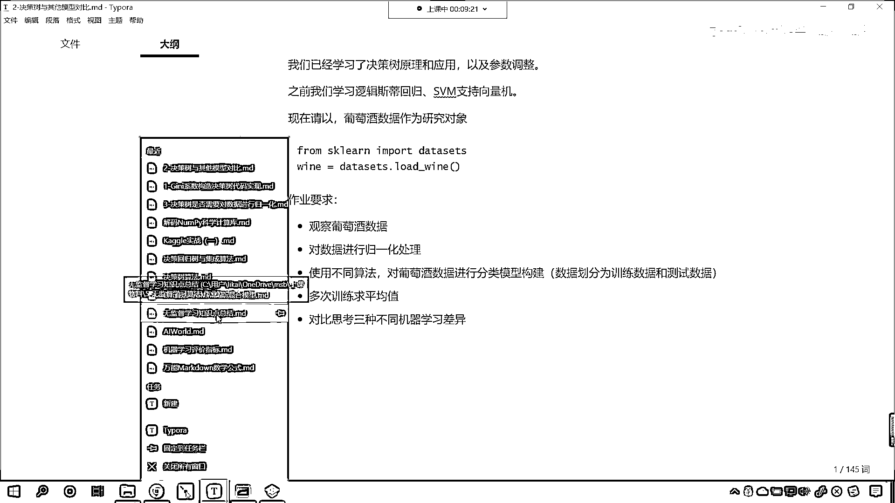
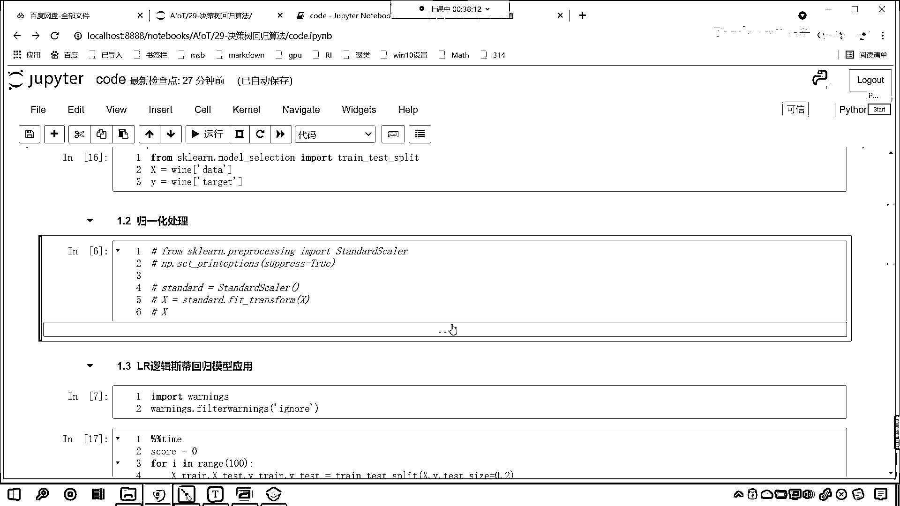

# 7天爆肝整理！AI量化交易-机器学习全套教程，从入门到项目实战保姆级教程！（数据挖掘分析／大数据／可视化／投资／金融／股票／算法） - P186：1-决策树与不同算法综合对比 - Python校长 - BV1KL411z7WA

咱们现在呢已经学习了决策数的原理，那我们之前呢学习过逻辑4D回归，咱们学习过支持线缆机等分类算法，那么我们所学的决策数这个原理和咱们逻辑4D回归和支持线缆机有什么不一样的地方呢。

大家还记得咱们在上一节课的时候。

最后呢，我们问了一个问题，对不对，好，咱们往后滑，滑动到最后，最后这个问题呢，咱们说你想一下逻辑4D回归支持线缆机，这些算法，它有没有决策数的这个这个特征重要性呢，对吧，这个呢，特征重要性呢。

属于是咱们决策数的一个负产物，是吧，那这个负产物还是很重要的啊，叫做feature importance，在上一节课呢，各位小伙伴众说纷纭，那我们今天晚上呢，咱们就。

来看一下逻辑4D回归还有支持线缆机这两个算法，它到底有没有，那我们同时呢，也看一下逻辑4D回归和支持线缆机与咱们的决策数这个算法，他们之间的这个差异有什么不一样的地方，现在呢，咱们就回到我们的代码当中。

咱们就进入到这个今天，你看这是已经第29讲了，咱们就进入这个29讲决策数回归算法，进入这之后呢，咱们在这创建一个代码文件，点击一下它，咱们给它改个名，好，那么首先呢，咱们来一个三级标题，那这个呢。

就是不同分类算法，他们的差异，那在这个地方呢，咱们导一下包，那我们就，import numpy as np，from sklearn，咱们首先呢，将tree这个算法我们导进来。

那就是decision tree classifier，然后呢，我们from sklearn，咱们从线性模块下，我们导入logistic regression，然后呢，from sklearn下面。

咱们从SVM下面，咱们导一个包叫SVC，那包导进来了，咱们还得需要把数据，咱们给它导进来，那就是from sklearn，咱们import data sets，这个就是我们的数据集。

咱们把这个也给它加载进来，好，那么此时呢，咱们执行一下这个代码，好，那么此时，接下来呢，我们再来一个4级标题，咱们呢，去加载数据，那咱们就使用data sets。，调用其中的方法叫load1。

我们使用其中的白酒，咱们呢，作为我们的这个训练数据，那在这呢，我们可以，接受一下，咱们起个名就叫one，看一下这个白酒，它呢是分不同等级的，对不对，那这个白酒都分哪些等级呀，大家看啊，等级分为012。

那也就是class0，class1，class2，咱们知道这个不同的，这个葡萄酒，它含有的这个特征，特征值是不一样的，啊，你想一下，为什么有一些葡萄酒贵呢，为什么有一些葡萄酒还便宜，对不对呀。

那这个是不是跟它的特征有一定的关系呀，那我们知道不同的葡萄酒，它含有的酒精度是不一样的，对不对呀，含有的酸是不一样的，等等，你看这些特征，它呢，就可以衡量咱们葡萄酒的等级，那么我们有了这些特征，现在呢。

你可以想一下这些特征是吧，它大概呢，有有几个特征呢，一个两个三个四个五个六个七个八个九个十个十一十二，大概有十几个特征，那这些特征里边是不是有的特征重要一些，有的特征不重要一些呀，对不对。

那我们是不是使用咱们的决策数回归，咱们使用咱们的这个决策数算法，我们是不是就可以得到哪些特征重要，哪些特征是不是不重要呀，对不对，好，那么咱们现在呢，获取一下数据啊，那结合咱们上一节课所留的那个疑问。

是吧，说其他的算法像逻辑4d回归这个它有特征重要性，这个属性吗，来回到代码当中，咱们现在呢，就演示一下，那么我们得到万咱们得到这个数据啊，万中国号，咱们得到data，那咱们这个数据就是x，然后呢。

咱们给一个外外呢，就等于万咱们来一个中国号，我们叫他给他数据x和y得到了紧接着呢，咱们再导一个包fromsklearn，咱们来一个model selection，我们从这个当中。

咱们导入train test split，好，那么有了这个train test split，咱们是不是就可以加了一个x给他一分为二啊，对不对，好，那么我们的作业当中是这样要求的，咱们的要多次训练。

我们去求一下他的平均值，对不对啊，还有咱们的对于数据进行一个规一化处理，来呢，回到代码当中，咱们此时所加载的数据呢，他肯定不是规一化的数据，咱们在这里打印输出一下，来咱们看一下我们的x它长什么样啊，哎。

大家看你看这个是不是咱们的数据啊，咱们的数据呢，它是科学技术法表示，那我们设置一下叫set print options，咱们给一个superpress，我们让他等于true。

这个时候咱们的数据各位来看一看，看各位来看一看，此时咱们这个数据，它是不是就不是科学技术法了，很显然这个数据它是规一化的吗，很显然不是，对不对，那咱们现在呢，对这个数据，我们对它进行一个规一化处理吧。

那就是from sklearn，咱们呢从这个，咱们也导一下包啊，叫做pre-processing，pre-processing就有预处理的意思，咱们导入standard sklearn，这个呢。

就是咱们的zscore规一化，zscore规一化，那么我们把这个standard的导包导进来了，现在呢，咱们就生成一下这个standard，我们就让它等于standard的sklearn，现在呢。

咱们就调用这个规一化，那我们就调用fit transform，这个时候咱们就可以将X一把对它进行一个规一化处理，那我们得到一下X，这个时候呢，咱们X再打一输出，各位小伙伴，你就能够看到这个数据呢。

就是规一化的一个结果，现在你来看是吧，我们规一化的结果是不是就有了呀，那在这个地方咱们上面插入一行，我们来一个四级标题，好，那么这个呢，就是进行规一化，咱们进行规一化处理，好，数据就有了。

有了这个数据之后，现在呢，咱们就使用逻辑4D回归多次运算，我们去求一下它的平均得分，好，那么在这呢，咱们来一个四级标题，这个呢，就是LR，逻辑4D回归这个模型的应用，那这个时候呢，咱们来100次循环。

for i，in，run值，咱们给一个100，好，在每一次循环当中，咱们呢，都使用twin test split，X和Y咱们把它一分为二，Task size，我们给一个0。2，数据拆分之后。

咱们接收一下，那就是Xtwin，X下滑线test，Y下滑线twin，Y下滑线test，数据在这里就拆分了，然后呢，咱们就声明咱们的模型，那就是logistic regression，参数我们使用默认的。

以后你做项目，如果更加细致，里边的参数，你是不是需要调呀，惩罚项到底是L1正则化，还是L2正则化，这个惩罚项到底选1。0，还是2。0，这个是不是都可以调呀，对不对，还有咱们的max_iter，是吧。

这个100次够吗，是吧，这个是最大的迭代次数，这个都可以调，好，那么有了LR，咱们让这个模型，我们fit一下，咱们将Xtwin放进去，和它对应的目标值Ytwin放进去，然后LR咱们来一个score。

score的话，咱们将X下滑线test放进去，这个时候呢，我们会得到一个分数，是吧，那咱们起个名就叫S，我们100次训练，是不是会得到100次这个分数呀，那我们在最上面，咱们呢。

就给他介绍声明一个score，让他等于零，每一次一个模型计算了分数，咱们呢，就让他加等S，我们来一个除以100，看这个之所以除以100，是不是每个模型所占的比例就是1%呀，等这个file循环结束。

咱们print输出一下，在这的话，那就是LR逻辑回归，这个算法多次运算，我们的平均得分是英文的逗号，然后我们将score在这输出一下，逻辑4D回归，有可能呢，会出现这个，这个提示，所以说呢，提示和警告。

咱们将warning导包导进来，warnings。，咱filter warnings，咱们呢，给他一个null，就是忽略掉，先执行这个代码，现在呢，咱们就运行一下，好，那么我们既然有100次循环。

此时呢，咱们就使用魔法指令，咱们看一下，下面这一段代码，一共执行花了多长时间，是吧，这是100次循环，来，我们一运行，好，现在咱们就能够发现，此时是不是报错了呀，看啊，syntaxed error。

我们的语法错了，那大家看，fi是吧，我们少一个in，对不对，那我们往上走，咱们在这呢，给他加一个in啊，此时再来执行这个代码，好，大家看，咱们是不是这个少一个y是吧，你看，lrskr这个地方。

咱们只是将测试数据放进去了，和他所对应的真实值，那就是y下滑线test，此时咱们再来执行代码，来，各位小伙伴就能够看到，逻辑回归多次运算，咱们的平均得分是不是98呀，对吧，好，那么逻辑回归有了。

接下来呢，咱们再来一个四级标题，那就是SVC，这个SVC呢，就是我们的支持向量机，咱们模型的，那这个是支持向量机，咱们模型应用一下，那重复的代码，咱们现在呢复制一下啊，Ctrl+C复制一下。

在这儿咱们来一个粘贴，此时我们修改，咱们是不是只需要修改这个lr，这个地方呀，咱把模型呢定义成model，那么在声明变量的时候呢，咱们也给一个咱们呢就给一个SVC，那下面训练这个地方。

咱们就使用model，预测这个地方是吧，模型验证得分这个地方，咱们也修改成model，print打印输出这个地方是吧，咱们修改一下啊，把这部分选中删除，这就是SVC，支持向量机，多次运算平均得分。

我们看一下它的表现怎么样，花费的时间怎么样执行，来大家现在就能够看到，支持向量机多次运算，咱们的得分是不是98。36呀，是不是比这个稍微高一点点，来现在这个代码再来复制，我们在下面再来一个四级标题。

现在呢咱们就使用决策数是吧，这个是决策数，模型它的一个应用，此时呢，我们在这来一个粘贴SVC，咱把它删除掉，修改成decision classifier，此时呢，我们运行这个代码，打印输出这个地方。

咱把它删掉，这个呢就是决策数多次运行，我们看一下咱们的平均分是多少，好，现在我们发现决策数运行完之后，这个平均分是不是0。986呀，看到了吧，你看它的得分是不是就不太高呀，看到了吧。

它的得分是不太高的啊，咱们说这个决策数呢，它是一个重要的算法，但是呢有一些数据，逻辑回归或支持限量机，它就更加适合，那此时呢，咱们将决策数这个模型循环次数，咱们给它增加，我们给它增加成1000个。

这个时候咱们再来执行，大家看啊，这个时候你看，我们把它的次数增加，决策数是不是没有发生什么变化呀，对吧，这个时候其实应该是除以1000的，再来执行一秒钟，是不是0。9039呀，基本没变化，那上面呢。

你看上面啊，咱们的支持限量机，我们把它调整成，咱们把它也调整成1000，好，那么除法这也来个1000，咱们执行一下，好，大家看支持限量机是不是也也特别稳定呀，无论我们给1000还是100。

是不是都是98。3，对吧，那咱们这个逻辑4D回归，那肯定也是一样的，好，大家有没有记得，咱们刚才进行了一个规一化处理，那假如说我要不进行规一化处理会怎么样呢，现在咱们将规一化处理这部分代码。

咱们给他注释掉，也就是说我不进行规一化处理了，咱们将这个数据直接加载，是吧，看直接加载，然后呢，咱们使用逻辑4D回归，我们测一下啊，你看一直行，大家观察时间，原来咱们的时间是657毫秒，现在我执行一下。

看一下此时咱们逻辑4D回归，他会怎么样，此时各位小伙伴，你能够看到咱们所花的时间和刚才相比，是不是就慢了一点呀，准确率你会发现，看准确率怎么样了，准确率是不是变小了呀，看到了吧，准确率变小了。

知识线量机呢，我们也运行一下啊，你看来，咱们运行这个代码，看一下知识线量机，大家现在发现这知识线量机，我们运行了一千次，这平均得分是不是就变成了67%了，咱们再看决策数，是吧，执行，大家看啊，决策数。

你看有没有变化，此时你记着咱们的数据，是没有经过规划处理的，那决策数，他的得分是不是依然是0。906，和刚才是不是差不多呀，他这个一点一点的波动是吧，就像这种轻微的波动，我们可以认为它是没有变化的。

你像咱们上面，知识线量机这个波动，是不是特别剧烈，咱们逻辑4d回归这个波动呢，也发生了一个比较大的变化，特别是逻辑4d回归，它运行时间是不是比较长呀，哎，那现在你就要想一想，这是为什么呀，对不对。

这是为什么，咱们在这儿，我们就来一个总结，是吧，哎，这叫做不同算法，咱们呢来一个总结对比，好，那么其一呢，哎，咱们来一个第一点啊，其一，这第一点呢，哎，就是，这决策数，嗯，看他呢对咱们的，数据的对比。

对比的对比，嗯，数据，是否规一化，它是不是不敏感呀，对不对，你看决策数对我们的数据是否规一化，这个是不敏感的，呃，第二呢，咱们的逻辑回归，是吧，如果，不进行规一化，咱们的准确率，会降低，我们的运行时间。

是不是会增加呀，接下来咱们的SVC，支持向量机，是吧，如果，如果不进行规一化，是吧，咱们的准确率，是不是大大的降低了，对吧，大大降低，你想，这是不是咱们这三种算法，它的一个差异呀，那最后呢。

咱们再看一下，咱们的先声明一个决策数这个算法，看复制一下，在这来一个粘贴，选中他Shift Tab，这个时候缩近他就向回缩了，我们按的是Shift Tab，模型进行了训练。

咱们得到他的feature importance，这个时候你就能够看到，这个特征重要性质，是吧，是不是就出来了，很显然，这第一个特征是不是不重要，第三个特征，对于这个葡萄酒的分类，是不是也不重要。

看到了吧，好，那么我们上面的代码，咱们呢，再复制一下，在这呢，我们再来一个粘贴啊，咱们加这个模型，我们给他修改成支持线量机，好不好，看一下支持线量机，有没有这个属性，此时我执行一下，你想一下。

这个代码能不能返回一个结果，会不会为我们返回特征的重要性，你想一想，来讨论区里边回复一下，是吧，不会认为会的是吧，你就回复一个会啊，来此时我执行啊，来各位小伙伴，你就发现这个支持线量机怎么样。

是不是has no attribute feature importance，呀，他告诉你支持线量机这个算法是吧，没有这个特征，好，那么我们看一下model。，这个时候呢，看咱们来一个底儿来一个底儿。

就可以把这个算法是吧，他有哪些属性，在这里会为我们显示一下，看到了吧，在这里会为我们显示一下，你可以从这找到他相应的这个特征，那从这找到他相应的特征，咱们之前在学支持线量机的时候。

我们学习过support vector，对不对，这个就是支持线量，那在这呢，咱们没有发现他描述特征重要性的这个属性，是不是你看你往上滑，有吗，是不是没有呀，看到了吗，那比如说这个maxEter。

这是他最大的迭代次数，是不是还有这个intercept，这个是结句，我们再往上看，他呢有一个coeff，咱们呢把coeff，我们给他打印输出一下啊，上面这个feature importance没有。

我们就把这个代码注释掉，此时你看我一执行，大家看，coeff是不是也没有呀，报了个什么错，这个coeff是系数，就是你这个系数呀，只有当你这个和函数是linear的时候，那么你才可以调用coeff。

对不对呀，所以说现在咱们SVC这个算法，他默认的和函数是RBF，就是高斯和函数，那么，那么这个方法，他呢就没有返回咱们的特征，重要性相关的这个信息特征，重要性的信息，他呢都没有，大家明白吗。

这个算法都没有啊，来现在咱们再把这个复制一下，再来一个粘贴，我们把这个算法，咱们给他修改成logistic regression，逻辑思维回归，我一执行，哎，你现在能够发现逻辑思维回归，是不是也没有呀。

对不对，那我们把它注视掉啊，逻辑思维回归，虽然他没有这个特征，但是呢，他有一个什么呀，他有一个coeff，这个coeff是什么，看到了吧，coeff是不是他的这个斜率啊，看到了吧。

coeff是他的这个斜率啊，那各位小伙伴，你现在呢来观察一下这个斜率，你能不能通过斜率来找到咱们特征的重要性，或者说他不重要呢，你仔细观察一下是吧，因为我们这个，因为咱们这个逻辑思维回归呢。

现在是一个三分类问题是吧，现在是一个三分类问题，那如果是三分类问题，其实呢，他就有三条线，现在你就能够看到是吧，我选中的这是一条线，中间的是不是也是一条线呀，最后的这个也是一条线。

咱们刚才讨论区里边有小伙伴就提到了，说越靠近0，这个影响就越小，你要注意啊，这个方程他描述的并不是咱们特征的重要性，这个方程他是不是咱们之前在讲逻辑思维回归原理的时候。

这条线它的作用是不是就是把咱们的底儿分成几部分呀，你思考一下是不是，你看假如说这上面有一有一类底儿，是不是，你看这上面这上面有一有一部分底儿，是不是，然后那我们再来一个颜色啊。

绿色的你看下面有一部分底儿，是不是假如说下面有部分底儿，是吧，下面有问题，所以说呢，这个权重大家注意啊，这个权重他不能表示咱们的特征重要与否，咱们这个结论呢，我们把它写到这啊，这个LR。

LR他所返回的系数，他呢，不能表示特征重要与否，所以说呢，无论是支持限量机也好，还是咱们的逻辑回归逻辑回归也好，他们所返回的系数都不能表示咱们的特征重要性，那上一节课，咱们所留的那个疑问。

在今天这一节课里边，咱们做一个收尾，是吧，那也就是说呢，咱们的决策数这个算法，在学习了我们的数据之后，他呢，是有特征重要性的，而咱们的逻辑四壁回归和支持限量机呢，这个是没有的，当然在我们的回归模型当中。

在咱们的回归模型当中，大家注意在这个地方呢，我再给你一个结论，在我们的回归模型中，比如说线性回归，它的系数大小，它的系数的绝对值大小也可以表示咱们特征的重要性，它也表示特征重要性，因为非常直观。

你看这个系数的大小是不是就表示，你看它的权重的这个多和少呀，对不对，所以说在线性回归，领回归呀，等一系列回归算法当中，这个系数绝对值的大小也在一定程度上表示了咱们特征的重要性，好，那么到此为止是吧。

咱们这个问题我们就探讨清楚，搞明白了，这个呢，也是我们上一节课所留的作业，那么不同模型之间的差异是吧，咱们就看到了，好，那么，最后呢，我们再说一下，咱们进行规一化处理和不进行规一化处理。

对于逻辑回归对于咱们的支持线量机，那它的影响是非常深远的，所以说你以后呢，在使用这类算法的时候，你要注意巧妙的使用，这个规一化处理，那它的底层原因呢，是因为咱们的逻辑回归和支持线量机。

它在进行优化的时候，它使用了梯度下降梯度下降呢，跟咱们数据的这个量纲之间有非常大的关系是吧，我们说如果有一个特征值非常非常大是吧，那它是不是会影响其他的这个属性的这个发挥呀。

就像咱们白天天上有没有星星呢，有，但是我们看不见，为什么呀，是因为白天太阳出来了，太阳的光芒是不是特别耀眼呀，是不是把星星的光芒是不是就遮盖，是不是就遮盖住了呀，同样。

如果你的数据当中有一个属性值特别的大，那你想你其他的属性在这个特别大的属性的面前是不是就微不足道呀，对不对，所以说呢，这就是我们为什么要进行规划处理的原因所在，而决策数呢，不是使用梯度下降，对不对。

昨天咱们讲到的决策数，它的原理跟梯度下降没有关系，所以说呢，你的属性值大和小对我不会造成这样的影响，好。

这个就是咱们这个知识点的一个介绍。

