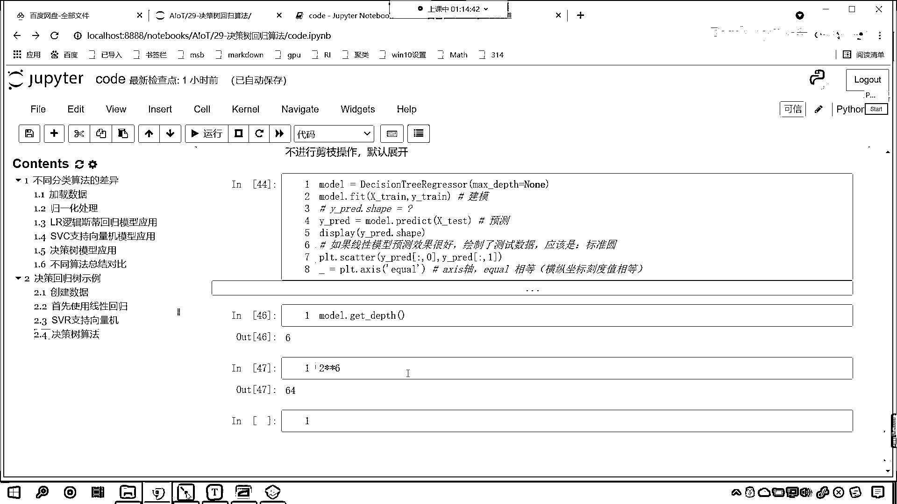
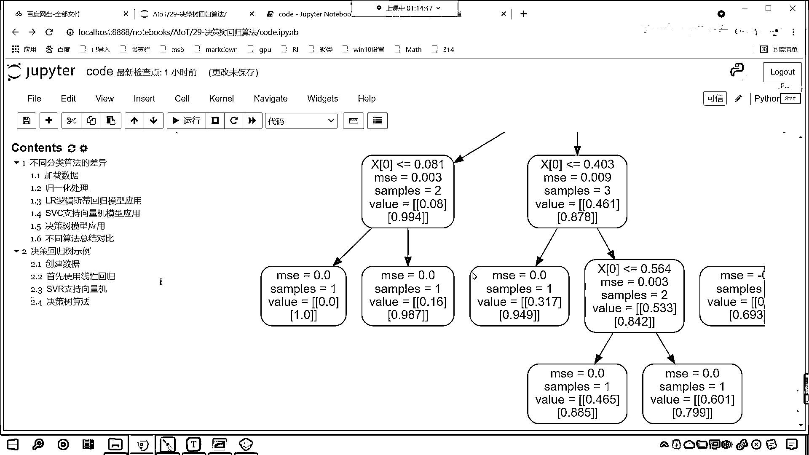
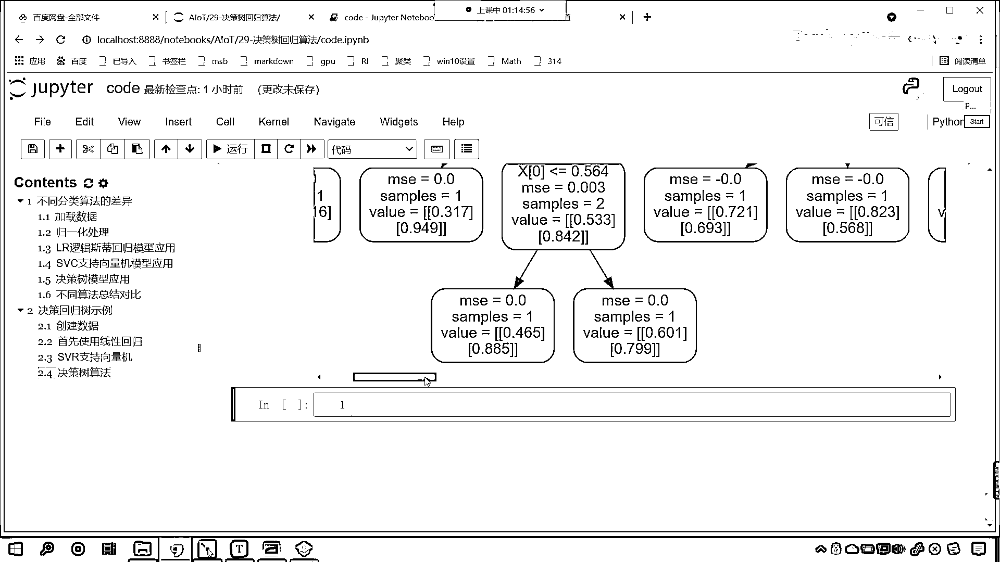
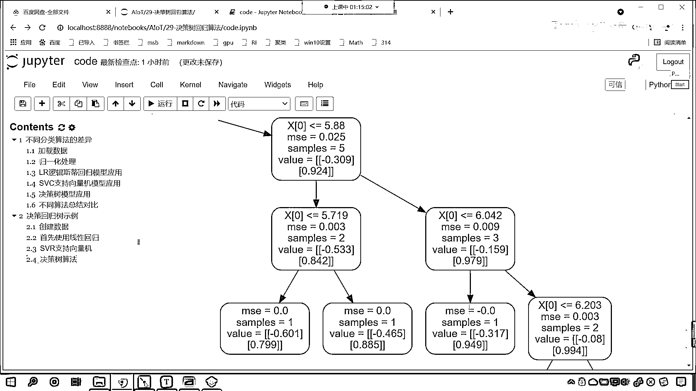
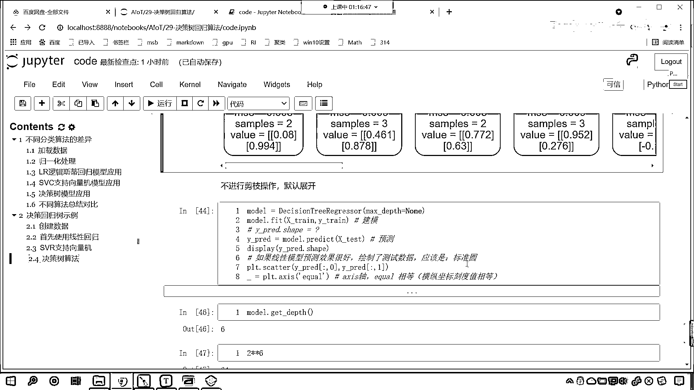
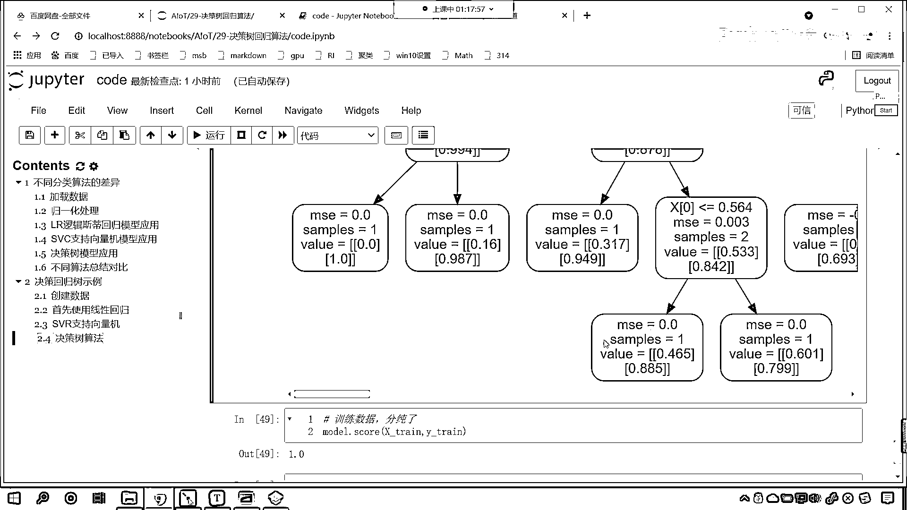
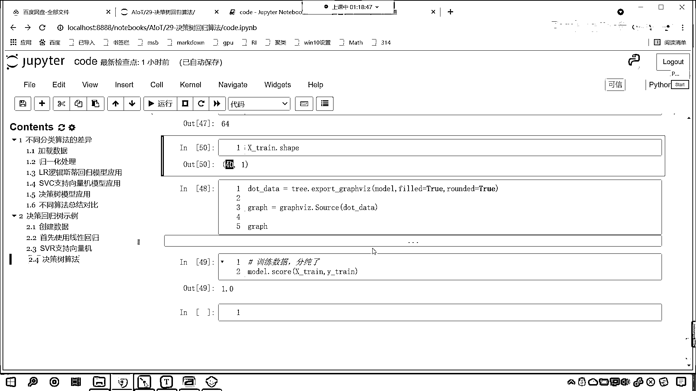

# 7天爆肝整理！AI量化交易-机器学习全套教程，从入门到项目实战保姆级教程！（数据挖掘分析／大数据／可视化／投资／金融／股票／算法） - P188：3-决策回归树算法示例演示 - Python校长 - BV1KL411z7WA

接下来我们看一下决策数回归，给一个算例，回到代码当中，往下滑，给它来一个三级标题，这个就是我们的决策回归数，咱们给一个示例，咱们点开我们的目录，这个时候目录就呈现了，我们把这个可以关掉。

那现在呢我们导一下包，从sklearn。tree import decision tree regressor，从sklearn。tree import nonepip，为了能够显示咱们的这个数据情况。

我们import matplotlib pyplot，画图工具我们给它导进来，执行一下这个代码，紧接着呢咱们来一个四级标题，在这个地方呢我们就创建数据，创建数据呢咱们就给一个x下滑线，x-chun。

咱们使用np。linespace，我们给它创建一个等差数例，0~2np。py，很显然咱们这个是不是一个正弦波的数据啊，那我们把它分成多少份啊，咱们把它分成40份，这就是40个点，我们通过np。

linespace咱们得到的数据是1维的，它的形状呢并不符合咱们机器学习的要求，所以在这个地方咱们来一个reshape，-1和1，那么这个时候咱们的训练数据它呢就是符合要求，它就是符合要求的二维数据。

现在你想一下为什么它必须得是二维的，为什么咱们这个数据必须是二维的呀，二维有两部分组成，一个中光再来一个中光，再来一个中光，那么里边这个呢我们可以叫做样本1，然后呢样本2，样本3，是不是一直是省略号啊。

也就是说你的数据是二维，它可以表示成这种形式，就是样本1，样本2，样本3，样本4，后面是省略号，也就是说这个是多个样本，它呢就可以表示多个样本，而每个样本，你看，而咱们的每个样本。

它是不是又包含多个属性呀，对不对，每个样本又可以包含多个属性，这个时候你这个样本呢，它可以有高度有宽度是吧，还有长度，好，那么这个时候咱们的数据就搞定了，搞定了数据之后呢，咱们给一个y啊，y是什么呢。

y呢就等于np点，这个时候呢咱们来一个这个集联叫concat，咱们来一个concat，concat net来一个集联，好，那么这个数据y肯定是从x这得到的，对不对，数据y肯定是从x这得到的。

那咱们在进行集联的时候呢，咱们求一下x寸的正弦波，再求一下它的余弦波，那就是np点syn，咱们将x下滑线寸放进去，然后np点cosyn，咱们将x下滑线寸放进去，那么集联的时候呢，咱们要指定一下轴。

咱们让它最后一位进行集联，这个时候咱们就会得到一个y，这个y呢咱们起个名叫y寸，好，那么你知道我所创建的这个x寸和y寸，这个y寸它是什么样的一个数据吗，你知道我创建的y寸是什么样的一个数据吗，来。

咱们plt，咱们调用scatter，是吧，来一个小括号，我这个y寸呢，它的形状呢，它的shape肯定是等于40和2，对不对，这没跑啊，这是必然的，因为我们在这进行了计算，求了一个正弦，求了一个余弦。

是吧，所以说它一定是40和2，好，那么咱们这个形状是什么样啊，如果我要画图给它画出来，它长什么样啊，它的形状呢是一个圆，知道吧，它的形状是一个圆，现在咱们就画一下啊，好，那么我们用scatter来绘制。

那就是y寸中国号，冒号，咱们来一个0，这是它的第一位，然后y寸，中国号冒号咱们来一个1，这就是它的第二位，此时你看我一执行这个代码，大家看画出来的是不是一个圆啊，现在咱们看起来像一个椭圆，对不对。

那此时你观察一下它的横纵坐标，看到了吧，横坐标是不是-1到1，纵坐标是不是也是-1到1啊，这个时候怎么可以变成椭圆了，是因为它的比例不是1比1，对不对，那这个时候咱们给它设置一下比例，那就是plt。

figure，咱们给一个figure。size，咱们让它是4和4，这个时候你看我一执行，咱们这个时候得到的是不是就是一个圆啊，因为咱们只要给了一个角度值，0到2π，那这个值0到2π它其实就是一个正圆。

那我们的圆和咱们这些底是什么样的关系呢，是不是就是正弦波和余弦波啊，我们之前高中的时候学习三角函数，往往和圆是不是分不开关系啊，这个时候你看通过咱们数据可视化，你是不是一下子就明白了，这个正弦波。

余弦波，它们俩一组合是一个什么样的情况，那如果把这部分代码是吧，交给初中生，高中生，他们一看到就明白了，印象肯定特别深刻，什么是正弦波，什么是余弦波，好，那么现在咱们的数据就创建好了。

那创建好数据之后呢，咱们还差一个测试数据，咱们在这个地方呢，给一个x下滑线test，我们就等于np。line space，咱们小括号从0到2倍的np。py，我们此时呢，咱们把它分成多少份呢。

咱们把它分成256份，大家看啊，我们把它分成256份，这个时候咱们的测试数据和上面的训练数据，肯定就很不一样了，上面是分成了40份，这个地方我们分成了256份，好，那么同样，它的形状也必须得转变一下。

那就是-1和1，这个时候咱们执行这个代码，好，此时咱们的数据就创建好了，好，那么你想，咱们现在这个问题是不是就是一个回归问题啊，对不对，那x寸和咱们的y寸，它们之间是不是有这样的一个关系啊，对吧。

因为这个数据上面这个假数据，是我们自己创建的，所以说我们代码，我们程序员知道，它们之间的对应关系是什么，对吧，现在呢咱们给了一个测试数据，我们希望咱们的算法也能找到它们之间的关系，对不对，好。

那这个时候该怎么找呢，看这个时候该怎么找呢，咱们首先呢，使用咱们的线性回归，我们来预测一下，看看线性回归，它能不能找到这个关系，是吧，咱们首先，咱们首先使用线性回归，我们呢来操作一下，好，那么。

这个时候呢咱们导一下包，咱们from sklearn。linearmodel，咱们从linear model当中导入linear regression，那我们执行一下，然后呢我们声明一个model。

就等于linear regression，然后呢咱们使用model。fit一下，我们将x寸放进去，目标值y寸也放进去，OK，现在就建模了，大家看啊，此时呢我们就建模了，那这个模型到底怎么样呀。

来咱们model。，咱们predict一下，将测试数据xtest放进去，返回的值我们就叫做y-predict，看那上面是建模，这个是不是咱们的预测呀，那到底准不准呢，在这呢，到底准不准咱们给一个标准。

如果咱们的线性模型，预测效果很好，你看原来咱们的这个数据是不是一个圆，如果它预测的效果很好，你想一下，咱们预测效果很好，那么我们绘制了咱们的测试数据，它应该是一个，它应该是一个什么。

它是不是应该是一个标准的圆呀，你想它是不是应该是一个标准的圆，对不对，因为你只要能够找到他们的规律，那你得到的这个数据应该也是一个圆，对不对，那我们看一下，咱们到底有没有找到啊，调用prt。

scatter，是吧，咱们将y下滑线predict，中国号冒号0放进去，好，在咱们画之前，我先问一个问题，咱们的y下滑线predict，它的形状是什么样的呀，看它的shape等于多少呀，是吧。

那我们在这个地方，咱们display一下啊，咱们display一下，那就是y下滑线predict。shape，咱们打印输出一下它的形状，是吧，shape，你想一下啊，它的形状是什么样的，各位小伙伴。

你可以在讨论区里边，把它的形状是吧，发一下啊，好，那么你想，这个形状和咱们的xtest，是不是有非常大的关系呀，这个ypredict和咱们的xtest，大家想他俩有关系吧，对不对，因为因为什么。

因为这个ypredict，是不是由咱们的xtest，预测出来的呀，对不对，所以他俩有关系，那xtest是什么样的形状呀，对吧，哎你看这个地方有一个256，是不是，那我们就执行一下啊，来，顺。

我们不仅把图画出来，同时呢，咱们将咱们这个模型是吧，它的这个形状给它输出一下，你看此时我一直行，各位小伙伴，你能看到咱们得到的结果是多少，是不是256和2啊，对不对，哎，所以说呢。

你一定要搞清楚数据之间的对应关系，一旦你搞清了数据之间的对应关系，那么机器学习，你基本上就学会了90%了，明白吗，其实我们和数据进行打交道，是吧，这个模型，它是现成的，你工作当中，其实就是应用，是吧。

你水平高，那你应用的更加6一些，玩的花样是不是多一些呀，对不对，是吧，好，现在我们就能够看到，咱们预测出来的，你看它是一个圆吗，是不是一个圆，不是圆，是吧，果然如它的名字一样，是吧。

这个算法的名字叫什么，线性回归，你看它预测出来的结果就是什么样，是不是就是直来直去的一条线呀，对不对，你看它就是线，对不对，好，所以说这个算法，看到了吧，这个算法对于我们这种问题，很显然就失效了。

是不是，好，那么接下来呢，咱们再来一个，那我们看一下SVR，是吧，这个支持限量机，那咱们看一下这个支持限量机，是否好使，是吧，from sklearn。svm，咱们从这个当中导入SVR。

这个就是咱们的支持限量机，它的回归算法，那么上面的代码，咱们就复制一下，上面的代码复制一下，在这个地方来一个粘贴，linear model regression，我们把这个删掉，咱们声明一个SVR。

那么里边的核函数，咱们是不是就可以选呀，我们给一个RBF，是吧，咱们试一下，给一个RBF，这个RBF就是咱们这个高斯核函数，来此时执行，各位来看一下，看一下咱们这个结果。

咱们的Y数的比edit array，咱们got ndarray 40和2，是吧，那这个时候你看，咱们的支持限量机，在使用的时候，它是不是报了一个错呀，是不是说明咱们的Y寸，这个形状，看到了吧。

这个形状必须得是这个一维的，对吧，那而我们此时，咱们的Y是几维的，咱们的Y是二维的，所以这个RBF这个建模，是不是马上就不行了，然后呢咱们给一个linear，我们给一个线性的，大家看咱们给线性的。

是不是也不可以呀，那我们给一个多项式，Poly，你看我一执行，大家看此时，是不是就说明，咱们这个就走不通了呀，那我们使用这个支持限量机，你看啊，它对于这个数据而言，是吧，它就捉襟见肘，黔驴技穷了。

它呢就不行了啊，你看看咱们的Y寸，是吧，这个数据，它呢确实是二维的啊，而我们的线性模型，看线性模型，遇到这个问题的时候，是不是没有问题，好，那么咱们的支持限量机呢，对于我们的数据Y，是有形状要求的。

那所以这个时候呢，咱们这个这个数据呢，就这个算法，对于这样的数据，它就不太合适，那咱们看一下咱们的决策数，看我们的决策数算法，看一下它怎么样，是吧，这个时候咱们也来一个粘贴，Control V。

咱们将Linear regression，给它替换一下，叫decision tree，这个时候就不是classifier了，对不对，叫decision tree regressor，大家要注意。

我们刚才在介绍算法原理的时候，咱们说这个决策回归数，我们说到了这个决策回归数，咱们说到了这个数的深度，对不对，那这个数的深度，是不是有它的裁减，是不是有它的一些参数来决定的呀。

那其中有一个参数叫max depth，这个就可以控制它的深度，比如说咱们给最大的深度是3，是吧，我们尝试一下，看我执行这个代码，来现在各位小伙伴，你就能够看到，咱们预测出来的结果是这样的，看到了吧。

这是画出来了，好那么这个时候呢，咱们Prot点我们设置一下，叫axis是吧，这个时候给一个Eq，Eq UL，你看我们给一个Eq，它也可以是一个圆，看到了吧，咱们给一个Eq，我们对轴进行设置。

这个axis，AXIS，这个呢就表示咱们的坐标轴，我们如果要设置了个Eq，它表示什么意思呀，你翻译成中文就明白了，这个Eq是不是就表示相等呀，相等是谁和谁相等，就是咱们的横纵坐标，它的刻度值相等。

如果要是刻度值相等，你看这个时候我画出来的图，看是不是就是一个圆呀，看到了吧，像不像一个圆，咱们是不是把圆的这个规律决策数，是不是给我们预测出来了，看到了吧，那我们这个地方有一个打印输出是吧。

是因为我们设置axis的时候，它在这进行了一个操作，那我们用一个下环线杠，咱们来接受一下它，这个时候就不会有这个打印输出了，因为打印输出对我们来说没什么用，对吧，所以我们来一个下环线杠，这个时候你来看。

哎，大家来看，看这个决策数是不是就有了，像一个圆吧，是不是就比较像一个圆了，那么此时我们的这个决策数，它长什么样呀，来咱们把它画出来，这个时候呢，咱们就调用tree，这个时候我们还得导一下包啊。

咱们import graph viz，我们把这个导进来，然后呢咱们就调用tree。explotgraphviz，把哪个模型导出来呀，上面的这个model，然后我们给它填充一个颜色。

fill来一个true，然后呢我们给一个rowen的，也让它是true，现在导出来这个数据，我们接收一下，那就是dot data，有了dot data，现在呢咱们就用graphviz。

调用其中的source这个对象，把数据放进去，这个时候咱们是不是就可以构建咱们的图形了，图形就叫graph，输出一下这个graph，来各位小伙伴，你就能够看到一棵决策树，是不是就出来了，深度是几。

深度是不是3，是吧你看深度是3，最后咱们分成了几个业结点，是吧，大家深度是3，分成了几个业结点，那就是二星号，星号三次幂，是吧就是8个，看到了吧，算一下就是8个啊，看这棵树是不是就比较大。

这就是咱们决策回归树，它的一个构建，到这还没完，接下来呢咱们继续看啊，看上面这个咱们给的深度，在这咱们进行说明一下，咱们决策树的深度是3，是吧，那我们调整一下深度，咱们在这儿，再来一个，叫做决策树。

深度呢我们给它调整成4，好那么来复制一下这个代码，在这来一个粘贴，那么我们把max depth咱们给它调整成4，这个时候你看我一执行，来各位小伙伴你能够发现，此时这些底儿，是不是就多了一些呀。

你告诉我咱们的深度是4的时候，我们这个当中一共有多少个底儿呀，看一下咱们这个当中有多少个底儿，我们有16处底儿，大家看啊我们有16处底儿，对不对咱们有16处底儿，那我们这个时候呢，我再问你一个问题啊。

这个时候问你一个考问灵魂的问题，咱们画图画的时候，画图画的是不是web predict呀，对不对，请问这个web predict，是吧，它有多少个底儿，看这打印这个地方是不是直接打印输出了。

是不是256呀，你要注意啊，虽然咱们画出来这个底儿，看上去它是16个，其实咱们这个底儿是多少个呀，因为我们这有了是吧，其实呢，咱们的底儿是不是还是256个呀，为什么画出来咱们的效果显示是16个底儿呀。

大家注意啊，我们把它叫做16处底儿，我们把它叫做16处底儿，那么每一处底儿当中有多少个底儿呢，有16个，咱们的每一处或者说叫每一类是吧，它含有16个底儿，它们是这样的一个关系，明白吗。

因为你如果说这个底儿，要是数值一样的话，你想咱们画图画出来，是不是就摞到一起了呀，看到了吗，它呢是摞到一起了，明白吗，它是摞到一起了，所以说你肉眼看出来，你肉眼看起来的效果好像是16个底儿。

其实呢是256个底儿，上面咱们的深度是3的时候，你看起来像8个底儿，其实呢它也是256个底儿，是吧，那现在呢我也给你看一下，这棵树它的形状，复制咱们的代码，在这呢咱们来一个演示，你看这个时候这棵树。

你来看是不是就更深呀，对不对，你看这棵树就更深了啊，它的最后呢，看到了吧，是不是就特别深，像这种图形是吧，你可以保存，是吧，你可以保存啊，好那么最后呢，咱们不控制树的深度，看啊，我们不控制树的深度。

那max depth默认情况下，它是null，如果要是null，那么它会把这棵树展开，让这棵树的深度是最深，知道吗，哎这个时候呢，咱们不进行剪枝操作，不进行剪枝操作，默认这棵树呢，它会展开。

来此时呢咱们执行一下这个代码啊，你看我运行，现在你就能够看到啊，现在呢，咱们不进行剪枝操作，默认咱们是不是，它的一个状态啊，对吧，那这个时候呢，咱们画出来啊，在画之前，咱们调用model点。

我们把它的深度给它打印输出一下，咱们看一下，max depth点，咱们得一下它的这些属性，叫做get depth，你看它有一些方法，是不是叫做get呀，对吧，来咱们执行一下啊，大家看啊。

它给了我们一个深度，这个最大的深度是不是给了个6呀，对不对，那如果要是6的话，咱们2的6次密，信号信号，你看一下它是几个点，它其实是不是就是64个点呀，它并没有将我们这256个点啊，完全构成一棵树。

是吧，因为你想也没那个必要吧，对不对，因为也没有那个必要，那如果说我们的数据是2万个数据，或者说10万个数据的话，难道我们使用决策数在进行操作的时候，它会把这10万个数全部给我们展开吗，也不会对不对啊。

好，那么这就是咱们默认展开，它给了一个参数呢，哎，这个就是深度是6，画出来咱们看一看啊，复制一下这个代码。

在这呢，咱们来一个粘贴，好，你看我运行，大家看啊。

你看这个树的深度，看到了吧，大家看，你看我是不是滑了很久呀，对不对。

你看那我就滑了很久，是不是，好，这个呢是咱们这棵树。

双击合起来，现在咱们就使用这个模型，看一下它的得分，咱们来一个Score，此时呢，咱们将X下滑线寸放进去，Y下滑线寸放进去，我们看一下它的得分，你就能够发现这个得分是多少，是不是1。0呀。

是不是给分纯了呀，看到了吧，咱们是不是将咱们的测试，是不是将咱们的训练数据，那咱们呢将训练数据怎么样，给分纯了，对不对，因为分纯了之后，你看这个Score得分是不是1。0，大家注意啊。

这个地方的Score，是吧，它和我们的准确率是不一样的啊，因为这是一棵回归树，回归树的得分，它是用什么度量的呀，看它是R2，之前咱们在讲回归算法的时候，我们介绍过R2，这里呢咱们就不再进行说明了啊。

这个R2它呢可以是一个小数，知道吧，它会有一个范围，它呢可以是小数，是吧，最大值是1，它可以是负数，这个值可以是负数，好，那么你看到此为止，咱们决策树，咱们的回归势力，我们呢就进行了一个说明。

你看归根结底，这棵决策树你发现，是吧，这棵决策回归树你发现，它是不是也是一个，看到了吗。

你看是不是也是叶结底，叶结底，叶结底，那这个和咱们的，你看这个和咱们的这个，这个和咱们的这个分类数，是不是就非常相似呀，只不过咱们的回归数，我们里面用的列分标准是什么，你就能够发现这个列分标准。

是不是就是咱们刚才介绍的MSE啊，对不对，你看这个就是咱们介绍的MSE，那我们不进行简直操作，默认展开，咱们往下滑，是吧，我们画图显示，各位小伙伴，你就能够看到，它的最后这个MSE，是多少，是不是零呀。

对吧，你看，为什么到这个叶结点，它可以停了呀，看到了，为什么到这个叶结点给停了，看为啥到这个叶结点停了，是不是因为分纯了呀，对不对，你看构建那个模型，它是不是给分纯了，是不是你看零零是吧。

到了零是不是就得停呀，是不是你看都是这样的一个特征啊。

所以你看我们给六就够了，你看为什么六就可以把咱们所有的数据分纯呀，是吧，那你回想咱们的训练数据是，Xtrain它是多少个，是吧，我在这儿下面插入一行，查看一下咱们Xtrain。shape，你看我一执行。

它是不是只有40个呀，而我们2的6次幂是64个，你想能不能把它分开，能不能把它分纯呀，那绝对可以，对不对呀，这就是咱们决策回归数示例，包括它的算法演示，可视化的一个展示，以及呢。

我们在这个里边还调整了它不同的这个参数，对于我们这个决策数。

回歸術進行了一個減值。