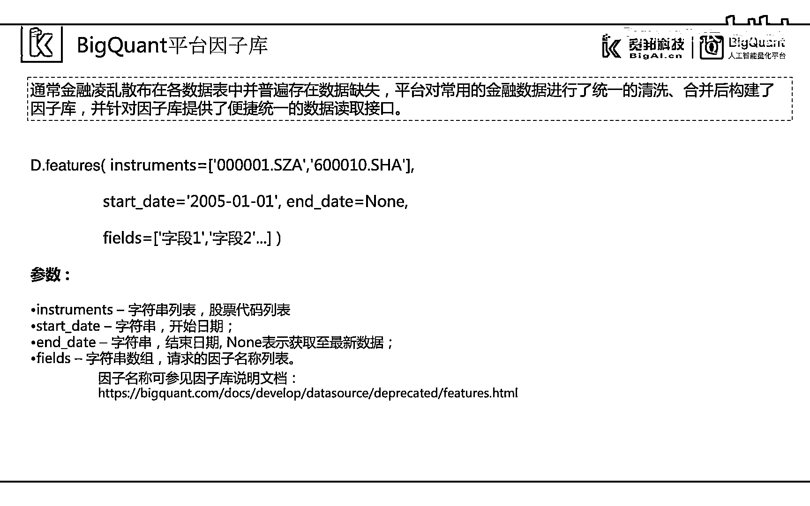
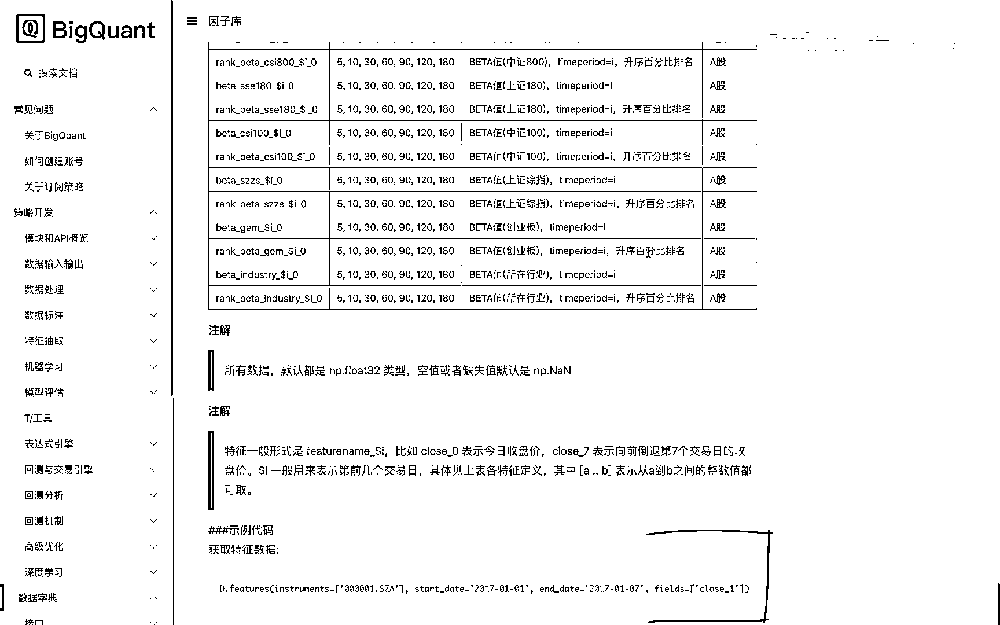

# 7天爆肝整理！AI量化交易-机器学习全套教程，从入门到项目实战保姆级教程！（数据挖掘分析／大数据／可视化／投资／金融／股票／算法） - P18：4.1.2-因子库 - Python校长 - BV1KL411z7WA

可以看到，平台提供的金融数据散布在各个数据表中，并由于停牌或是退市等原因，普遍存在数据方面的缺失，为此，平台对常用的金融数据进行了统一的合并和清洗和填充，并构建了因子库。

针对因子库提供了一个便捷的统一的数据读取接口，地点features，例如，我们可以通过地点features这样一个接口读取，00001和600010这两只股票在2005年1月1日至今的开盘价，收盘价。

换手率，以及财务因子等相关数据，这些数据从平台的因子库直接抽取，并已经经过了合并和清洗，平台所提供的因子库相关字段可以参考文档。

平台所提供的因子库可以参考相关文档，我们可以通过点击数据字典中的因子库，查看因子库中所包含的因子字段，我们可以看到因子库中包含了股票的基本信息，量价因子，换手率因子，估值因子，资金流因子，财务因子。

以及我们常用的股东因子，技术分析因子，波动率，比特值因子，我们可以看到这些字段中，以比特因子为例，比特CSI800$I-0表示该因子的字段名，$I表示为可变的参数，可取值的范围为平台内置的取值范围。

例如该因子对应的爱取值范围为50，30，60，90，120，180，分别反映了相对于中正800，5日的比特值，10日区间比特值，30日，60日，90日，120日和180日的比特值。

特征的一般形式为因子名和参数构成，比如C0表示今日收盘价，C7表示向前倒退第7个交易日的收盘价，可变参数一般用来表示第几个交易日，例如我们获取000001这只股票。

从2017年1月1日到2017年1月7日，昨日收盘价这个因子，我们可以通过地点features，instruments这样的写法来实现，如果我们想获取某只股票昨日收盘价因子。

我们可以在地点features，the fields字段中填入close-1。

