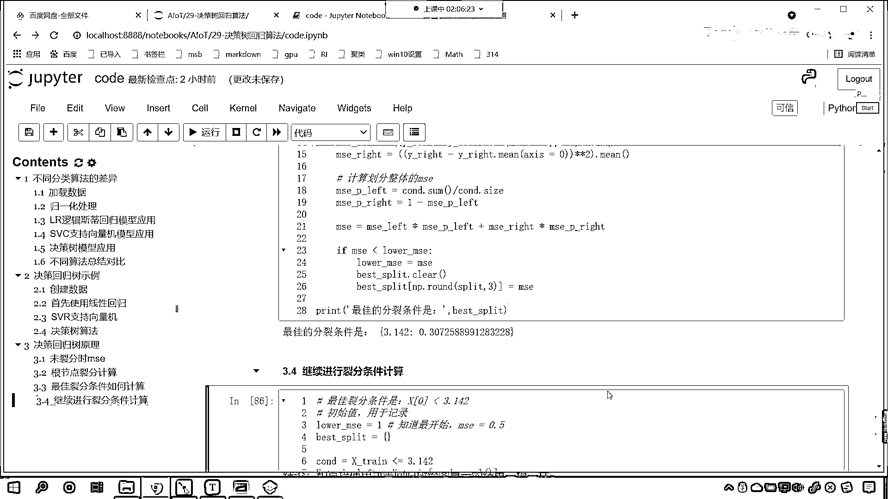
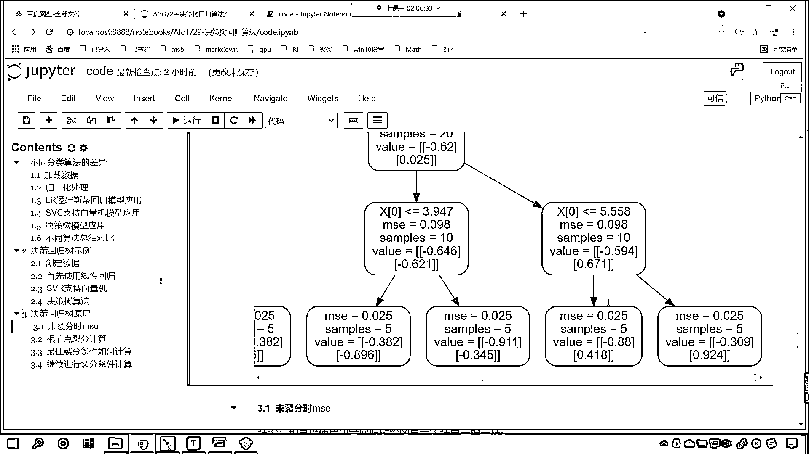
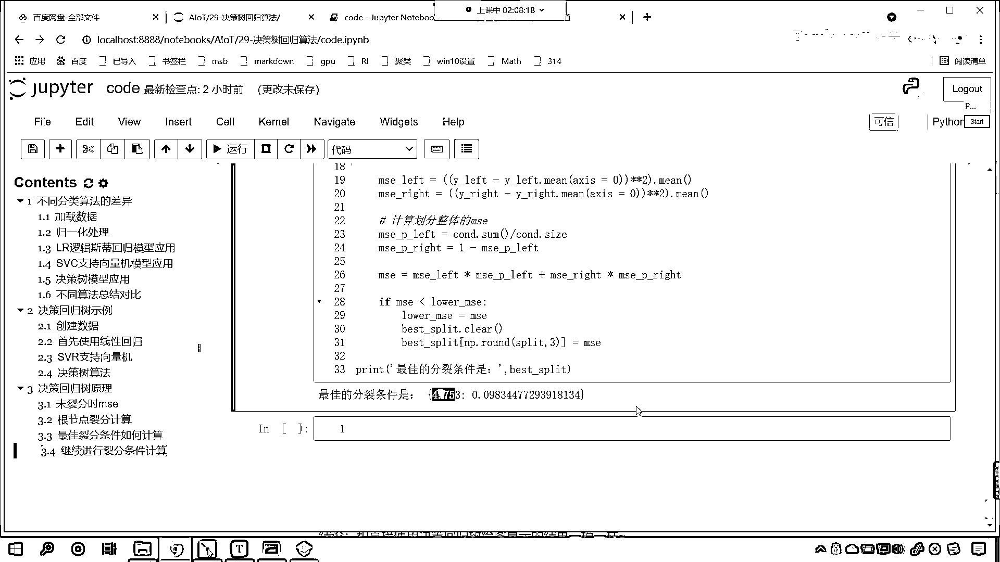

# 7天爆肝整理！AI量化交易-机器学习全套教程，从入门到项目实战保姆级教程！（数据挖掘分析／大数据／可视化／投资／金融／股票／算法） - P191：6-决策回归树最佳裂分条件计算 - Python校长 - BV1KL411z7WA

好 那么咱们接下来呢 我们继续往下看啊，那现在有一个问题，现在有一个问题 就是咱们这个最佳列分条件到底是怎么找到的呀，刚才这个最佳列分条件它是怎么找到的，就是看我们图形当中。

你看这个x0它为什么就选择了3。142呢，你看这个地方为什么它怎么知道选3。142啊，对不对 看它怎么知道选3。142，我们刚才的代码演示，咱们找到了为什么是4。99 为什么是0。5 对不对啊。

就是没有列分的时候 咱们根据MSE的公式计算出来了 它是0。5，咱们根据根解点它的列分，咱们也计算出来了 左侧MSE是0。307 右侧也是0。307，这个时候都吻合上了 对不对。

现在的问题是什么呀 它是怎么算的呀 对不对，那这个最佳的列分条件是怎么找的，现在呢 咱们就计算一下 好不好 咱们就算一下，看一下这个最佳列分条件如何来找，回到咱们的代码当中 咱们来一个四级标题。

就是说这个最佳列分条件如何计算，那么在我们上面这个图形当中，咱们的最佳列分条件是多少呀，是X0 是不是小于咱们的3。142呀 对不对，那这个如何找到的呀 现在咱们就写一个代码。

叫做lowerMSE 我们让这个MSE一开始我们给它设一个初值，让它是1 lowerMSE 给它一个初值是1，你看为什么我可以给一个初值是1呀，因为我知道最开始的时候咱们的MSE它是不是0。5呀。

MSE它是0。5 所以我给个1是吧，你这个地方给个1也行 给个2也行 但是你不能给0。5小，因为lowerMSE它呢 这个地方呢 只是给了一个初始值，它的作用是什么 它是用于记录。

所以说咱们给一个lowerMSE 让它是1 是2也行 是3也行 是100也行 是1万也行 是多少其实都无所谓，但是呢要比0。5大就行，然后呢咱们再给一个叫best split。

这个是不是咱们的列分条件呀 咱们给一个字典，然后呢我们就来一个Full循环啊，那就是FullIinRange，那我们Full循环咱们给它分成多少份呢，那就是Length x_t。

它的长度让它减去1 然后来一个冒号，这个时候咱们就开始找列分条件吧，split就等于x_t，咱们来一个切片，爱冒号 英文的冒号，我们让它到爱+2，然后呢点我们求一个mean，你看这个列分条件是怎么来的。

和咱们上一节课所讲到的分类算法的列分条件是不是一样呀，有了这个列分条件咱们就可以怎么样了，是不是就可以x'小于等于咱们这个列分条件呀，那小于等于这个列分条件这个时候你看我们是不是就得到一个条件。

根据这个条件咱们是不是就可以得到左侧和右侧的数据的划分呀，对不对 你看就可以得到左侧和右侧的这个数据划分，有了左侧和右侧的数据划分，咱们的y'是吧来一个中国号，我们得到这个数据那就是COD点儿。

这个时候是不是得需要调用reshape了，是吧给他来个-1，好那么我们得到的是什么，y_left，有了y_left，然后咱们再得到y_right就等于y_t，中国号小括号来一个波浪线COD。

这个时候呢我们给他来一个平铺，这个时候咱们来一个注释啊，这个叫平铺，平铺呢就是把它变成eV的数据，你看你有了左边和右边了，咱们现在是不是就可以计算一下左侧和右侧他的这个MSE了。

然后咱们就MSE下滑线left，是不是就可以计算一下怎么算，那就是y_left减去咱们的y_left点儿me，咱们给一个轴让这个轴等于零，是吧然后呢去求一下他的me对不对，这个时候还不行。

是不是少一个平方，星号星号平方，小括号扩起来，前面呢也来一个小括号，是吧这个时候小括号就成对出现了，看到了吗me left就有了对不对，然后呢MSE下滑线right，是不是相同的计算。

咱们就来一个y_right减去y_right点儿，也求一下他的me，也给一个轴让他等于零，然后呢星号星号平方，小括号把这个平方扩起来，求一下他的me，是吧前面再加一个小括号。

这个时候你看左侧的是不是计算出来了，右侧的是不是计算出来了，这个时候还不行，你左侧右侧，是不是我们得算一下整体的，你刚才只是左侧分支的这个数据，那接下来呢咱们计算，是吧整体的。

就是计算化分整体的这个MSE，那MSE就等于左侧的这个，就等于左侧的MSE，加上右侧的MSE，这个时候还不行，你左侧是不是有一个比例，右侧是不是有一个比例，这个时候呢我们得让右侧的乘以右侧的比例。

是吧左侧的乘以左侧的比例，那就是MSE-P，是吧那MSE-P=，这个MSE-P，后面这个MSE-P，你左边这一部分，它占的比例是多少呀，是不是根据咱们的条件来确定的，这个时候咱们计算一下。

MSE-P是吧，它的概率是多少呀，left它就等于C1D。SUM，因为这个C1D呢它是条件，那它是一个这个逻辑运算，如果它要是那么它就是true，SUM的话就是它的个数，然后除以谁，除以C1D。

SIZE，这个就是它的总数，然后呢MSE-P-RIGHT，它就等于C1D。，它就等于C1D，看这个时候是不是得给它来一个波浪线点SUM呀，看到了吗，除以C1D。SIZE，这个时候呢左右的就都有了。

其实还可以来一个简单的，是不是就是1-MSE-P-LEFT呀，因为我们就将数据分成了左右两边，那左右两边它的概率之和是不是就是1呀，对不对，好这个时候你看就有了MSE了，有了MSE了。

现在呢咱们就来一个判断，就是E(MSE)，它如果要小于咱们的lower MSE，你看如果它要小咱们就怎么样，那这个lower MSE就让它等于咱们的MSE，这个时候你看我们是不是就记录了一下呀。

我们说MSE它用于干嘛，是不是用于记录，这个时候你既然算出来的MSE比lower小，那我们就记录一下，记录之后呢，咱们把最合适的条件给它存进去，存到哪呢，咱们就存到这个best split。

那最合适的条件只有一个，咱们先清空clear一下，然后呢这个best split来一个中国号，是吧咱们把最合适的条件，我们给它放进去，那这个最合适的条件呢，就是咱们的split是吧，让它等于多少。

我们就让它等于咱们的MSE吧，就是我们算出来的这个，就是咱们算出来的这个MSE啊，好那么这个fault循环结束之后，我们print输出一下，在这呢就最佳的分裂条件是，最佳的分裂条件是。

逗号咱们将这个best split输出一下，这个时候你看我一执行，来各位小伙伴，看看看出来了吗，我们的最佳裂纷条件，是不是3。14159啊，3。14159对不对，那我们这个时候呢，给它来一个np。

rawen的啊，我们让它保留三位小数好不好，来一个三位小数，你看执行一下是多少，3。142，诶各位小伙伴，咱们是不是自己写代码，算出来了，0。307和咱们上面画图，看上面咱们使用决策数，看到了吧。

上面咱们使用决策数，它的裂纷条件3。142，是不是它如何找到的3。142，你现在知道它如何找到3。142了吧，对吧，也就是说这个3。142是吧，它是怎么找到的，我刚才是不是用这这部分代码给你演示了。

它如何找的呀，对不对，你看3。142就是这样找的啊，是吧，放循环这个里边你要注意，是吧，左侧右侧，咱们计算整体的这个mse，以及呢，你要注意它的概率，明白吗，要注意它的概率的这个计算，好。

那么到此为止你就知道了，原来我们使用的这个决策回归数，它的最佳裂纷条件如何计算，就是通过这个裂纷计算的，那么同样的道理，我们延展一下，同样道理咱们延展一下，比如说，这个分支，你看啊，这个分支。

这个分支是不是，这个1。531呀，那请问这个1。531是如何算的呀，看了这个1。531是如何算的，你知道这个是怎么算的吗，来我也给你演示一下啊，咱们就将我们的代码，复制一下，Ctrl+C。

咱们在这粘贴一下，我们在上面插入一行，咱们来一个四级标题，这个呢就叫做，继续，是吧，继续进行，裂纷条件计算，好，那么这个时候呢，咱们的这个X寸，这个时候咱们这个X寸就得，就得发生一点变化了，大家明白吗。

这个X寸，因为我们此时的数据，咱们此时的数据是不是就是左侧呀，对吧，就是你第一次裂纷之后，是不是得左侧的那部分数据呀，对吧，那这个时候咱们调整一下啊，那就是，X下滑线寸下滑线left，看就等于。

上面我们先给一个条件，Cond就等于X下滑线寸，我们让它小于等于3。142，是吧，这是不是一个条件，然后咱们把这个数据取出来啊，那就是X寸，咱们来一个这个中国号，我们将Cond放进去。

这个时候这个Cond呢，它是一个二维的，咱们得调用Revel，R A V E L，小括号，看用这个数据复制一下，把下面的X寸都替换一下，是吧，X寸Ctrl+V粘贴一下，替换一下，是吧。

我们看一下下面还有没有啊，好下面没有了，来咱们执行一下啊，你看我一运行，这个时候你看这个Y寸，是不是也得需要变换一下呀，因为这个Y寸，它就不是整体了，对不对，那咱们来在这个地方，我们来一个Y下滑线寸。

下滑线left就等于Y下滑线寸，然后中国号Cond。Revel，是吧，你看啊，然后呢这个Y寸left复制一下，把下面的Y寸都得需要替换，看都得需要替换，这个时候咱们再来执行，你看我一运行。

诶各位小伙伴你看，是多少，1。531，来惊讶不惊讶，此处应该有掌声，是吧，因为这个1。531。

你看我算出来的和上面的，看了吧，你看是是多少，是不是1。531呀，来我们再往后滑啊，看看右侧这个分支是多少啊。

右侧这个分支是多少啊，看到了吧，4。753，它是怎么算的呀，对吧，代码复制是吧，我们只需要简单修改一下啊，Ctrl+C，在这呢来一个Ctrl+V，你刚才是left，现在是不是变成right就行了。

R-I-G-H-T，是不是啊，来R-I-G-H-T，那这后面这个这个数据呢，得来一个波浪线了，对不对，看咱们给他来一个波浪线啊，这个时候得需要来一个波浪线，波浪线就表示取反。

好那么同样的这个left是吧，咱们都得给他改成right，我们耐心改一下，是吧，R-I-G-H-T，下面这个也改一下，R-I-G-H-T，那数据这呢也改一下，R-I-G-H-T，是吧。

看R-I-G-H-T，来咱们执行这个代码，来各位小伙伴你看，4。753，还记得刚才图形里边是多少吗，来各位你看啊，各位你看啊，看4。753，好那么到了这之后，这个地方为什么是5。558。

这个地方为什么是3。947，你现在会会算了吗，你看这个就相当于地规一样，是不是，这个现在放循环一样，算完一个再算一个再算一个再算一个，是不是代码基本上是不是都是，我们给刚给给各位显示的这部分代码呀。

对不对，所以你看算出来了，现在你知道这个决策回归数，它的原理到底是怎么回事了吧。

呈現實際狀況。