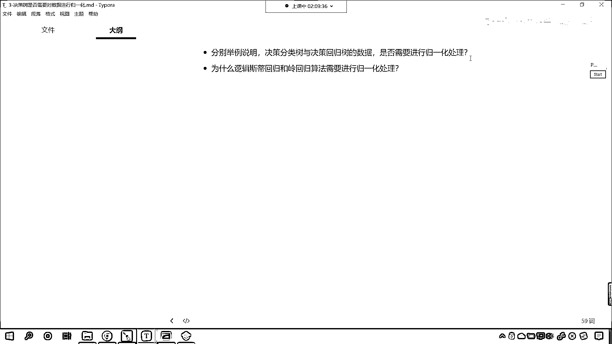

# 7天爆肝整理！AI量化交易-机器学习全套教程，从入门到项目实战保姆级教程！（数据挖掘分析／大数据／可视化／投资／金融／股票／算法） - P192：7-作业 - Python校长 - BV1KL411z7WA

咱们今天晚上决策数原理的知识点就介绍到这，咱们来看一下咱们的作业，咱们的作业就是分别举例说明决策分类数与决策回归数的数据是否需要进行规划处理，为什么逻辑回归和领回归算法需要进行规划处理呢。

咱们在课堂上是不是都有提示呀，那你在做这个作业的时候呢，你可以使用原微花的数据或者说使用我们的手写数字是吧，来进行来进行这个验证一下啊，举例说明决策分类数与决策回归数的这个数据是否需要进行规划处理。

这个就是咱们今天晚上所有的内容了。

