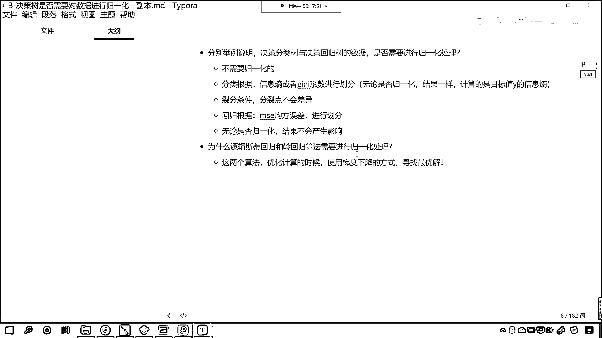

# 7天爆肝整理！AI量化交易-机器学习全套教程，从入门到项目实战保姆级教程！（数据挖掘分析／大数据／可视化／投资／金融／股票／算法） - P193：1-归一化对不同算法影响 - Python校长 - BV1KL411z7WA

上一节课呢 我们留了这样的一个作业，咱们说分别举例说明 我们的决策数与决策分类数与决策回归数，咱们在进行训练的时候 咱们的数据需要规一化吗，哎 在这的话 我们给一个答案啊 这个是不需要规一化的。

那为什么不需要规一化呢 因为我们的分类，咱们是分类的话 我们是根据这个CROP，根据咱们的这个信息商 是吧 CROP TY CRU，根据咱们信息商 或者咱们的根据基尼系数 是不是来进行划分呀。

那根据信息商和基尼系数在进行划分的时候，无论是否规一化 其实我们的结果是一样的，为什么 是否规一化结果是一样的，因为咱们计算的是目标值Y的信息商，即使咱们对数据进行了规一化。

比如说咱们进行规一化的时候 原来是1到100，现在咱们把它规一化 规一化成0到1了，那其实划分的裂分条件是不是没有发生变化呀，对不对 你看啊 其实呢 这个裂分条件 是吧。

它的分裂点 分裂点呢 不会有差异，所以说呢 这个决策数分裂的时候 这个是没有影响的，那咱们回归的时候呢 咱们根据的是什么，咱们根据的是MSE 军方误差，我们根据军方误差 咱们呢 来进行划分。

那这个军方误差呢 和上面的基尼系数和信息商是类似的，对吧 无论是否规一化 这个无论是否规一化，那么它的结果呢 不会产生影响，这个得需要各位根据咱们的计算过程 你去思考一下。

咱们前面的课程 我们在讲分类的时候，咱们都手动为各位进行了演算，也就是说这个算法到底怎么回事，咱们每一步的信息商 或者说每一步的基尼系数，我们都进行了计算 对不对。

那你想规一化之后 你计算的方式 你计算的这个裂分点大小可能不一样，但是这个裂分点 它所占的比例是一样的，因为咱们的这个 因为咱们的规一化，其实呢 它是按照一定的比例是不是进行了缩放呀。

对不对 你看它按照某一定的比例进行了缩放，所以说呢 是否规一化 对于我们决策数分类没有影响，那回归也是 咱们是否规一化 对于咱们的回归也没有影响，上一节课我们计算了MSE 这个到底是如何算的。

咱们给各位演示了一下，好 那么为什么逻辑回归和领回归，这两个算法 咱们需要进行规一化处理呢，往往一进行规一化处理 那这个效果是特别好的，咱们在这呢 也说一下原因啊，因为这两个算法 它在进行优化的时候。

在进行优化计算的时候，咱们使用梯度下降，使用梯度下降的方式来寻找咱们的最优解，如果他要使用梯度下降的方式去寻找最优解，那么你想一下 它如果使用最优化的形式，使用梯度下降的方式去寻找最优解。

那梯度下降 我们知道这个属性和属性之间，每一个属性呢 它属于是一个特征，那如果说我们的特征量纲不一样，有的特别大 有的特别小，那么在使用梯度下降的时候，有的会梯度下降特别快，有的呢梯度下降特别慢。

导致呢 咱们没有一个很好的，因为你找最优点 最合适 最好的方式，那就是同时 是吧 各个属性，咱们同时梯度下降到最优点，对吧 那如果说我们没有进行规划，有的数值特别大 有的数值特别小。

咱们在使用逻辑回归和领回归的时候，那这个时候这个效果就不会特别好，所以说就是因为梯度下降 是吧，你就像咱们这个下山一样 对不对，那比如说有很多条路 是吧，那有的路呢特别陡峭 有的路呢比较平滑。

平滑的路你是不是走的特别慢呀，陡峭的路你是不是速度就快一些呀，假设说山上要是有一个电梯的话 是吧，你乘电梯是吧 可能一两分钟就下来了，但是如果你要爬山的话 是吧，沿着这个坡道一级台阶一级台阶向下走。

你可能得需要小半天时间，但是呢电梯是一个属性，咱们的这个山上的这个轨道呢，山上的这个小路呢它也是一条属性，你能够看到我刚才举例，咱们所花的时间是完全不一样的 对吧，如果要坐电梯那就快多了。

如果我们要爬楼梯那所花费的时间就很长 对吧，你看放到咱们算法当中，这个逻辑四地回归和领回归，它优化算法它是通过梯度下降，你梯度下降都是一步一步去寻找最优解，那这就会出现这个属性之间寻找最优解的时候。

它不匹配 有的属性可能得需要一万步，有的属性呢你可能两步就找到了，所以说呢这个逻辑回归和咱们的领回归，这样的算法凡是用到梯度下降的，那我们给它进行规一化，往往就会取得比较好的一个结果。

咱们的准确率都会有一个大幅度的提升，好 这个呢就是咱们上一节课所留的作业，这个算是对于我们算法原理更深刻的一个理解，咱们上一节课在讲课的过程当中呢，我们进行了相应的举例，咱们使用的是葡萄酒的这个数据。

那你能够发现是吧，逻辑四地回归 规一化和不进行规一化。

它的差距呢还是非常明显的啊。