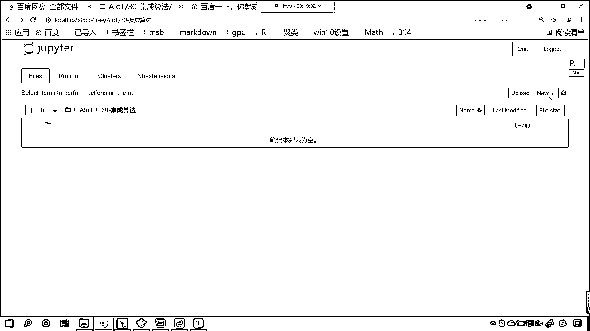
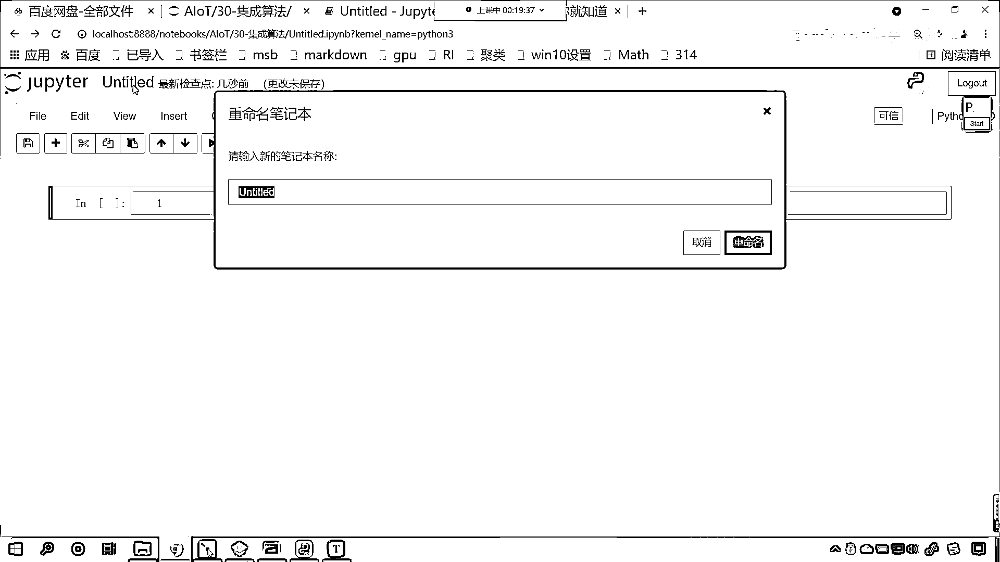
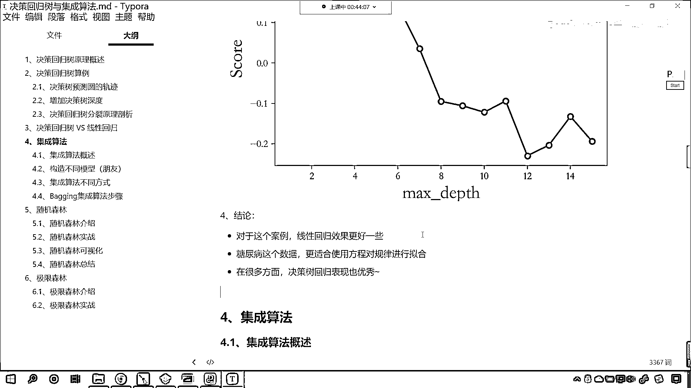

# 7天爆肝整理！AI量化交易-机器学习全套教程，从入门到项目实战保姆级教程！（数据挖掘分析／大数据／可视化／投资／金融／股票／算法） - P194：2-决策回归树VS线性回归 - Python校长 - BV1KL411z7WA

接下来呢，咱们继续往下看啊，看咱们今天的这个内容知识点，那上一节课咱们讲完决策数回归之后呢，我们还剩一点内容，那就是咱们决策数回归和咱们线性回归，它们之间的一个对比，现在呢，咱们回到咱们的代码当中。

咱们就使用一下决策数和咱们的线性回归呢，进行一个对比，上一节课呢，咱们将决策数回归的原理，我们进行了一个讲解，咱们也知道它如何进行分裂了，对不对，那么它根据的标准就是咱们的MSE，是吧，咱们上一节课。

我们也使用代码，手写代码，一步一步的咱们把这个裂分的这个过程，最佳的裂分条件，我们算出来了，咱们算出来的这个最佳裂分条件，和咱们题目当中和咱们决策数，画出来这个决策数一模一样。

那咱们就知道这个决策回归数到底是怎么一回事了，接下来呢，我们对于决策回归数，咱们进行一个使用，来，现在的话，咱们就回到咱们的代码当中，好，那么我们在当前的文件夹下，这个我起了一个30-集成算法。

咱们在这呢，创建一个python文件。

我们给它改个名，这个呢就叫做code。

好，那么现在的话，我们呢就导一下包，咱们呢就from sklearn，咱们从tree这个模型下，那我们导一个包，咱们导入decision tree，我们现在选regressor。

然后from sklearn，咱们从linear model下，咱们要对比一下决策数和咱们的线性回归，它们之间的这个差异，所以说我们将linear regression咱们导进来。

然后呢咱们将数据导进来，from sklearn，这个时候呢咱们import，我们将data sets导进来，然后from sklearn，咱们从model selection这个子模块下。

咱们导一个包，那我们就import，twin test split，这个方法呢，它可以将我们的数据呢来进行一个拆分，好，那么先，然后呢我们再导一个包，import numpy as np。

此时我们执行一下代码，首先咱们加载一下数据，那我们就load下滑线，咱们选择diabats这个数据，这个呢是糖尿病的数据，在这呢我们注释一下啊，这个是糖尿病数据，那我们执行一下。

给各位看一下咱们这个糖尿病，它数据是什么样的一个数据，在这你能够看到data，这个是数据，这个是target，那target这个值越大，就说明呢咱们糖尿病的这个情况呢就越不好，是吧。

我们血糖的含量呢就越高，是吧，这个是一个指标，那我们再往下看啊，看一下咱们都有哪些特征，看到了吧，这个就是咱们的feature names，这个feature name就是特征，也就是说。

一个人他为什么会得糖尿病呢，那哪些特征跟他得糖尿病有一定的关系呢，根据我们的常识，咱们就知道一个人得不得糖尿病，和他的年龄是不是有关系啊，像年龄越大，得糖尿病的概率是不是就越大呀，还和性别有一定的关系。

还和BMI有一定的关系，这个BMI就是表示一个人是否肥胖，那我们知道一个人如果特别肥胖的话，他患糖尿病的概率是不是就更高一些，还有BP这个是血压，还有S1一直到S6，是咱们血液当中的一些指标。

也就是说这些呢都是生物上采集的数据，那这些生物上采集的数据，是不是就决定了这个人糖尿病的严重程度呀，好 那么这个数据呢，它就是一个回归问题，它不是一个分类问题，各位小伙伴你仔细看一下咱们的target。

那我们这个target是不是就相当于我们的目标值呀，看到了吧 target，这个就相当于是目标值，那我们这个目标值呢，各位小伙伴你来看一下，151 75 178 48 270 是吧，99 280。

每一个数据和每一个是不是都不一样呀，对不对 每一个数据和每一个数据都不一样，这个就是一个回归问题，如果我们这个数据是一个分类问题的话，那么它长得应该像咱们圆花那样，长得应该像咱们葡萄酒那样。

你看葡萄酒的数据是吧，16全是0 是吧，另一排全是1，再接下来就全是2 是吧，那样的它才属于是一个分类问题，而像咱们糖尿病它的这个严重程度，是吧，这个就属于是一个回归问题。

好 现在的话咱们获取一下这个数据啊，我们调用这个方法，里边呢有一个参数，它呢叫return x和y，那这个意思呢就是直接返回数据x和数据y，咱们这呢给它一个true。

那么我们就会得到咱们的数据x和咱们的目标值y，现在有了x和y，咱们现在调用tryne test split，我们将x和y放进去，这个时候我们的数据就会被一分为二，那就是x下滑线tryne。

x下滑线test，y下滑线tryne，y下滑线test，这个时候你看数据就被一分为二了，好，那么有了数据之后呢，咱们现在就使用linear，线性回归这个模型，我们对它呢进行一个建模。

然后咱们就model。fit，咱们将训练数据放进去，然后呢我们看一下它的效果怎么样啊，那就是model。score，这个时候咱们将测试数据，xtest y下滑线test放进去。

同时上面咱们来一个打印输出，那这个呢就是叫测试数据的得分冒号，打印一下，那就是model。score，咱们将x下滑线tryne放进去，y下滑线tryne放进去，下面这个呢就是我们上面这个，我们修改一下。

上面这个叫做训练数据的得分，好，那么下面这一行打印输出，它是不是对应着咱们测试数据的得分啊，在这呢修改一下啊，这个文本咱们填充一下，这个是测试数据的得分冒号，测试数据得分，训练数据得分。

你想一下哪个得分会高一些啊，上面这个得分会高一些，还是下面这个得分会高一些，来各位在讨论区里边回复一下啊，来你看我一执行，来各位小伙伴，各位小伙伴咱们就能够看到，是吧，我们有同学说上面这个得分高。

咱们有同学说下面这个得分高是吧，现在我们就能够看到，你看哪个得分更高呀，咱们现在得到的结果是下面这个得分更高是吧，现在呢我们解释说明一下啊，这个按道理来说，是不是上面的得分应该更高呀，对不对。

因为上面的数据呢，是不是咱们的这个训练数据呀，对不对，我们算法学习的就是这个数据，然后我们对它进行预测的时候，理所当然应该上面这个数据高一些，是不是啊，那这个跟我们数据划分有一定的关系啊，这个时候呢。

我们twin test split咱们再执行一下，你看啊，上面这个代码，大家注意，上面这个代码我们再执行一下，你看我再运行，然后呢再一次去运行，依然是咱们这个情况，是不是啊，依然是咱们这个情况。

那这个时候呢，它和咱们常规的这个情况出现的不太一样啊，我再执行一下啊，现在你来看，各位小伙伴，现在你再来看，这个时候你会发现，是不是上面的得分要更高一些呀，看到了吧，0。527，这个是不是0。470呀。

因为我们的twin test split，咱们这个在进行数据划分的时候，大家注意啊，咱们在进行数据划分时，我们存在一定的随机性，存在一定的随机性，所以说这个分数呢，有的时候上面高，有的时候下面高。

但是如果说这个数据量足够大，现在呢，咱们给一个前提，如果我们的数据量要是足够大，那么一定是上面的得分更加高一些，一定是上面的得分要更加高，大家要注意啊，这是我们的最终的一个结论啊，好。

那么咱们就能够看到，这是我们linear这个线性模型，它的得分，那我们现在呢，就看一下咱们决策数，我们看一下它的表现怎么样，好不好，现在的话，我们就声明一下咱们的这个决策数啊，那这个时候呢。

我们将决策数的得分呢，同时呢，咱们给它这个绘制一下啊，这个时候咱们import matplotlib。pyplot，画图工具，咱们呢，给它导进来，这个划分的时候呢，当然是可以固定的啊。

你看如果我要固定的话，咱们呢就使用random state，这呢咱们给一个911，你看这个时候，你看我如果给911，咱们这回执行得到的分数是0。54，下面是0。41，你看我再执行一下啊。

现在这是带码执行的是第八行，如果我要再执行，你看右上角是不是就变成9了呀，看到了吗，这个时候这个random state 911，就相当于我们将数据固定了，你这个数字是多少都可以，知道吗。

这个数字是多少都可以，好，那么接下来，咱们就看一下决策术，它对于这个分类问题的一个操作和研究，那咱们plot呢，我们设置一下属性吧，plot rcparams，然后呢，我们设置一下它的font，咱们呢。

将它的family，我们呢给它设置一下，这个就是设置它的字体，那就是st，咱们来一个开体，好，现在的话，我们绘图的时候，咱们就可以显示它的这个中文了，好，那我，咱们知道决策数呢，是不是有深度呀，对不对。

决策数有深度，咱们就给一个max，depth，好，这个就是咱们决策数的深度，咱们决策数的深度，我们这个时候就给它一个范围吧，那就是orange，咱们让数字深度是1，一直到16，左逼右开。

也就相当于是1到15，对不对，好，然后呢，咱们给一个score，score呢，就相当于是它的得分，然后我们来一个for循环，到d in咱们的max depth，对它呢进行一个变力，那么在变力的过程当中。

在变力的过程当中，咱们呢就声明一下咱们的决策数，那就是decision tree regressor，里边给它声明一个参数，max depth就等于咱们的d，现在咱们就使用这个特定深度的数。

咱们呢进行一个训练，那我们调用它的fit方法，同样将咱们上面得到的寸数据放进去，然后目标值外寸放进去，然后呢咱们model。score，这个时候我们获得一下它的得分，咱们将x test放进去。

y下滑线test放进去，这个时候你想，我是不是会得到一个分数score呀，有了这个分数之后，咱们呢score。append，上面这个score是一个列表，咱们将每一个模型，它所获得的对于测试数据的分数。

咱们放到这个s当中，大家看啊放到s当中了，好现在这个Fall循环就对于15棵树进行了训练和得分，好那么接下来呢咱们就进行一个绘制，那我们就plot一下，现在呢咱们将max depth。

把这个作为咱们的行锁，咱们将score作为我们的作为咱们的列锁，然后呢逗号咱们给一个r咱们给一个o，然后呢我们给一个杠，这个就相当于是对它设置了属性，那这条线呢是红色，这个o呢就代表着这个原型。

这个杠呢是不是就代表破折线呀，对不对这个杠呢就代表咱们线的一个形状，好那么接下来呢咱们plot，我们对于它的横坐标，它的标签我们对它进行一个设置，好那么标签呢横坐标咱们传的数据是不是max depth。

好这个呢咱们给一个中文啊，这个就是最大深度，这就是咱们树的最大深度，然后呢逗号咱们给一个font size，我们把它的字体大小设置成18，然后plot咱们再来一个y label。

这个y label就是咱们的纵坐标，那么我们纵坐标咱们给的数据是吧，纵坐标咱们给的数据呢是score，这个就是咱们这个回归的得分情况，这个呢就叫做决策数，决策数的这个得分，决策数的得分。

咱们随着树深度它的一个变化情况，font size咱们也给一个18，好那么这个，这个呢我们给一个title啊这个给一个标题，那么我们plot。y label呢，咱们把这个给它改成score。

这个就是咱们的这个分数了，那font size咱们也给一个18，这个时候你看我执行这个代码，哎各位小伙伴你就能够看到，咱们这个得分情况是不是就出来了，哎我们现在看咱们的最高得分是多少呀，看到了吗。

咱们的最高得分是不是当决策数的深度是2的时候呀，你现在来看啊，这个数的深度是2的时候，其实它的得分也并不高，你看我们把它画到这，这个是不是它的得分啊，你看这个是0。1这个是0。2。

那到这个地方也可能就0。25左右吧，对不对，0。是吧也就0。25左右啊，这个分数是不高的啊，那我们输出一下，你看咱们print一下是吧，这个最高的分数是吧，最高分数是冒号是吧，咱们来一个max。

那我们将score当中的这个最大值给它拿出来，你看最高分数是多少，是不是就是0。25489呀，对吧，这个决策数它的得分和咱们上面训练和咱们上面线性模型的得分相比，你看是不是线性模型的得分更高一些啊。

看到了吗，线性模型的得分更高一些啊，好，那么我们现在画的这个曲线呢，是决策数，它对于测试数据它的分数，那我们现在呢，咱们再画一条线啊，这个时候呢，咱们就来一个score，我们给一个中国号。

那么咱们在这个里边呢，我们让score。append一下，对它进行一个追加，这个里边咱们要添加的数据呢，哎就是决策数，对咱们的这个训练数据，看一下训练数据的得分，也就是说随着你决策数的深度增加。

咱们看一下这个决策数对于训练数据得分是怎么样的，那这个时候呢，咱们就使用model。调用score这个方法，然后呢，我们将x寸放进去，咱们将y寸放进去，好那么score有了，咱们紧接着呢。

在这个图形当中咱们再画一个图，是吧，那这个时候呢，那就是plt，大家看啊，咱们给它来一个换行，调用plt。plot小括号，咱们呢，横坐标依然是max。depth，咱们的纵坐标呢。

这个时候我们给一个score，然后呢，咱们给一个绿色的，是吧，咱们给一个星号，然后咱们给一个杠，好那么，分别注释一下，那么绿色的这条线，绿色的线，是我们训练数据，随着数深度的增加，它的这个得分变化情况。

好那么下面这条线，是不是咱们红色的线呀，红色的线呢，是我们测试数据，咱们随着数深度增加得分的变化，那此时你看我一执行，哎呦各位小伙伴，各位小伙伴，你有没有发现，有没有发现咱们绿色的线，这个得分怎么样。

这个得分是不是超级高呀，你知道这是为什么吗，看到了吧，决策数咱们绿色的这条线，看到了吧，它得分超级高，而咱们红色的这条线，是我们测试数据的，绿色的这条线呢，绿色的这条线，是咱们什么数据的。

是不是咱们训练数据的，那这个时候咱们在绘制的时候呢，我们再给它一个这个plt点，plt点legend，咱们呢给它一个图例啊，那么这个，这第一个呢，是我们训练数据，训练数据，第二个呢单一号。

是我们的测试数据，测试数据的得分，上面呢是咱们训练数据的得分，这个时候你看我一执行，大家现在看啊，此时在咱们的右上角，咱们是不是就有一个这个图例了，这个图例不太大是不是啊，来我们在画这个图之前。

咱们图形尺寸设置一下，plt点savefigure，我们给它一个这个plt调用figure，然后在这个当中设置一下，它的尺寸12和9，这个时候你看我一执行，哎现在你再来看啊。

这个时候是不是就稍微好一些了，看那这个字体还是不够大，咱们设置一下它整体的这个字体啊，那这个时候就是p，那我们在设置图例的时候，咱们给它一个字体啊，在这儿咱们就调用font-size，我们也给一个18。

这个时候大家来看，这个时候这个字体是不是就就变大了，那我们根据红色的这条线，咱们就知道随着这个数深度的增加，看随着咱们数深度的增加，其实这个算法的表现是不是越来越差呀，对不对这个算法的表现越来越差。

咱们给12和9稍微有点大，咱们给一个12和6啊，这个时候你看再来执行，哎这个时候咱们就可以把它全部框起来，我们呢对它进行一个说明，那么咱们决策数相对于咱们的，我们的决策数相对咱们的线性回归。

那哪个模型更好呀，决策数相对于线性回归，它的表现是不是要差一些呀，对不对你看它的表现要差一些，那其实我们看表现的时候，咱们主要看哪个表现呀，是不是主要看咱们红色数据的表现呀。

对不对因为这个红色数据是测试数据，对不对你绿色的数据呢是我们训练数据，对不对也就是说你这个模型表现好坏，你得需要对你得需要在新的数据上进行测试和验证，才能够表示你很好。

对不对那就像一个考生平时考试的时候，是吧每次都考班里第一名，但是呢一高考是吧，就是这个就考不上985211，那这个时候是不是说明这个学生的心理素质，是不是不够不够稳啊不够稳定是不是。

那你看咱们画出来这个图，你有没有发现如果出现了这种情况，看到了吧也就是说你数的深度越深，其实你的决策数对于我们训练数据，是不是效果越来越好，对不对这但是呢，它对于测试数据是不是越来越差。

我们之前讲过一个，概念就叫什么就叫过拟核，就叫过拟核，这种情况就属于是非常明显的过拟核，知道吗非常明显的过拟核，也就是说他训练数据特别好，但是测试数据特别差，看到了吧最后这个测试数据的得分。

你看都是不是变成负的了，看到了这个时候就是负的0。2，看到了吧就变成负的0。2了，所以说在这里呢，咱们给各位演示了一下过拟核，那随着数深度的增加，你想一下会怎么样，咱们的数这个数的深度。

这个数的深度增加，咱们是不是可以把训练数，它的这个业结点，业结点是不是就变得非常多呀，对吧你看它的业结点就变多了，那它是不是可以将训练数据，给我们分纯呀，对不对你看它是不是就可以将，咱们的训练数据分纯。

对不对将训练，但是这个时候没用，知道吧这个时候没用，它的鲁邦性，它的鲁邦性不行，遇到我们的新数据是吧，它就不行了，因为遇到咱们的测试数据是吧，它就解决不了这个问题，它就决定了，所以说这样的模型。

对于我们这个工作当中而言是吧，这个就是一个比较差的模型，我们希望怎么样呢，我们希望咱们的训练数据，和咱们的测试数据是吧，它的这个表现尽量，那它的表现我们希望让它尽量一致。

这个时候就说明咱们的模型鲁邦性好，说明咱们的模型稳定，我特别清楚的记着，我在上高中的时候是吧，大我三届有一个学长，他学习特别好，学习特别稳定，高中三年，他一直是全年级第一名，也就是说任何一次考试。

他永远都是全年级第一名，18个班级，最后呢参加高考，考上了清华大学，最后参加高考考上了清华大学，以全校第一名全市第一名的成绩，考上了清华大学，你看这就是你平时的训练，就是每一次考试，最终的那个测试数据。

就相当于我们的高考，我们希望平时的成绩特别好，测试的时候这个成绩也特别好，那么在这里呢，咱们对于决策数是吧，又进行了一个介绍，好那么最后呢，看我们总结一下啊，看咱们的结论呢，对于我们这个案例而言。

咱们的线性回归呢，表现更好一些，而糖尿病这个数据呢，大家看啊，咱们更适合使用方程，对规律进行拟合，在很多方面呢，决策数回归是吧，他的表现也是非常优秀的啊，咱们并不能说在这个案例当中。

咱们线性回归把决策数回归给比下去了，是吧，那我们就否定决策数回归这个算法，其实呢这个是不对的啊，再说了，咱们现在所介绍的这个决策数回归算法，他呢属于是最基本最基本的这个决策数算法，后面我们还会接。

我们还会接触更优秀的这个决策数算法，好那么这个呢，就是咱们决策数回归。

咱们线性回归的一个综合对比。。