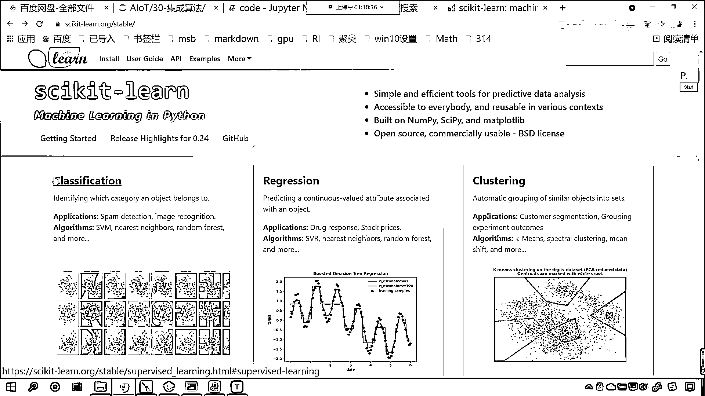
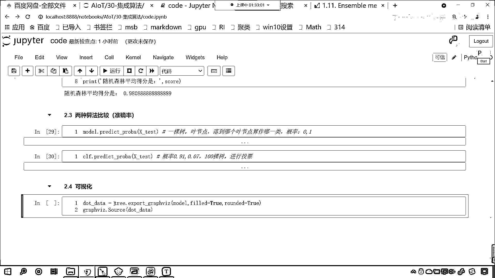
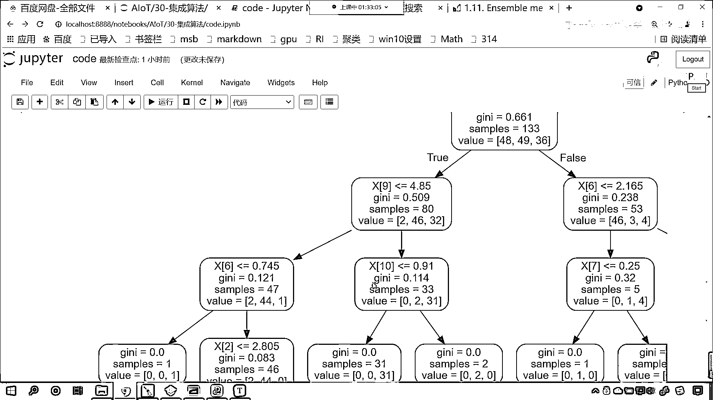
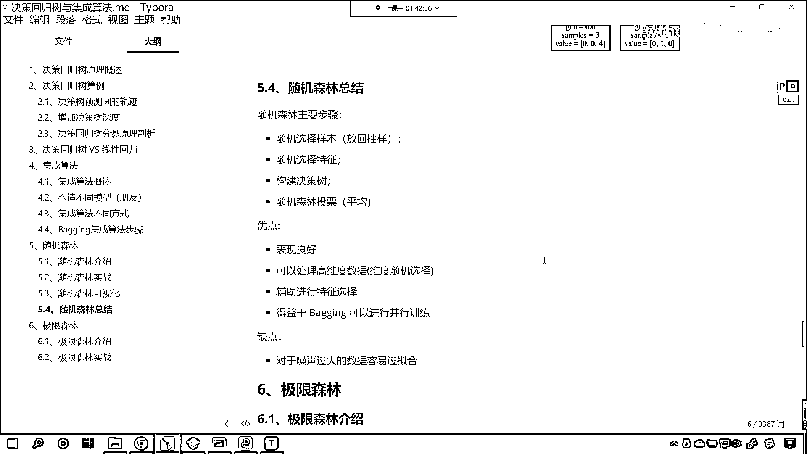

# 7天爆肝整理！AI量化交易-机器学习全套教程，从入门到项目实战保姆级教程！（数据挖掘分析／大数据／可视化／投资／金融／股票／算法） - P195：4-随机森林原理和应用 - Python校长 - BV1KL411z7WA

集成算法就是取长补短，接下来我们就看一下随机森林，这是我们要介绍的第一种算法，这种算法是bagging+决策数，回顾一下上面什么是bagging，这个就叫套袋法，咱们对于训练集进行抽样。

咱们将抽样的结果用于训练，得到一个模型，并行独立训练，随机森林就是这一类的代表，那么我们看一下随机森林有哪些随机呢，为什么叫随机森林呢，之前的算法是不是叫做决策数，它是一棵树，那什么是森林啊。

是不是多棵树就是森林，我们这个地方强调了一个随机，那什么是随机呢，像这个决策数，咱们现在学的酷叫sklearn。

现在我们可以进入sklearn官方网站，然后我们在这可以找到random forest。

classification是不是就表示分类，然后这里边有一个random forest，你random forest表示的是什么，random forest表示的是不是就是咱们的随机森林。

翻译成中文这个是不是随机森林，那么这个随机森林你看，这个地方是不是有一个英文的描述呀，对不对，那你看我在咱们的笔记当中为各位进行了一个截图，看到了吧，这个random forest。

它到底是它到底是这个哪种随机呢，看这个图当中，我对于特定的部位咱们呢进行了一个截取，咱们随机森林它有两种随机性，哎，你看啊，这个随机森林它的随机性一是进行随机抽样，看为什么呢，你看这个红这个块里边是吧。

叫做sample，drawn with replacement，是吧，from training set，看这个drawn就是拉取的意思，看我们从哪个数据当中呢。

我们从training set当中咱们怎么样呀，给它是不是随机抽样获取了一部分数据呀，那这个就是随机抽样，既然是随机抽样，你想我们这次随机抽样得到的样本级和另一次随机抽样得到的样本级是不是不一样呀。

对不对，随机抽样得到的样本一般是不一样的啊，有没有可能完全一样呀，有可能啊，这种概率是非常非常小的，特别是当数据量比较大的时候，那么第二种随机是什么呢，看第二种随机是吧。

这个either from all input features，or a random subset of size max feature，是吧，那这就是咱们的第二种随机，第二种随机呢就是特征随机。

看到了吗，一个是随机抽样，另一个是特征随机，哎，你看啊，随机抽样对应着咱们上面所说的什么，看啊，我们第一种随机是随机抽样，是不是对应咱们的行不同呀，看到了吧，行不同是不是表示随机抽样。

你的行是不是就表示样本呀，对吧，大家要注意啊，这个行不同就表示样本，我们的数据都是二维的，你想是不是，那么第一维它表示样本，第二维这个列就表示属性，对不对，所以说是吧，这个就表示什么，哎。

这个就表示咱们的随机抽样，是吧，好，那上面这个呢，你看行相同列不同，这个是什么，看这个是不是就是特征随机呀，你的特征是吧，比如说你有十几个特征，我一次不取你的全部，我取你的一部分特征进行训练，是吧。

所以说咱们的决策数是吧，咱们的这个随机森林，它随机的它随机在哪里，就随机在这两点，一个是随机抽样，另一个是这个特征随机，你看这在它的官方网站上都有说明，那么随机森林有什么样的好处呢，看咱们可以减少方差。

防止过拟合，看到了吧，叫overfit，这个就是过拟合，那就是防止这个减小方差，防止过拟合，那减小了方差之后，咱们的结果就更加稳定，方差表示的是不是咱们的波动性，对不对，你减小了方差。

那么我们的结果就会更加稳定，好，那么这个就是随机森林，很简单，现在咱们就对于随机森林，我们来进行一个应用，你可以把这个就想象成咱们的一个随机森林，你现在就能够看到，你看，看我们这个当中是不是就有多棵树。

看一棵两棵三棵四棵是吧，省略号是吧，这每一棵树都进行训练，是吧，然后每一棵树它都有一个怎么样，每一棵树是不是都有一个预测，那最后预测，我们得到的结果，最后进行汇总统计计数，看看哪个类别多，那我们就选谁。

看为什么选浣熊，因为你狐狸只有一个，咱们的浣熊是不是有两个，所以二比一是吧，那这个时候浣熊就胜出了，好，现在的话咱们就回到代码当中，咱们对于咱们的随机森林，我们进行一个应用，来回到咱们的代码当中，好。

那么我们往上滑，滑到咱们代码的最上方，咱们给一个三级标题，在这儿咱们来一个三级标题，这个就是我们的决策数回归，vs咱们的线性回归，好，那么我们往下滑，然后咱们再来一个三级标题。

咱们看一下随机森林它的使用，好，那么这个时候咱们导一下包，咱们from sklearn。assemble，大家看我们现在所在的模块叫assemble，这个英语单词它有集成的意思，有嵌入的意思。

从这个模块下咱们导入叫random forest classifier，看把这个模型导出来了，然后from sklearn。assemble，现在呢我们从tree下边。

咱们导入一个decision tree classifier，咱们对比一下，看一下咱们随机森林和咱们的决策数，有什么样不一样的地方，然后呢，我们from sklearn。assemble。

咱们import一个tree，我们将这个数这个模块给它导进来，from sklearn。assemble，咱们import一个data sets，然后from sklearn。assemble。

咱们将画图工具给它导进来，那画图工具呢，咱们导一个包啊，叫import graph vz，这个呢可以帮助我们画图，好，那么咱们呢就执行一下这个代码，好，现在大家就能够看到这个模型导进来了，然后呢。

咱们就使用data sets，我们去加载一下咱们的数据，这个数据呢，你可以变，可以是你工作当中的数据，是什么数据都行，明白吗，这个数据咱们在这为了给大家演示，所以说咱们就使用sklearn当中。

为我们提供的这些比较经典的数据，好，那么这个数据我们已经很熟悉了，咱们呢得到一下它的xy，好，那么得到了这个数据之后呢，紧接着呢，咱们就对它进行一个拆分。

那就是train test split xy放进去，接收一下咱们拆分的结果，那就是xtrain，x下滑线test，y下滑线train，y下滑线test，好，那么执行一下这个代码，ok，数据就拆分了。

咱们先使用咱们简单的这个决策数，我们来操作一下，那就是model，就等于decision tree classifier，然后呢，我们调用model。fit一下，将xtrain放进去。

ytrain放进去，然后呢，调用model。score一下，我们看一下咱们决策数，对于我们原蔚花这个数据它的情况，大家看这回得分是多少，0。921，是不是，我们在上面插入一行，来一个四级标题。

这个呢就是一棵树，这就是一棵树，对不对，那接下来咱们再来一个四级标题，咱们呢，给一个随机森林，你想如果要是随机森林的话，那是不是就是多棵树，对吧，这就是随机森林多棵树，我们看一下，它怎么样，好。

那么随机森林，咱们来一个clf，就等于random forest classifier，大家要注意，你看我在命名的时候，我这个地方是不是也可以叫model，这个都无所谓。

一般情况下model这个英语单词表示模型，表示算法，那咱们这个clf表示什么呢，这个clf你可以把它认为是classifier，是吧，它的一个缩写，你知道它表示classifier，表示咱们分类。

因为我们现在导入的random forest，其实它就是一个分类器，在这呢，咱们叫做分类器，所以说这个缩写我们可以用clf来表示，当然变量的名字，你只要是合情合理，是吧，符合咱们python的命名规范。

其实你叫什么名字都无所谓，名字是小，是吧，你理解它的应用就可以，然后clf点咱们就fit一下，那就是x下滑线寸，y下滑线寸，现在呢，我们在执行之前，咱们先看一下，这个里边的一个参数，这第一个参数。

大家看是nestimator，这第二个参数是criteria，你看你熟悉不熟悉，然后max depth，mean sample split，是吧，这些熟悉不熟悉，是不是很熟悉，这些参数其实和咱们。

你看这些参数，其实和我们决策数当中的那些参数，是不是一样，对不对，因为决策数，它的根模型，咱们的随机森林，它的根模型，其实就是上面咱们的决策数，和决策数差不多，但是第一个参数叫nestimator。

nestimator就表示100颗，决策数，你看100，咱们在这对它进行一个说明，这个就表示100颗，它就表示100棵树，组成了随机森林，组成了咱们的森林，这不就相当于三个臭皮匠顶个诸葛亮吗，是吧。

100棵树在进行学习的时候，是吧，这叫人多力量大，现在咱们训练了，然后咱们CRFscore一下，将x下滑线test放进去，ytest放进去，你看我一执行，现在咱们发现，看得分有没有变化。

这个得分好像没有很大的，没有变化，是不是，我们看一下，得分咱们就发现，是不是没有，没有任何变化，对不对，好，那么我看一下，咱们random forest classifier，这个得分没有变化。

那应该和我们数据拆分的时候，有一定的影响，好，那么咱们现在再将上面这个数据拆分，我们执行一下，看运行，我们再看一棵树，看执行，这个时候这棵树变成1。0了，是吧，咱们再执行，这个时候你看也都变成1。0了。

好，那么原来咱们拆分的结果，咱们拆分的结果和咱们预测的结果，和咱们数据拆分，是不是有很大的关系，我们现在怎么办，咱们现在这样，我们来一个Full循环，好不好，咱们来一个Full i，我们引run值。

我们批量运算，是吧，咱们来一个100次，好不好，选中这三个来一个type键，我们对它进行一个缩进，好，那么咱们在这个Full循环当中，我们对这个数据，进行100次的拆分，看，Control V。

咱们把它放到这，看，现在你看，这个每次是不是都进行了拆分，拆分之后，咱们在Full循环之前，我们给它来一个Score，让它等于0，是吧，那每一次模型训练，咱们把分数给它进行一个相加，我们就让它等于加等。

咱们后面这个数值，是吧，因为你是100次，所以说你每一个模型，它所占的权重，比例是不是1，比例是不是1%，所以说咱们这个时候，给一个怎么除以100，是吧，最后我们print输出一下，这个就是决策数。

这个叫做一颗决策数，咱们的平均得分是，冒号，这个时候咱们将Score放进去，你看我一执行，大家看一颗决策数，平均得分是不是0。9455，好，那么接下来，咱们再对于我们的随机森林，我们也进行这样的操作。

Fallout，In range，咱们给一个100，然后来一个冒号，同样咱们将这个数据，同样咱们将这个数据，给它拿过来，Ctrl+V，来上面再复制一下，Ctrl+C，是吧，Ctrl+V，好。

那么下面这三行代码，咱们来一个缩近，选中它按键盘上的type键，它就缩近了，同样，Fallout循环之前，咱们也给一个Score，让它等于0，好，那这个空格，咱们就给它删除，删除，好。

现在咱们Score，我们让它加等，除以100，来咱们打印输出一下，Print来一个单一号，好，那这个就是咱们随机森林，看随机森林，平均得分是，我们看一下有没有变化，因为咱们一次的情况，是不是带有随机性。

对不对，你像上面是吧，你给一颗决策数，是吧，随机划分一下，它是存在随机性的，有的时候高，有的时候低，咱们如果要给100次，你想一下，这个时候，是不是就基本上趋于稳定了，对吧，来，现在咱们执行一下代码。

好，这个时候运行的时间，可能会稍微长一点，大概就是七八秒钟，10秒钟的样子，好，各位小伙伴，我们现在就能够看到，咱们随机森林平均得分，你现在就能够看到，是不是比上面要稍微高一点点，看了吧，确实增加了。

但是我们增加的幅度，还不是特别大，对吧，这个增加的幅度，还不是特别大，跟咱们这个数据，也是有一定关系的，看跟咱们的数据，也是有一定关系的，看这个耗时比较长，是吧，因为它是100，然后我们每一棵树当中。

是不是又有100个，对不对，跟咱们每一棵树当中，又有100个，这个是存在一定关系的，好，那么大家要知道，单一的决策数，看单一的决策数，看单一的决策数，是吧，在这里，我们得到的结果，稍微有点牵强，是吧。

随机森林分数稍高，它的结果更加稳定，降低了咱们结果的方差，减少了咱们的错误率，大家要注意，回到咱们的代码当中，我们可以将这个数据，给它更换一下，比如说现在咱们这个数据，我们给它漏的一个one，我们使用。

咱们这个时候，你看咱们这个数据，是不是葡萄酒的数据，来我们执行一下，现在换一个数据，咱们看一下它的情况怎么样，看一棵树，对于葡萄酒是0。907，看一下咱们随机森林，这个时候怎么样，所以说这个。

取决于咱们的数据不同，来各位小伙伴，现在你就能够看到，咱们使用随机森林平均得分，这回是多少，是不是0。980，上面这个得分是多少，来此处应该有掌声，因为我们改变了数据，你就发现是吧，这个是不是一下子。

就把它给凸显出来了，看到了一下子就凸显出来了，所以说随机森林，是不是还是非常优秀的，这就是，三个臭鼻酱，赛过诸葛亮，好，那么我们再往下看，好，那么我们就看一下，咱们随机森林的可视化。

看咱们看一下它的可视化，好，来回到咱们的代码当中，看回到咱们的代码当中，那么对于咱们的随机森林，和咱们的，决策数，我们在这进行一个，这个比较，两种算法，这叫两种，算法它的比较，咱们这回比较从哪里开始呢。

我们从准确率，看我们从准确率开始，好，那么咱们model，是不是我们的这个决策数，咱们调用它的predict prob，看这个是不是就表示概率，咱们将x test放进去，现在你就能够看到，看到了吗。

model。predict prob，你看这个是概率，是吧，那么我们发现这个概率就非常工整，是不是，它要么是1，要么是0，是不是，因为你是一棵树，是吧，一棵树，你的业结点，是吧，你想你有业结点。

那么你落到哪个业结点，是不是就，是那个类别，看，你落到哪个业结点，咱们就算作那一类，所以说它的概率，看，所以说它的概率，要么是0，要么是1，两种选择，我们再看一下咱们，随机森林，看，那就是CRF。

predict，数据都一样，x下滑线test，来，咱们现在来看一下，各位小伙伴，你就能够看到，此时的概率，是不是，看此时的概率就有什么了，看此时的概率，是不是0。91，对不对，0。007，是不是0。

07，为什么会出现这样的，因为我们是100棵树，咱们进行了什么，是不是进行了投票，进行了投票之后，你想一下会怎么样，比如说咱们第一种情况，看，比如说咱们第一种情况，看91，0。91，0。07，0。02。

它的投票情况，应该是什么样的，看，我们的数据是分三类的，对不对，0，是不是分01和2，对不对，0投了多少票，0投了91票，1投了多少票，1投了7票，2投了几票，2类别2就投了两票，我们将票数。

咱们给它转换成概率，你想一下，看把票数转换成概率，是不是就是0。91，对不对，然后0。0。07，0。02，是不是就是这种比例，对不对，所以说它是这样的一个情况，好，那么，然后我们再把数画出来。

再来一个四级标题，咱们可视化，好，那么这个时候，咱们就调用tree，点，一颗是plot graph viz，咱们先将model，这单一的数，咱们给它画出来，看到了吧，这是单一的数。

然后给它field等于true，然后给它round，我们也让它等于true，好，那么咱们将这棵树的数据导出来了，我们就叫做dot data，然后咱们就使用graph viz，source。

咱们将这个dot data放进去。

你看我一执行，来，现在你就能够看到，这棵树是不是就有了。

看到了吧，这棵树，这棵树是，看这棵树是什么，是不是咱们，一单一的，决策数，它的结构，看到了吧，这个时候你要观察一下，咱们的样本有多少个数据，来，各位小伙伴，你告诉我有多少个数据，这颗决策数。

它的训练数据有多少个，告诉我，来，在我们讨论区里边回复一下，大家看它是不是133，对不对，为什么是133，为什么，来，我告诉你为什么，咱们是不是叫X寸，看X寸点shape，你看它是多少，看是不是133。

看到了吧，然后接下来，我们再将随机森林给它画一下，好，你想一下，咱们的随机森林，是不是有100棵树，对不对，我们先画，咱们就先画第一棵，好不好，咱们先画第一棵树，好，这个时候也简单，看。

那就是trade，exploit，graph，vz，model，点，这个时候就是c，lf了，来一个中框20，这就表示第一棵树，然后我们也给一个field等于true，也给一个round。

让它等于true，得到的数据咱们接收一下，那就是dot data，然后graph vz。souce，咱们将dot data放进去，你看我一直行，看，第一棵树是不是就出来了，看到了吧，大家仔细观察。

我们第一棵树当中有多少样本，83个，对不对，为啥，它是83个，对吧，为啥它是83，它样本量好像少了一点，对不对，看是不是，样本量是不是少了一点，看到了吧，我们刚才在讲随机森林的时候。

看咱们刚才在讲随机森林的时候，它有几个随机性，这第一个叫什么，是不是叫做随机抽样，你进行了随机抽样，大家看看咱们，训练的过程，你看，这个是随机森林，这一行代码，看这两行代码是不是它的训练。

你看我在fit的时候，我在训练的时候，咱们给的x寸，咱们给的x寸，它里面的样本是不是133个，我们给的是133个，这个没错吧，对不对，但是它进行了随机抽样，是不是，进行了随机抽样。

抽样之后这个数据是不是就变成了83个，所以你现在知道为什么，这一棵树画出来，它是83个了，大家注意咱们的随机森林，不能把它的所有的样子画出来，但是咱们可以把它的每一棵树画出来，它的每一棵树。

都是一棵决策树，随机森林当中的每一个模型，都是一棵决策树，好，那么我们刚才画了它的第一棵树，来咱们复制一下，Ctrl+C，在这Ctrl+V，咱们现在画它的第50棵树，那就是49，咱们画它的第50。

第50棵树，你看我一直行，看到了吧，这回你看，样本量变成多少了，81，看到了样本量，这个是不是也是随机抽样，是不是随机抽样，咱们的数量有可能会不一样，接下来咱们再来一个复制，Ctrl+V。

我们画它的最后一棵树，最后一棵树，这个C0F咱们是不是可以给个99，看这个是不是它的最后一棵树，看到了76，对不对，那最后一棵树，我们在获取的时候，是不是也可以使用-1，一样的，你看你给99，也行。

给-1也可以，看到了吧，每一棵树，你看和咱们原来，所学习的决策数，有区别吗，看到了吧，是不是没有区别，好，那么现在你就知道，它是怎么一回事了，看到现在你就知道，随机森林到底是怎么一回事了，好。

那么我们就通过代码，咱们通过它的可视化，是吧，我们就进行了，汇质，是吧，最后，我们看一下，咱们随机森林的一个总结，好，咱们的随机森林的主要步骤，就是随机选择样本，有放回的抽样，随机选择特征。

然后构建咱们的决策数，然后随机森林，最后是不是来了一个平均，对不对，你看随机森林，最后来了一个平均，我们这个表现，它更加的良好，咱们可以处理高维度的数据，是吧，就是你的特征属性比较多的时候。

使用随机森林，更加均衡一些，它可以辅助进行特征选择，得益于bagging，咱们可以进行并行训练，对于噪声过大的数据，那就容易过拟核，其实对于噪声过大的数据，咱们随机森林过拟核，决策数过拟核，支持下两机。

它也会过拟核，你噪声大是吧，都不行，咱们都得需要进行处理，随机森林当中的每一棵树，都是一棵决策树，随机森林当中的每一棵树，都是一棵决策树，好，那么这个就是咱们随机森林，大家注意，咱们的特征。

也是进行随机的，你想一想，如果这个特征要不是进行随机的，我们随机森林在进行操作的时候，随机森林在进行，构建决策树的时候，你想它是，它从特征筛选的时候，是不是会选择基尼系数，或信息商，变化最大的特征。

你如果说你这个特征不是随机的，你给再多的树，我再多的树长出来，是不是都一样，如果咱们的特征要进行了随机，这个时候咱们得到的结果就会，略有不同，正是因为随机，所以说，咱们的表现就更加良好，是吧。

你看咱们代码当中，展示了咱们葡萄酒的数据，葡萄酒的得分，是不是就比咱们，这个，单一的决策数分数要高，在这儿咱们再多讲一句，因为咱们的葡萄酒，它的特征是13个，大家要注意，X下方线寸，你看它的shape。

它的特征是13个，而咱们的原维花，特征只有4个，特征只有4个和特征只有13个，像你在进行特征筛选的时候，你想你特征只有4个，你没得选，是不是，你的选择空间就很小，所以说，无论是一棵树也好。

还是多棵树也好，你最终得到的分数差距，是不是就不大，如果你是13个特征，是吧，那我进行特征筛选的时候，我的可选空间，是不是就大得多了，比如说，现在让你上大学，是吧，你要么上，要么上河北工业，要么上。

河北大学，看你就有两个选择，你都是这个都不是985，如果说你的选择多了，是吧，多给你一个清华大学，是吧，这个北京大学，浙江大学，上海交通大学，上海复旦大学，你的选择空间多了，那你想。

你的人生是不是就完全不一样了，对不对，当你特征少的时候，是吧，你选择就少，无论是决策数也好，还是咱们的随机森林也好，他们都没有什么特别大的差异，这就是咱们，当中所说的，你看，这个可以处理高维度数据。

是吧，这个维度随机选择，这个维度随机选择，就是咱们的特征随机选择，其实它，这一点，其实咱们这一点，和上面所说的特征选择，它是一个意思，好。

那么这个就是咱们随机森林。

这一部分知识点的一个综合介绍。