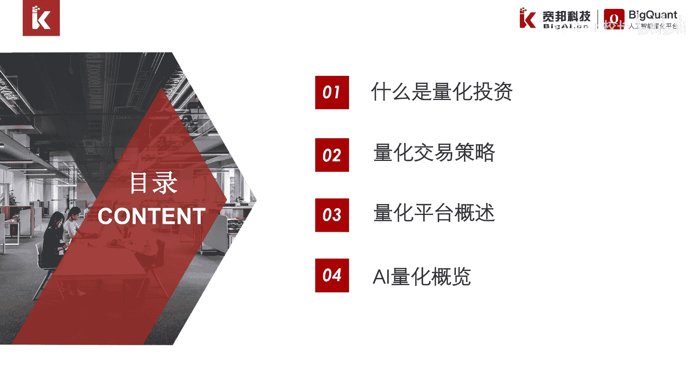
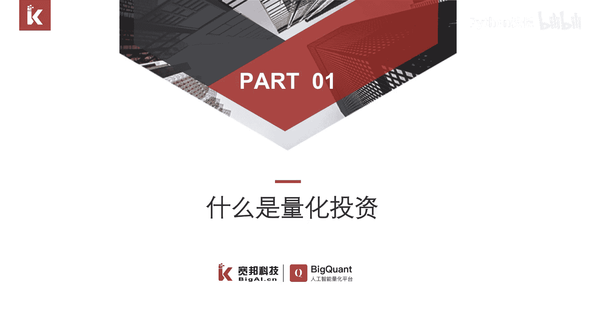
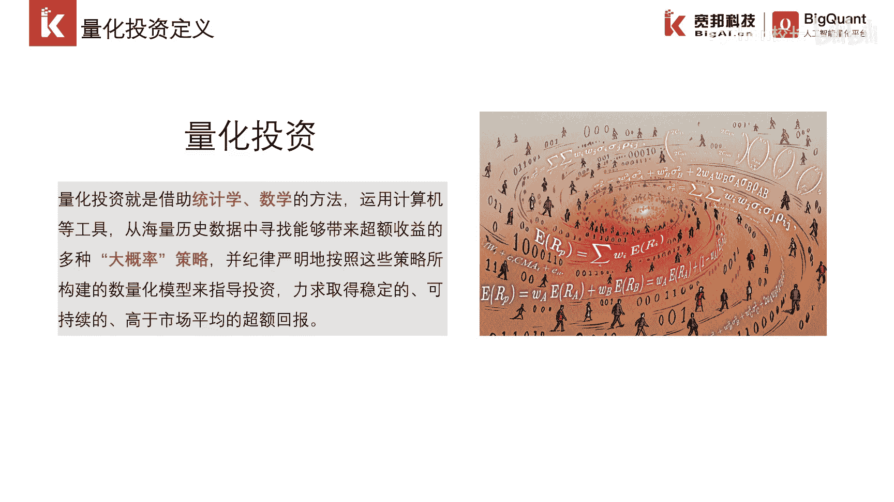
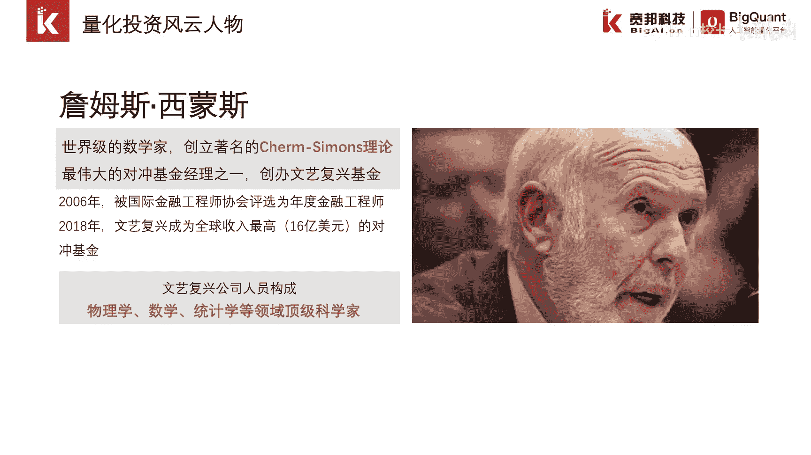
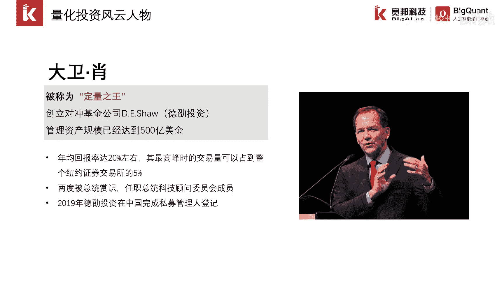
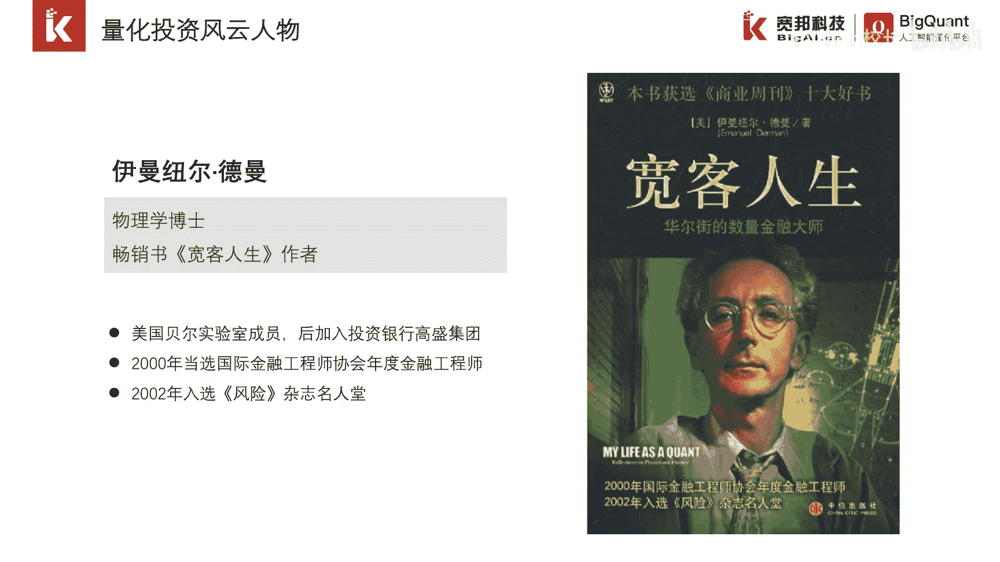
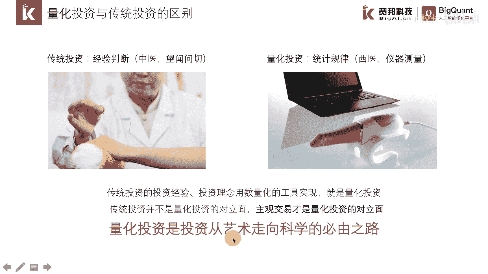
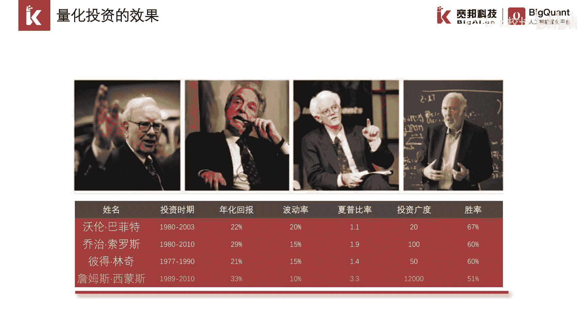

# P1：1.1.1量化投资理解 - 程序大本营 - BV1KL411z7WA

大家好，我是宽邦科技的策略工程师，今天我们主要给大家带来AI量化导论，这一章节的一个介绍，这一章节主要包含以下四个小节，第一节什么是量化投资，第二节量化交易策略介绍，第三节量化平台概述。

第四节AI量化概览介绍，下面我们依次介绍各个章节的内容。

这是AI量化导论的第一节。

什么是量化投资，说到量化投资，其实大家并不陌生，它是一种数量化的方法来进行定量研究，以便进行投资交易，量化投资也是随着计算机的发展而得到，迅速的发展，这是关于量化投资最主流的一个定义。

它表明了其实它是一种不同于以往，一种新型的一种投资方式。

詹姆斯西蒙斯，他其实是量化投资最为代表的一个人物，他本身是一个世界级的一个数学家，曾与我国的著名的数学家陈陈兴生一起合作，进行理论研究，后来他进入了业界，创办了文艺复兴对冲基金。

文艺复兴是一家纯量化的对冲基金嗯，主要的成员呢是物理学，数学，统计学，计算机等科学家，在文艺复兴对冲基金嗯。

科学家占了绝大部分的一个比例，大卫枭在华尔街被称为定量之王，他所创立的对冲基金公司叫做德少投资，目前管理资产规模已经达到500亿美金，之所以被称为定梁之王，是因为在最高峰的时候，德少投资。

交易量可以占到整个纽约证券交易所的，5%，在2019年，德嫂投资在中国完成私募管理人登记。

正式进入中国投资市场，宽客一词想必大家并不陌生，这一称呼主要是来自于一位焦灼，伊曼纽尔德曼这样的物理学博士，他曾经写过一本非常畅销的书籍，叫做宽阔人生，目前旷课主要指的是将统计学，数学。

计算机等知识运用在金融领域，这样的一批人员啊，德曼之前是美国贝尔实验室的成员，后来加入了投资银行高盛集团，在2000年被评为国际金融工程师协会，年度金融工程师，2002年入选风险杂志名人堂。

接下来我们介绍量化投资风云人物，最后一位人物，他叫做雷伊达利奥，他创立了资产规模全球第一的桥水公司，其个人排名也是在2019年，福布斯全球亿万富豪榜排在第57位，桥水公司呢主要是采取Q阿尔法。

从阿尔法策略，已累计获得358亿美元的收益，在2019年，桥水基金在国内发行了首支私募基金产品，桥水全天候中国私募投资基金一号。

我们看一看量化投资与传统投资的区别，传统投资是根据经验判断来进行投资决策，用一个形象的一个比喻来方便大家理解，就是传统投资有点类似于中医，是通过望闻问切把脉来给出诊断结果。

而量化投资是根据统计规律给出结果，量化投资有点类似于西医，是通过仪器测量得到数据，最终给出诊断结果，传统投资的投资经验，投资理念，我们如果用数量化的工具进行实现，那么这就是量化投资。

传统投资也并不是量化投资者对立面，传统投资和量化投资各有各的应用场景，主观交易才是量化投资对立面，量化投资是投资从艺术走向科学的必由之路。

下面我们看一看，传统投资和量化投资的代表人物，沃伦巴菲特是定型投资者的代表人物，其代表的方代表的投资方法主要就是基本面，价值投资，在1989年至2008年，平均年化回报率约为20%，在2008年。

因为国际金融危机回报率为负的15%，定量投资者的代表人物呢是詹姆斯西蒙斯，在1989年到2008年，平均年化回报率约为35%，2008年回报率约为80%，并没有受到国际金融危机的一个影响。

在过去的半个多世纪，诞生了众多著名的投资大师，比如巴菲特，索罗斯，彼得林奇，詹姆斯西蒙斯，其中前三位都是基本面投资的代表人物，而詹姆斯是量化投资的代表人物，我们统计和对比了这四位投资大师。

他们的一个长期业绩，发现詹姆斯西蒙斯的投资表现最为亮眼，这有力地证明了。

