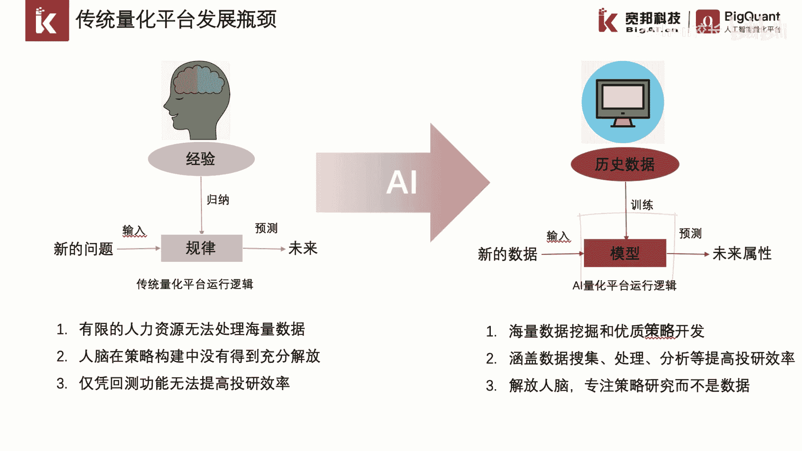
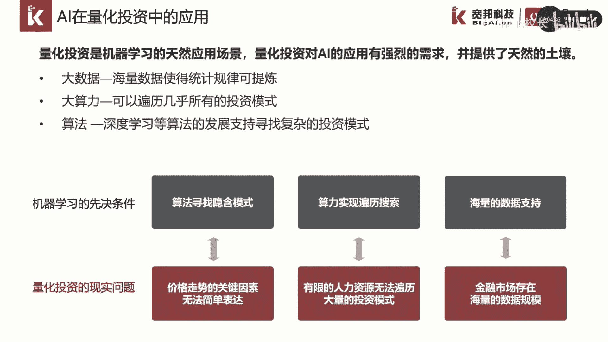
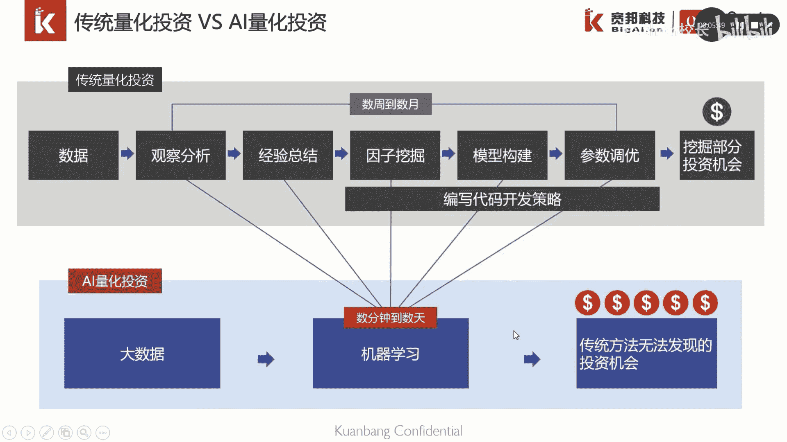
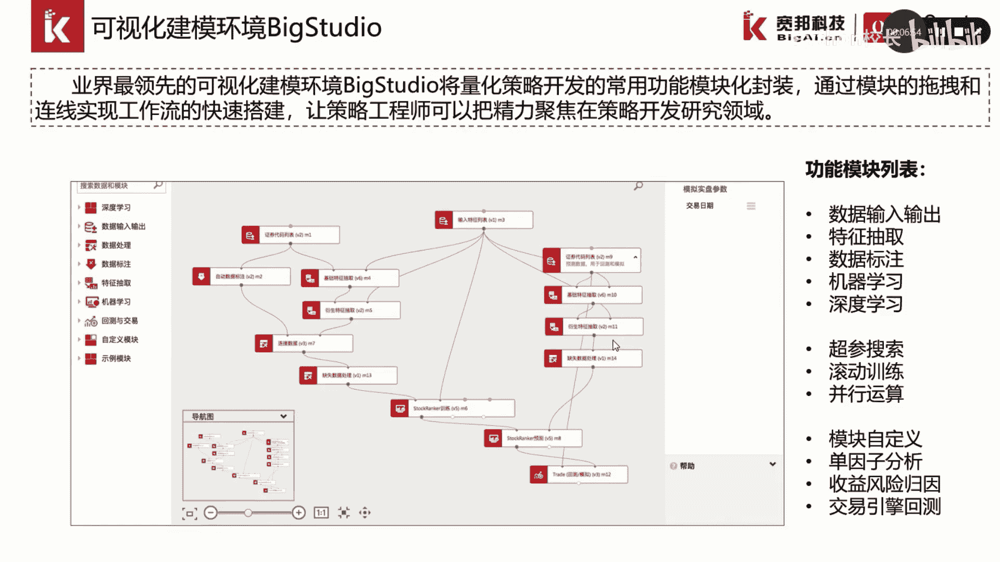

# P10：2.1.1-AI量化平台概览 - 程序大本营 - BV1KL411z7WA

大家好，这一章我们主要介绍一下ai量化平台背个框的，我们主要分四个小节的介绍，首先我们介绍一下传统量化平台到ai，量化平台的一个区别，也就是量化平台的概览。

然后我们介绍一下big quant产品的big studio，可视化编程界面，后面我们会介绍，在可视化编程界面中的可视化模块。

以及如何利用模块创建工作流，第一部分我们介绍一下量化平台概览。

目前市面上有很多的传统量化策略开发平台，例如国外的光头pin以及count start，那么这些平台通常都是开源的，唉这些传统量化策略平台的功能大致趋同，主要是实现策略回测的工具化。

其目的主要是进行策略想法的快速验证，对接的数据以量价数据，基本面数据为主，数据规模并不大，策略开发呢是依赖策略研究员，多年的行业经验以及专业知识，数据的计算主要体现在回测环节，对算力的要求并不大。

随着时间的推移，传统量化开发平台逐渐遇到瓶颈，主要体现在策略开发平台无法替代人脑，处理海量的金融数据，在规律总结探索的过程中，人的脑力并没有得到释放，仅凭借平台的回测功能，是无法提高策略的开发效率的。

我们以传统量化策略的开发流程为例，首先呢，由策略开发人员对我们的金融数据进行观察，并进行归纳总结，得到投资的量化经验，进而编制成程序，预测未来的收益，那在这个过程中，人作为经验和规律的主要归纳者。

其脑力劳动并没有得到充分的解放，我们需要通过ai赋能量化来帮助我们提质增效，来实现海量数据的挖掘和优质策略的开发，那我们通过模型对海量的历史，历史数据进行分析处理。

通过算法帮助我们从中提取出有效的投资模式，构建模型，再利用模型对股票的未来收益进行预测。

这样就实现了一个ai赋能，nas ai在量化投资中，随着大数据，大算力以及算法的发展，逐渐得到了一个应用，我们说量化投资是机器学习的天然应用场景，在量化投资中面临的现实问题主要分下面三类。

简单的走势影响的关键因素无法简单表达，有限的人力资源，无法便利大量的投资模式，以及金融市场中天然存在的海量数据规模，与之匹配的是积极学习对海量数据的一个支持，以及我们可以利用算力。

实现投资模式的便利搜索，通过先进的算法寻找收益和因子之间，复杂的投资模式，可以说量化投资对ai的应用有强烈的需求，并提供了天然的土壤，使得我们可以利用计算机的大算力，对海量的数据进行统计规律的提炼。

这张图对比了传统量化投资和ai，量化投资的一个区别，我们可以看到，从流程上来说，传统量化投资是通过人对数据进行观察分析，经验总结，因子挖掘模型构建并进行参数调优，那么从观察分析总结规律到参数调优。

这个过程，往往需要需要数周到数月的时间来不断优化，优化后呢，我们可能得到一个，挖掘部分投资机会的一个策略，而ai赋能量化投资呢，我们是通过机器学习算法，对海量的大数据进行总结分析，提炼出背后的投资模式。

并且利用计算机的并行计算能力进行参数调优，从而将策略开发的周期从数周到数月缩，缩短至数天甚至数分钟，并且能够发掘出人脑无法发掘出的投资机会。

这里我们要介绍一下我们的bill矿平台，ai作为ai量化策略开发平台，beacon的是全球最大的ai量化开发社区，拥有10万以上的开发者在平台进行开发，策略和研讨，拥有完整的学院教程以及文档说明。

覆盖了从数据研究，ai策略构建和回测，模拟交易以及实盘对接的ai投资全生命周期，贝克矿平台提供了业界最领先的，可视化的建模环境，big studio，通过big studio。

我们将量化策略开发中的常用功能，进行模块化封装，通过模块的拖拽和连线，实现工作流的快速搭建，让策略工程师可以把精力聚焦在策略开发。

