# P100：7-多项式回归实战天猫双十一销量预测（随机梯度下降模型） - 程序大本营 - BV1KL411z7WA

好那么我们继续再来看啊，咱们继续再来看咱们的随机梯度下降，看看咱们的随机梯度下降，也是可以进行创建的啊，现在呢咱们就操作一下好不好。

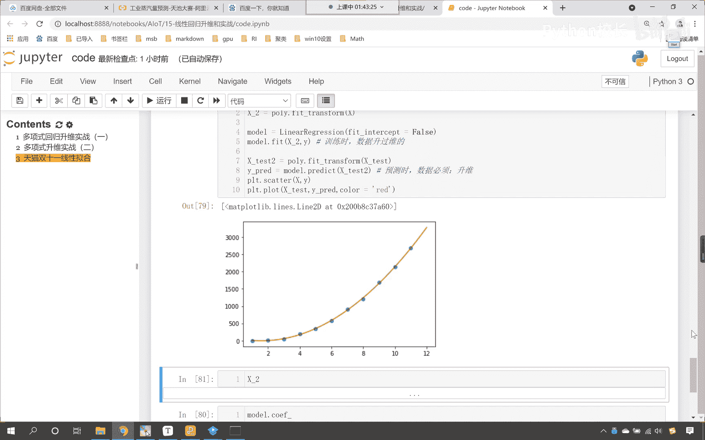

这个刚才咱们使用随机梯度下降的时候，我们操作的时候是不是就出了一些问题呀，我们把这个代码复制一下。

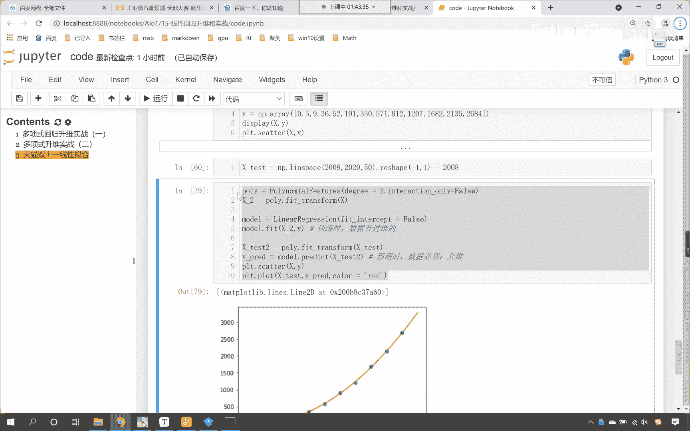

看咱们把这个代码复制一下，咱们粘贴到这儿。

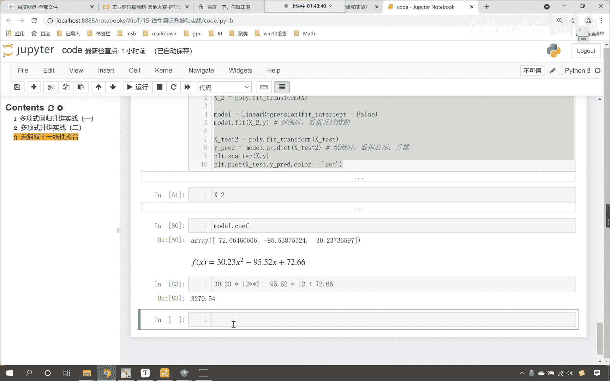

ctrl a ctrl c。

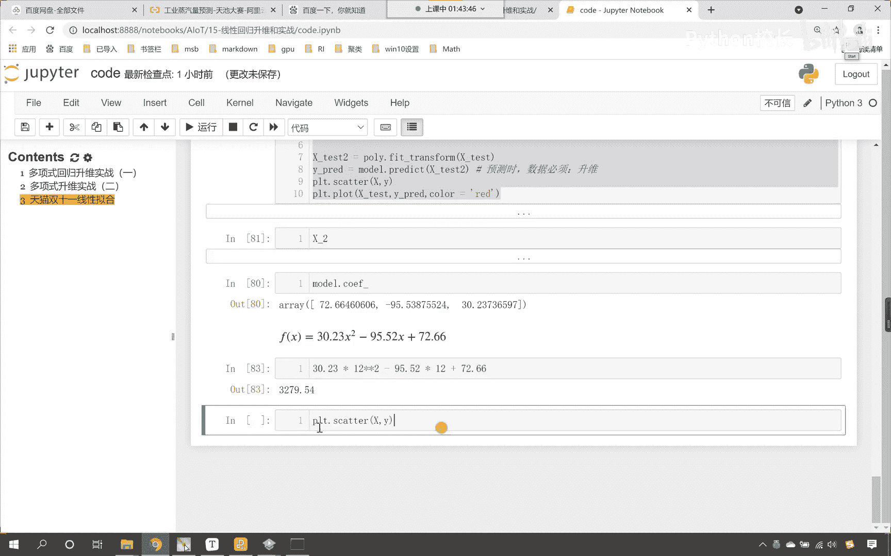

ctrl v粘贴过来，我们把这个依然改成s gd regressor，依然咱们选择这个feat interpreter呢，它等于false，那它依然是一个model。

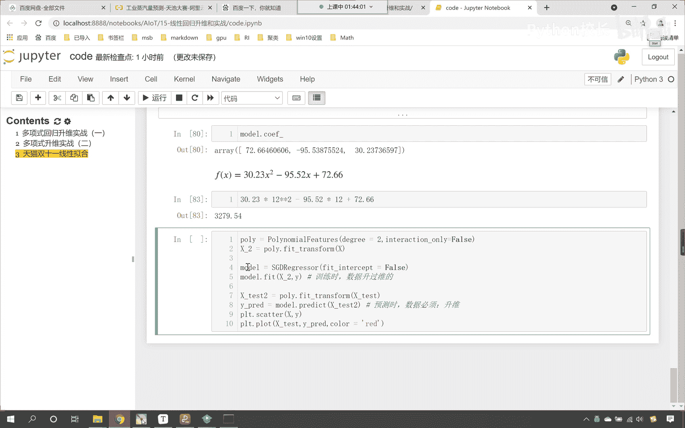

咱们在进行执行的时候，大家就能够发现这个效果是不是并不好呀，看到了吗，这个效果并不好，哎，那这个是为什么呢，咱们如果要使用s g b进行梯度下降的话，那我们需要对数据进行一个归一化处理啊。

咱们需要对数据进行归一化处理，你想你看咱们的x下划线二。

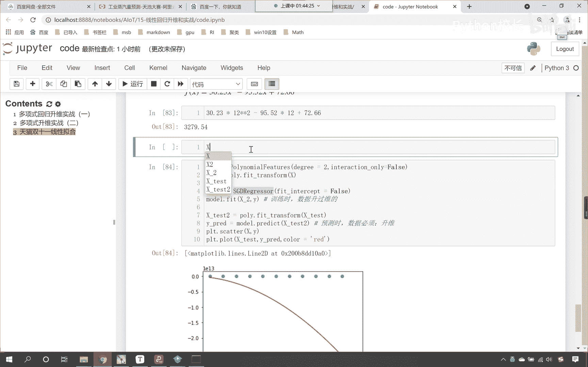

你看这个数据，你看这第一列，第二列，第三列，这个数据差别是不是特别大呀，对不对，看到了吧，这个数据差别是不是很大呀，那数据差别很大，咱们之前学过，如果要不进行归一化处理会怎么样。

因为你的这个数量级不一样，所以说他走的这个速度快慢是不是就不一样呀。

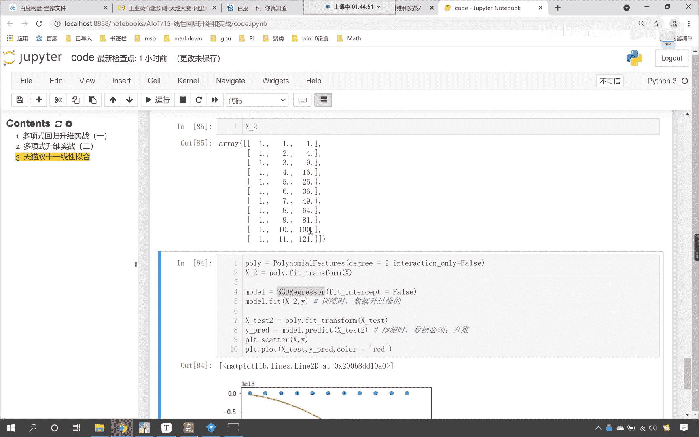

所以说呢咱们对它进行一个归一化啊，往上走，咱们在导包的时候呢，我们多导一个包，from sklearn叫pray processing，咱们导一下，导一个包。

那这个就import standard scale。

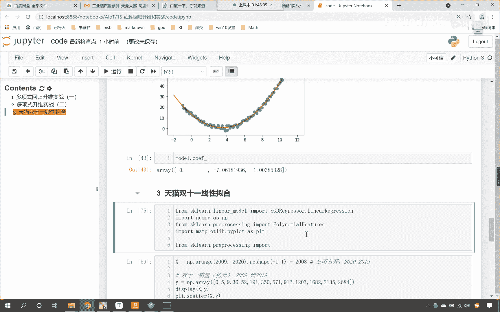

把这个包导进来。

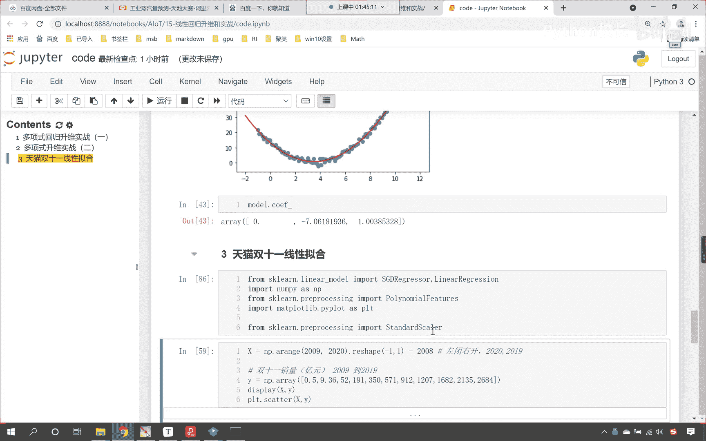

然后呢咱们就使用这个standard了啊，我们对它进行规划，那就是s st r d standard就等于standard的scale，咱们就使用standard的scale。

咱们调用fit transform，咱们将咱们的x2 ，我们对它进行一个规划处理，得到的这个数据呢，咱们就让它叫做x杠二杠nm嗯，这个就说明我们进行了规划，然后呢随机梯度下降声明了之后。

我们所给的数据就是规划之后的数据，看给的数据就是归一化之后的数据，那这个数据进行了归一化，咱们的这个测试数据也进行了升维，升维之后，咱们是不是，同样也得需要进行这个规划的操作呀。

那咱们也来进行一个归化的操作啊，那这个时候呢就是standard的，咱们调用feet transform小括号，咱们将x下划线test 2放进去，得到的这个结果就叫做x下划线test。

二杠nm n o r m，也得需要对它进行一个归一化好，那么归一化之后，咱们的预测数据就变成了x下划线test nb，所以说要对于训练数据进行怎样的处理，咱们呢就必须对于测试数据进行怎样的处理。

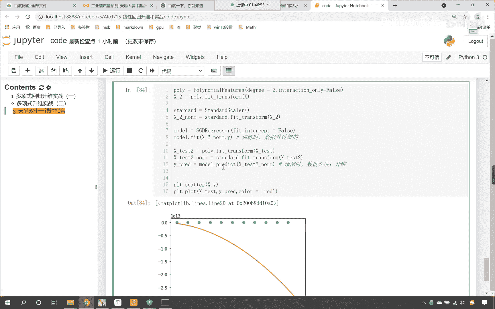

这个时候你看我在执行唉，大家现在就能够看到，你看这个时候是不是就很像了呀。

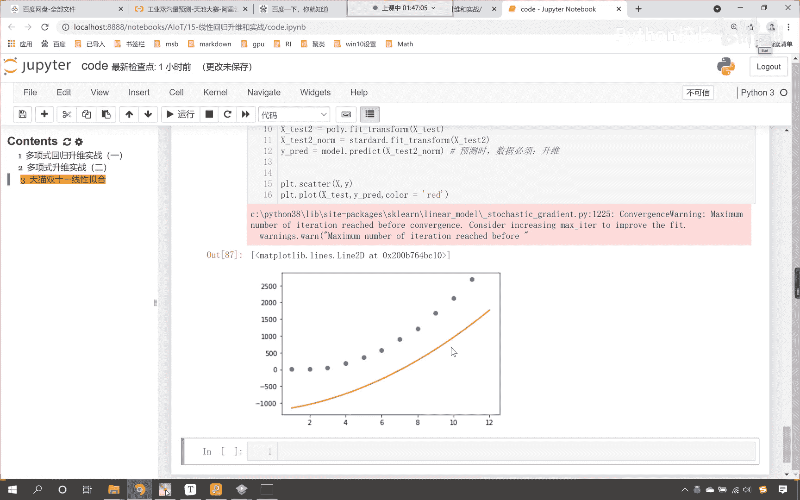

看到了吧，此时是不是就很像了，我们有一个红色的，看到咱们有一个红色的这个嗯，说明红色的说明他告诉我们什么呀，嗯告诉我们这个最大的训练次数还没有达到。

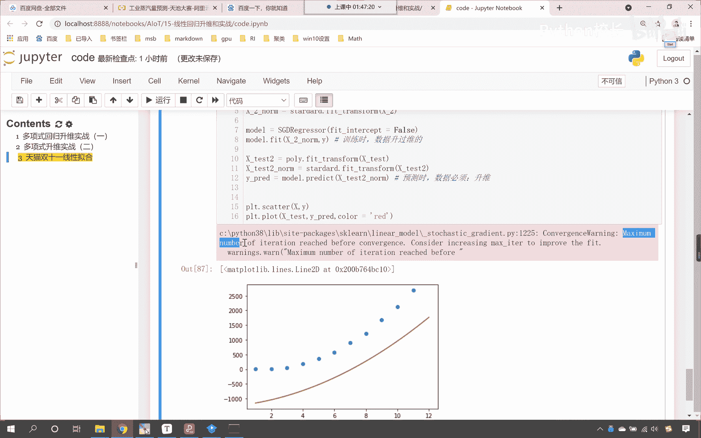

但是咱们是不是就停止了，那我们把咱们的随机梯度下降，把他的max eater咱们给它升到1万次。

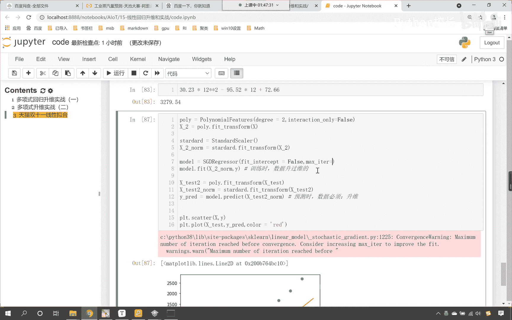

这个时候你看我再来执行，大家看现在是不是就可以得到这样的一个这个，规律和趋势呀，对不对，好，那么我们继续调整它的参数啊，它里边有一个参数叫一塔，这个一塔呢就表示咱们的学习率。

我们把学习率稍微给它调大一些啊，学习率稍微给它调大一些，现在咱们就发现哎你看啊，这个是它的一个呃这个规律是吧，这个这个规律呢求解出来之后，呃，咱们是嗯这样的一个规律，是不是啊。

呃那咱们现在呢就看一下咱们这个数据，咱们在进行操作的时候啊，嗯咱们这个时候这样啊，各位小伙伴就能够看到咱们正态，咱们在进行规划的时候，我们既有fit和transform两个方法。

那我们对于上面的训练数据，咱们是fit transform，那咱们下面的这个测试数据呢，咱们就让它在原来数据的基础上进行一个转换，这个时候你看我再来执行，唉大家现在就能够看到效果，是不是依然不是很好。

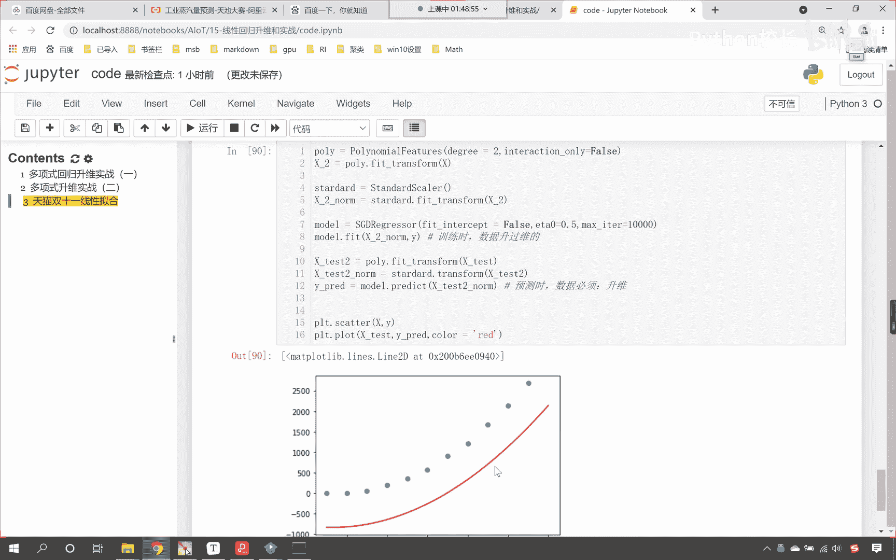

那么我们degree呢咱们给它升为啊，升到三维唉，这个时候嗯，咱们再来看看咱们的这个这个效果啊，还是不是很好是吧，那我们这个feat intercept把这个参数去掉执行诶。

大家现在就能够看到咱们的随机梯度下降，我们在给定这个参数的时候，咱们是不是也很好的，把天猫双11他历年的销量数据，是不是也给它拟合出来的呀，嗯好那么这个呢就是咱们随机梯度下降，我们必须要做的。

其实呢这个标准化这是吧，你加上它也可以，你看啊，咱们加上它啊，再来执行，你看是不是也差不多呀，看到了吧，是不是也差不多看到了吧，也可以啊，就是我们在进行标准化的时候，这个不是standard的吗。

啊这个叫标准化，那我们标准化，你想咱们是进行了怎样的一个这个操作呢，我们是不是让它减去平均值，然后再除以一个标准差呀，那这个时候呢它就有一个基准啊，这个时候就有一个基准。

因为我们的数据咱们用的是训练数据，x2 x2 的数据长什么样呢，你就能够看到你看咱们的x2 这个数据啊。

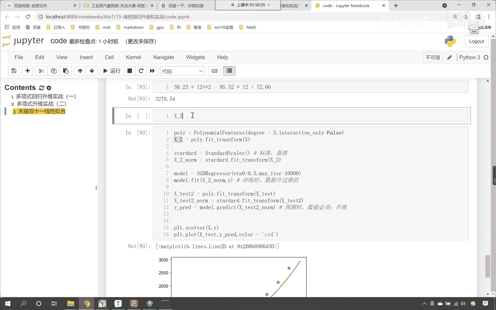

x2 的数据是不是从一一直到11呀，而我们的然而咱们的x下划线test 2呢。

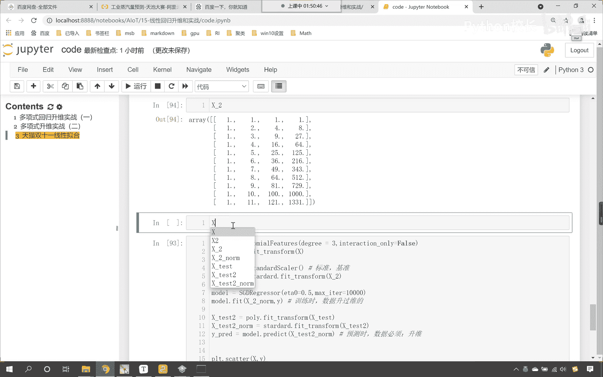

你看它的数据是从哪儿到哪儿，你看它的数据是不是到12啊，各位小伙伴能够看到他的数据是不是到12。

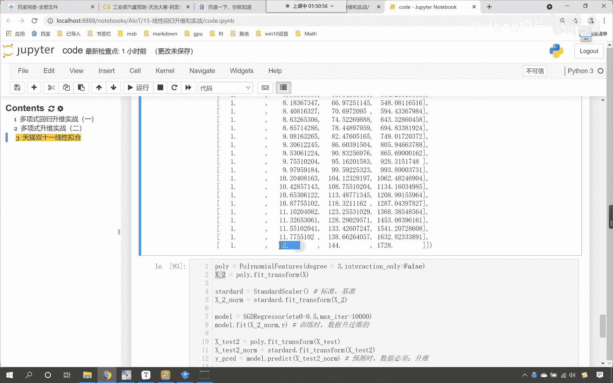

上面，这个数据到哪儿，是不是到11，所以说这就有一点点的这个差距，那我们如果说想要让他俩进行统一。

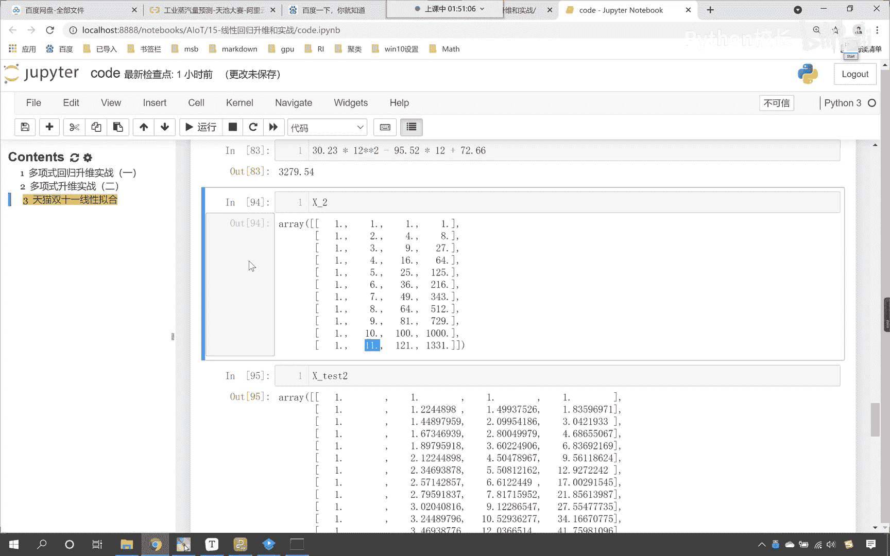

咱们可以怎么样呀，咱们在创建x test的时候，咱们就不要让他到2020了，我们让它多少到多少到2019执行，看让他到2019，因为lin space和咱们上边arrange，这两个方法是不一样的。

orange这个方法它是左臂右开lspace，这个方法它呢是左臂右臂啊，它是左臂右臂，也就是说它可以取到啊，它可以取到咱们右边的数据，所以说这就是一点点区别啊，它呢是左臂，右臂就是左边能取到。

右边也能取到，所以说呢我们创建的x和x test它的范围不同。

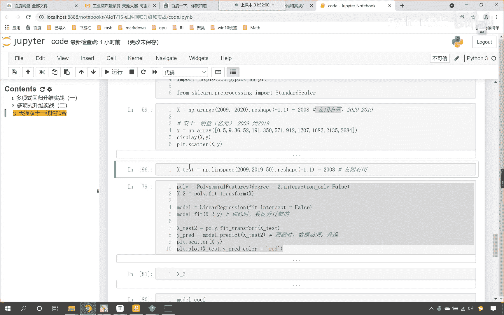

这就导致了咱们在进行这个数据转换的时候。

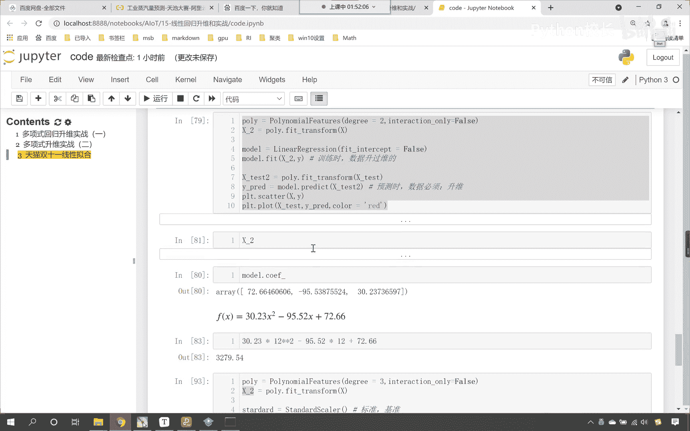

如果说你的数据不一样是吧，如果说这个数据不一样，那么你在进行fit transform的时候，就要小心看看哪个数据是基准，现在呢你看现在咱们继续使用fit transform，这个时候呢。

你看我一运行是不是也能够很好的拟合呀。

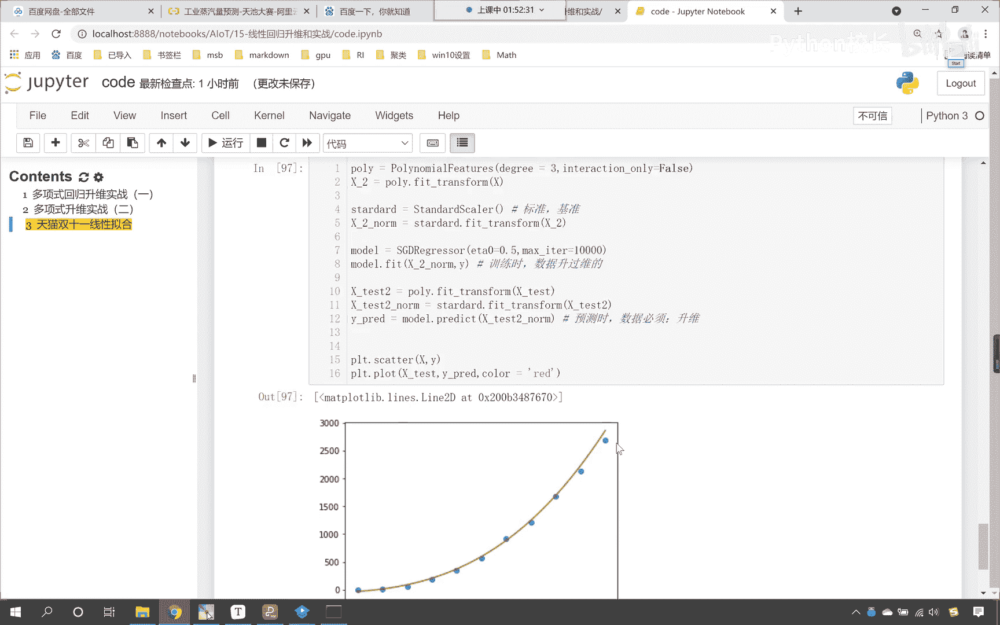

因为我把上面的x test范围修改了，修改之后我的范围也是从一到11，而x2 也是从一到11。

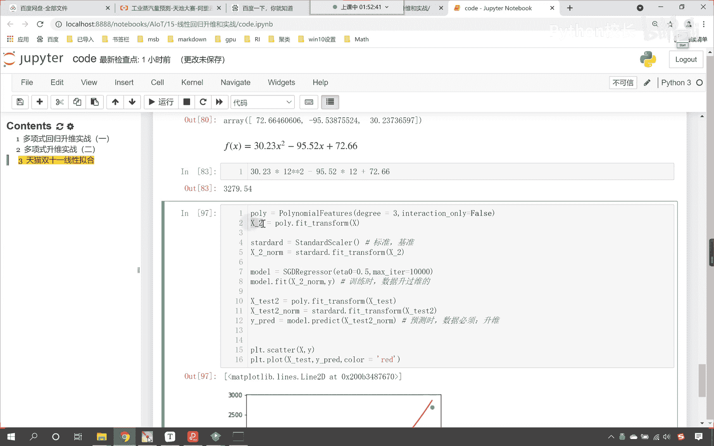

这个时候你用fit transform，下面也用fit transform，或者说用transform都一样，看到了吧，都一样，知道吗，用哪个都一样，但是如果说这个x2 当中的数据范围。

和咱们x test 2当中的数据范围不一样的时候，那你就得选择以某一个为基准来进行操作。

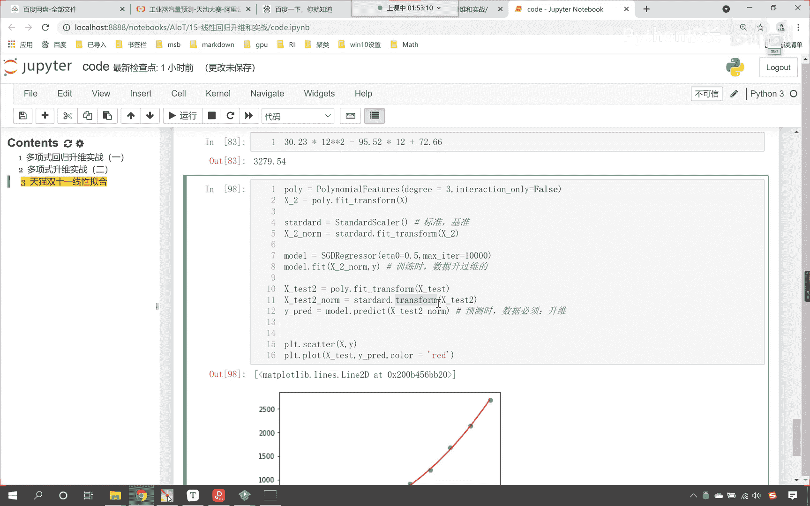

嗯知道了吗，看所以说呢嗯终归结底还是line space，和咱们arrange这个方法，它呢稍微有点不一样。

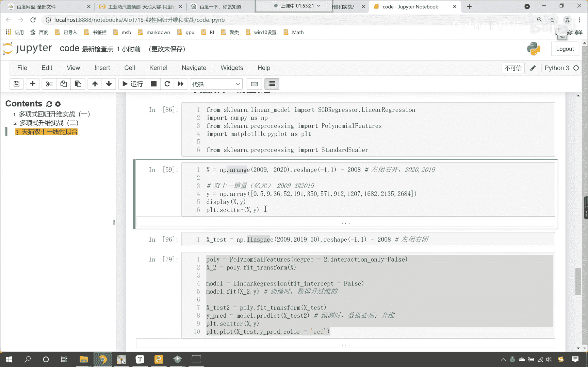

所以说我们在进行操作的时候，也稍微有点儿不一样好，那么各位小伙伴现在就能够看到，无论我们使用线性回归也好，还是使用咱们随机梯度下降也好，咱们都能够拟合出来，这样的一条曲线，条条大路通罗马，是不是。

所以说都一样啊，都可以啊。

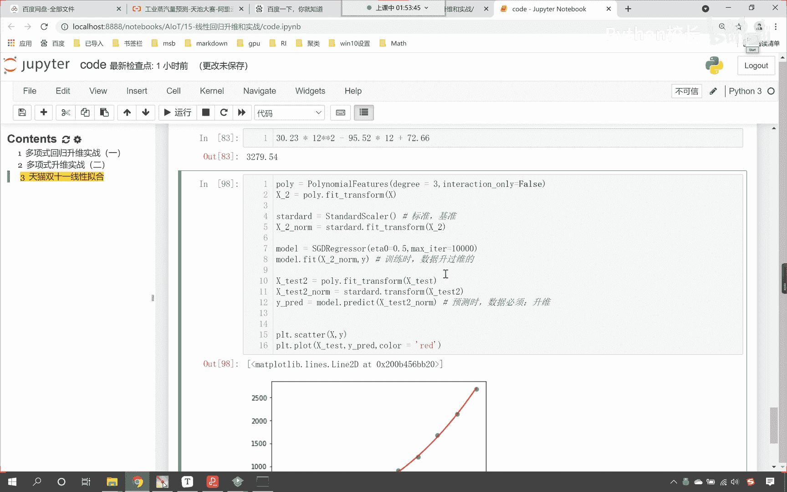