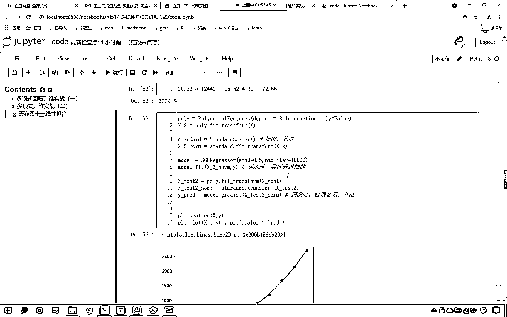

# 7天爆肝整理！AI量化交易-机器学习全套教程，从入门到项目实战保姆级教程！（数据挖掘分析／大数据／可视化／投资／金融／股票／算法） - P100：7-多项式回归实战天猫双十一销量预测（随机梯度下降模型） - Python校长 - BV1KL411z7WA

好 那么我们继续再来看啊，咱们继续再来看，咱们的随机梯度下降，看咱们的随机梯度下降，也是可以进行创建的啊，现在呢，咱们就操作一下好不好，这个刚才咱们使用随机梯度下降的时候。

我们操作的时候是不是就出了一些问题啊，我们把这个代码复制一下，看咱们把这个代码复制一下，咱们粘贴到这，Ctrl A， Ctrl C，Ctrl V粘贴过来，我们把这个依然改成SGD。

Regressor依然咱们选择这个fit interpreter，它等于false，那它依然是一个model，咱们在进行执行的时候，大家就能够发现这个效果是不是并不好呀，看到了吧这个效果并不好。

那这个是为什么呢，咱们如果要使用SGD进行梯度下降的话，那我们需要对数据进行一个规一化处理，咱们需要对数据进行规一化处理，你想，你看咱们的X下环线2，你看这个数据，你看这第一列第二列第三列。

这个数据差别是不是特别大呀，对不对看到了吧，这个数据差别是不是很大呀，那数据差别很大，咱们之前学过，如果要不进行规一化处理会怎么样，因为你的这个数量级不一样，所以说它走的这个速度快慢是不是就不一样呀。

所以说呢咱们对它进行一个规一化啊，往上走，咱们在导包的时候呢，我们多导一个包from sklearn，叫preprocessing，咱们导一下导一个包，那这个就import。

standard sklearn，把这个包导进来，然后呢咱们就使用这个，standard，我们对它进行规一化，那就是STARD，standard就等于standard sklearn。

咱们就使用standard sklearn，咱们调用fit transform，咱们将咱们的X2，我们对它进行一个规一化处理，得到的这个数据呢，咱们就让它叫做X2-num，这个就说明我们进行了规一化。

然后呢随机梯度下降，声明了之后，我们所给的数据就是规一化之后的数据，给的数据就是规一化之后的数据，那这个数据进行了规一化，咱们的测试数据也进行了升维，升维之后，咱们是不是同样也得需要进行规一化的操作。

那咱们也来进行一个规一化的操作，那这个时候呢就是standard，咱们调用fit transform小括号，咱们将X下滑线test2放进去，得到的这个结果就叫做X下滑线test2-num。

也得需要对它进行一个规一化，那么规一化之后咱们的预测数据，就变成了X下滑线test-num，所以说要对于训练数据进行怎样的处理，咱们就必须对于测试数据进行怎样的处理，这个时候你看我在执行。

大家现在就能够看到，你看这个时候是不是就很像了呀，看到了吧此时是不是就很像了，我们有一个红色的，看到了咱们有一个红色的说明，红色的说明它告诉我们什么呀，告诉我们最大的训练次数还没有达到。

但是咱们是不是就停止了呀，那我们把咱们的随机梯度下降，把它的maxEta咱们给它升到1万次，这个时候你看我再来执行，大家看现在是不是就可以得到这样的一个规律和趋势呀，对不对好那么我们继续调整它的参数啊。

它里边有一个参数叫eta，这个eta就表示咱们的学习率，我们把学习率稍微给它调大一些，学习率稍微给它调大一些，现在咱们就发现，哎你看这个是它的一个这个规律是吧，这个这个规律呢求解出来之后。

咱们是这样的一个规律是不是，那咱们现在呢就看一下咱们这个数据，咱们在进行操作的时候啊，咱们这个时候这样啊，各位小伙伴就能够看到，咱们正在咱们在进行规划的时候，我们既有fit和transform两个方法。

那我们对于上面的训练数据，咱们是fit transform，那咱们下面的这个测试数据呢，咱们就让它在原来数据的基础上进行一个转换，这个时候你看我再来执行，哎大家现在就能够看到，效果是不是依然不是很好。

那么我们degrade呢咱们给它升为啊升到三维，哎这个时候咱们再来看看咱们的这个这个效果啊，还是不是很好是吧，那我们这个fit intercept把这个参数去掉执行，哎大家现在就能够看到。

咱们的随机t2下降，我们在给定这个参数的时候，咱们是不是也很好的把天猫双11，它历年的这个销量数据是不是也给它拟合出来的呀，好那么这个呢就是咱们随机t2下降，我们必须要做的其实呢这个标准化这是吧。

你加上它也可以，你看咱们加上它啊再来执行，你看是不是也差不多呀，看到了吧是不是也差不多，看到了吧也可以啊，就是我们在进行标准化的时候，这个不是standard吗，啊这个叫标准化，那我们标准化。

你想咱们是进行了怎样的一个这个操作呢，我们是不是让它减去平均值，然后再除以一个标准差呀，那这个时候呢它就有一个基准，这个时候就有一个基准，因为我们的数据咱们用的是训练数据x2，x2的数据长什么样呢。

你就能够看到你看咱们的x2这个数据啊，x2的数据是不是从1一直到11呀，而我们的，而咱们的x下滑线test2呢，你看它的数据是从哪到哪，你看它的数据是不是到12啊。

各位小伙伴能够看到它的数据是不是到12，上面这个数据到哪是不是到11，所以说这就有一点点的这个差距，那我们如果说想要让它俩进行统一，咱们可以怎么样呀，咱们在创建xtest的时候。

咱们就不要让它到2020了，我们让它多到多少到2019，执行让它到2019，因为line space和咱们上面orange，这两个方法是不一样的，orange这个方法它是左避右开。

line space这个方法它呢是左避右避，它是左避右避，也就是说它可以取到，它可以取到咱们右边的数据，所以说这就是一点点区别，它呢是左避右避，就是左边能取到右边也能取到，所以说呢。

我们创建的x和xtest它的范围不同，这就导致了咱们在进行这个数据转换的时候，如果说你的数据不一样，是吧，如果说这个数据不一样，那么你在进行fit transform的时候就要小心，看看哪个数据是基准。

现在呢，你看现在咱们继续使用fit transform，这个时候呢，你看我一运行，是不是也能够很好的拟合呀，因为我把上面的xtest的范围修改了，修改之后，我的范围也是从1~11，而x2也是从1~11。

这个时候你用fit transform，下面也用fit transform，或者说用transform，都一样看到了吧，都一样知道吗，用哪个都一样，但是如果说这个x2当中的数据范围。

和咱们xtest2当中的数据范围不一样的时候，那你就得选择以某一个为基准，来进行操作，知道了吗，看所以说呢，终归结底还是line space和咱们arrange这个方法，它呢稍微有点不一样。

所以说我们在进行操作的时候，也稍微有点不一样，好，那么各位小伙伴现在就能够看到，无论我们使用线性回归也好，还是使用咱们随机梯度下降也好，咱们都能够拟合出来这样的一条曲线，条条大路通罗马，是不是。

所以说都一样都可以啊。

调整相应的参数，咱们就可以了。