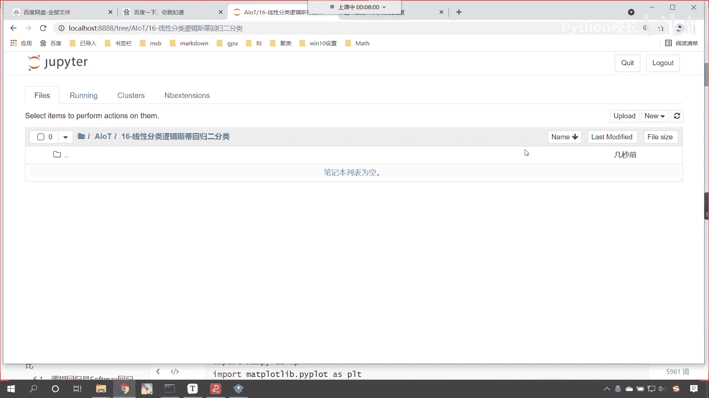
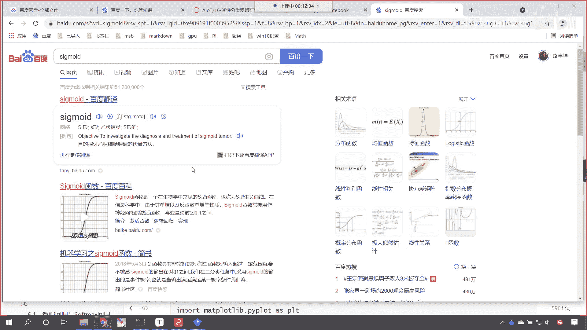

# P102：1-逻辑回归介绍 - 程序大本营 - BV1KL411z7WA

课程，那咱们今天呢啊咱们要看一下这个逻辑回归，咱们的线性分类呢，就对应着我们的逻辑斯蒂回归好，那么这个逻辑斯蒂回归到底是什么呢，嗯咱们看一下这个什么是逻辑斯蒂回归，他的名字。

大家看是不是叫做逻辑斯蒂回归呀，虽然它的名字叫罗逻辑斯蒂回归，但是呢它不是一个回归算法，逻辑斯蒂回归呢是一个分类算法，现在呢咱们回到代码当中啊，今天的这个文件夹我已经创建好了，就是16杠线性分类。

逻辑斯蒂回归，今天呢我们讲一下二分类，进入这个当中呢。

咱们创建一个代码文件，给这个代码文件呢呃改一下名字。

那我们今天所讲的算法它在哪个包下面呢，i from sk learn，点里边呢有一个linear model，咱们从当中呢导入logistic regression，现在我导包导进来的这个东西。

你看它的英文是不是叫做logistic regression呀，这个就是逻辑斯蒂回归，那大家能够发现咱们这个算法，它隶属于哪个包呀，看这个算法是不是在linear model当中呀。

这个linear model是不是就是咱们的线性模块呀，对不对，这也是为什么咱们这个算法你看我们叫什么呀，是不是叫做线性分类呀，那么这个名字它虽然叫啊，这个名字它虽然叫做回归是吧，它叫做逻辑回归。

但是它的作用看它，但是它的作用呢是用于分类，那这个里边儿咱们嗯就要区分一下，这什么是分类，什么是回归呢，之前咱们讲了线性回归，对不对呀，那线性回归它的作用是什么呢，是不是你和一个方程。

用这个方程咱们去预测趋势，对不对，就是你是这个曲线是怎样的一个走势，对不对，所以说回归它的作用呢就是为了预测趋势好，那么什么是分类啊，分类这个你看男女是不是类别不同呀，看到了男女类别不同，咱们的苹果嗯。

咱们的香蕉，你看这个是不是也是水果的种类不同呀，看到了吗，这个也是种类不同，那你像这种任务就是把类别咱们给它分开，那这种呢就是分类，现在你明白什么是分类，什么是回归了吧，来明白分类和回归的。

咱们呢在我们的讨论区，咱们扣一个一好不好，如果要不明白的话，你把疑问说出来，咱们呢再次进行解释，这就是分类和回归，之前咱们讲的那好几节课，我们讲的都是线性回归，咱们的天池工业蒸汽量预测。

咱们那个任务呢它就是回归，那咱们看一下咱们的逻辑回归，那这呢也举了一个说明，就好比卡巴斯基是吧，他不是司机，红烧狮子头，没有狮子头，这个是一样的啊，我们不能因为名字带了一个回归是吧。

就限定了这个算法必须得用于回归，那为什么逻辑回归不叫逻辑分类呢是吧，现在这个问题出来了，因为呢，咱们逻辑回归算法是基于多元线性回归的算法，我们导包的时候咱们就能够看到这个特点。

咱们这个算法它是不是在线性模块下呀对吧，正因为如此，逻辑回归这个分类算法它是线性的分类器，未来呢后面我们还要学习，基于决策树的一系列算法，基于神经网络的算法等等，那些呢都是非线性的算法。

咱们支持向量机呢本质也是线性的，这些算法我们后面都要进行介绍，那么逻辑回归当中呢，对应着一条非常重要的曲线，这个曲线呢叫s型曲线，它所对应的函数叫sigmoid，sigmoid，你去百度上一搜。

你就能够搜到sigmoid它所对应的这个函数啊，给各位演示一下啊，来咱们回到这儿，那我们就进入进入这，咱们就搜一下叫西格mod，你看我一回车，现在你就能够发现是不是就有百度百科呀。

点击进入百度百科。

在这里你就能够看到，那sigmoid的这个函数长什么样呢，各位小伙伴你就能够看到了，这个就是咱们sigmoid的函数的定义，你要注意这个e是吧，是咱们的自然底数，这是不是给了一个负x呀。

我们就把这个函数叫做sigmoid函数，那这个函数有一个什么样的特征呢，这个函数它的导数可以用它自身来表示，看到了吧，导数可以用自身来进行表示，这个就是它的一个非常好的一个特点，那么这个曲线长什么样呢。

你看这个曲线就长咱们下面看到的这个样子啊，这就是这条曲线，那这条曲线有什么样的特点呢是吧，你观察一下啊，看到这看到这幅曲线，你观察一下这条曲线有什么样的特点，是不是s型的呀，除了s型还有什么特点呢。

唉我现在把这个问题发出去了，你呢现在思考一下，那咱们现在呢再回来啊，嗯再回到咱们的代码当中，咱们一会儿讲解的过程当中呢，哎我们进行一个嗯进行一个这个说明好，那么我们有小伙伴说了，有中心对称是吧。

除了中心对称之外，它还有其他的这个特征，哎我们又有小伙伴说了，那y的这个值是0~1之间，是不是0~1之间呢，你看这个就可以当成概率问题，你看这个就可以当成概率问题。

你想一下咱们是不是有一个嗯这个逻辑回归，它的作用是不是用于分类啊，对不对，那既然是分类，咱们怎么分才公平呢，现在你就能够看到，那么在我画的这条红色的线，它的上面它的数值是不是从0。5到一呀，看到了吗。

咱们画的上面它的值呢是不是从0。5到一呀，那我们的这个下面呢，你看这个值是从多从多少的，是不是从0~0点五呀，那如果要是上面那个范围是吧，咱们就可以认为它是一种类别，如果说你要是在下面。

那么我们认为它是另外一种类别，唉所以说在这儿呢咱们进行一个说明啊，上面它呢是概率是0。5到咱们的一点，好那咱们的下面呢看下面这个，那他呢是从零到咱们的0。5，唉，那这个时候呢上面是一种类别。

你看上面是一种类别，下面也是另一种类别，所以说我们在进行分类的时候，咱们就可以通过这个概率来进行类别的划分，你知道咱们人对于类别的划分，其实我们大脑当中都有一个复杂的计算，然后呢我们进行判断是吧。

这个是个男的还是个女的，比如说你在大，你走在北京的大街上是吧，看到一个长发飘飘的是吧，啊这个穿着特别漂亮的一个一个人走过来是吧，那你的感觉是不是是不是就会认为更趋向于说，向你走过来，这个人是吧。

他是不是就是一个女士呀，对不对，因为啥，因为你看到它的相应特征了，是不是长发飘飘，是不是，然后这个眉毛眼睛是不是又特别的秀气，对不对啊，看衣服，看裤子是不是，那假设说你要在泰国呢。

你在泰国的一个小酒吧看到了一个人，是不是这个人呢也是长发飘飘是吧，这个人呢还对你挤眉弄眼的，那请问这个人是男的还是女的，这个时候你就不能确定了，是不是，因为泰国酒吧里边的人妖是不是特别多呀，对不对。

很可能他做了相应的手术，是不是它看起来像女的，但有可能是人妖，是不是，所以说这个时候你的判断就会失效，那我们是根据什么样的特征来判断，他是男的还是女的呀，咱们是不是有有一定的这个规则呀，是不是啊。

我们根据从人群当中是吧，得到了这么多的这个男男女女的这些特征，我们进行了总结，是不是哎我们大部分情况下，我们会说这个长头发的，是不是啊，然后她呢就属于是女性，唉你想是不是，那你想你看你之所以在泰国。

咱们刚才举的那个例子，你给判断错了嗯，是说明什么问题呢，是不是一个概率问题啊，对不对，你看着它特别像，但是呢它有可能不是这个就是你的大脑，你的这台精密的仪器在进行判断的时候是吧，根据它的特征进行判断。

那就出错了，所以这个时候呢你可能心里会犯嘀咕是吧，这个到底是男的还是女的，有的时候你在你走在大街上，你可能会看到一个中性的人，你看我们把它叫做中性的人，什么是中性的人呢，哎就是它的区别度不大。

就这个时候呢，我也分不清他到底是男的还是女的是吧，他一说话你有可能就识别出来了，但是他如果要不说话是吧，那有可能你就区别区别不出来，这个确实存在这样的这个呃，同志啊，好，那么大家知道了概率。

我们是不是很多时候都可以通过概率，来进行类别的划分呀，计算机你想一下，它又不长眼睛，它又没有思想，它又不能进行相应的这个啊，这个通过看观察特征来进行类别的划分，那它是通过什么样的计算。

来对于我们的数据进行类别划分呀，它就是通过概率是吧，咱们呢就通过概率是吧来进行类别的划分，所以说大学当中所学到的这个概率论，是不是这个是非常有用的啊，这个有一个经济学家就说了，咱们现在所应用的机器学习。

深度学习其实呢都是数学加概率论的一个应用，好那么咱们现在呢来回来啊，好那么这个函数呢大家看它有这样的一个特征，是不是它的导数可以用它自身来表示，那这个函数其实很简单，sigmoid的函数就是1÷1。

加上np。e x p负x，现在咱们把这个图给各位小伙伴画一下啊，回到咱们的代码当中，咱们呢来操作一下，我让你来看一下，现在呢咱们来一个三级标题，这个呢就是四个贸易的函数好，那么我们呢就导一下包。

咱们呢就import numpy as np画图工具，咱们导进来，matt plot lib piplot，起个别名as plt，然后呢咱们就定义一个方法叫d e f c mode。

这个里边给一个参数x我们给一个冒号，那我们进行什么样的计算呢，return那根据咱们这个公式，分子上是不是一呀，然后除以小括号是分母，是不是一加上e e的多少次幂，是不是就是np。e x p。

小括号是不是给一个负x呀，对不对，你看是不是就是这个方程，对不对，那我把这个sigmoid函数的方程，给各位也显示一下啊，把它转换成mark down，咱们来一个dollar dollar，是不是啊。

那这个时候咱们的sigmoid就等于反斜杠，frank花括号是吧，分子上是一再给一个分母，分母上呢是一加上e的嗯，这个花括号给一个负x唉，这个时候你看我一执行诶。

大家看这个是不是咱们的sigma的函数呀，这个sigmoid函数，咱们可以把字体给它调大一些啊，font来一个size，我们让它是六来一个尖括号，然后后这个字体，那我们是前后对应的，前面有一个phd。

后面也就有一个phd，你看这个是不是就是咱们的sigma的函数好，那么我们把这个函数写出来了，咱们现在呢就给一个x x就等于np。lin space，我们给它一个范围，咱们从-五到正午。

咱把它分成100份，有了x了，咱们是不是就可以根据sigmoid的这个函数，来计算一下它的y值呀，对不对，那这个y就等于咱们sigmoid的x，现在呢咱们把这个图形画出来，p t。plot。

我们将横坐标放进去，纵坐标y放进去，然后呢咱们给它一个颜色，给一个color，我们这个卡我们让这个color等于green，这个时候你看过一执行，大家现在就能够看到一条完美的s型曲线。

是不是就绘制出来了，现在你能够看到它的最小值是不是零，它的最大值是不是一点呀，对不对，唉所以说sigmoid是不是很简单，唉大家不要看sigma的这个函数简单，它在应用的时候，它的功能是非常强大的啊。

咱们现在所学的这个逻辑斯蒂回归在工业界，在应用界，他有这样的一个这个称呼，你看叫做一招一招逻辑思地打天下，啥意思呢，它可以解决很多问题，就是很多公司当中我们要进行机器学习，咱们要进行分类了。

那我们优先使用什么样的方式呢，哎优先使用逻辑思d就可以了，所以说你看他有这样的一个这个这个美称是吧，叫一招逻辑思力打天下，可见这个算法看它的强大，是不是啊，这个就是咱们这个呃逻辑斯蒂回归。

