# P103：2-Sigmoid函数介绍 - 程序大本营 - BV1KL411z7WA

来咱们回到这儿啊。

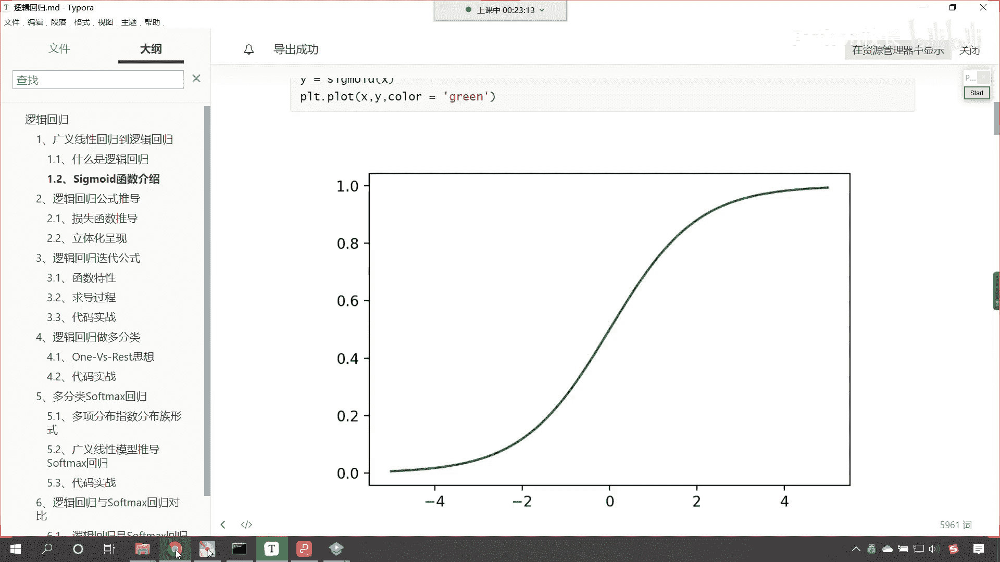

好这个呢我们修改一下啊，可见这个算法的强大。

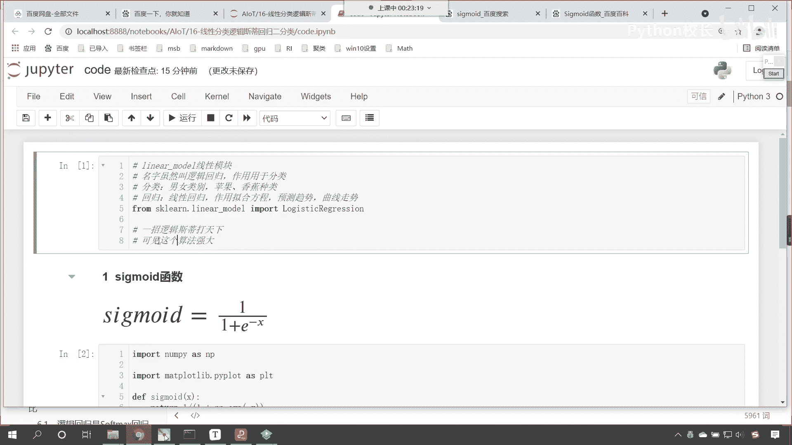

来咱们回来，我们继续往下看，那么接下来呢我们就介绍一下，逻辑斯蒂回归当中sigmoid的函数。

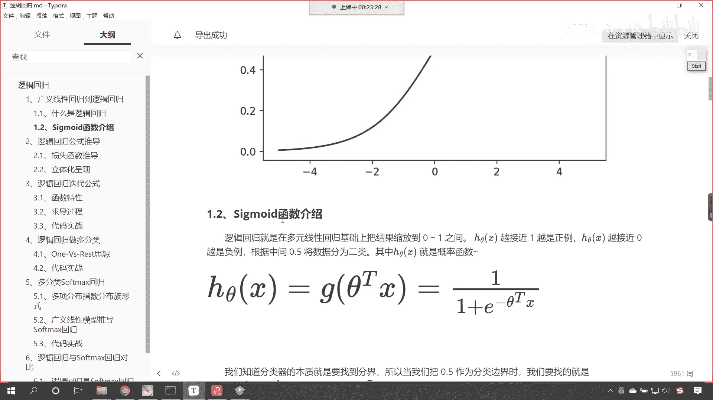

我们对它进行一个详细的介绍，逻辑斯蒂回归就是在多元线性回归的基础上，咱把结果缩小到0~1之间，在这个当中，各位小伙伴就能够看到一个h c塔x，那这个h c塔x，是对于咱们这个方程的一个描述。

那它是对于这个方程的一个描述，其实这个方程你换成其他的名字，是不是也一样呀，对不对，好，那么我们知道sigmoid的函数，就这个函数它有一个作用，它可以将数据是不是变到0~1之间呀。

既然变到0~1之间了，那么咱们是不是，就可以通过概率来进行类别的划分呀，对不对，哎这就是他巧妙连贯的地方啊，咱们呢就根据概率来进行划分类别，那么h theta呢越接近于一，它呢就属于是正立。

正立呢就是咱们一种类别，h c塔越接近于零，咱们认为呢它就是复利，这个复力呢就是另外的一个类别，中间0。5呢，咱们将数据呢分为两类，那我们可以认为呢，这个0。5呢属于是它的划分临界点。

其中呢h c塔x就是hc塔x，就是咱们的概率函数啊，这个就是概率函数好，那么各位小伙伴你就能够看到，你看我们在进行描述的时候是吧，咱们首先是一个h c塔x，然后呢又来了一个g c a t x。

那么你看到这儿熟悉不熟悉，咱们之前在讲线性回归的时候，那么我们说了这个theta tx它代表什么呀，这个c塔tx，你想一下，它是不是就是咱们的线性回归的方程呀，看到了它呢就是线性回归的方程，对不对。

这个就是线性回归方程，那既然是线性回归，你想这个值是不是可能很大，这个值是不是也可能很小呀对吧，那我们进行分类，这个线性回归它是没有办法解决的，怎么办呢，咱把这个c塔tx把它当成一个整体。

那把它当成一个整体，那这个呢就是咱们的多元线性，这个就是咱们多元线性的这个方程，那这个整体看啊，这个多元线性回归这个整体，咱把它放到哪里了呢，现在你就能够看到，我们是不是就把它放到了咱们sigmoid。

是不是就把它当成了咱们的负x呀，对不对，注意啊，它是一个整体，那有了这样的一个转变，我们是不是就可以把它转换成概率了，对不对，我不管你原来的线性回归，这个值多大还是多小是吧，无所谓。

你原来的值是1万也好是吧，是-200也好，只要经过这样的一个转换，那么你想最后是不是同它就变成了概率啊，这个概率呢就是在0~1之间，变成了0~1之间，那咱们是不是就可以进行类别的划分了。

所以说你看咱们的逻辑4d回归是吧，它的概率函数它的构建是不是非常的巧妙呀，对不对，你看这就是数学家是吧，不知道他的大脑是哪个地方开窍了是吧，他就找见了这样的方法，然后呢方便我们现在的人的使用好。

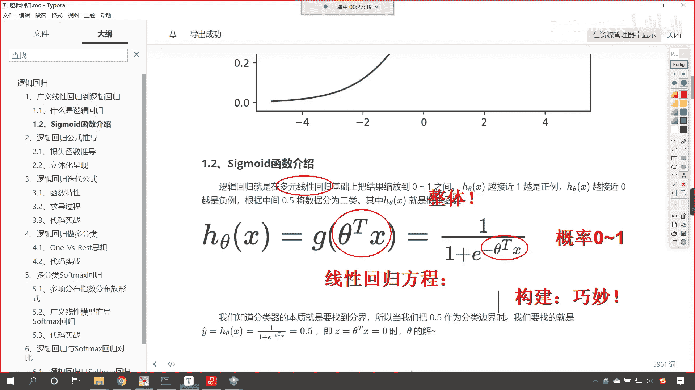

那么这个是方程的一个介绍，那我们知道分类器的本质就是找到边界，你看我们把它叫做分类器，我们把这个也叫做机器学习的算法，你看我们人，看咱们人，是不是可以进行各种类别的一个划分呀，对不对。

哎我们认为这个植物是吧，属于什么这个动物属于什么，对不对，那我们其实呢在大脑当中就有一个边界是吧，那你大于这个边界，我们把它划归到一种类别，小于这个边界，咱们呢把它划归到另一种类别。

那在咱们逻辑斯蒂回归当中，咱们呢可以把0。5作为咱们的分类边界，那我们要找的就是看咱们要要找的就是谁呢，这个你看y上面是不是带一个帽子，那这个方程怎么理解，看这个方程怎么理解，y上面带一个帽子。

这个是不是就是咱们的预测值呀，看到了吧，这个就是咱们的看这个就是咱们的预测值，那你看这个预测值是不是，就是咱们的hc的这个h theta，咱们上面介绍了这个是不是一个概率啊，对不对，这就是一个概率。

因为我们是进行类别的划分，咱们其实就是通过概率的大小来嗯，来对它进行分类嘛是吧，然后呢就是一加上e的负c塔，tx分之1=0。5，也就是说当我们的这个数值等于0。5的时候，你想它是不是咱们的这个边界呀。

对不对啊，咱们这个时候就定了，咱们这个z呢就等于c a t x，也就是说它等于零的时候，咱们c它的解，那为什么这个要等于零呢，因为你想如果它等于零，看这个值如果等于零，我们把这个值带到咱们方程当中。

看到了吧，把它带到方程当中会怎么样，我们自然底数e它的零次幂是不是等于一呀，是吧，1+1是不是等于1/22，是不是就等于0。5，对不对。

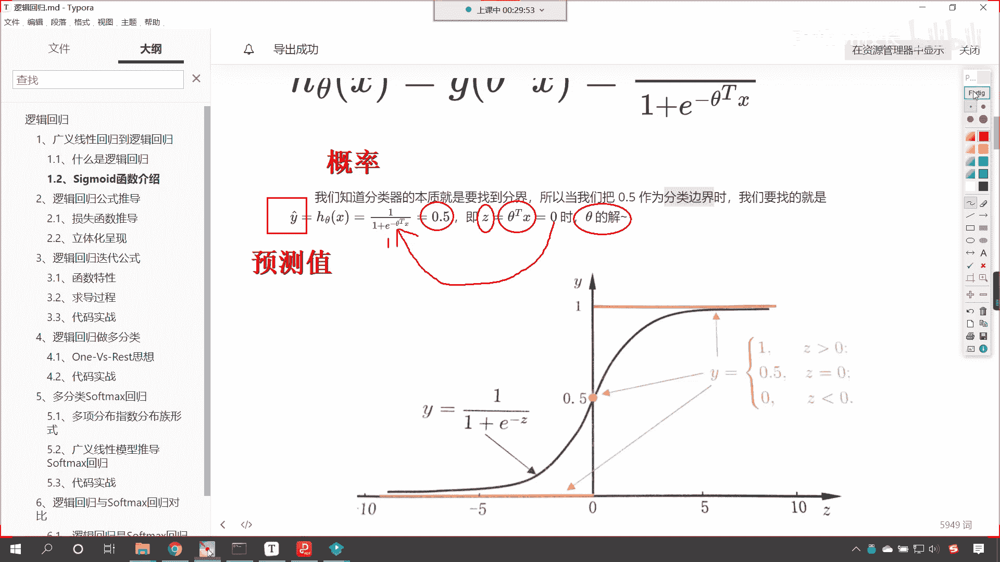

所以你看下面这个图看到了吗，下面那个图是吧，z如果要大于零是吧，那我们就认为它是一类是吧，z如果小于零是吧，咱们认为它是这个类别0z如果等于零呢是吧，那么我们求解出来，这个值是不是刚好是0。5呀。

那这个函数在数学当中，我们怎么对它进行称呼呢，这个呢叫做单位越界函数啊，这叫做单位越界函数与对数，几率与对数几率函数，那叫单位越界函数与对数几率函数，看经过这样的一个转变是吧，也就是说只要你大于0。5。

通通把你归到类别一当中，小于0。5，怎么样通通把你归到类别零，这那这就好比是吧，咱们在评判一个人是富人还是穷人的时候是吧，只要你的这个财富在100万以下，那我们通通把你归为穷人是吧，你有50万也好。

还是80万也好，都是穷人，假如说你的财富在1000万以上是吧，那无论是1000万，2000万还是多少是吧，这都认为呢他属于是这个富人是吧，假如说你要是钱更多是吧，你的财富超过十个亿。

你无论是这个50亿也好，还是100亿也好，还是3000亿也好，其实这辈子你都不可能花钱，都都不可能把这笔钱花完，对不对呀，那这个就是超级富豪，就像马云一样是吧，他即使生八个败家子儿，他的钱有可能败光吗。

那也不可能败光，是不是，所以说呢这个就是单位越界，就是说你超过了某一个临界点什么，那么就怎么样哎那么你的这个类别就变了，就像就像咱们的第一宇宙速度7。9，只要你超过了7。9千米每秒，那么你就可以。

那么你就可以这个脱离地球的约束飞出去，是不是这个函数只能分为二类吗，哎当然不是啦，咱们可以进行多分类啊，只不过咱们今天晚上讲的是二分类，咱们由2~3是吧，再衍生更多它更多的分类也是可以实现的啊。

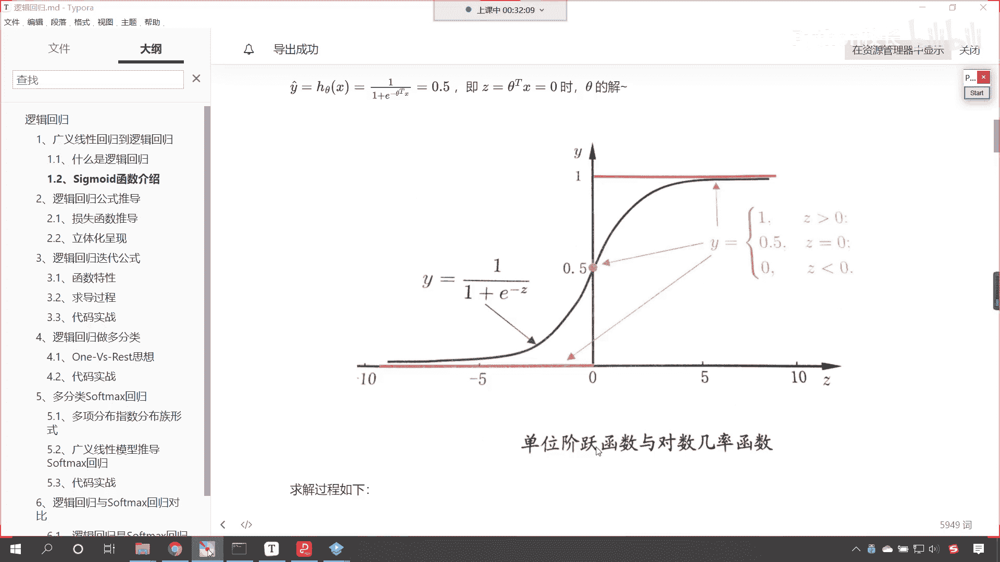

好那么接下来呢咱们就看一下它的求解过程，你能够看到在这个图当中，看看咱们这个图当中，你看咱们左边这一部分看到了吗，x1 w e x i w i，还有咱们x i w这个这个最后这个i。

那你想这个是不是就对应着一个线性方程呀，对吧，我们这一块呢他呢就是一个线性方程，这个线性方程我们使用哪个符号来表示呢，看看这个方程咱们使用哪个符号，看看咱们使用z等于看到了吧。

这个是不是就是一个线性方程呀，好有了这个线性方程之后，你看这个b呢就是咱们的截距啊，看到了吧，这个b就是截距好，那么我们进行了一个这个符号，这个符号叫什么，来哪位同学可以告诉我咱们这个符号叫什么呀。

看到了吗，这个符号叫什么，你想一下这个符号就叫西格玛，看看这个符号就叫这个这个西格玛，好，那么它呢就对应咱们的sigmoid，啊这个就对应咱们的sigmoid是吧。

那我们对于sigmoid 11进行转变，你看到了吗，下面是不是就是咱们的这个西格玛z，它的方程，好然后的话是吧，哎你看啊，咱们这个它所对应的方程，就是咱们刚才在代码当中所画出来的，这个s型曲线是吧。

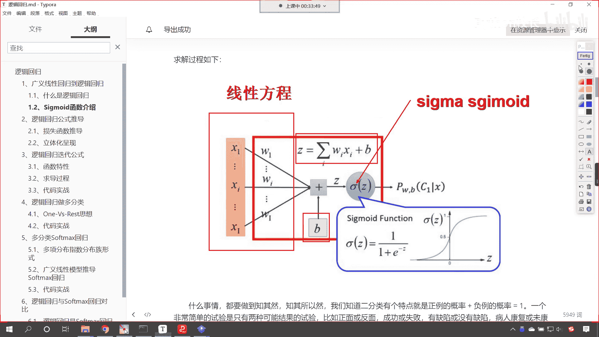

所以说这个就是咱们逻辑回归它的一个过程，那咱们什么事情呢，我们学习算法，咱们肯定要知其然，还要知其所以然，那我们知道二分类呢有个特点，就是正类的概率加上父类的概率等于一，看到了吗，这就是特点。

就是你要么属于类别零，要么属于类别一是吧，你这两个概率加和等于一，一个非常简单的试验是只有两种可能的，这个实验，比如正面和反面成功或失败，缺陷或没有缺陷，病人康复或未康复等等是吧，好比咱们抛硬币是吧。

你抛硬币要么是正面，要么是反面，对不对呀，为了方便起见是吧，咱们这儿所说的这个正例和负例是吧，在咱们代码当中，咱们一般不使用这个字符去表示，咱们一般使用什么来表示呀，零和一看到咱们使用零和一。

这个零呢就表示咱们的复利，这个一呢就表示咱们的正立，一般情况下我们更加关注正力是吧。

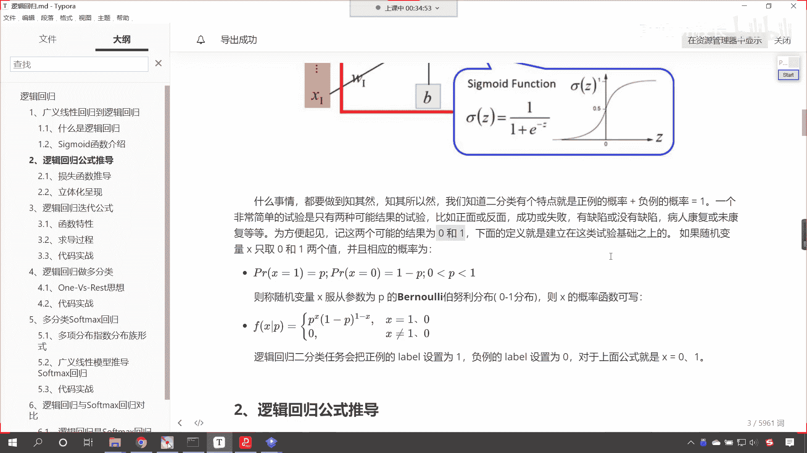

咱们更加关注正理，你比如说这个病人康复或未康复是吧，那你想这个病人康复和胃康复，大夫更关心哪一个呀，大夫是不是更关心未康复的呀，是不是康复了，那你就回家就行了，该吃吃该喝喝。

未康复的大夫特别关心说为什么这个用药，这个病人他没有好呢，咱们得研究研究得会诊一下是吧，得给他开点不一样的药是吧，保证把他治好，所以说呢这个你看现实生活当中是吧，这个大夫是吧，他就去找这个未康复的。

因为你见过的未康复的病人多了，这个就属于是疑难杂症，为什么一些大城市大医院里边的顶级专家，顶级大夫是吧，去我们这个去这个市里边，或者去这个唉小地方坐诊，那一天老多钱了，是不是哎就是因为他在大城市。

他在大城市里边见多识广，见到了更多的未康复的病人，是不是啊，这个就是疑难杂症，那么他就可以解决这个问题，所以下面的定义呢，就是建立在这类实验基础上的，如果随机变量x只能取零和一两个值，并且相应的概率呢。

咱们把它表示成这个看到p r x等于一，那这个概率是p，那么你想另一类的概率，咱们是不是可以用一减p来表示，对不对，你看你发生，这就相当于咱们之前所讲到的红球和白球，一个罐子当中有红球。

也有这个白球是吧，拿了一个球，请问这个球是红球还是白球，如果我们假设红球的概率是p，那么白球的概率是不是就是一减p啊，是不是，那我们呢咱们就称为变量x，服从参数为p的这个伯努利分布。

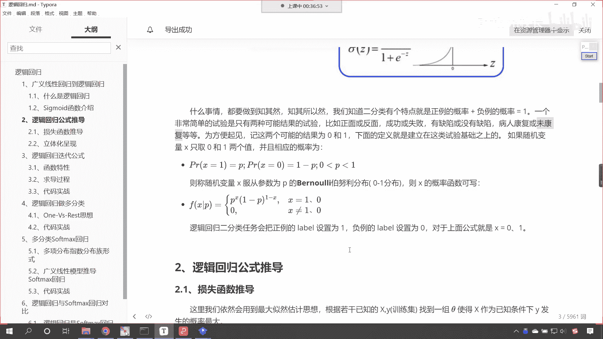

哎你看那我们在进行这个这个公式书写的时候，咱们呢就可以写成下面这种形式，看到了吗，叫做fx p是吧，这个就是它的一个概率密度，这就是它的一个概率分布，现在你能够看到是吧，咱们把概率是。

咱把概率是不是写成一块儿了是吧，那你下面这个零比较容易理解，那就是x不等于一，也不等于零，看注意啊，此时的x是类别啊，啊注意此时的x是类别，你不要把它理解成连续性的，咱们坐标轴上的数值那样是不对的啊。

你看这个一和零代表类别，就是咱们上面所说的是吧。

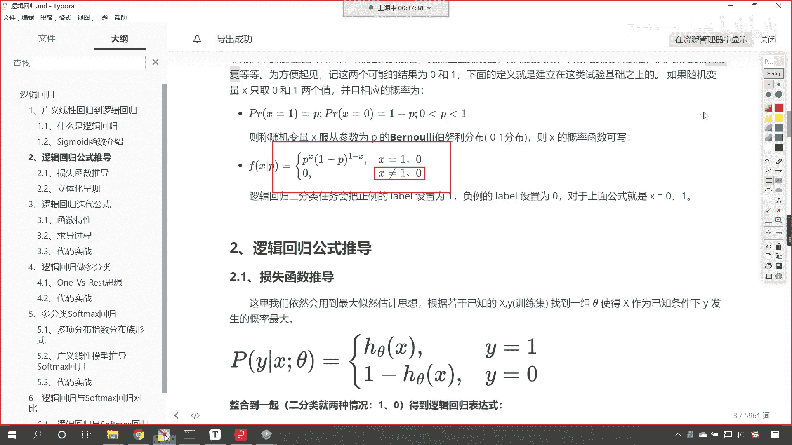

你看就是咱们上面所说的抛硬币的正面，反面成功失败，缺陷或没有缺陷，病人康复或未康复是吧，如果说你看你病人康复和胃康复是吧，你既不属于是康复和也不属于未康复是吧，那这种情况一般情况下是不存在的是吧。

所以这个那它的概率就是零，那上面的是p x，然后一减p一减x，那这个概率咱们怎么去理解呀，听到了吗，就这个概率怎么理解，你只要把咱们的x的值带入到这个方程当中啊，你把它带入到这个方程当中。

你就能够看到哎它的这个概率是怎么一回事呢，假设说我们把函数x等于一带进去，你看啊咱们把x等于一带进去，带进去之后，你看这个时候得到的概率是多少，因为一减p它的幂次是不是1-1呀，1-1=0。

任何数的零次幂是不是都等于一呀，所以说这个时候咱们的概率是多少，是不是就是p是不是就是p呀，那如果要x要等于零呢，看到了吗，x等于零，咱们把它带进去，你看你既然等于零呢，你p的零次幂是不是等于一呀。

是不是一减x x是不是零，那1-0是不是就是一，那这个时候你看我们的概率不就是一减p，对不对，哎所以说咱们的这个p和一减p他俩一合并，看他俩只要一合并，就是咱们这个公式，所以说看到这个公式。

你不要这个呃，不要感觉到这个惊讶啊，而数学家呢喜欢把嗯，这个不同的公式给它合并是吧，这个就是咱们合并之后的这个公式，看这就是合并之后的这个公式好，那么现在呢咱们对于这个sigmoid函数呢。

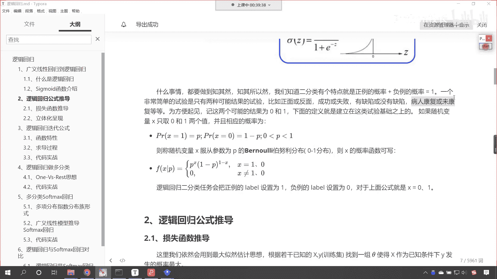