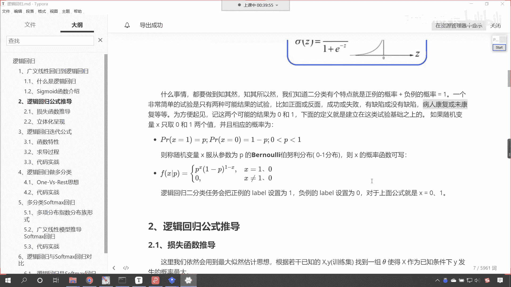
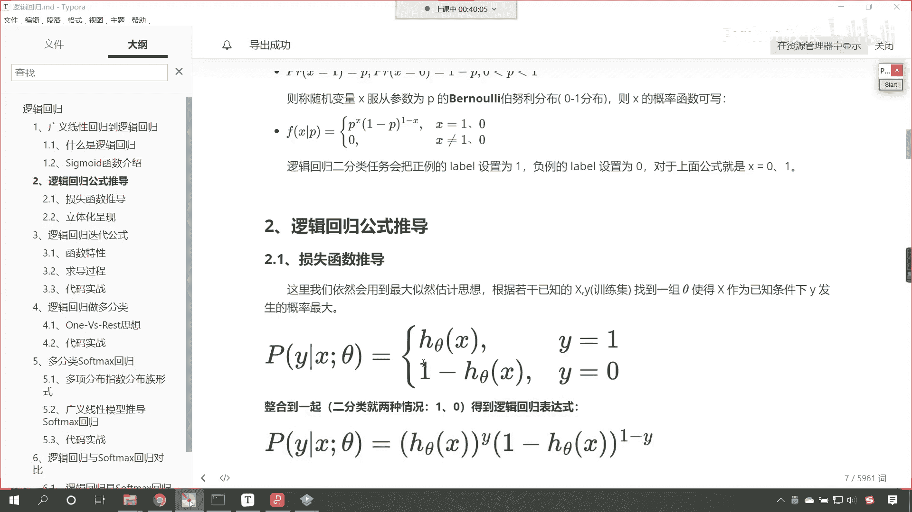
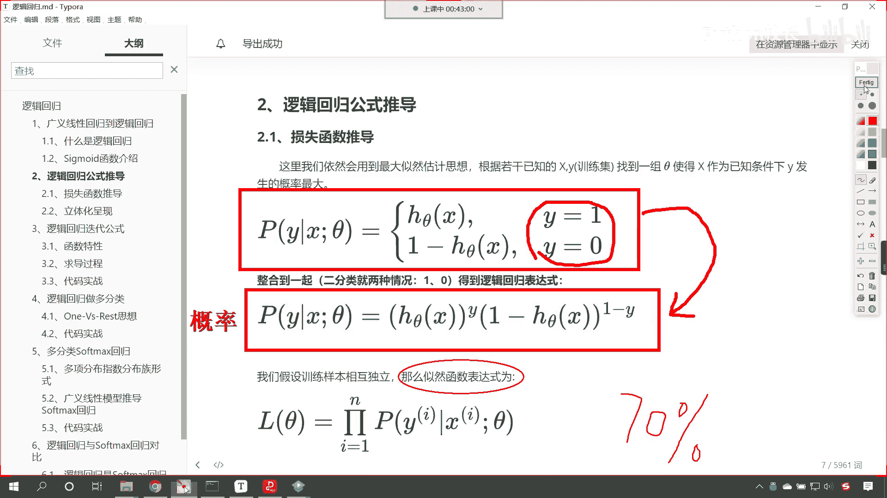
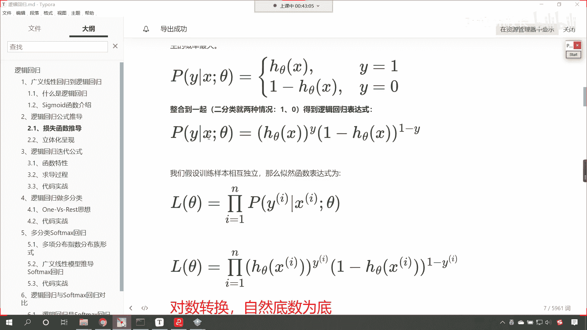
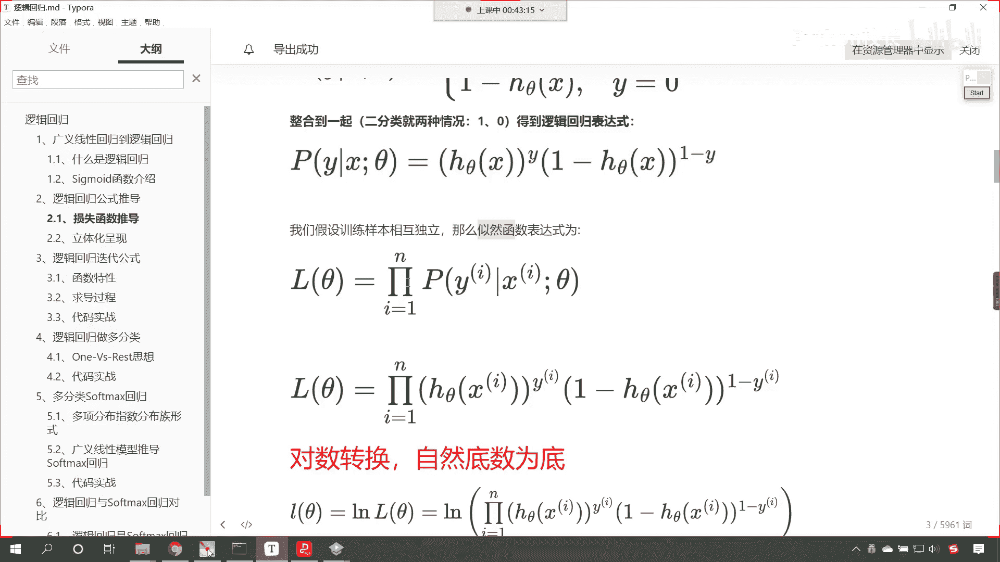
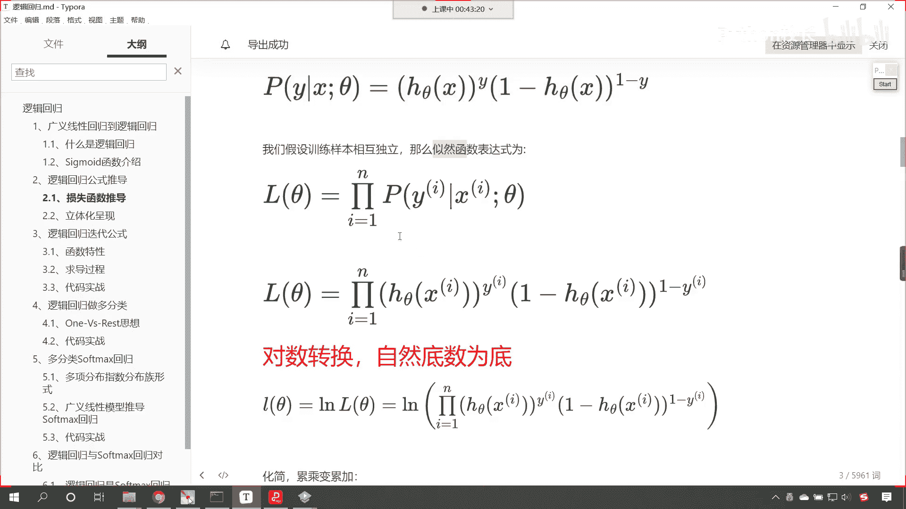
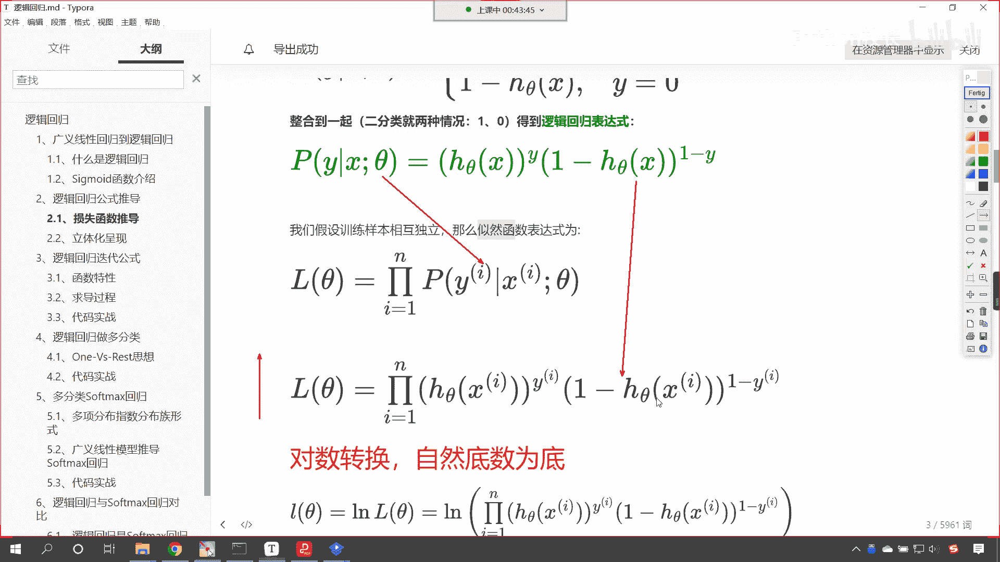
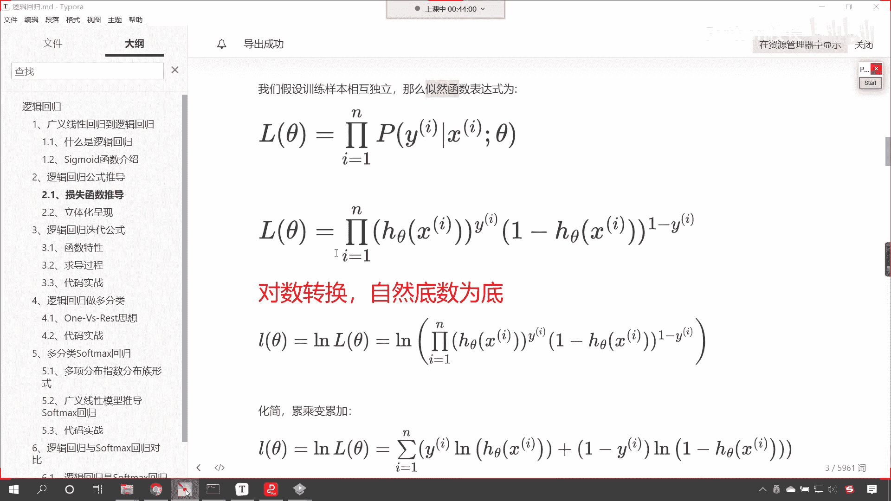
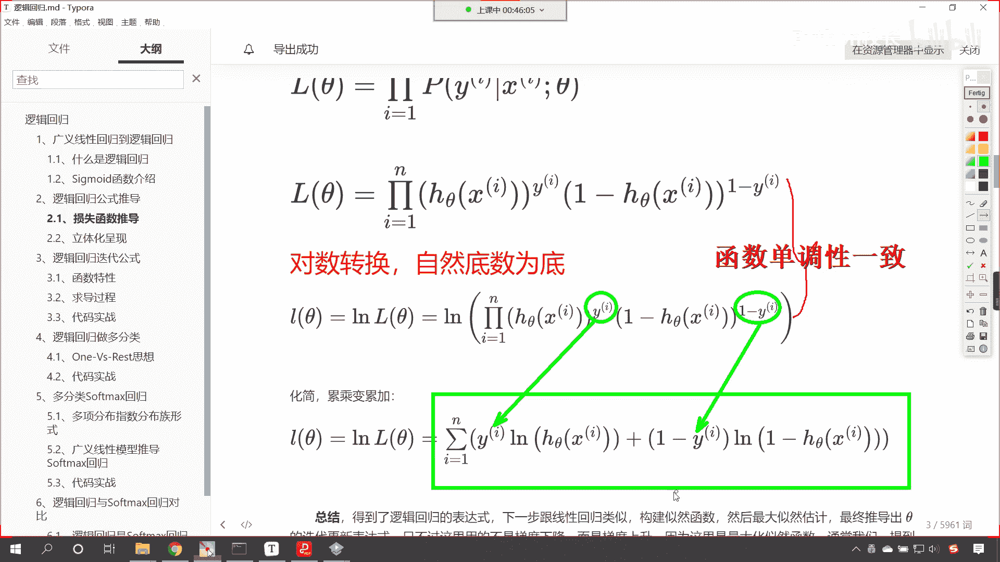
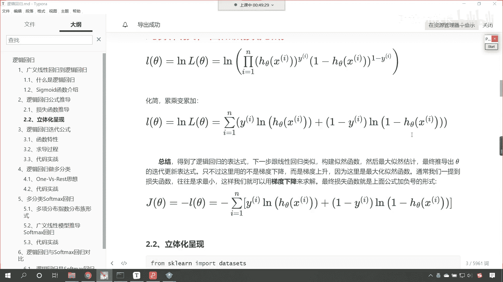

# P104：3-逻辑回归损失函数推导 - 程序大本营 - BV1KL411z7WA

来咱们继续向下看，接下来我们就看一下，咱们逻辑回归这个公式的推导。

根据咱们上面所讲的知识点，我们的概率是不是可以用这个来表示呀，看看咱们的概率呢就可以使用这个来表示，因为我们是二分类，那这个y要么是零，要么是一，你看是不是就可以使用这个符号来表示，看那我画红色的框的。

这个各位小伙伴理解不理解，如果要理解了，没问题了是吧，咱们就在讨论区扣一个六啊，我们在讨论区扣一个六是吧，好看来大家都没有问题，是不是因为我们上面已经介绍了，咱们说这个hc大x是不是表示概率啊。

所以这个时候咱们就把它替换成概率了，好，那么现在呢我们对于这个概率呢，进行了一个合并，叫做整合到一起是吧，你看就是hc塔y一减去h theta，它的这个右上角呢是一减y，那大家要注意啊。

咱们是从这个是吧，给它进行了一个整合，也就是说两个公式合到一个公式了，因为你因为我们的y呢就两种情况，咱们只要把这个y带到下面这个公式当中，你看它又变成上面这个公式了，所以说这就是一个整合啊。

咱们上面对于sigmoid的这个函数，刚刚进行了介绍，好那么到这里呢，咱们是不是就得到了一个概率呀，看到了吗，就得到了一个概率，之前大家还记得吗，咱们在讲解线性回归的时候，我们是不是用到了最大自然呀。

这什么是最大自然呀，嗯就是事件发生它所有的概率，它最大的这个可能是不是就是最大自然呀，之前咱们是举过具体的例子，一个罐子当中有黑球和白球，是不是黑球白球的比例，不知道，我们呢也不能把所有。

也不能把罐子当中所有的球取出来，数一数，那咱们就可以做这个有放回的实验，把罐子摇匀，拿一个球记录一下，放回去再摇匀，再拿出来记录一下，这个实验重复100次，其中呢有70次是白球，30次是黑球。

那请问这个当中白球的概率是多少是吧，那这个情况咱们之前是不是介绍过呀，那它的概率，你想白球的概率是不是70%呀，对不对，最有可能的概率那就是70%，我们当时我们是在这儿讲的这个自然函数，那在逻辑回归。

这咱们上面也求解出来了它的概率。

那你想那我们自然函数是不是就是所有的样本，它的概率的累乘呀，看到了吧，这个符号就表示垒成好。

那么我们把上面这个pi带进去啊。

咱们把上面的这个带进去啊，这就表示累乘，然后呢我们把它的展开公式也带进去，看到了吧，展开公式带进去，这个就是咱们的自然函数，那我们希望这个自然函数越大越好，对不对，你看你这个自然函数越大。

咱们所求解出来的这个h theta，这个方程就说明越准确好。

那么上面呢是咱们的垒成，垒成不好算呀，对不对，即使即使是计算机，他在进行累乘处理的时候是吧，也不好算。

怎么办呢，咱们将累成把它变成累加加法好算，那怎么才能把它变成这个累累加呢，咱们进行对数转换，我们以自然底数e为底进行转换，这个时候咱们的累乘就变成累加了，同时呢垒成它的曲线规律，和咱们这个自然以自然为。

以自然底数为底的对数，它的这个单调性是一样的，看他们俩这个函数的单调性是一样的，所以我们求上面这个方程，就变成了求下面这个方程，因为这个函数单调性一致，啊函数单调性一致，所以咱们可以进行这样的转换。

那么函数单调性一致，所以说可以进行这样的转换，好，你看你到了这儿之后是吧，你就非常熟悉了，你看熟悉不熟悉，这个时候呢咱们有了这个垒成之后啊，这个时候咱们有了这个垒成，变成变成咱们的累加之后。

那我们就紧接着进行下面的转换吧，你看下面的转换来，咱们画一条绿色的线啊，看下面这个转换是不是就变成了累加了呀，哎这怎么就变成累加了，你看上面咱们有一个多少多少次me，是不是那个多少多少次me。

你看这个时候是不是就写到看他就写到哪儿了，看他是不是就写到这儿了，对不对，你上面在咱们第二个乘法这啊第二个乘法，这是不是一减y啊，这是一减y次幂，那只要我们一进行对数运算，它会写到哪里呀，看到了吗。

这个是不是就写到这儿了，所以说经过对数转换，咱们呢这个累乘变累加，咱们进行化简，咱们就会得到下面这个公式好。

那么得到了下面这个公式之后呢，这个总结一下，咱们得到了逻辑回归的表达式，那这个表达式其实就是它的损失函数啊，嗯这个下一步呢就跟咱们的这个线性回归类似，是咱们这个构造的自然函数。

然后呢咱们进行最大似然估计，最终呢我们就会推导出，c大的这个迭代更新表达式，只不过咱们这里不是梯度下降，而是梯度上升，为啥，因为它是最大自然嘛，最大自然求的是不是最大值，对不对。

那我们通常一提到损失函数，咱们往往是求最小，对不对，那我们之前咱们讲梯度下降，是不是讲了好几个版本啊，随机梯度下降，批量梯度下降，小批量梯度下降，是不是，那么我们如何对于上面的最大，自然进行一个转换呢。

其实咱们只需要给它调一个符号就行了，原来你这个数据呢是向上的，那如果我要给它加一个负号，大家想一下它是不是就变成向下了呀是吧，加一个负号，那么咱们这个函数呢就变成向下了。

向下的话也就是说这个嗯就变成损失函数了，那么它呢就是越小越好，到这里，其实呢，你应该和咱们之前所讲的线性回归，有一个联系是吧，他们俩之间的关联是非常强的啊，相似度咱们可以认为是90%，知道吗。

你去看咱们之前的线性回归，你也能发现在咱们的线性回归里边是吧，也有类似的方程，也有类似的这个公式，只不过在咱们线性回归当中，我们这个概率密度是不是高斯的，这个概率密度呀，对不对，和这不一样。

咱们这儿的h theta是sigmoid，好，那么这个呢就是我们损失函数的一个推导，大家注意啊，损失函数一般情况下在咱们的书籍当中，我们都使用j theta来表示，有的呢也用l theta来表示。

看有的它也使用这个l c它来表示，你看有的用l l它的英文对应的loss，你看l o s s loss就有损失的意思，很多书籍当中用的是j唉，这个g呢它也代表损失函数，所以说到这里。

咱们呢就将逻辑回归它的损失函数，找到了，有了损失函数，咱们是不是就可以研究这个损失函数，我们可以使用梯度下降，或者说求导令导数为零，对不对啊，一般情况下啊，这个求导令导数为零，那个是解方程。

而我们真实的案例当中，这个往往这个方程比较复杂，咱们一般不通过解方程来求解，咱往往是通过梯度下降来进行求解，所以说呢有了损失函数，这就好办了。

