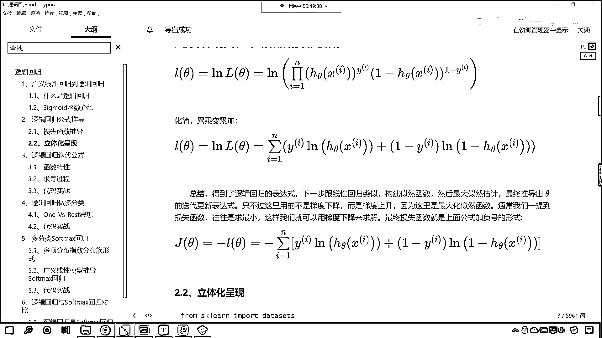

# 7天爆肝整理！AI量化交易-机器学习全套教程，从入门到项目实战保姆级教程！（数据挖掘分析／大数据／可视化／投资／金融／股票／算法） - P104：3-逻辑回归损失函数推导 - Python校长 - BV1KL411z7WA

來，咱們繼續向下看，接下來我們就看一下咱們邏輯回歸這個公式的推導，根據咱們上面所講的知識點，我們的概率是不是可以用這個來表示啊，咱們的概率就可以使用這個來表示，因為我們是二分類。

那這個y要麼是0要麼是1，你看是不是就可以使用這個符號來表示，看，那我畫紅色的框的這個，各位小夥伴，理解不理解，如果要理解了沒問題了，咱們就在討論區扣一個6，看來大家都沒有問題是不是。

因為我們上面已經介紹了，咱們說這個hθx是不是表示概率啊，所以這個時候咱們就把它替換成概率了，好，那麼現在呢，我們對於這個概率進行了一個合併，叫做整合到一起，你看就是hθy，1-hθ。

它的這個右上角呢是1-y，那大家要注意啊，咱們是從這個給它進行了一個整合，也就是說兩個公式合到一個公式了，因為我們的y呢就兩種情況，咱們只要把這個y帶到下面這個公式當中，你看它又變成上面這個公式了。

所以說這就是一個整合啊，咱們上面對於sigma的這個函數剛剛進行了介紹，好，那麼到這裡呢，咱們是不是就得到了一個概率啊，看到了吧，就得到了一個概率，之前大家還記得嗎，咱們在講解線性回歸的時候。

我們是不是用到了最大自然啊，這什麼是最大自然啊，就是事件發生，它所有的概率，它最大的這個可能，是不是就是最大自然啊，之前咱們是舉過具體的例子，一個罐子當中有黑球和白球，是不是啊，黑球白球的比例不知道。

我們呢也不能把罐子當中所有的球取出來數一數，那咱們就可以做這個有放回的實驗，把罐子搖勻，拿一個球記錄一下，放回去再搖勻，再拿出來記錄一下，這個實驗重複100次，其中呢有70次是白球，30次是黑球。

那請問這個當中白球的概率是多少，那這個情況咱們之前是不是介紹過呀，那它的概率，你想白球的概率是不是就是70%呀，對不對，最有可能的概率，那就是70%，我們當時我們是在那講的這個自然函數，那在邏輯回歸這。

咱們上面也求解出來了它的概率，那你想，那我們自然函數，是不是就是所有的樣本，它的概率的累乘呀，看到了吧，這個符號就表示累乘，好，那麼，我們把上面這個PI帶進去，咱們把上面的這個帶進去，這就表示累乘。

然後呢，我們把它的展開公式也帶進去，看到了吧，展開公式帶進去，這個就是咱們的自然函數，那我們希望這個自然函數越大越好，對不對，你看你這個自然函數越大，咱們所求解出來的這個Hθ這個方程就說明越準確。

好那麼，上面呢是咱們的累乘，累乘不好算呀，對不對，即使是計算機，它在進行累乘處理的時候，是吧，也不好算，怎麼辦呢，咱們將累乘，把它變成累加，加法好算，那怎麼才能把它變成這個累加呢，咱們進行對數轉換。

我們以自然底數1為底進行轉換，這個時候咱們的累乘就變成累加了，同時呢，累乘它的曲線規律和咱們這個自然以自然為，以自然底數為底的這個對數，它的這個單調性是一樣的，它們倆這個函數的單調性是一樣的，所以。

我們求上面這個方程就變成了求下面這個方程，因為這個函數單調性一致，函數單調性一致，所以咱們可以進行這樣的轉換，那麼函數單調性一致，所以說可以進行這樣的轉換，好你看你到了這之後，是吧，你就非常熟悉了。

你看熟悉不熟悉，這個時候呢，咱們有了這個累乘之後，這個時候咱們有了這個累乘變成，變成咱們的累加之後，那我們就緊接著進行下面的轉換吧，你看下面的轉換，來咱們畫一條綠色的線啊，看下面這個轉換。

是不是就變成了累加了呀，哎這怎麼就變成累加了，你看，上面咱們有一個多少多少次幂，是不是，那這個多少多少次幂，你看這個時候是不是就寫到，看他就寫到哪了，看他是不是就寫到這了，對不對。

你上面在咱們第二個乘法這，看第二個乘法這，是不是一減外呀，這是一減外次幂，那只要我們一進行對數運算，他會寫到哪裡呀，看了這個是不是就寫到這了，所以說，經過對數轉換，咱們呢，這個累乘變累加，咱們進行化解。

咱們就會得到下面這個公式，好，那麼得到了下面這個公式之後呢，這個總結一下，咱們得到了邏輯回歸的表達式，那這個表達式其實就是他的損失函數啊，這個下一步呢，就跟咱們的這個線性回歸類似。

咱們這個構造的四然函數，然後呢，咱們進行最大四然估計，最終呢，我們就會推導出C大的這個迭代更新表達式，只不過咱們這裡不是T度下降，而是T度上升，為啥，因為他是最大四然嗎，最大四然求的是不是最大值。

對不對，那我們通常一提到損失函數，咱們往往是求最小，對不對，那我們之前咱們講T度下降，是不是講了好幾個版本啊，隨機T度下降，批量T度下降，小批量T度下降，是不是。

那麼我們如何對於上面的最大四然進行一個轉換呢，其實咱們只需要給他調一個符號就行了，原來你這個數據呢是向上的，那如果我要給他加一個負號，大家想一下，他是不是就變成向下了呀，是吧，加一個負號。

那麼咱們這個函數呢就變成向下了，向下的話也就是說這個就變成損失函數了，那麼他呢就是越小越好，到這裡其實呢，你應該和咱們之前所講的線性回歸有一個聯繫，是吧，他們倆之間的關聯是非常強的啊。

相似度咱們可以認為是90%，知道嗎，你去看咱們之前的線性回歸，你也能發現在咱們的線性回歸裡邊，是吧，也有類似的方程，也有類似的這個公式，只不過在咱們線性回歸當中。

我們這個概率密度是不是高斯的這個概率密度呀，對不對，和這不一樣，咱們這的hθ是sigma的，好，那麼這個呢就是我們損失函數的一個推導，大家注意啊，損失函數，一般情況下，在咱們的書籍當中。

我們都使用jθ來表示，有的呢，也用lθ來表示，有的他也使用這個lθ來表示，你看有的用l，l他的英文對應著loss，你看loss，loss就有損失的意思，很多書籍當中用的是j，這個j呢，他也代表損失函數。

所以說到這裡，咱們呢就將，邏輯回歸他的損失函數找到了，有了損失函數，咱們是不是就可以研究這個損失函數，我們可以使用t度下降，或者說求導令導數為零，對不對，一般情況下啊，這個求導令導數為零，那個是解方程。

而我們真實的案例當中，這個往往這個方程比較複雜，咱們一般不通過解方程來求解，咱們往往是通過t度下降來進行求解，所以說呢，有了損失函數，這就好辦了，好。

那這一部分知識呢。

咱們就介紹了。