# P105：4-损失函数立体化呈现（一） - 程序大本营 - BV1KL411z7WA

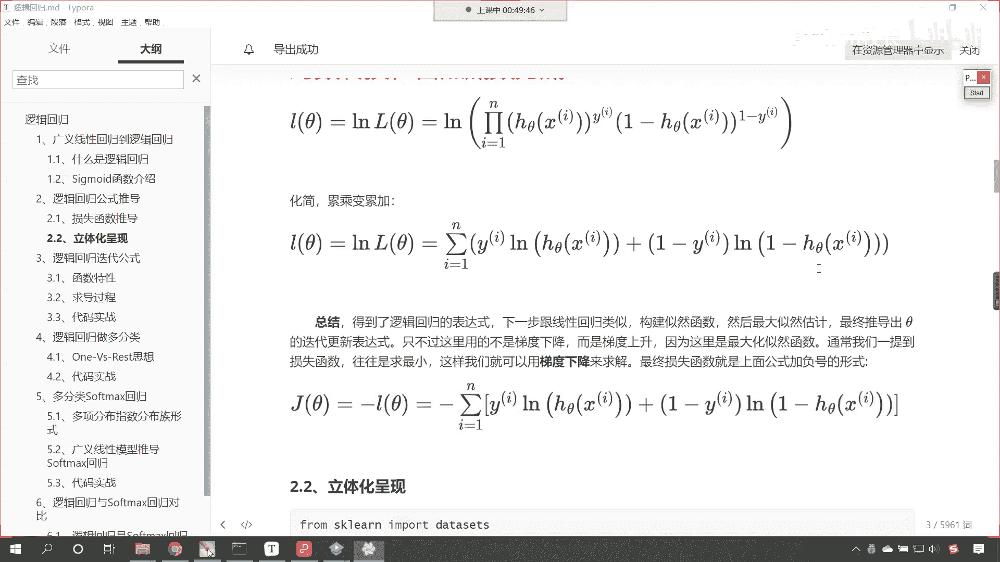

好那么接下来我们继续往下看啊，咱们接下来呢我们就进行一个应用，咱们呢来一个立体化的呈现，咱们使用这个逻辑斯蒂回归是吧。

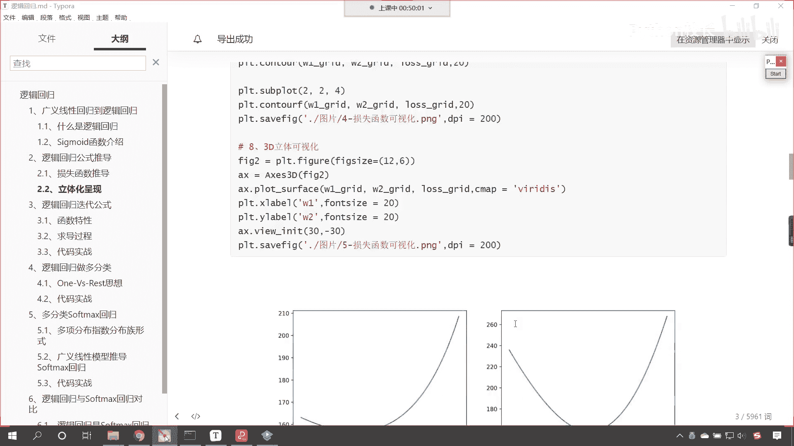

哎啥是立体化呈现呀，我们把这个图画出来，咱们让你看一下，咱们说嗯这个逻辑斯蒂回归是吧，它可以进行这个梯度下降，那这个梯度下降我们所对应的这个函数，它是凹函数呀，还是凸函数呀，对不对，那我们得那嗯。

咱们就可以通过画图。

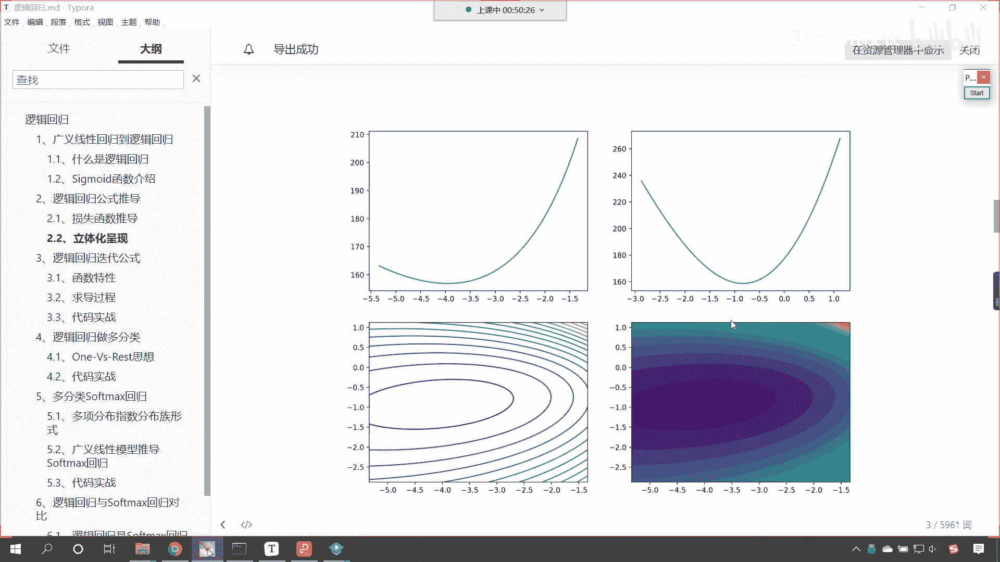

来对它进行相应的一个显示，好那么咱们这个数据很简单啊，来现在的话咱们就回到代码当中，我们呢进行操作一下啊。

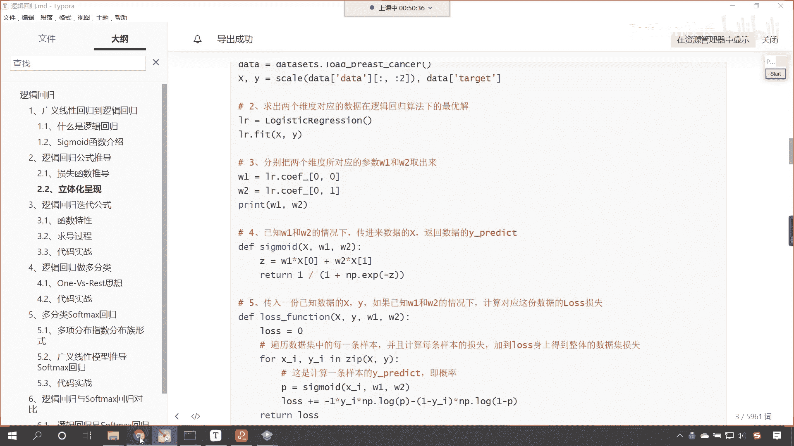

回到代码当中，咱们在这儿呢再来一个三级标题，这个呢就是咱们损失函数，它的立体化呈现，那首先呢我们导入相应的包，咱们from sklearn，咱们import data sets，把这个导进来。

from sk learn，咱们线性模块下，咱们导入咱们的logistic regression，同时呢import numpy as np，画图工具是不是也得导入进来呀，piplot as plt。

那么咱们这个图形当中呢，咱们有三维图形，所以说咱们把三维图形相应的插件给它导进来，叫做m p l two kids，那就是m plot 3 d，咱们从这个当中呢导入咱们3d绘图的引擎。

就是axis 3 d，然后的话嗯咱们呢在进行数据，数据处理的过程当中，我们得需要进行归一化，所以说咱们将归一化也导进来，那就是from sklearn preprocessing，之前咱们打包的时候。

咱们看咱们导入的是不是standard scale呀，那还有一个规划叫skill，这个方法也可以进行z score归一化啊，它呢也对应的z高归化，所以我们把这个导进来，咱们使用一下。

那我们说这个啊这个skill和standard skiller，看它俩是一样的啊，这个时候我执行一下导包就成功了，然后呢我们去加载咱们的数据，接下来呢我们再建一个标题，这个时候呢咱们就加载数据好。

那么加载数据咱们就使用上面刚刚导包的data size，咱们load一下，那么这个时候呢咱们漏的一个叫breast cancer，大家看这个就是乳腺癌，那么这个数据呢咱们加载的就是乳腺癌的数据。

那乳腺癌的数据里面有一个参数叫做return x y，默认情况下它是false，如果这个参数我们要不指定，你看我一执行，咱们返回的数据是什么样的一个数据，是不是一个字典类型的数据呀，那如果说我要给他接。

给他指定一个参数叫true，它是什么意思呀，就是只返回咱们的数据x和y，你有没有发现在咱们这个方法当中，它的参数x和y x用的是大写，这个y用的是不是小写呀，这个和咱们之前的书写习惯都是对应的啊。

看我执行一下。

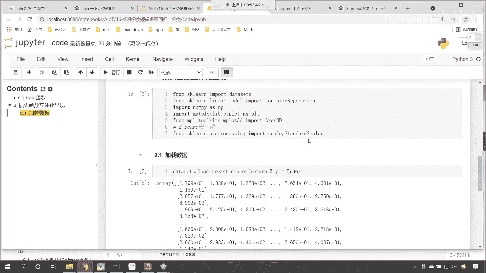

这个时候你就能够发现，咱们此时返回的这个数据，它是不是就是一个元祖呀，元组当中有两个数据，第一个数据就对应着咱们的嗯，这个跟乳腺癌相关的这个特征数据。

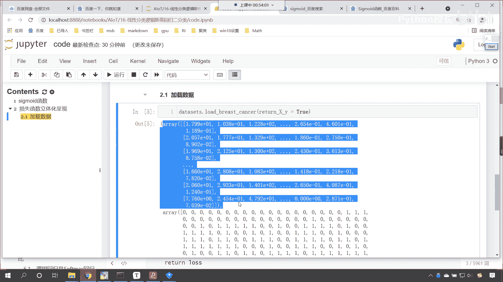

这第二个数据呢就是类别，这这个这个当中是不是含有零和一呀。

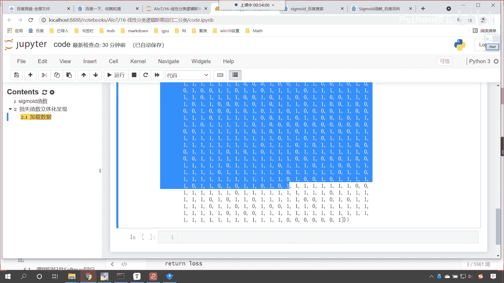

零就说明你是健康的，这个一呢就说明你是乳腺癌的患者，对不对，我们说这个零和一是不是代表正力和负利啊，对不对，那一般情况下这个一呢就是医生特别关心的好，那么咱们这个数据是一个二元的数组。

咱们就可以使用xy来接收一下x，然后来一个逗号y，这个时候给大家查看一下，咱们的数据长什么样啊，咱们display x。ship，然后y。sheep，执行一下这个代码，我们现在就能够看到咱们这个数据呢。

一共是569个样本，有30个属性，这些属性咱们有30个特征，那这些特征看都是跟健康相关的特征啊，跟健康相关的一些特征，我们不是医生，咱们的是计算机编程人员，我们呢是数据科学家。

咱们要对这个数据进行相应的这个科学运算，那这个数据是什么是吧，这个这个属性是什么，对于我们而言无所谓，它都是数字，就像咱们之前所做的那个项目，天池工业蒸汽量，咱们没有同学在这个电厂工作过吧是吧。

你看电厂工作是就是没发成电，是不是嗯，没有这样的相应的工作经验，我们依然可以对数据进行处理，进行建模进行预测，是不是啊，我们没有在医院工作过，但是呢我们对这个数据是吧，依然可以进行相应的处理好。

那么我们的数据呢有30个特征，现在的话咱们对这个特征呢进行一个筛选，x就等于x咱们来一个切片冒号，冒号我们切到二，咱们现在呢就切片儿它的前两个特征，嗯切片它的前两个特征，这样的话我们画图比较方便。

是不是好，那么此时呢咱们就执行一下，现在大家看就是5692了，然后接下来我们再来一个四级标题，咱们呢就进行建模好，那么我们导包了是吧，咱们导包呢咱们声明一个模型。

那就是model就等于logist tek regression，参数呢咱们都使用默认的啊，后期的话逻辑斯蒂回归当中，这些参数我们是可以调整的，有了这个模型，咱们就执行feat一下。

我们直接将x y放进去，诶，你看和咱们之前的线性回归训练方法，是不是一样呀，大家看啊，这一步咱们呢就是训练，这个和咱们之前线性回归是不是类似呀，后面咱们再学的，看后面咱们接触的其他方法。

其他算法在进行训练的时候都是怎么样呀，都是类似的，知道吧，因为他们都是来自一个库好，那么这个时候你看我一执行哎，咱们就有了那模型，训练好了，模型是不是就从咱们这个数据当中，找到了相应的规律呀，对不对。

你看再来一个四级标题啊，现在的话咱们将逻辑回归中的这个线性方程，我们给它拿出来是吧，那这个线性方程是不是就对应着咱们的系数呀，对不对，咱们给它拿出来。

这个时候你看我调用model model model。co，那你还记得咱们线性回归的方程吗，是不是有call if呀，扣if就表示系数，这个时候你看我一执行，咱们这个系数是不是就得到了，看到了吗。

这个系数就得到了，那这个是不是咱们特征一的系数，这个负的0。21是不是咱们特征二的系数呀，来现在的话咱们把这个系数给它拿出来啊，好那么拿出来之后呢，我们就叫做w1 ，就等于我们这个系数。

它属于是一个二维数组是吧，咱们根据索引把这个负的1。046取出来，那么它所在的位置就是零逗号零，然后呢再把w2 就是咱们第二个特征，它的系数取出来，扣if中括号，那就是零和一，好。

这个时候呢我们就取出来了，取出来之后呢，咱们打印输出一下啊，好这个呢就是咱们方程的系数，方程的系数就是w1 w2 ，唉你看我一执行系数是不是就得到了，好那么有了这个系数之后呢。

咱们接下来呢我们就进行一个这个操作啊，嗯那你想咱们除了这个系数之外，我们是不是还有一个，咱们是不是还有一个截距呀，来咱们把截距也找到啊，截距等于多少，是不是model。intercept呀对吧。

那我们把方程的截距也打印出来是吧，然后来一个冒号好，再打印输出一下print好，那这个呢就是咱们方程的截距，冒号逗号，咱们将b打印输出一下，这个时候你看我一直想有没有好，那么我们到这一步，各位小伙伴。

如果你对于咱们代码写到这儿没有问题，那你在讨论区里边回复一个666好不好，好有问题的小伙伴呢，及时在我们群里边进行反馈啊，好那么我们拿到了系数了，接下来呢咱们就定义这个sigmoid的函数好不好。

我们来一个四级标题，大家看啊，这个就是咱们sigmoid函数的定义好，那我们就定义方法，那就是d e f嗯，咱们起名呢就叫sigmoid，来一个小括号，咱们这个sigmoid呢，我们这个给一个数据x看。

给一个数据x然后把系数w一放进去，然后w2 也放进去，然后截距b也放进去，你想有了x w1 w2 ，咱们现在是不是就可以进行函数的计算呀，那这个函数值等于多少呢，z咱们呢就等于w1 ，我们让系数啊。

这个时候咱们让系数乘以咱们x当中的数据，那x当中的数据呢，这个第一个系数对应零，所以说咱们就把零取出来，然后加上w2 ，我们的w2 呢对应咱们第二个特征，咱们从x当中把一取出来，然后再加上b。

你看我加上b这个b是不是就表示它的截距，那我现在所写的这个z，它是不是就是表示咱们的线性方程呀，你看像不像咱们之前在讲损失。

在咱们讲这个代码过程当中，你看这个是不是咱们的z啊，对不对，你看这就是z好。

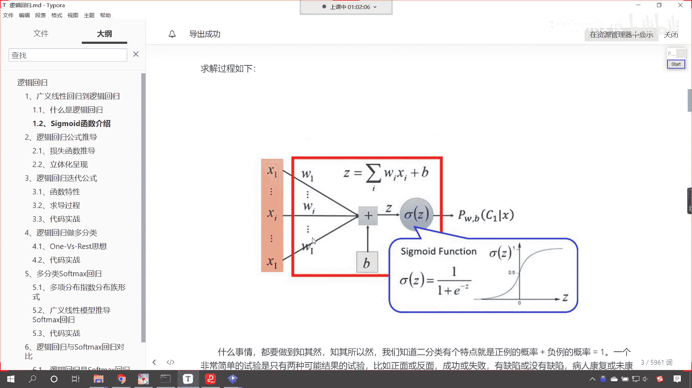

那么有了这个z之后，你看这就是线性方程，那我们需要把线性方程进行一个转换，咱们给它return一下，我们现在是不是就得需要把这个方程给它，转化成概率呀，对不对，那咱们就return。

那现在这个sigmoid的函数是不是就是1÷1，加上np。ex p，是不是我们来一个负z是不是就可以了，看来一个负z就可以了，好大家看到这个时候，咱们sigmoid的函数我们就定义完成了。

这个比咱们刚才sigmoid函数的定义，稍微复杂一点，上面你看直接给负x就行了，现在有千套，有什么嵌套呀，哎这个嵌套就是咱们的z是不是好，那么现在呢咱们这个sigmoid的函数就嗯确定了。

然后接下来我们再来一个四级标题，那么我们接下来呢咱们定义一下它的损失函数，好不好好，那么你看啊，接下来呢我们定义损失函数，因为你想咱们的损失函数是不是，就对应着咱们的jc它呀，对不对。

你看损失函数就对应着，就对应着咱们的jc塔啊，dollar dollar啊，这个j小括号反斜杠t h e t a c a，执行一下啊，损失函数就对应了咱们这个jc塔，那咱们就定义一下。

那就是d e f叫做loss function function，就表示方法的意思，那此时呢咱们传入相应的数据x传进去，y传进去，那我们的系数呢也传进去，咱们的系数呢就是w1 w2 。

以及咱们的截距b嗯，那为什么我们为什么咱们要传这么多的。

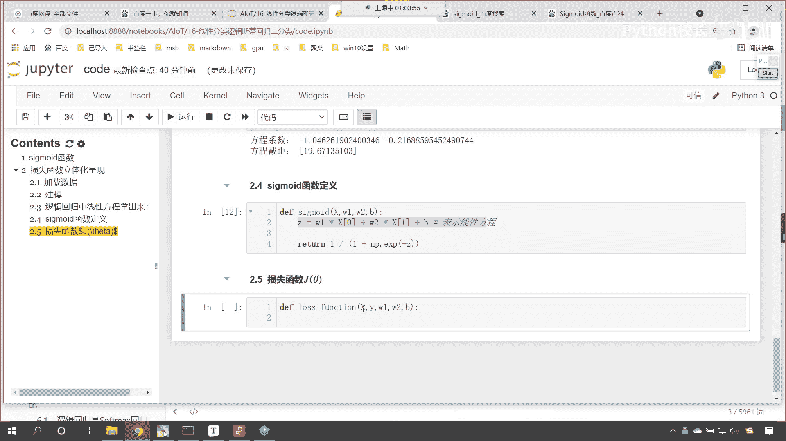

这个参数呢，看咱们的损失函数。

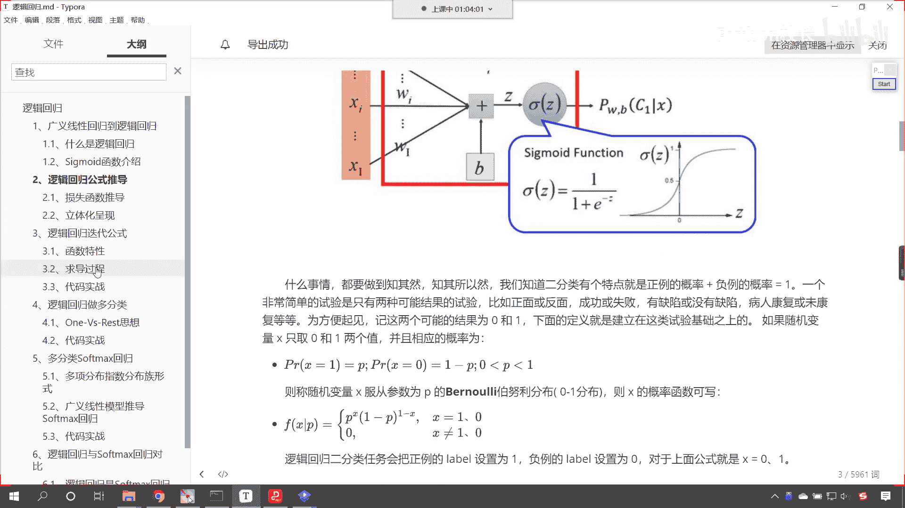

看咱们刚才这个在立体化呈现之前，这个地方咱们是不是就给了一个损失函数呀，现在你能够看到咱们损失函数所对应的，这个方程当中，你看有没有y看到了吗，有没有y，这个是不是y这个ln h c塔x h c塔x。

这个当中是不是就有咱们的啊，这个系数是不是就有咱们的数据x呀，所以咱们这个方程当中用到了y，那么我们在构建这个方程的时候。

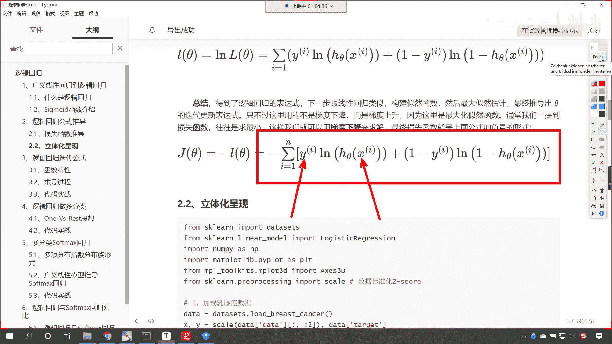

代码当中，你看代码当中，咱们就相应的这个参数传进去好，那么这个损失到底是多少呢，咱们先定义一下，就是初始初始一下咱们的loss好，然后呢，你看咱们传入的这个数据x传入的这个数据y。

现在呢咱们对它进行一个便利，因为我们传入的这个数据有可能不止一个，那就是fx下划线i y下划线i in，咱们的z i p，小括号x y，那这个zip就相当于一次，对于咱们的xy进行便利啊。

这个就是一次对xy同时进行遍历，从x当中取出一个x赋值给x下划线，i，从y当中取出一个数据赋值给咱们的下划线，yi好，那么在这里呢咱们首先计算一下概率，这个概率是p。

概率是不是就是咱们的sigmoid的函数呀，sigmoid的函数咱们上面定义了，那就是x这个呃w1 ，此时的这个x呢，就对应咱们从for循环当中取出来的这个小xi，然后我们把w一放进去，w2 放进去。

再把b放进去好，大家看，这个时候咱们是不是就根据sigma的计算出来了，概率啊啊这个时候呢嗯咱们呢就计算了概率好，那么有了概率，咱们紧接着呢我们就计算一下它的loss，l o s s。

咱们的loss呢我们就来一个加的，因为这个for循环呢我们是遍历了多个数据，所以说咱们这个损失，每一次for循环计算出来的这个概率呢，咱们都进行一个这个操作好，那么这个时候根据咱们公式。

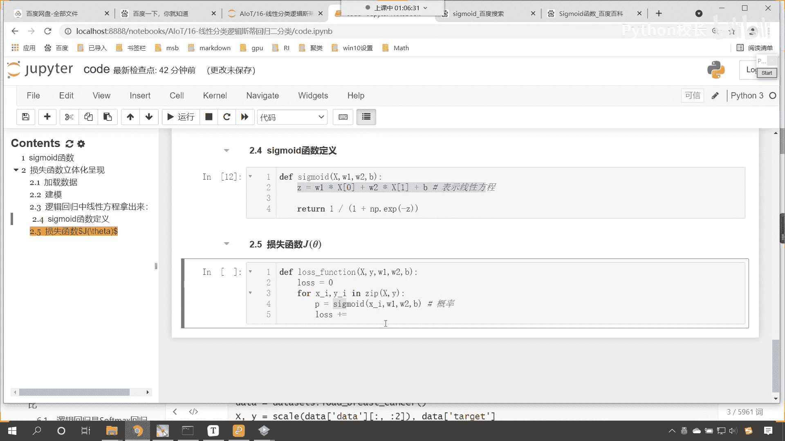

现在呢咱们把这个公式给它复制过来啊。

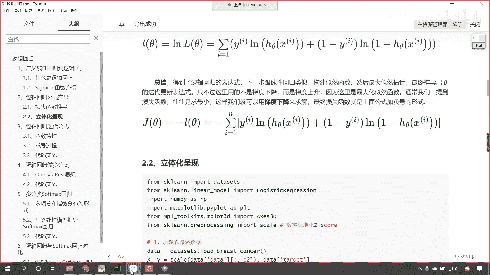

看这个时候咱们复制过来复制复制过来好。

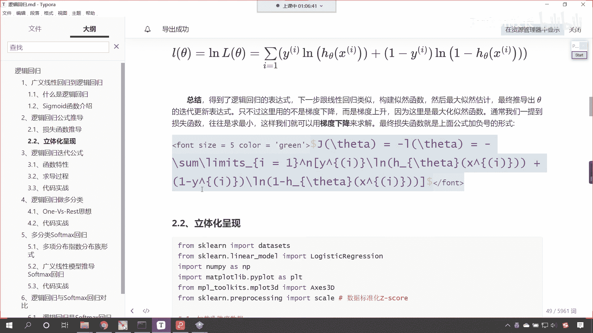

有一个对比，回到咱们代码当中，在上面插入一行转换成mark down，在这来一个粘贴，你看这个时候我一直行，大家看这个公式就有了，是不是啊，那这个公式有了之后，首先前面是不是带了一个负号呀。

那我们首先给他来一个负号，那这个时候就是负的多少，看啊，咱们这个那这个时候就是负的看啊，那就是负的y下划线i看，那这个时候就是负的y下划线i，我们让它乘以什么呢，你看因为这个y呢它表示咱们的真实值。

那此时的这个真实值是不是，就是咱们for循环遍历取出来的这个yi啊，它和谁相乘呢，乘以np。log，你看log默认情况下它的这个底数是e log谁呢，哎你看ln后边是不是就是h c tx呀。

那这个h c tx是不是就是咱们计算出来的，这个西格玛id呀，看到了吧，这个sigmoid，因为这个h c塔x看回到上面。

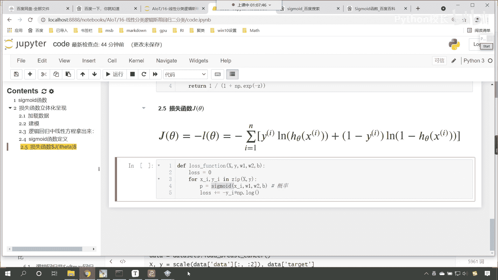

咱们给各位看一下咱们这个hc塔啊，你看这个hc塔x是不是就是一加上e的负，thettx分之一，是不是来咱们把这个公式是吧，我们也复制一下，这样的话你就知道它的一个对应关系了。

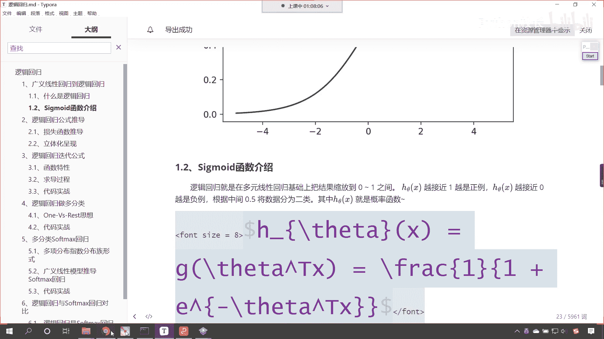

对不对，咱们在上面插入一行，也来一个markdown，ctrl v粘贴过来，看到了吗，那那那也就是说咱们这个hc的，你看到了吧，这个hc塔，也就是说咱们ln当中的这个h theta。

是不是就对应着对应着咱们这个sigma呀，对不对，那这个sigmoid，你看我是不是在这计算了，看到了吗，我在这计算了，没问题吧，是不是这个计算完之后的结果，我是不是用p来表示。

所以呢咱们log当中看咱们log小括号当中，我是不是放个屁就行了，对不对，来咱们现在呢把p放进去好，那么放进去之后呢，咱们再来啊，你看因为这因为这是一个负号，是不是看到了吧，你看这是负号是吧。

那我们这样啊，负号小括号把它当成一个整体看到了吧，负号小括号当成一个整体，前面部分咱们就写出来了，然后他是不是还有后面部分呀，是不是一减y a，那咱们小括号一减去y下划线a是不是，然后再乘以多少呢。

来一个乘法，同样是不是np。log呀，小括号，你看这个时候，这个ln当中是不是一减去h theta呀，那一减h theta不就是一减p嘛，对不对，好，那么经过咱们这个for循环，咱们的损失就求解出来了。

咱们就return一个loss，哎，这个时候求解出来了，来执行一下这个代码，也就是说这个公式是吧，我们完全就是按照咱们上边推导出来的进行的，这个计算好，那么接下来呢咱们再来好。

那么相应的函数我们都进行了声明，紧接着呢咱们就这个定义咱们参数，看定义咱们参数w1 ，因为我们要画图嘛，对不对，咱们定义参数w一和咱们w2 它的范围看，我们就定义w一和w2 的这个取值空间啊。

咱们定义它们的取值空间，也就是说这个数据只有有一个范围，咱们是不是才可以画图呀，好那么我们就定义一下吧，那就是w一啊，这个时候就是w一就等于w一下划线space，这就是它的取值空间，怎么给它取值呢。

线性划分，原来这个数据是w1 ，咱们让它减去二哎也就是说从这个小于二，这到大于二，这然后w一再加上二，我们给他来100份是吧，这个时候就是线性分割分割成了100份，那w2 也一样。

w2 点space就等于np。lion space，然后呢咱们将w2 放进去，然后减去2w2 ，我们让他加上二，同时呢也给它划分成100份，这个时候我将这个数据展示一下，给你看一下啊。

展示其中一个就可以了，现在你就能够发现，你看咱们获取出来的数据是不是长这个样呀，哎这就是它的取值空间好，那么有了取值空间了，咱们现在是不是就可以进行相应的计算了呀，啊有了w1 w2 的取值空间了。

那接下来的话咱们就将损失，啊咱们就将损失来进行计算，那损失的计算呢咱们叫loss 1，下划线就等于np一点a瑞，然后呢我们来一个中括号，在这个里边儿呢，咱们来一个列表生成式，那我们就爱看啊。

for i in我们w space，这个时候你看是不是就是从咱们w1 ，这个参数当中给它进行了一个列表生成式，把这个数据取出来了，然后我们对于这个i嗯，咱们进行一个这个计算啊，咱们对这个i进行一个计算。

那如何计算损失呢，上面咱们是不是定义了损失函数叫loss function来，在这儿呢我们就把loss function写到这，那咱们就传参数xy，然后逗号把i放进去，w2 放进去。

然后逗号截距b放进去，你看这个时候这个时候是不是就放进去了，你看你这个i是不是，咱们w一当中的取值空间呀，执行一下哎，大家看这个时候呢咱们就这个计算完成了，那么计算完成了之后，同样看咱们输出一下啊。

那就是los 1，这个时候你看大家看这个数据，是不是就计算出来了，这个数据计算出来了，我们看一下啊，咱们嗯就是在进行这个损失函数，计算的时候是吧，这个divided by zero。

也就是说呃这个嗯我们看一下divided by zero in log，也就是说我们在进行这个log计算的时候，他是不是这个分母为零了，是不是apathrun time error，好。

那么我们画出来图看一下效果啊，这个nf看这个就表示infinity，你知道日本有一款豪车叫做英菲尼迪，知道吧，这个i n f这个叫infinity，这个呢就有无穷无尽的意思啊，它有无穷无尽的意思啊。

有无穷无尽的意思，那为什么是这个infinity呢，你看我给你演示一下啊，你比如说咱们1÷0会怎么样，你看我一直行，咱们1÷0，那这个时候它能除尽吗，是不是除不尽是吧，它一旦它除不尽会怎么样。

除不尽这个数据是不是就是无穷无尽呀，是不是无限大呀，对不对啊，所以说咱们这个infinity呢，哎也就是说它在进行计算的时候是吧，他这个不能计算了，所以说这个数值就给了一个infinity啊。

哎你可以把它认为是异常值好，那么我们的loss一就有了，咱们接下来我们计算一下loss 2，那loss 2也是一样的啊，这个除数不能为零呃，是因为我们在进行log的时候是吧，大家看啊。

咱们在进行log的时候，你看叫做np。log小括号，如果我们要给个一，这个时候你就能够看到求解出来的是零是吧，然后咱们np。log，如果我要给个零呢，看到了吗，如果我们要给个零会怎么样。

咱们求解出来的结果是不是就是infinity啊，对不对，你看求解出来的结果是infinity，那你现在知道为什么咱们这个方程，你看我们求解出来，他是这个他是这样的一种情况了吗，因为我们把这个数据。

咱们将这个数据带进去之后，传到这个方法当中，他首先是不是进行了一个概率的计算呀，对不对，咱们进行了概率计算之后呢，这个时候呢咱们就产生了一个这个，产生了一个这个数据是吧，它所产生的这个数据呢它趋于零了。

那这个时候咱们怎么办呢，诶大家看啊，咱们可以进行相应的一个这个判断，之前咱们在学np的时候，你有没有学过clip这个函数呢，有没有学过clip，clip这个函数它的作用是什么。

看clip这个函数它的作用是不是裁剪呀，咱们传入一个a比如说我们传入一个三，给一个最大值是吧，这个给一个最小值，给一个二是吧，然后咱们给一个五，然后执行一下，你看如果我要给个一的话，你看它会变成二。

如果我要给个十的话，它会变成什么，它会变成五，这个就是裁剪，之前咱们在讲南派的时候，我们给过啊，0123456，你看这个时候我一执行，你看咱们的数据是什么样的一个规律，我们给了一个数组0~6，是不是啊。

然后咱们给了裁剪的范围是二和五，也也就是说，你看你所产生的数据只能在二和五之间，你小于二会把它变成二，看到了吧，你要是大于五会怎么样，是不是把它给裁减到五呀，所以咱们所求解的这个p。

咱们也来进行一个这样的操作啊，看调用咱们np。clip小括号，我们将p放进去好，咱们将p放进去，你最小我们给到多少呀，0。001吧，最大我们给到多少啊，0。999啊，那这样的话你看这个p是不是就裁剪了。

这个p在进行裁剪之后，它是不是保证不会出现零呀，对不对，你不可能出现零，如果你一旦小于零，我是不是就把你变成了零点点001呀，对不对，好，那么这个时候呢咱们接收一下，这就是咱们新的p好，大家看啊。

我们进行了相应的裁剪，这个时候就不会出现这种情况了，这个代码执行一下，现在的话咱们再次计算咱们的损失函数，这个时候你看我一执行，现在还报那个错吗，是不是就不报了，来此时呢我给你演示一。

此时呢咱们把数据打印输出一下啊，那就是loss一唉，这个时候你看这个数据，是不是就不会报这样的错了，看到了吧，此时这个数据呢就没有这样的错了，是不是啊，但是没有这样的错。

咱们发现很多数据是不是就都变成了一四，这个1464了，是不是好，等会儿啊，咱们将这个我们调的这个值肯定大了，咱们再给两个零看啊，再给两个零，那你想这个时候看一下一共有几个啊，咱们是不是这个百万分之一啊。

看到了吧，百万分之一啊好，那么这个999呢咱们多给几个九，这个时候呢执行一下看，然后我们再去运行，查看一下咱们的los 1，这个时候你看过一执行好，大家现在来看，这个时候咱们这个数据是吧，就对了。

就不会出现那种情况了，是不是我们说之所以出现那种情况，原因是什么，是不是就是咱们np。log来了个零，看到了吧好，那loss一计算loss 2，咱们也计算一下，来把上面那个代码复制一下。

在这儿呢粘贴过来，改个名叫los 2，下面也也叫los 2，然后n p u a rx y，那这个loss 2呢它就对应了咱们，它就对应着咱们的这个w2 是吧。

那这个w2 呢我们把w一改成w2 space，这个时候你看我一直行嗯，同样它也不会出现相应的问题，好现在咱们这个数据咱们准备好了，有了这个数据，有了这个loss 1，loss 2。

现在呢咱们就对它进行一个可视化好。

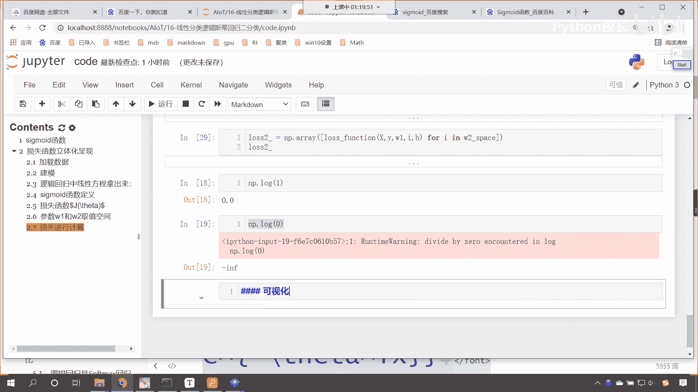