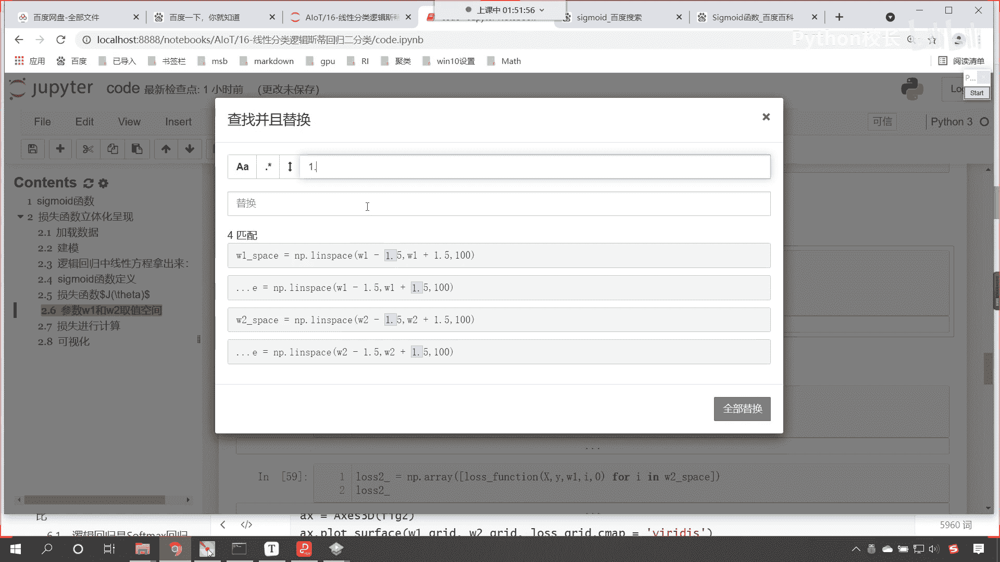
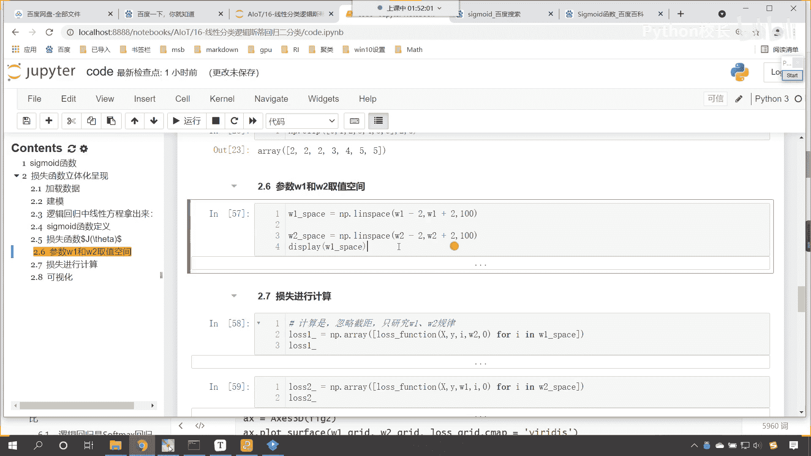
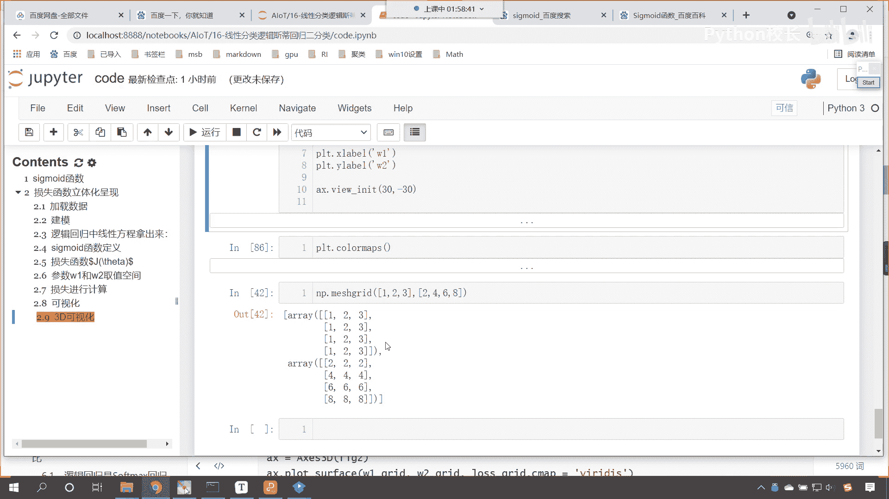

# P106：5-损失函数立体化呈现（二） - 程序大本营 - BV1KL411z7WA

好那么接下来呢咱们继续往下看啊，只要咱们经过这样的一个转变，那么嗯咱们计算出来的概率你就不能无限小啊，为什么这样他就不会报那个粉红色的提示了，因为我们进行了呃这个裁剪。

那也就意味着咱们计算出来的值它不能无限小，那它就不能无限小，这样的话就不会出现nf这种情况了，好那么咱们的数据都准备好了，接下来呢咱们就进行一个可视化好，那么咱们首先呢嗯咱们就可视化。

看咱们首先呢就就可视化咱们w一是吧，那这个时候呢咱们就创建一个figure，咱们plt点飞哥，给它调整一个尺寸，figure size，咱们给一个12和九，有了这个figure一之后呢，咱们plt。

sub plot，这就是添加一个子视图，两行两列，第一个，然后呢咱们就plt。plot，这个时候就开始画图，咱们画咱们的线性图，将咱们的w space绘制出来，然后呢损失函数不也有了吗。

咱们将loss一发放进去，我们给一个color，咱们这个color呢等于gin，这个时候你看我一执行诶，大家现在就能够看到，你看这个是不是就是咱们所绘制出来的，这个损失函数呀，看到了吧。

此时就是咱们绘制出来这个损失函数，那你看到这个损失函数，你告诉我咱们这个损失函数，它其实是看这个损失函数，它是不是一个这个凸函数呀，看到这个损失函数是一个下凸函数，对不对。

那你想这个损失函数是一个下凸函数，那请问它是不是就有这个最优解呀，啊咱们这个损失函数呢它是一个凸函数，我们也把它叫做下凸函数，看这个呢就叫做下凸函数，那么它呢是存在最优解的，对不对。

我们是不是就可以通过梯度下降，一步一步找到它的解呀，好带大家看看，这是对咱们w e而言，这是对于一个系数而言，那同样我们是不是还有第二个系数呀，第二个系数是咱们的w2 ，接下来呢咱们就绘制一下w2 啊。

好那这个时候呢就是p t点，咱们这个添加一个子视图，那就是p t。sub plot，咱们来一个两行两列，这个时候是第二个是不是好，那么咱们plt点调用plot这个函数，咱们将w2 space放进去。

咱们将loss 2放进去，唉选中咱们的w2 space，然后这个loss 2放进去，这个时候我们给一个color，咱们让这个color等于red，这个时候你看我一执行，唉。

大家现在就能够看到w2 是不是也一样呀，对不对，注意啊，这两个这两个w一和w2 ，它的范围是不一样的啊，你看这个w2 的范围，这个我们这个时候呢咱们给它一个这个标题吧，那就是plt。

title t i t l e是吧，这个是咱们的w1 ，然后下面这个呢我们plt。title，t i t l e，咱们呢给一个w2 ，这个时候你看我一执行，大家看这个是w，一个是w2 。

注意他俩是不一样的啊，范围是不一样的，这个范围是从-3~1，这个范围你看是从-2~1点五，是不是唉，你注意看注意咱们有一个区域看到了，我们有一个区域是不是，你看是不是基本是水平的呀。

那为什么它是水平的呢，你知道这个区域为什么变成水平了的吗是吧，为什么，是因为呢，我们上面这个数据在进行计算的时候啊，咱们这个数据在进行计算的时候，它是不是有趋近于零的这种可能呀，对不对。

你看它有趋近于零这种可能，所以说呢一旦它太趋近于零的话，你想它是不是就平了呀，对不对，你看它趋近于零，那么这条线呢就平了，知道吗，所以说它有这样的一个情况好，那么我们如果说你看到这个曲线。

这个不美观怎么办，咱们可以调什么呢，看上面咱们滑动，咱们在给w1 w2 这个区间的时候，你看我们是不是w一减二啊，然后w一加二是不是，那么我们这个范围，咱们是不是可以把它调小一些呀。

看我给你调小一些就可以了，咱们怎么样让它减一，看我们依然让他减二，但是我们不让他加二了是吧，我们让他加一，你看这个是不是可以调呀，数据的范围吗，这个是可以调的啊，执行一下啊，现在我微微做了调整。

w一加一，这是w2 加二，然后呢咱们这个重新计算一下运算，loss一计算一下，loss 2计算一下，然后呢我们画出来图，这个时候你看我在执行，现在你再来看这条线，是不是就不存在这样的问题了，看到了吧。

然后呢我们接下来再画图啊，咱们在画的这个图呢，嗯他呢就是咱们这种图形了，哎你现在来看啊，就是咱们这种图形，你知道这种图形叫什么吗，这种图形叫做等高线，就是里面这个圈是吧，哎它是一个等高线，越往外面是吧。

这个等高线就越高，还有咱们这个颜色好，那么我们上面这个图咱们画的是w1 ，第二个图画w2 ，咱们能不能把w一和w2 同时给它画出来呢，可以横坐标是横坐标是咱们的w1 ，纵坐标是咱们的w2 。

这个是可以画出来的啊，来现在回到代码当中，咱们呢给各位演示一下啊，此时呢plt。sub plot，咱们添加一个子视图，两行两列，那就是第三个，现在的话咱们就绘制一个这个呢叫做等高线，看叫等高线。

那我们将w一和咱们的w2 咱们的同时进行啊，和w2 看咱们同时来进行绘制好，那么这个时候如果想要同时绘制的话，咱们得绘制一下网格线，np里边有一个方法叫mesh grade，这个mesh就有交叉的意思。

grade就有网格的意思，那这个是什么意思呢，啊咱们把w space放进去，w2 space放进去，那么它就会生成一个网格线，我给你演示一下啊，看np。mash grade，让你看一下什么是网格线。

中括号，咱们来一个135逗号，再来一个中括号，246，你看现在咱们是不是给了这样的数据呀，这个时候你看我一执行，大家现在来看咱们的123和246，它就变成什么样的数据了，你看他是不是根据对方的这个形状。

进行了一个延伸呀，是不是进行了一个数据的衍生，你看他是怎么衍生的，你原来这个数据是不是只有123，对不对，你看你原来的数据只有123，现在怎么样了，你看到了吧，一，三，现在你有没有发现这个数据就变多了。

你看变成二维了，是不是，我现在呢再给你增加一个叫2468，咱们再来看一下它的规律，现在你就能够发现你看咱们的数据，看看咱们的数据啊，原来是123，现在你看变成了这个二维的数据，是不是123123。

123123，他是不是变成了四行，看它为什么变成了四行呀，因为我们第二个数据你就能够发现，看看咱们的第二个数据，第二个数据是不是四个，这第一个数据是三个对吧，看看咱们第一个数据是三个，没问题吧。

2468，第二个数据是不是四个呀，那么它俩进行网格交叉啊，他俩进行网格交叉，最后变成的结果是什么，看变成的结果，咱们这个你看因为你对应的数据是四行，你发现规律它是不是就是四行。

看这个是不是就是四行三列呀，对不对，你看那这个四行三列，你就能够发现这个123123，你看它就变成什么了，看到了吧，这第一行是123，第二行也是123，第三行是123，第四行是不是也是123呀。

这为啥变成四行，就是因为它的第二个数据2468是四个数，所以说就变成了123，那我们再看咱们第二个数据啊，你能发现咱们第二个数据，你看它是不是也是四行呀，看到了吗，它呢也是四行，它是不是也是三列呀。

对不对，你看它也是四行三列，这个时候你就能够发现，你看我们的力，这第一列是2468，第二列是不是也是2468，第三列是不是也是2468，这什么叫网格交叉呀，我给你举个例子啊。

看啊咱们就画一个水平的好不好，咱们再画一个数值的，我们水平的这个数据呢，咱们假设说就改成看咱们水平的这个数据呢，看我们就改成一，给一个二，然后呢给一个三数值的这个数据呢，咱们给一个二嗯，给一个四。

给一个六，然后再给一个八，看什么叫网格交叉，非常形象，你看啊它非常形象，啥叫网格交叉呀，看你这不是一点吗，向上滑，这是二点，向上滑，三向上滑，水平的这个二，看了吧，水平的四水瓶的这个六，然后八嗯。

现在你就能够发现经过咱们网格交叉之后，咱们这个数据就变成啥了，你看我们是几行几列，咱们是不是四行三列，现在你看咱们生成的数据，是不是就是四行三列的数据，看到了吧，咱们来一个橡皮擦啊，好我们来一个橡皮擦。

咱们把这个给它擦掉，看是不是，看到了吗，怎么样，看到了吧，是不是好，那你想这个时候我们选其中的一个点，看，这个时候我把其中的一个点给你这个描述出来，看你比如说这个点儿它的数据应该是多少。

是不是一和六的一个组合呀，对不对，你看这个是不是就是一和六，是不是，然后呢这个点呢是不是就是二和六，这个点是不是就是三和六呀，对不对，所以咱们在进行这个交叉的时候，你看啊我们画成这个。

看咱们画成这个这个绿色的啊，看666它是不是就是三个六呀，看那他和谁进行这个组合呢，他是不是和123呀，看了你这个时候666和咱们的123，是不是就是在对应咱们绿色的这三个点呀，所以说如果数据是这样的。

我们画图形是不是就可以画一个网格线呀，是不是就可以画一个这个等高线呀，好这是咱们这个方法的介绍，那咱们现在就使用这个方法，我们进行相应的一个这个转换啊，那这个时候就是w一下划线。

grade w2 下划线，格瑞等于好，有了这个数据之后，咱们紧接着呢根据咱们这个数据，咱们进行一个计算好，那这个时候咱们就调用咱们的这个loss function好，那么我们将x放进去，咱们将y放进去。

然后呢将w1 grade放进去，将w2 格瑞的放进去，这个时候他会统一进行计算，然后最后一个参数把b放进去，那我们求解出来这个值啊，就是咱们的loss l o s s叫lost grade。

我们现在放的数据是不是就是一个矩阵呀，看到了吗，现在咱们求解出来的这个啊，求解出来的它就是矩阵，那矩阵求解出来之后呢，我们把这个方法把矩阵放到咱们loss function当中，咱们求解出来的也是矩阵。

那矩阵是不是就有行和列，那咱们就画出来看，那怎么才能画出来呢，那就是p t点，我们调用content看cn counter这个方法，咱们呢将横坐标w一放进去，纵坐标w2 grade放进去。

那我们对应的数值呢就是咱们的law，就是咱们lows grade，这个时候呢我们给一个颜色，咱们这个color呢我们就给一个purple，给一个紫色的来，这个时候你看过一执行唉，来大家现在就能够看到。

你看此时的这个等高线，咱们是不是就画出来了，看到了吧，此时的这个等高线就画出来了，那么我们此时所画出来的这个等高线嗯，各位小伙伴能够看到，咱们这个等高线是不是不像一个圆圈呀，对不对，为什么呀。

哎就是因为我们嗯这个这个空间范围是吧，咱们这儿给的是-2，是不是我们让他加，我们让他加上了一，那咱们现在呢再来调整一下啊，来执行一下啊，执行一下，现在的话重新计算一下w一和w2 。

好重新计算一下咱们的w一和w2 ，现在的话咱们再来绘制一下啊，啊现在咱们再来绘制一下，好大家现在就能够看到，此时你看我画出来，这个是不是就像一个等高线了，但是和咱们和咱们上面这个代码画出来的。

等高线是不是还是不太一样呀，对不对，你看上面这个等高线画出来就是一圈一圈，就像咱们扔一个石头，扔到水里边，是不是产生的一个一个波纹呀，这个更完美，那我告诉你为什么为啥咱们这个就不行了呢。

是因为我们洁具的影响啊，是因为咱们截距的影响，你看啊，咱们求解出来的截距是多少呢，咱们求解出来的截距是不是这个呀，你看这个截距是不是19。6呀，这个截距大不大，看这个结局是不是特别大，np。log嗯。

咱们使用咱们的sigmoid的函数，你看1÷1加上np点，看log，咱们将19放进去，你看这个np。e x p是吧，e x p 19放进去，你看我们单单把咱们的截距19。67放进去，你看我求解出来的。

咱们所求解出来的这个概率，它是e的-9次幂，看到了吧，这是e的-9次幂，这个数是不是特别特别小呀，对不对，这个数特别特别小，那我们有了这个方程的截距，咱们在进行这个sigma的计算的时候看到了吧。

这个时候咱们是不是这个方程，它是不是受咱们截距的影响特别大呀，因为你这个b是19，对不对，所以说呢哎就对它有一个非常大的影响，这也就是为什么咱们只要把这个b一放进去，我们画出来这个图呢就不够好看。

现在怎么办，咱们呢操作一下啊，看我们怎么操作呢，我们令b等于零行不行，这b等于零意味着什么，b等于零，是不是意味着我就不算截距了，对不对，来重新执行一下啊，看啊不要截距了，现在咱们进行一个说明啊。

咱们计算时好，咱们忽略，计算时呢我们忽略结局，啊咱们忽略结局，那为啥可以忽略结局呢，因为我只研究，那因为咱们只研究w一和咱们的w2 对吧，我们研究w一和w2 的规律，所以这个时候呢咱们忽略结局也没关系。

执行一下截距就忽略了啊，这个时候咱们的截距呢就忽略了好，那么这个截距忽略之后呢，嗯咱们我们这个p呢，嗯这个裁剪咱们就给他注掉啊，执行一下好，我们现在就不裁剪了，注掉因为啥呀，因为你想我计算出来的对数。

我使我使用sigmoid计算出来的这个概率，你想它是不是可以很小呀，只要我给19，你就能够发现它是不是e的-9次幂，咱们现在给的这个是多少，是不是百万分之一啊，这百万分之一大。

还是咱们的e的-1的-9次幂大呀，很显然是不是百万分之一要大得多呀，所以现在既然我们忽略了截距，是不是啊，那么我们就不要对这个p进行裁剪了，把这行代码注掉之后，你这个代码要执行一下啊，注意啊。

要执行一下，现在呢咱们重新计算一下咱们的loss 1，然后呢再计算一下咱们的loss 2，现在你就能够发现这个，此时是不是又出现了一个nnf呀，对不对，你看此时又出现了一个这个nnf是吧。

它依然出现的这个问题呢，是divided by zero，是不是这个也没关系啊，我们照样画图把它画出来，是不是啊，咱们一起来看一下啊，好那么可视化一下，执行，嗯这个时候呢我看一下啊。

咱们所画出来这个数据呢，嗯大家看啊，这个虽然有拐弯，但是效果呢是不是也不太好呀，呃我们出现了这种情况呢，咱们还得去我看看啊，还得去调一下啊，来我们往上滑看一下咱们的，这个取值的空间我看一下啊。

往上滑一点，看一下咱们w1 w2 的取值空间，我们是w一减二，w2 加二，是不是呃，那我们调一下咱们的这个空间吧，看调一下咱们这个空间，我们对于w2 呢，咱们这个各取1。5，看一下怎么样啊。

嗯其实咱们为了研究这个数据，我们希望能画出来这个图形漂亮一些，是不是来执行一下好，那么现在呢咱们就有了这样的一个范围，然后呢我们就计算咱们的这个损失函数好，那么这个损失函数在进行这个操作的时候。

因为我们的b呢给了个零，所以说这个sigmoid计算的时候，他就用咱们传入的这个数据，好那么执行这个代码嗯，los一就出来了，没有问题，在执行这个代码，los 2也就出来了，现在是不是就不报那个问题了。

我们如果给的这个数据范围太宽的话，那它就容易出现咱们刚才的那种情况，容易出现i n f就是英菲尼迪那种情况，现在呢来咱们绘制一下好，大家看啊，这个就是咱们的这个等高线，那我们发现咱们这个等高线是吧。

依然不太行是吧，这个颜色呢让它自定义就行了啊，嗯我看一下啊，这个时候咱们画出来这个图形依然不太像，是不是w space w2 space好，你看我们这儿是不是又给了个b，咱把b调整成零。

嗯这个时候大家看这个就是咱们的这个等高线，好，那么这个没有出现这个涟漪是吧，那么大家可以在课下的时候，根据咱们上课的这个代码，我们呢来进行这个调整一下就可以了啊，根据咱们上课的这个代码调整一下。

因为你就能够看到啊，我们这里边儿咱们进行相应的操作是吧，呃我们不一样的地方，咱们就是加了一个b嘛，是不是啊，这个这个是没有太大影响的啊，来咱们继续啊，好，那么这个时候你看它有这个粉红色的这个提示。

是不是那个粉红色的提示呢，咱们可以我们在上面插入一行，咱们导一个包啊，import warning，我们设置一下叫filter warnings，咱们给一个一个now，因为这个粉红色的提示。

归根结底它呢只是一个提示而已，知道吧，粉红色的提示它呢只是一个提示而已，好那么有了这个有了咱们这个数据之后呢，咱们紧接着呢再画一个啊井号，我们刚才画了一个等高线是吧，咱们再来一个等高面。

啊再来一个等高面，那这个数据呢咱们已经获得到了，那这个等高面呢咱们就添加子视图，prt。sub plot，两行两列，咱们第四个，这个时候子视图就有了。

然后呢咱们就叫ctrl f看上面这个counter是等高线，那counter f呢就是咱们的等高面，把数据放进去，ctrl c在这儿呢，ctrl v看依然是横坐标，纵坐标，咱们求的数据。

这个时候你看我一执行，哎，现在你就能够发现你看这样的一个这个等高，这样咱们的一个这个等高线是吧，哎我们就出来了啊，嗯这样的一个这个等高面咱们就出来了，好那么咱们现在呢还是要去这个看一下啊。

为什么咱们这个数据是吧，求解出来这个它就有点偏差呢，是不是啊，那我们得这个研究一下啊，那这个出现问题的地方，可能就是在这个地方叫w space，来我们调一下咱们的代码。

其实咱们可视化这个案例呢基本上就讲完了，讲完了之后呢，来咱们去调一下啊，看一下咱们这个啊，看一下是哪个地方可能出现了一丁点儿问题啊，来那么我们代码重新执行一遍，好不好，好，那么嗯各位小伙伴就能够发现呃。

咱们这个数据当中呢，看咱们这个数据当中是不是没有进行标准化呀，啊我们没有进行标准化，现在呢咱们对这个数据进行一个标准化，你发现不进行标准化，咱们画出来这个数据是不是不太好看呀。

来现在呢咱们就进行一个这个数据的标准化好，那么数据标准化，咱们呢需要对于咱们的这个x进行一个标准化，那么我们就往上走，找见咱们的xx呢，就等于skill小括号，咱们将x放进去。

在这儿呢咱们进行一个说明好，这个地方呢咱们对数据，进行z sc，进行z score的这个归一化，好那么我们执行一下这个代码，你看我们如果要对x这个数据进行z score，归一化，那大家想。

咱们这个数据范围，是不是就变成了一个正态分布了，然后呢咱们进行训练训练之后呢，咱们获取它的这个数据啊，训练之后咱们获取相应的这个数据，获取了相应数据之后，大家看啊，进行了规划之后。

你看方程的截距是不是就小多了，那么定义函数咱们依然给这个函数是吧，给他b，然后呢咱们定义咱们的这个损失函数执行，然后呢，咱们声明咱们的这个嗯这个参数，w1 w的这个命名空间，我们将这个1。5呢。

现在咱们再给它调回成二啊。

选中它来一个f，咱们将这个1。5你看然后把它替换成二。

然后全部替换，你看是不是就全部替换成二了。

选中他按f上面是你想要替换谁。

下面是替换成的值就可以了，然后呢我们进行计算，哎大家看现在就计算成功了，这是规划的数据，loss 2，咱们也进行一个计算，这也就计算成功了，好那么开始画图吧，这个时候你看我一直讲诶，大家现在来看。

此时是不是就像了，看到了吧，此时是不是就就像了呀，那我们把它的范围给它调宽一些啊，好不好，咱们将它的范围调宽一些，我们这个地方不是减二吗，咱们调成减四好不好，调成减四，这个时候范围就宽了。

损失函数呢重新计算，嗯然后呢咱们这个l2 呢我们也重新计算，画图现在呢咱们看一下，现在你就能够看到怎么样，这个数据是不是就看到了吧，你能够发现w一是不是梯度下降呀，可以找到最低点。

w2 是不是梯度下降也可以找到最低点，我们现在得到的这个图呢，看咱们现在得到的这个图，你现在就发现嗯，你有没有感觉到，我们就是比如说这个等高面儿啊，咱们再向下走的过程当中是不是越来越深。

是不是越来越低呀，我们再调一下啊，嗯咱们让他加四，这个二呢也让它都变成四，好不好，这样的话咱们的范围就更宽了，是不是计算l1 ，计算l2 是吧，重新计算一下啊，计算l一计算l2 好，然后的话咱们就画图。

这个时候你看我一执行，哎大家现在来看啊，哎这就是咱们求解出来的这个数据，是不是就是越往中心，你可以认为越往中心看，越往中心，这就是咱们的这个嗯谷底它越深，说明离我们越远。

这就是这就是咱们下山的时候那个呃那个山谷，所以这不就是可以进行梯度下降吗，从最高的地方，我们是不是可以一步一步的向下走呀，对不对呀，走到这个地方，咱们就找到最优解了。

所以这个呢就是咱们数据可视化的这部分代码，好，那么我们最后呢，咱们还有一个这个3d的可视化，是不是，来，现在的话咱们就绘制一个这个3d的可视化啊，好那么来咱们这个再给它添加一个这个子标题。

这个呢就是3d啊，这是咱们3d的一个可视化，好，那么3d的可视化呢，嗯咱们给他创建一个子视图叫figure，二，就等于p t点，咱们创建一个figure尺寸，给它调整一下。

那给他一个figure size，咱们呢就给一个12和九，根据咱们刚才的这个操作呢，你也能够发现我们在进行这个模型训练的时候，归一化是不是不可避免呀，对不对，你看不进行归一化，咱们这个数据呢就不太好看。

是不是啊，所以说这一步归一化它呢是很重要的啊，好那么创建咱们的3d子视图，咱们调用它的plot p l o t，它里边呢有一个方法叫plot surface，surface就有面儿的意思。

看咱们将求解出来的w e grade放进去，然后w2 w2 grade放进去，来一grade放进去，然后w2 grade放进去，这个w2 grade不就相当于咱们的这个纵坐标吗。

然后将咱们的loss grade放进去，g r i d，然后呢我们给它一个颜色吧，c map，那这个c map就是它的颜色对应，这个颜色对应可以选很多，然后plt接下来就是设置，咱们设置一下它的横坐标。

起个名叫w1 ，然后再设置一下它的纵坐标，plt。y label，咱们给一个这个w2 ，这个c map大家之前没有接触过，是不是好，马上呢我们就给大家介绍一下啊，然后调整一下它的视图，视图的角度。

30和-30，执行一下，这个看一下咱们某一个地方给错了是吧，has no property，这个这个是c map啊，这个m和a是吧，哎给写反了，这个时候你看我一执行。

咱们现在是不是就将3d的可视化给画出来了，那我们知道这个c map代表颜色，你看这个颜色呢我可以给一个grey，grey是不是就表示灰色呀，看到了吧，我们还可以给什么呢，还可以给rainbow。

这个rainbow呢就代表彩虹色，那这些颜色咱们可以去哪里找呢，看那就是p l t一点color，看plt。color co叫做color map，你看我一执行这个当中是不是有很多颜色呀，你都可以选啊。

知道吗，这个颜色都可以选color map当中，这些都可以选，所以说你看到这个3d图形，是不是也能够看到它有一个谷底呀，看到了吧，它也是有一个谷底的啊，好那么这个呢就是咱们相应的这个损失函数。

