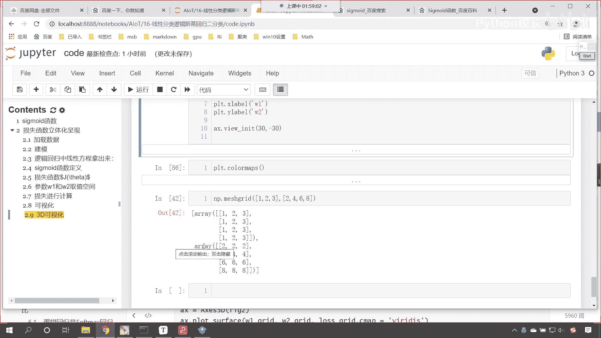
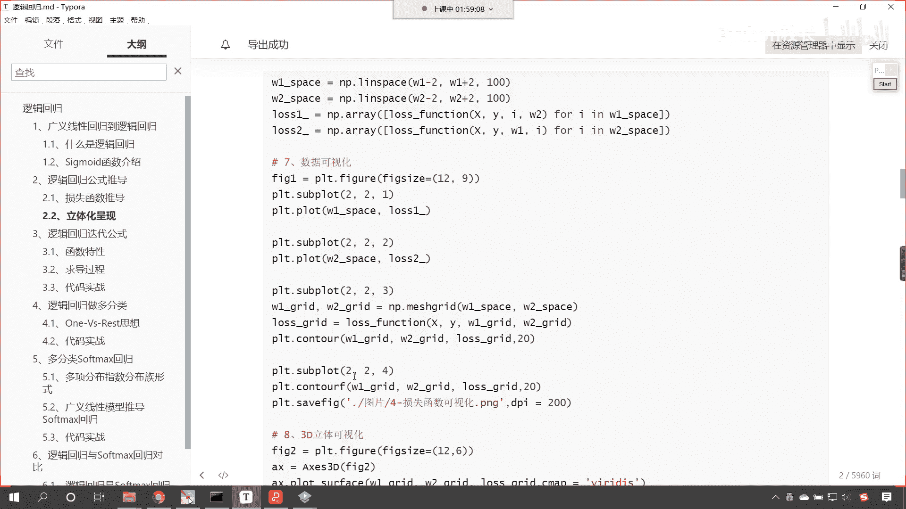
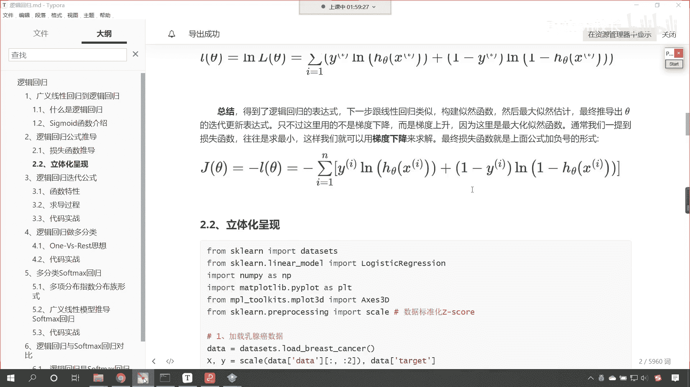
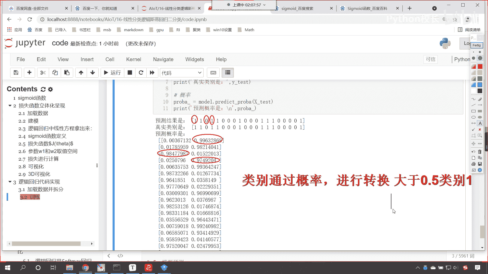
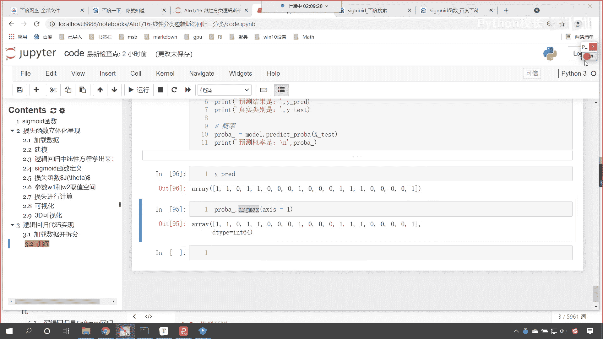
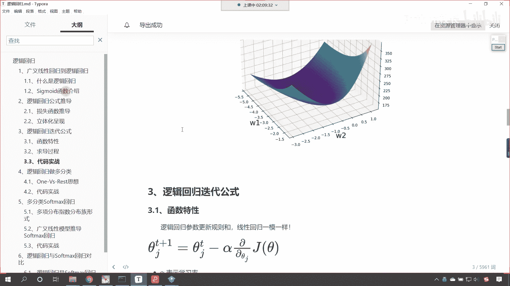
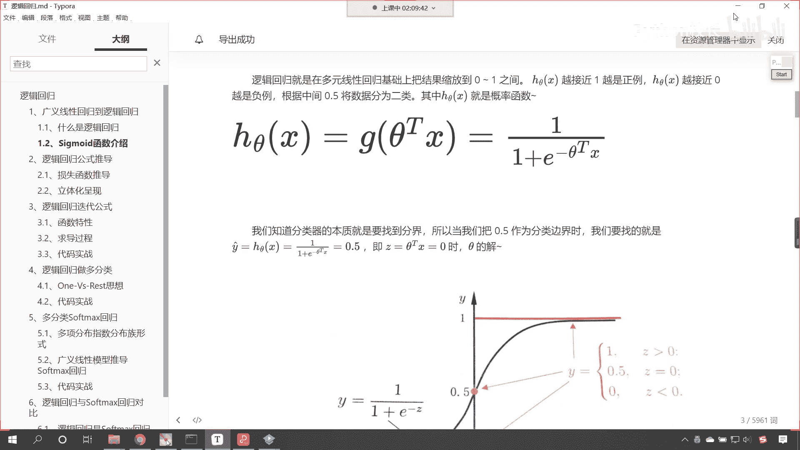
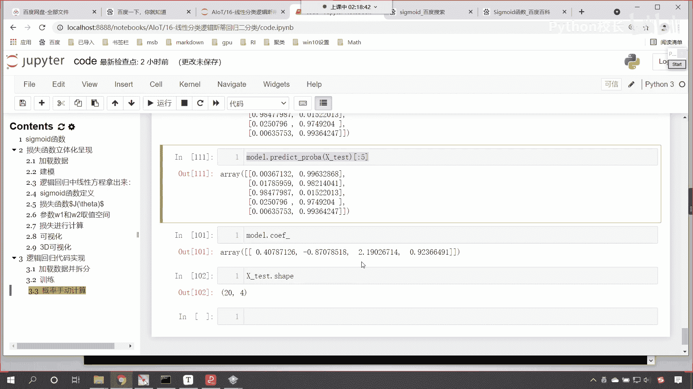

# P107：6-逻辑回归代码实现与概率手动计算 - 程序大本营 - BV1KL411z7WA

来接下来呢我们继续往下看啊，咱们现在已经知道了。

咱们这个数据呢啊也就是说咱们逻辑斯蒂回归。

就这个损失函数，咱们把它画出来了，对不对，这个损失函数画出来了，咱们就能够发现它呢是一个下凸的函数，下凸的函数是不是表明它一定有这个最优解呀，对不对。

那我们现在就不用考虑这个问题了，那嗯接下来呢，咱们呢就看一下它相应的这个代码实现，就是你怎么去实现呢，是不是来现在回到代码当中，咱们就看一下这个代码的实现的这个过程。

好现在的话咱们在这儿来一个三级标题，这个呢就叫做逻辑回归啊，咱们的代码实现，现在的话咱们这个加载一下数据上面啊，我们先导包啊，import npas s n p from sk learn。

点linear model，咱们导入logistic regression from sk learn，咱们import data sets，执行一下这个代码，接下来咱们就加载数据，low的eris。

我们将这个圆为花加载进来，里边给一个参数，return x y让它等于true，这个时候我们加载进来的数据就是x和y，那有了这个x和y之后，打印输出一下咱们的y，现在你能够发现是不是012呀。

这说明它分三类，对不对呀，默认情况下它是分三类，现在呢我们讲的是二分类问题，对不对，那我们给把这个数据给他化简一下啊，y不等于二，这个是不是就是一个条件呀，有了这个条件。

咱们就可以根据这个条件来进行数据筛选，新的x就根据这个条件筛选一下，就是说你不等于二，就等于true是吧，你如果要等于二的话，我是不是就将数据过滤掉呀，看这个条件其实就是过滤数据，过滤什么样的数据呢。

唉如果你的类别是二，那怎么样，那是不是就过滤掉，然后x过滤了y是不是也得过滤，y就等于y中括c n d，这个时候我给你演示一下，咱们新的y，你看是不是新的y是不是就是零和一呀。

好那咱们有了这个数据之后呢，上面咱们再导包导进来，from sk learn，这个pre processing，咱们import train，看咱们将这个训练数据和测试数据呢，我们给它这个导包导进来啊。

这个叫做model selection，咱们import train test split，这个方法咱们之前有没有介绍过呀，train test split，你一看这个方法。

它的命名是不是就是训练数据和测试数据，你看它就是训练数据和测试数据，是不是进行了一个拆分呀，split是不是就是拆分，那我们数据x和y咱们是100个，咱们对它进行一个拆分啊，那调用咱们这个方法。

那就是train test split，上面这个代码需要执行一下，然后train test split，咱们将x和y放进去，它是怎样的一个拆分比例呢，test size等于0。2，这个是啥意思。

也就是说咱们将训练数据和测试数据啊，咱们将训练数据和测试数据咱们进行拆分，80%是我们的训练数据保留20%，看咱们保留20%作为咱们的测试数据，大家想我们对x拆分是不是一分为二。

对于y拆分是不是也一分为二，所以说这两个数据拆分之后，他是不是会得到四个数据呀，那咱们就接收一下，那就是x tra x下划线test，它先拆分x y呢也按照相同的规则进行拆分。

那就是y乘y x这个时候呢咱们display一下啊，看一下咱们的数据的结构，那就是x train。ship x下划线test。sh，然后看一下咱们y的数据。

display y下划线串点ship y下划线test。sh，上面有一个参数给写错了是吧，因为这个都是对应的啊，一个是训练数据测试数据，训练数据测试数据，这个时候你看我一执行。

大家看是不是就是80 20 80 40呀，对不对好，那么咱们这个数据呢我们就搞定了，上面插入一行，来一个四级标题，这个呢就是加载数据并怎么样拆分好，那么接下来我们就训练一下吧，再来一个四级标题。

然后呢咱们就训练训练呢声明一个model，model呢就等于logist t regression，然后呢model。feat，咱们将x下划线串放进去，y下划线串放进去，这个时候是不是就训练了。

然后model。predict，这个是不是预测咱们将测试数据放进去，得到的这个结果起个名就叫做外gum predict，里边还有一个方法叫做predict，probe probe，什么意思。

来probe什么意思，是不是probability的缩写呀，这个probe就表示概率的意思啊，probe表示啥，是不是表示概率呀，这个时候呢咱们打印输出一下啊，看看咱们print输出一下好。

那么我们的预测结果是逗号，咱们将y predict放进去，下面我们是不是计算了概率呀，咱们也来一个print好，那这个就是咱们预测的概率是冒号反斜杠n，反斜杠n表示换行，把咱们的probe放进去啊。

这个时候你看我一执行，看咱们的预测概率是不是110，100是不是出来了吧，这个结果概率是不是也出来了，好那么同样呃，这个时候呢我们再打印一下这个唉真实的类别。

你看真实的类别是是不是咱们的y下划线test，来执行一下，大家看啊，上面是预测的结果，下面是不是咱们真实的结果呀，准确率是不是百分之百，这20个数据是不是全部给预测准确了呀，现在呢我们就看一下。

这为什么第一个预测出来的类别是一看，为什么啊，概率看到了吧，因为这个类别是一的概率，你看它是不是0。996呀，所以说你看它是不是一第二个一，那第三个为什么是零，你看咱们第三个数据计算出来的概率。

是不是0。9847啊，所以说它就是一第四个呢，你看0。9749，所以说它对应一对不对，所以说咱们的类别是怎么来的，咱们上面那个类别是如何来的，看到了吧，这个类别是不是通过概率，进行了一个转换呀。

对不对呀，咱们说你如果要是大于0。5，是不是就是类别一对不对，哎，你如果要是大于0。5，类别一小于0。5。

是不是就是类别零，对不对，来我现在给你演示一下啊，看probe pro ba是不是一个概率，咱把它转换成类别，调用什么arg max给一个轴，我们让它等于一，这个时候你看我一直行。

还记得arg max这个函数和方法吗，来各位小伙伴，你看啊，咱们只要一进行arg max，你看我求解出来的是不是就是概率，是不是就是类别，你看咱们将y predict打印输出一下，看到了吧。

这个是不是最大值的索引，所以你看，这个就是通过概率是不是转换成类别，上面是不是算法预测出来的类别好，那我们下面这个框呢是什么，咱们呢就是概率是不是转换为类别呀，你看和上面的这个是不是一模一样，看到了吧。

它和上面的结果看到了一模一样，对不对，好，那么问题来了，咱们的概率是怎么计算的呢，概率是怎么计算的。

逻辑斯蒂回归的概率是怎么计算的。

看是不是通过这个函数计算的，是不是hc塔一加上e的负x，e的负c塔tx是不是来咱们计算一下。

现在呢咱们这个给他来一个四级标题，这个时候呢那就是概率，看咱们手动计算上面，咱们声明了算法计算没问题，那现在咱们手动计算，我们就定义这样的一个方法叫sigmoid，好不好，传一个x冒号是吧。

那这个时候呢咱们就return，然后此时呢咱们就进行了一个这个return好，那么那这个return呢是不是就是一除以小括号一，加上np。e x p是不是给他一个负x呀，我们这个把公式给它写成z啊。

因为这个z呢表示咱们的方程，看咱们给它定义成z好不好，好那大家看这个公式是不是就定义了，有了公式定义之后，咱们就获取系数w就等于model。coe，这个是不是系数b是不是就等于model。

intercept呀，这是不是咱们方程的系数井号注释一下，看这个就是咱们的方程的系数和截距没问题吧，有了方程的系数和截距，咱们是不是就可以求解方程，是不是就可以求解咱们的线性方程了。

线性方程咱们就让它等于z z就等于多少是吧，咱们现在呢就进行矩阵运算啊，test是不是咱们保留的数据呀，点儿咱们来一个dot，我们把w放进去，然后加上b z是不是就有了，然后咱们计算概率p看啊。

p就等于什么，是不是就是咱们的sigmoid的函数呀，我们把z放进去干啊，p等于多少，执行输出一下啊，我们某一个地方给错了是吧，这个sheep是20和四，但是咱们这个是一和四，是不是啊，我们看一下啊。

好那咱们就明白了是吧，那形状不对应，咱们现在呢稍等啊，我们操作一下ctrl c，来ctrl v我们查看一下它的形状，是咱们的这个这个系数呢是不太对应的，是不是啊，看啊这个是24是吧，这个是一和四。

那简单啊获取的这个w咱们中括号来一个零，这个时候你看我在执行是不是就可以了，因为我们所求解出来这个系数呢，给大家看一下啊，看你看你复制一下，你看这个系数求得的结果是不是二维的，看到了吧。

求得的结果是二维的，而我们矩阵运算它是不是要求形状得匹配呀，x test它的形状是什么样的，给你看一下x test它的ship是不是20和四呀，所以说那我们在进行计算的时候，咱们要么把这个数据取出来看。

要么我们在进行乘法的时候，咱们进行一个resh，那就是r e s h a p e reshape，咱们来一个-1，这个时候一执行也没问题，ok你看p计算出来了，我们计算出来的p和上面计算出来的p。

怎么不一样呀，看一下上面计算出来的p啊，看看一下咱们算法计算出来的p model，点predict probe，咱们将x下划线test放进去，大家看观察到相同的地方了吗，你看啊，0。99632826。

看这个0。996328681样不一样，看看这个啊，0。01522031，看到了吧，0。01522013，这可是保留八位数啊，也就是说我们这个是不是第二列，对不对，看到了吗，这个是第二列，对不对。

为啥为啥是他呢，因为第二列是正列，因为第二列是正立，看啊，在这咱们要说明一下，一般一一般情况下，我们第一列是不是代表零，第二列是不是代表一，对不对，所以说它计算概率的时候，它优酸计算咱们的这个第二列。

那你知道只要有了第二列，咱们第一列是不是就可以计算出来，因为第一列和第二列它们的概率和等于多少，来你告诉我在咱们的讨论区里边儿，咱们如果是二分类，那么这两个类别的和是不是就是一呀，哎那这个也很简单啊。

来咱们现在就操作一下，这个时候咱们np。c o l stack，看这个就是数据的集成，我们我们把这个一减p放进去，然后逗号再来一个p，这个时候你看我一直这个时候呢，你看我一直行好。

那么我们这儿呢应该给一个列表啊，给一个列表，这个时候你看我一直行数据是不是得到了，看到了吗，这个c o l它呢代表着列合并啊，这个代表列合并和咱们np。concocnate，方法类似啊，方法类似。

那来我来给你演示一下，contacculate，剪切一下ctrl v，你看这个是列合并，那如果要是contact innate是吧，咱们来一个中括号，那就是一减p是吧，逗号来一个p。

这个时候呢你还得再加一个中括号才行，加一个中括号，再加一个中国，然后逗号咱们给一个轴，让这个轴等于一，这个时候你看过一执行，嗯我看一下咱们这个数据啊，0。03，这个时候合并了吗，我看一下0。98。

那咱们合并完之后呢，还不能直接这样加小括号括起来，得对它进行一个reshape形状改变啊，-1和一这个p呢也得进行一个形状改变，就我可能在写的时候，你需要考虑一下是不是啊。

你看看这个时候一执行has no reshape，给写错了，少写一个e，加上这个e执行一下，你看现在是不是就出来了，也就是说上面这种写法更简单，下边这种写法常规的也行，比较一下啊，咱们就比较前十个吧。

来一个切片好不好啊，比较前五个就行了啊，那算法的预测数据咱们也来前五个，你现在能够看到我们自己手动计算出来的概率，和咱们算法计算出来的概率，你看是不是一模一样，上面是咱们，手动计算出来。

下面是算法计算出来的一模一样，而且呢它的小数看它的小数是精确到嗯，这个小数点儿八位，是不是看精确到小数点后八位，那也就是说我们的模型当中，所用到的这个计算公式，是不是就是咱们所所告诉各位的呀对吧。

你看它里边的计算公式，肯定就是咱们上面这段代码的封装，是不是这是几位，123456788位啊，看这是八位啊，精确到小数点后八位，有的是七位，你知道为什么有的是七位吗，他这是零，所以他没写，知道吗。

看这个是七位是吧，这应该是个零零的话，它就不写了好那么到此为止，咱们就演示了一下，咱们逻辑回归它到底是怎么一回事儿，到底是怎么计算的，你自己能够计算出来是吧，自己写的代码计算出来。

和算法计算出来代码一样。

