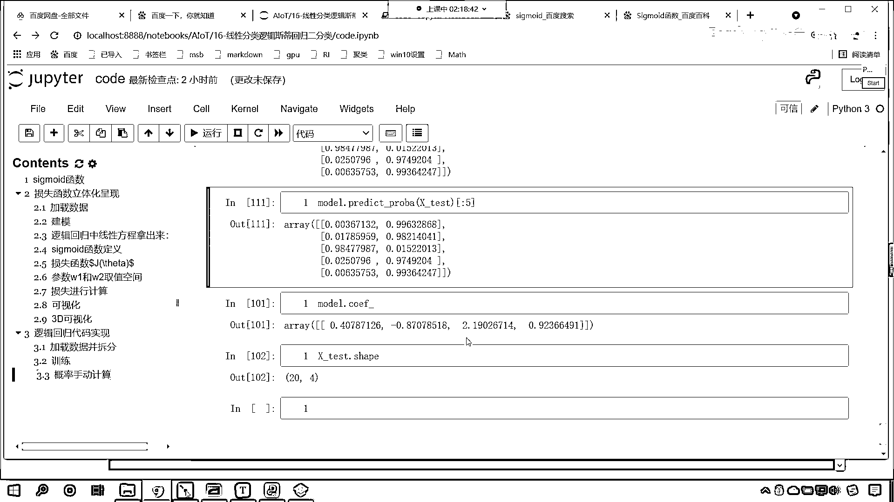

# 7天爆肝整理！AI量化交易-机器学习全套教程，从入门到项目实战保姆级教程！（数据挖掘分析／大数据／可视化／投资／金融／股票／算法） - P107：6-逻辑回归代码实现与概率手动计算 - Python校长 - BV1KL411z7WA

接下來我們繼續往下看啊，咱們現在已經知道了，咱們這個數據呢，也就是說咱們羅技斯蒂回歸，就這個損失函數，咱們把它劃出來了對不對，這個損失函數劃出來了，咱們就能夠發現，它呢是一個下凸的函數。

下凸的函數是不是表明它一定有這個最優解呀，對不對，那我們現在就不用考慮這個問題了，那接下來呢，咱們呢就看一下它相應的這個代碼實現，就是你怎麼去實現的是不是，來現在回到代碼當中。

咱們就看一下這個代碼的實現的這個過程，好現在的話咱們在這來一個三級標題，這個呢就叫做，羅技回歸，咱們的代碼實現，現在的話咱們這個加載一下數據，上面我們先導包啊，import，numpy as np。

from sklearn，。linear model，咱們導入，logistic regression，from sklearn，咱們import data sets，執行一下這個代碼。

接下來咱們就加載數據，load ares，我們將這個原文花加載進來，裡邊給一個參數return x y，讓它等於true，這個時候我們加載進來的數據就是x和y，那有了這個x和y之後呢。

打印輸出一下咱們的y，現在你能夠發現，是不是0 1 2啊，這說明它分三類對不對啊，默認情況下它是分三類，現在呢，我們講的是二分類問題對不對，那我們給把這個數據給它化解一下啊，y不等於2。

這個是不是就是一個條件啊，有了這個條件，咱們就可以根據這個條件來進行數據篩選，新的x就根據這個條件篩選一下，就是說你不等於2就等於true，是吧，你如果要等於2的話，我是不是就將數據過濾掉呀。

看這個條件其實就是過濾數據，過濾什麼樣的數據呢，如果你的類別是2，那怎麼樣，那是不是就過濾掉，讓x過濾了，y是不是也得過濾，y就等於y中括c和d，這個時候我給你演示一下咱們新的y啊。

你看新的y是不是就是0和1呀，好那咱們有了這個數據之後呢，上面咱們再導包導進來，from sklearn，preprocessing，咱們import trun，咱們將這個訓練數據和測試數據呢。

我們給它這個導包導進來啊，這個叫做model selection，咱們import trun test split，這個方法咱們之前有沒有介紹過呀，trun test split。

你一看這個方法它的命名，是不是就是訓練數據和測試數據，你看它就是訓練數據和測試數據，是不是進行了一個拆分呀，split是不是就是拆分，那我們數據x和y咱們是100個，咱們對它進行一個拆分啊。

那調用咱們這個方法，那就是trun test split，上面這個代碼需要執行一下，然後trun test split，咱們將x和y放進去，它是怎樣的一個拆分比例呢，test size等於0。2。

這個是啥意思，也就是說咱們將訓練數據和測試數據，咱們將訓練數據和測試數據，咱們進行拆分，80%是我們的訓練數據，保留20%，咱們保留20%，作為咱們的測試數據，大家想我們對x拆分是不是一分為二。

對於y拆分是不是也一分為二，所以說這兩個數據拆分之後，它是不是會得到四個數據呀，那咱們就接受一下，那就是xtrun，x下環線test它先拆分x，y也按照相同的規則進行拆分，那就是ytrun yx。

這個時候咱們display一下，看一下咱們的數據的結構，那就是xtrun。shape，x下環線test。shape，然後看一下咱們y的數據，display，y下環線trun。shape。

y下環線test。shape，上面有一個參數給寫錯了，是吧，因為這個都是對應的，一個是訓練數據，測試數據，這個時候你看我一執行，大家看，是不是就是80 20 80 40，對不對，好，那麼咱們這個數據呢。

我們就搞定了，上面插入一行來一個四級標題，這個呢就是加載數據，並怎麼樣拆分，好，那麼接下來我們就訓練一下吧，再來一個四級標題，然後呢咱們就訓練，訓練呢，聲明一個model，model呢就等於。

logistic regression，然後呢model。fit，咱們將x下環線trun放進去，y下環線trun放進去，這個時候是不是就訓練了，然後model。predict，這個是不是就是預測。

咱們將測試數據放進去，得到的這個結果起個名就叫做y-predict，裡邊還有一個方法叫做predict prob，prob什麼意思，來prob什麼意思，是不是probability的縮寫。

這個prob就表示概率的意思，prob表示啥，是不是表示概率，這個時候呢咱們打印輸出一下，咱們print輸出一下，好，那麼我們的預測結果是，逗號，咱們將y-predict放進去。

下面我們是不是計算了概率，咱們也來一個print，那這個就是咱們預測的概率是，冒號反斜概n，反斜概n表示換行，把咱們的prob放進去，這個時候你看我一執行，看咱們的預測概率是不是110100是不是。

出來了吧這個結果，概率是不是也出來了，好，那麼同這個時候呢我們再打印一下，這個真實的類別，真實的類別是是不是咱們的外下環線test，來執行一下，大家看啊，上面是預測的結果，下面是不是咱們真實的結果。

準確率是不是100%，這20個數據是不是全部給預測準確了，現在呢，我們就看一下，這為什麼第一個預測出來類別是1呢，看為什麼啊，概率看到了吧，因為這個類別是1的概率，你看它是不是0。996啊。

所以說你看它是不是1，第二個也那第三個為什麼是0，你看咱們第三個數據，計算出來的概率是不是0。9847啊，所以說它就是1，第四個呢你看0。9749，所以說它對應1對不對，所以說咱們的類別是怎麼來的。

咱們上面那個類別是如何來的，看了這個類別是不是通過概率，進行了一個轉換呀，對不對呀，咱們說你如果要是大於0。5，是不是類別1，對不對，你如果要是大於0。5類別1，小於0。5是不是就是類別0，對不對。

來我現在呢給你演示一下啊，看probe，proba是不是一個概率，咱把它轉換成類別，調用什麼，argmax，給一個軸我們讓它等於1，這個時候你看我一直行，還記得argmax這個函數和方法嗎。

來各位小夥伴，你看啊，咱們只要一進行argmax，你看我求解出來的是不是就是概率，是不是就是類別，你看咱們將y_predict打印輸出一下，看到了嗎，這個是不是就是最大值的索引，所以你看。

這個就是通過概率，是不是轉換成類別，上面是不是算法預測出來的類別，看我們下面這個框呢，是什麼，咱們呢就是概率，是不是轉換為類別呀，你看和上面的這個是不是一模一樣，看到了嗎，它和上面的結果看看一模一樣。

對不對，好那麼問題來了，咱們的概率是怎麼計算的呢，概率是怎麼計算的，邏輯思地回歸的概率是怎麼計算的，看是不是通過這個函數計算的，是不是hθ1加上e^-x，e^-θtx是不是，來咱們計算一下。

現在咱們給它來一個四級標題，這個時候呢，那就是概率，咱們手動計算，上面咱們聲明了算法計算沒問題，那現在咱們手動計算，我們就定義這樣的一個方法叫sigma，好不好，傳一個x冒號，是吧，那這個時候呢。

咱們就return，此時呢，咱們就進行了一個這個return，好那麼，那這個return呢，是不是就是1除以小括號1，加上np。exp，是不是給它一個-x呀，我們那個把公式給它寫成z，因為這個z呢。

表示咱們的方程，咱們給它定義成z好不好，好那大家看這個，公式是不是就定義了，有了公式定義之後，咱們就獲取系數，w就等於model。coef，這個是不是系數，b是不是就等於model。

intercept呀，這是不是咱們方程的系數，井號注釋一下，這個就是咱們的方程的系數和節句，沒問題吧，有了方程的系數和節句，咱們是不是就可以求解方程，是不是就可以求解咱們的線性方程了。

線性方程咱們就讓它等於z，z就等於多少，是吧，咱們現在呢就進行矩陣運算，x test是不是咱們保留的數據呀，點兒咱們來一個doubt，我們把w放進去，然後加上b，z是不是就有了，然後咱們計算概率p。

看啊，p就等於什麼，是不是就是咱們的sigma的函數，我們把z放進去，看啊，p等於多少，執行輸出一下，我們某一個地方給錯了，是吧，這個shape是20和4，但是咱們這個是1和4，是不是啊，我們看一下啊。

好，那咱們就明白了，是吧，那形狀不對應，咱們現在呢稍等啊，我們操作一下，control c，來control v，我們查看一下它的形狀，是咱們的這個，這個系數呢，是不太對應的，是不是啊，看啊。

這個是24，是吧，這個是1和4，那簡單啊，獲取的這個w咱們中國號來一個零，這個時候你看我在執行，是不是就可以了，因為我們所求解出來這個系數呢，給大家看一下啊，你看啊，你複製一下。

你看這個系數求得的結果是不是二維的，看到了嗎，求得的結果是二維的，而我們矩陣運算，它是不是要求形狀得匹配啊，x test它的形狀是什麼樣的，給你看一下，x test它的shape，是不是20和4啊。

所以說那我們在進行計算的時候，咱們要麼把這個數據取出來，要麼我們在進行乘法的時候，咱們進行來一個reshape，那就是reshape，咱們來一個-1，這個時候一執行也沒問題，ok，你看p計算出來了。

我們計算出來的p和上面計算出來的p，怎麼不一樣呀，看一下上面計算出來的p啊，看看一下咱們算法計算出來的p，model。predictprobe，咱們將x下環境test放進去，大家看，觀察到。

相同的地方了嗎，你看啊，0。99632826，看這個0。99632868，一樣不一樣，看看這個啊，0。01522031，看到了吧，0。01522013，這可是保留八位數啊，也就是說我們這個是不是第二列。

對不對，看到了吧，這個是第二列，對不對，為啥，為啥是它呢，因為第二列是正列，因為第二列是正力，在這兒咱們要說明一下，一般情況下，我們第一列是代表0，第二列是不是代表1，對不對，所以說它計算概率的時候。

它優算計算咱們的這個第二列，那你知道，只要有了第二列，咱們第一列是不是就可以計算出來，因為第一列和第二列，它們的概率和等於多少，來你告訴我在咱們的討論區裡邊，咱們如果是二分類。

那麼這兩個類別的和是不是就是1呀，哎，那這個也很簡單啊，來咱們現在就操作一下，這個時候咱們np。col stack，看這個就是數據的集成，我們我們把這個1-p放進去，然後逗號再來一個p。

這個時候你看我一直，這個時候呢，你看我一直行，好，那麼我們這兒呢應該給一個列表啊，給一個列表，這個時候你看我一直行，數據是不是得到了，看到了吧，這個col它呢代表著列合併，這個代表列合併和咱們np。

concatenate方法類似，方法類似，那來我來給你演示一下concatenate，剪切一下啊，Ctrl+v，你看這個是列合併，那如果要是concatenate是吧，咱們來一個中國號，那就是1-p。

是吧，逗號來一個p，這個時候呢，你還得再加一個中國號才行，加一個中國號，再加一個中國號，然後逗號咱們給一個軸，讓這個軸等於1，這個時候你看我一直行，嗯，我看一下咱們這個數據啊，0。03。

這個時候合併了嗎，我看一下，0。98，那咱們合併完之後呢，還不能直接這樣加，小括號括起來，得對它進行一個reshape，形狀改變啊，-1和1，這個p呢也得進行一個形狀改變，就我可能在寫的時候。

你需要考慮一下，是不是，你看這個時候一直行，has no reshape給寫錯了，少寫一個e，加上這個e，執行一下，你看現在是不是就出來了，也就是說上面這種寫法更簡單，下邊這種寫法常規的也行，比較一下。

咱們就比較前10個吧，來一個切片好不好，比較前5個就行了，那算法的預測數據，咱們也來前5個，你現在能夠看到，我們自己手動計算出來的概率，和咱們算法計算出來的概率，你看是不是一模一樣，上面是咱們。

手動計算出來，下面是算法計算出來的，一模一樣，而且它的小數，它的小數是精確到，這個小數點後8位，是不是，看精確到小數點後8位，那也就是說，我們的模型當中，所用到的計算公式，是不是就是咱們，所告訴各位的。

對吧，你看它裡邊的計算公式，肯定就是咱們上面這段代碼的封裝，是不是，這是幾位，12345678，8位，看這是8位，精確到小數點後8位，有的是7位，你知道為什麼有的是7位嗎，它這是0，所以它沒寫知道嗎。

看這個是7位是吧，這應該是個0，0的話它就不寫了，好，那麼到此為止，咱們就演示了一下，咱們邏輯回歸，它到底是怎麼一回事，到底是怎麼計算的，你自己能夠計算出來，是吧，自己寫代碼計算出來。

和算法計算出來代碼一樣，現在你了解邏輯回歸。

是怎麼一回事了，拜拜！。