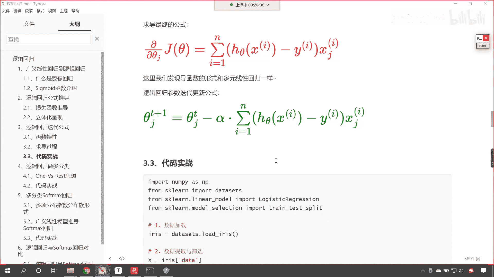

# P108：1-逻辑回归梯度下降更新公式 - 程序大本营 - BV1KL411z7WA

好，那么首先呢嗯咱们简单回顾一下上一节课是吧，我们所讲的内容，咱们上一节课呢我们学习了逻辑回归，那我们介绍了sigmoid的函数，那这个函数啊，它可以将咱们的数值无论多大或多小。

可以把这个数据呢变到0~1之间，这个其实就是一个映射是吧，你就像我们人的内心一样是吧，就是一个人如果经历了很多事情，那以后无论发生多大的事情，在他那儿是不是都可以都可以容得下呀，对不对。

都可以轻轻松松的过得去，sigmoid函数的作用呢就是类似的嗯，我们计算出来通过线性回归计算出来的数据，有可能特别大，有可能特别小，没关系，放进去传到sigmoid的函数当中，都可以把它变到0~1之间。

变到0~1之间，这个就是概率，那我们的计算机，咱们所说的算法在进行分类的时候，其实就是通过概率来来做的这个决定，嗯那我给你举一个例子啊，嗯其实咱们人世间都是概率，你看我给你一个选项啊，比如说这个a选项。

你可以百分之百的得到100万，再给你一个b选项，你有50%的概率会得到一个亿，嗯那请问你选哪一个呀，来各位小伙伴好，咱们有有同学选a，有同学是不是选b，来我们其他的小伙伴也回复一下啊。

我看一下到底选a的多还是选b的多，来现在呢嗯咱们jericho swan是吧，选的a little，选的a好卡猫，选的b是不是来其他小伙伴嗯，好那如果说我们从确定性这件事上来选择的话，那无疑选a。

这个是不是百分之百，确定你就可以得到100万呀，是不是啊，但是我告诉你这个题有唯一的答案，如果说我们从概率的角度，咱们从概率的角度来计算，你想哪个概率更大呀，你看你上面是一是吧。

那你1x1000000是不是等于100万呀，那我们下面是不是0。5，0。5乘以一个亿嗯是吧，0。5乘以一个亿，你算一下它等于多少，他是不是等于5000万呀，很显然我们应该选择啊，我们应该选择b嗯。

那有同学说这个是吧，但是50%是瞎蒙的，是不是，那我告诉你啊，这是一个选择，看到了吗，这是一个选择，那这个选择呢你可以把它卖出去，那么你可以卖出去，你比如说对于很有钱的人，他们不在乎钱。

他们在乎的就是选择，你比如说卖出去，你卖给马云，你说我现在有一个创业嗯，这个现在有一个项目，这个项目要成了，那么你就能得到一个亿，这个概率是50%是吧，现在呢唉我以1000万卖给你，你看卖出去卖给马云。

很多人对于他来说，这个金钱就是一个数字而已，比如说马云是不是金金钱就是一个数字，他要的是机会，那我再给你比举一个例子啊，比如说马云100岁了啊，咱们假如说啊马云100岁了是吧，他还不想死怎么办。

医院呢开发了一种药物，医生呢这个开发了一个药物，那这个药物呢医生就说了，开发成本比较贵，是十个亿是吧，对于马云来说，十个亿这都是小钱，是不是，那这个药物你吃了之后可以延长是吧，它可以延长10年的寿命。

但是呢这个概率是50%，那你说马云愿不愿意花这10亿，买这50%的概率呀是吧，我这个价钱虽然贵一点是吧，概率是吧，50%是吧，那他当然愿意花这笔钱去买这个概率，这个概率呢就是选择。

所以大家呢在学习一些知识，提升自己技能之后，你不仅仅要学知识，随着你年龄的增长，阅历的增加，那有可能你会以后会有一个很大的突破是吧，有可能你会做管理层是吧，有可能你以后会挣很多钱，有可能你会以后是吧。

为国家做出很大的贡献，这个呢都未可知，所以说我们看问题，咱们学习了机器学习之后，咱们看问题的角度也会有一定程度的提升，我们的思维方式也会发生一个转变好，那么咱们现在呢回到咱们逻辑回归这里啊。

在上一节课这个过程当中呢，我们介绍了逻辑回归他公式的推导，是不是，那么这个公式的推导呢，嗯最后呢我们推导出来是这个绿色的损失函数，这个损失函数越小，咱们就所求解的这个解呢就越准确。

那这个呢和咱们之前所讲的线性回归不谋而合，那咱们接下来呢，我们看一下咱们逻辑回归的迭代公式啊，这逻辑回归呢它在进行计算的时候，它是通过梯度下降，那既然是梯度下降，那么我们就有这个权重的更新公式。

大家现在所看到的这个公式，看你现在所看到的这个公式哎，就是咱们的权重更新公式，那我们t加一次的权重，它是在第t次权重的基础上进行的，一个梯度下降，谁是我们的梯度呢，唉大家看这个就是咱们的梯度。

那这个其中还有一个阿尔法值，这个阿尔法呢就是咱们的学习率，我们可以把它认为这个呢就是一个系数是吧，这个系数控制着咱们梯度下降的这个步子，迈的大和小，那决定了咱们梯度下降的快和慢好。

那么这个系数咱们说得需要调，不能给的特别大，也不能给的特别小，对不对，咱们要给合适的，那么我们才能够求解出来最优解好，那么大家看啊，这个是它的这个更新公式，那接下来呢，嗯咱们看一下这个具体的这个推导啊。

那上一节课呢咱们在讲课的过程当中，我们介绍到了sigmoid的函数叫做逻辑回归函数，这个逻辑回归函数呢它也叫sigmoid的函数，sigma的函数只要你100度，你就能够找到它对应的公式。

那么它对应的公式呢，就是咱们下面看到的这个公式，在这个里边是不是有一个自然底数e呀，2。718这个数字很神奇啊，在很多公式当中它都出现了，你想这个2。718是不是在咱们正态分布。

高斯分布当中是不是也出现了呀，对不对，如果说你遗忘了，你可以翻看咱们之前的那个公式啊，好那么咱们这里边的z呢，它就表示这个c塔tx这个不就是线性方程嘛，对不对，好。

那么现在的话咱们对于嗯这个sigmoid的函数，咱们对于逻辑回归函数，我们对它求一个导数，看到了吗，我们要对它求导数，那为啥要对它求导数呢，你想咱们上一节课所推导出来的，梯度下降的公式。

看上一节课咱们所推导出来的损失函数，这个当中你能够看到咱们这个hc塔x是不是，就是我们的sigmoid的函数呀，对不对，你看这里边就是hc塔x i，这个就是咱们的西格玛id的函数。

那么我们的sigmoid的函数有什么样的特征呢，是吧，为什么呃，这个创建逻辑回归的数学家啊，这个算法工程师他就选择了这个函数呢，你看你想一下是吧，为什么选择了这个函数呀，对不对，那这一定是这个函数。

它有特别的功能，咱们一起看一下啊，那首先呢我们看一下它的导数，它的导数呢可以用它自身来表示，看这是它的这个特征之一，也就是说它的导数可以用它自身来表示，你说奇怪不奇怪呀，对不对。

你就像咱们的e的x方是吧，这个函数的导数是不是依然是它自身，对不对，你看这个函数的导数依然是它自身，是不是完美不完美，那我们上面看到的sigmoid的函数，它的导数可以用它自身来表示。

那我们大家看这有详细的推导过程，我们如果要对它进行求导数，那么因为这个这是在分母上的，所以说就来一个二次幂是吧，分子上呢就继续对它进行求导，求导之后我们该拆开，咱们就拆开，拆开之后呢。

你看就可以写成一加上e的负z分之一，乘以小括号1-1加上e的负z分之一，那么前面这一部分就是jz用他自己来表示，后面这一部分呢咱们可以写成一减去jz，你看巧妙不巧妙是吧，那我们回到逻辑回归的损失函数。

这个时候是不是就开始求导了，大家注意啊，唉此刻你要想明白啊，上一节课咱们只是得到了损失函数，对不对，我们上一节课没有对损失函数进行求导，那这节课呢咱们就继续进一步，有了这个损失函数之后。

咱们看一下这个损失函数写成这样是吧，能不能通过求导的方式，咱们在代码当中通过for循环呀，或者while循环呀，能够自动的进行计算，这样的话那这个算法不就出来了吗，你要知道所有的算法它都不神秘，知道吗。

你看啊这个算法呢咱们学算法学原理，其实呢就是把它神秘的面纱，神秘的面纱，给它一层层给它揭开，你看这就是学算法，这就说明我们学会了神秘面纱，一层层揭开上一节课咱们得到的这个损失函数，有了损失函数。

咱们说是不是可以通过梯度下降来进行更新，咱们的权重，梯度下降当中你能够看到，是不是就有对于咱们损失函数的求导呀，大家看看，梯度下降当中就有对咱们损失函数的求导，那么我们现在呢。

就对于咱们的损失函数来进行一个求导，大家现在就能够看到，这个就是我们详细的求导过程，那我们选其中的一部分，咱们进行一个说明啊，比如说这一部分为什么它进行求导之后，会得到咱们下面这个结果，你来看一下。

首先这个yi是不是写下来，对不对，然后这个ln h c塔x i，那么我们如果要对它进行求导的话，你想一下ln x它的导数是多少，ln x看根据我们之前所学的数学知识，它的导数是不是就是x分之一呀。

对不对，所以我们对它进行求导之后，这个地方就出现了一个分式，那我们就发现咱们的hc塔x，它是不是复合函数，那求完之后，咱们需要继续对它根据链式求导法则，什么是链式求导法则呀，就是你的函数不是x。

就是说你是一个复杂的函数，复合的函数，那么求完导之后，继续再对它进行求导，看继续再对它进行求导，这个就叫链式法则，那么到了这儿之后，大家看啊，咱们再画一个线啊，看到了这儿之后，唉。

你就发现你看这个hc塔，咱们说它是什么函数，它是不是sigmoid的函数呀，sigma的函数求导是不是可以用它自身来表示呀，对不对，sigma的函数求导就可以用它自身来表示，所以说这就是为什么数学家。

他就喜欢使用这种特殊的函数，来构建我们的方程是吧，冥冥之中自有天意是吧，也就是说这个天意呢或者说这个大自然啊，这个根据某定的，根据某一规律为我们限定的这些特征，数学家呢找到之后。

那我们就可以在电脑当中大展身手，后面这个后面这一部分求导也是一样的，经过求导之后合并同类项，合并同类项之后呢，哎我们一步一步的化简，哎各位小伙伴你要注意了啊，这个里边儿咱们看到的这个公式很复杂。

其实呢其实它都是什么，它都是基本的求导过程，在这儿呢咱们进行一个说明啊，看这些呢都是基本的求导，基本的求导步骤是吧，该根据链式法则，我们就根据链式法则是吧，那个ln函数，它的导数呢就是这个x分之一是吧。

就是hc塔x2 分之一，然后该合并合并，那最后呢我们就可以得到，最后咱们就可以得到这样的一个结果，唉大家看我们就可以得到这样的一个结果，那最终呢我们把这个结果给它换一个颜色，咱把它写成红色的。

你看到这个结果熟悉不熟悉，就是hc塔x减去y x这个x j x i，熟悉不熟悉啊，这简直太熟悉了，这个为什么这么说呢，因为到这里我们就发现这个导函数的形式，和多元线性回归一样，看咱们说到这儿之后。

你就要翻看一下咱们之前线性回归梯度下降，它的权重更新规则和这样呢就一模一样了啊，那这也就是为什么咱们的逻辑回归，我们在进行导包的时候，你是不是就发现它所在的这个包，是不是线性回归下边的呀。

看它是一脉相承的，只不过呢他在这个地方进行了一个变化，原来线性回归适用于解决回归问题，而我们逻辑回归呢经过了一定的变化，把它转换成了概率，那么我们这个地方解决的是分类问题。

仅此而已嗯所以说这就是这个老子所说的是吧，道生一一生二二生三三生万物是吧，你研究最基本的东西，你就会发现是吧，物理世界当中的啊，这个质子和中子是吧，一个质子嗯，嗯这个一个质子。

一个电子是不是构成氢原子呀是吧，然后随着它的增加，是不是就侵害里皮蓬碳氮氧氟氖啊，本质上来说它们都是质子中子电子组成的，但是因为数量不一样，那么它们的化学性质完全不同，有的能燃烧是吧，有的就是惰性气体。

是不是好，那么到此为止呢，哎各位小伙伴就能够看到咱们绿色的，这个就是咱们逻辑回归它的参数，迭代更新的公式，你根据这个公式你也可以写出来嗯，这个逻辑回归的算法知道吗，你知道原理了。

你根据这个你也能写出来逻辑回归的算法，所以说咱们刚才说到的，我们学算法把原理搞明白之后，其实呢我们就把神秘的面纱一点点给它揭开了，那写sk learn这个算法的这些前辈们，你想他们有特别伟大吗是吧。

他们有特别牛吗是吧，他们一个月挣10万美金，你通过学习训练，你是不是也可以做到呀对吧，不断的突破自己，不断的精进学习，你也可以知道吗。

