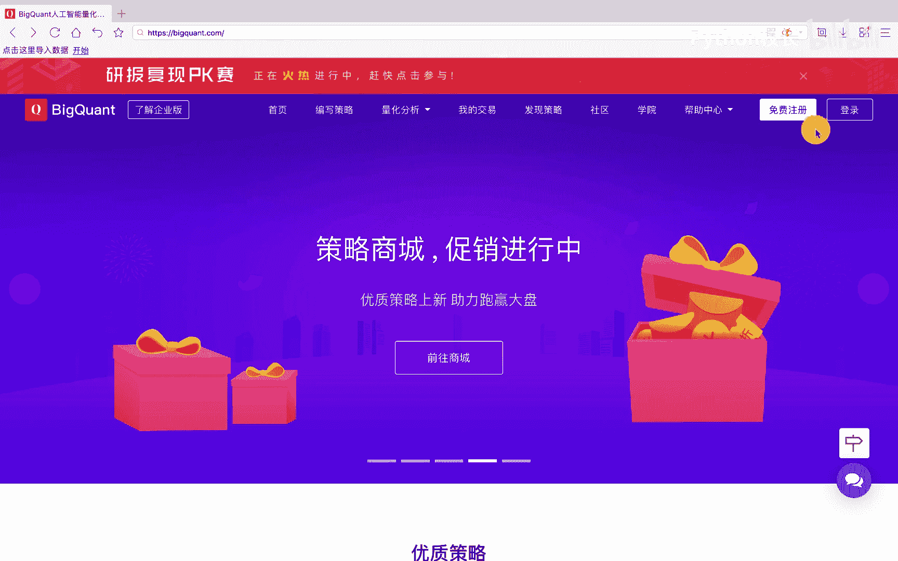
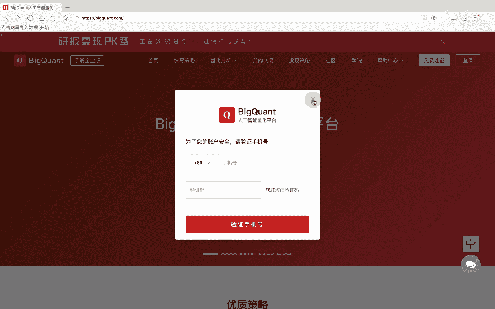
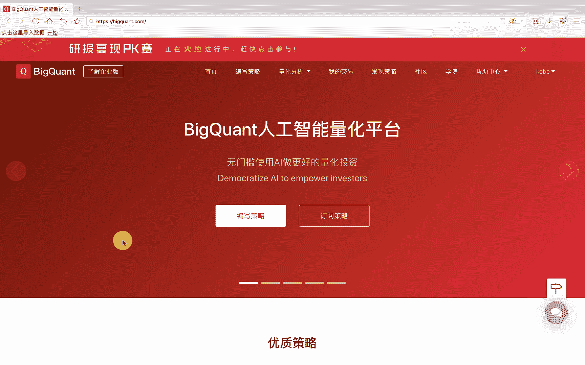
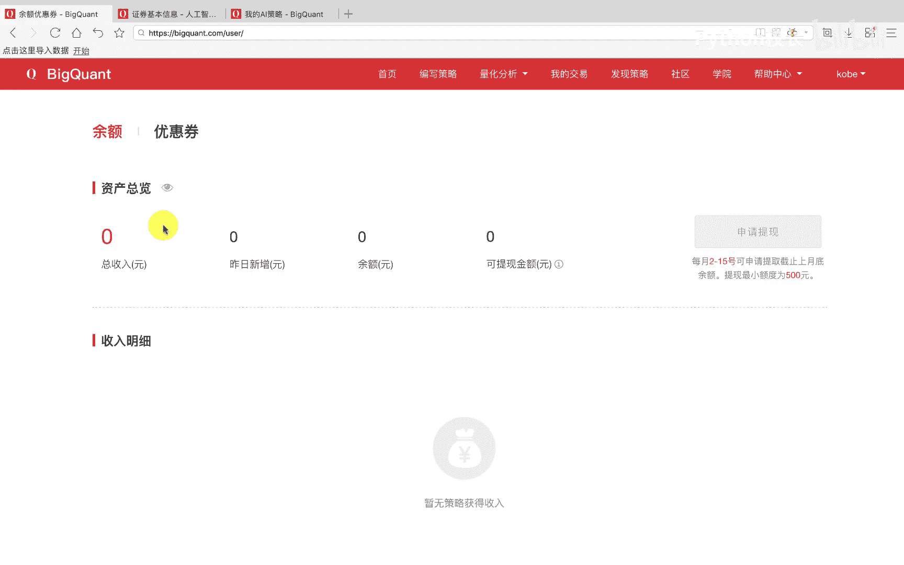

# P11：2.1.2-AI量化平台简介实操 - 程序大本营 - BV1KL411z7WA

下面我们来介绍一下背框的平台，首先我们通过浏览器输入网址，3w点边框的点com进入bon的平台主页，在这个框的平台首页，我们可以看到右上方有免费注册按钮。

我们通过点击该按钮输入手机号以及验证码，可以实现快速注册，注册后我们可以点击登录按钮，我们可以选择手机号和验证码登录方式，也可以点击密码登录，实现用户名和密码的登录，这里我们登录一个账号。

我们点击登录后，可以看到会提示我们进行手机号验证或绑定，我们可以选择手机号验证并绑定到手机，以方便我们每日获取到平台所推送的，每日模拟交易信号，也可以跳过此步。

直接进行策略开发等相关网页功能浏览，我们可以看到现在已经处于一个登录状态，在首页中，我们提供了平台最新的活动内容。

以及平台上的优质策略，这些策略都是平台其他优秀开发者开发出来的，我们可以点击查看详情并进行订阅，来进行信号跟踪，此外首页中还提供了很多模板策略的源码，我们可以点击获取源码来进行策略的克隆复制。

我们也可以点击发现策略，进入到策略商城或者策略天梯，我们可以点击策略商城或策略天梯，来进行页面切换，当我们开发完策略后，我们可以将其分享到策略天梯，来参与贝克矿的平台，策略开发者的策略排名。

我们也可以将策略分享出来，并分享到其他开发者，或订阅其他开发者所开发出来的优质策略，如果策略足够优秀，策略将被挑选到策略商城进行展示，在策略商城中，优秀的策略将被赋予更高的等级权限。

包括更高的订阅价格以及更优先的运行权利，策略开发者可以通过分享策略来实现收益，我们可以通过点击我的交易，来查看该账户所拥有的模拟交易，例如在该账号下，我们挂载了两个策略，我们可以通过点击分享到策略天梯。

实现策略的分享，我们点击其中的一个策略，进入该策略界面后，可以看到该策略在过去一段时间，每日模拟交易的相关信息，例如策略在每日的收益率走势，以及策略每日的计划交易列表。

我们可以点击风险指标来查看对应的风险，此外可以通过策略日志来查看，每日策略信号的相关报错信息，我们还可以通过点击策略设置，来进行策略描述或者运行状态的修改，我们也可以通过点击申请上架来申请。

将策略挂载到策略商城，以获得更高的点击量和关注量，我们返回模拟交易列表，在这里我们就可以点亮微信标志或邮箱标志，表示我们可以激活信号的微信推送或邮件发送，当我们点击开启微信调仓通知时。

我们可以通过微信扫一扫提示的二维码，实现微信账户的绑定，这样每日的策略，模拟下单的交易信号将会被及时发发送到，微信账户或邮件账户中，然后我们可以通过点击社区，进入到社区的页面中，进行社区内容查看。

在社区中我们提供了一个共同学习的社区环境，在该环境中，我们可以点击发新主题来进行求助或策略分享，也可以通过分类查看，来进行策略研究或策略克隆，除了社区功能外，我们还提供了学院，我们可以点击学院导航进。

进入到学院页面，在学院页面中，首先我们提供了旷课学院，这里我们提供了上手背框的平台的相关教程，文档分为学前小学，中学和大学的相关学习内容，我们可以通过阅读帖子并克隆策略。

此外我们还提供了python基础课程，以及策略开发的基础模板，相关的数学知识和机器学习专题介绍，以及金融市场的相关知识，最后我们可以通过帮助中心的文档，来查看平台的更详细的功能介绍，我们点击进入文档中。

左侧为我们的文档导航栏，可以看到我们相关的模块，策略开发以及数据的功能介绍，最后我们可以通过帮助中心的会员特权，进行会员权限的了解，此外我们还可以通过账户来查看，我们的账户设置。

以及我们所拥有的余额和优惠券等信息，在账户设置中，我们可以对用户名密码，邮箱微信等进行修改，在余额优惠券相关信息中，我们可以查看我们的分享。

