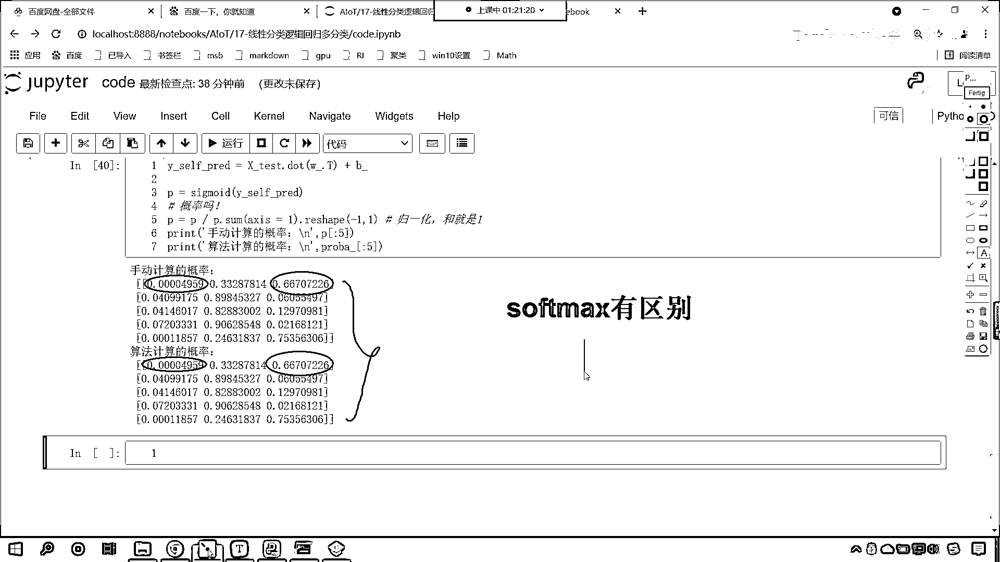

# 7天爆肝整理！AI量化交易-机器学习全套教程，从入门到项目实战保姆级教程！（数据挖掘分析／大数据／可视化／投资／金融／股票／算法） - P110：4-代码实现逻辑回归OVR概率计算 - Python校长 - BV1KL411z7WA

接下来我们就自己手动算一下，这个概率是如何出来的，咱们来一个四级标题，这个时候就是概率的手动计算，那么到底怎么算出来的呀，咱们说这个ovr是不是依然是sigmoid。

那咱们现在就定义一下咱们的sigmoid函数好不好，那就是df sigmoid小括号，这个当中给一个参数z，那有了这个参数z之后咱们就return一下，1/(1+np。

exp)是不是给他一个-z就可以了，看这个是不是就是咱们sigmoid的函数啊，对不对，有了sigmoid的函数之后咱们从模型当中获得，我们可以从模型当中获得什么呢，刚才咱们在介绍的时候，我们说这条线。

上面这条线，还有这条线是不是有三条线，这三条线是不是就相当于三个方程，每一个方程是不是都有系数和结句啊，对不对，所以回到代码当中我给你看一下，那就是model。intercept。

这个是不是就是咱们的结句啊，看到了吧，这个呢就是结句，你看我一执行，我们有几个结句，一个，两个，三个，对应上了吧，三个结句没问题吧，结句呢咱们接收一下，我们就叫做b->，这个b呢就是咱们bias。

这个英语单词的缩写啊，这个英语单词翻译成中文就有偏差的意思，那偏差呢就相当于结句，好，看到这个结句是三个了，那咱们model当中是不是还有coefficient，这个coefficient是什么。

是不是就是咱们的方程的系数啊，这个就是方程的系数，那么请问咱们得到的形状是什么，等等，在咱们输出之前，咱们要先为各位显示一下咱们数据的形状，看咱们数据的形状，我们数据的形状是150和4。

那这150表示什么，150表示150个样本，那这4表示什么，这4是不是表示每个样本的特征和属性啊，我们就是从这150个样本当中，根据它的四个属性，咱们是不是进行了建模，进行了方程的计算，对不对。

那这四个属性是什么呢，分别是咱们花萼的长和宽，以及咱们花瓣的长和宽，咱们说既然是植物，它的类别不同，区别在哪里啊，就在它的外在特征，是不是啊，那你想一下，我们model。coif。

如果我们要执行输出的话，它的形状会是什么样的，你在大脑当中想一下，你看我执行跟你想的一样不一样啊，来各位小伙伴，你能够看到咱们得到的这个形状，得到的这个数据的形状，你能够看到它是几行几列呀。

它是不是三行，它是不是四列呀，对不对，你看它是三行四列，那这三行表示什么，这四列又表示什么，把这个搞明白了，机器学习，你就明白它是怎么回事了，很多时候我们在学习的时候呢，其实就是数据的形状，是吧。

我们有小伙伴在群里边回复了，是不是啊，非常正确啊，这个三行呢就代表咱们刚才讲原理看到的这三条线，看到了吧，你一条线代表一个方程，是不是啊，所以说这三行呢就表示咱们的三个分类器。

那三个分类器说的非常高大上，是吧，其实呢就是咱们的线性，其实就是咱们的方程，那我们的，大家看咱们的四列，这个四列表示什么呀，四列呢它表示每个方程是不是有四个系数呀，为啥每个方程有四个系数呀。

再往上看咱们的数据，系数的多少由谁来决定，是不是由咱们的系数来决定呀，是不是由咱们的属性来决定呀，那么我上面的数据当中，咱是不是有四个属性，所以它就对应四个系数，现在你明白这是怎么回事了吧。

我们也接收一下咱们这个起个名叫w-，起个名叫w-，好那么咱们就display一下，咱们将w-放进去，将b-放进去，一执行，好那么咱们的数据就咱们的系数方程的系数就准备好了，有了方程的系数。

那咱们接下来呢，我们就开始进行相应的操作，那我们上面咱们计算概率的时候，你看我计算的是谁的概率呀，上面咱们进行概率预测，咱们是不是预测的测试数据的概率呀，看这个是测试数据的概率求解出来了，0。

0004959，怎么算出来的这个值啊，来我们下面呢就算一下啊，那既然是有方程了，我们又有x下滑线，test这个数据，那咱们是不是就可以使用方程来进行相应的这个计算呀，对不对。

那咱们现在呢就进行相应的计算啊，我们是不是就让咱们的方程和咱们的系数进行一个乘法呀，这个时候咱们看一下它的形状是多少啊，看它的形状是不是30和4呀，w-的形状是多少，看一下它的shape，少一个点。

咱们来一个点，这个时候你看，我们就能够看到它是不是三和四，那这个时候能直接进行矩阵乘法吗，看x。test咱们点dot，看我们将系数w-放进去，你看，一执行这个时候是不是就报错了呀，为啥。

咱们在进行矩阵运算的时候，它呢是行成一例，看是行成一例，你x。test当中这一行有几个数据呀，是不是这一行当中有四个数据，看咱们display一下，x。test咱们就查看它的前十个，w-呢查看所有。

看有了这个之后，我如果要进行矩阵运算，你想是不是这一行乘以这一列，这一行当中几个数，它是不是有四个数，而咱们这一列当中有几个，看它是不是有四个，这一列当中是不是只有三个，你三和四是不是数量不对应呀。

驴唇不对马嘴是吧，这个时候呢你就尿不到一壶里边，所以说就报错了，那怎么办呢，咱们呢对它进行一个转制啊，看怎么转制呢，就是点t，就是好像变成列，这个时候你看我一执行，哎，大家看，此时是不是就搞定了呀。

看了吧，我们的行变成列，现在你看，是不是就搞定了，行变成列之后呢，看那你第一个方程求解出来的结果是这个，第二个求解出来是这个，第三个求解出来是这个，是不是，好，那么转制之后呢，咱们再加上咱们的b盖。

那我们的b盖是不是就相当于结局呀，对不对，好，那么执行，你看也没问题了吧，所以说咱们一步一步是吧，对它进行了操作，那这个是不是就是我们手动计算出来的一个线性回归的预测值呀，那这个线性回归的预测值呢。

咱们起个名啊，咱们起个名，这个呢就是web predict，就叫做这个web predict，Self，SELF，这个就表示我们自己计算出来的啊，叫web self predict，那有了这个预测值了。

咱们需要把预测值对它进行转换，那是不是这个时候就用到sigma的函数的转换了，来咱们此时呢就调用一下sigma的小括号，将咱们求解出来的这个值放进去，那大家看啊，此时咱们就会得到一个概率P。

来执行一下这个代码，大家看结果出来了，我们算出来的概率，看咱们算出来的概率，0。0007224和上面算出来的概率，你看一样吗，0。0004959，咱们发现这个是不是不一样呀，看到了吧，这个不一样。

那这个如果要不一样的话，那为什么会不一样呢，看到了为什么不一样，你看这个是0。000722，这个是0。48，这个是0。97，对不对，我们上面那个算出来的是多少，0。33，0。66，0。0004959。

这是为什么呀，为啥不一样呢，看到这该怎么解决呀，咱们也算出来一个概率，但是呢不一样，我们现在呢往上走，咱们就找见这个方法，叫predict prob，我们看它里边有没有具体的说明，shift tab。

点开这个加号，咱们仔细看它的详细说明，大家看啊，看如果我们要使用1s 1vs rest，咱们要使用这种模式去实现的话，咱们看一下这个probability，是怎么calculate怎么计算的。

看这个it will be positively，using the logistic function，是不是使用了咱们逻辑4d这个方法呀，logistic function。

它表示的就是咱们sigma的函数，我们已经用了，add你看有一个add叫normalized，this value across all the classes，进行了一个什么，进行了一个皈依化。

因为我们现在使用了，咱们现在使用了这个logistic，我们还没有进行，咱们还没有进行normalized，所以说就有点不一样，知道吗，在这咱们也进行一个说明，logistic它其实就表示sigma的。

这个就表示sigma的函数，换一个颜色，红色的里边它就表示sigma的，那么我们绿色框当中，这个表示的是什么呢，表示的是皈依化，那么皈依化咱们皈依化之后，它们的概率和，概率和是1。

皈依化之后这个概率和是1，我们一起来看一下，你看，这三个数加起来，你口算一下，和是不是等于1，看看这三个数是不是1，来我们求一下和，咱们就调用SUM，然后给一个axis让它等于1，这个时候你看我一执行。

得到的结果全是1111，是不是就说明他们最后一围，它的和是多少，看就你三个数加起来等于1，这三个数加起来也等于1，这就是它进行的皈依化，而我们下面咱们得到的概率，你看它们加和是1吗，是不是明显不是。

那么我们现在就对它进行一个皈依化，好不好，P就等于P除以P。SUM，咱们给一个轴，axis让它等于1，这一步操作我们就进行了皈依化，这种皈依化咱们的和它就是1，为啥要把它变成这种形式。

因为这个是概率对不对，你想一下这个是概率，一共分三类，你这三类我在猜的时候，咱们的概率和是不是得等于1，所以经过转换，咱们再执行一下，咱们经过转换之后，现在我们来看一下咱们操作。

他说couldn't是吧，来我们看一下咱们操作，我们经过计算之后，大家看这个，不行了，是不是，因为这个形状不匹配，无法进行广播机制，咱们对这给它改变一个形状，在这，点那就是reshape，-1和1。

这个时候你看我再来执行，得到的结果，和原来是不是就一模一样了，我们为了对比，咱们在这，print输出一下，来一个单一号，这个就是我们手动计算的概率，太多了，咱们查看它的前10个，查看它的前5个。

然后再来一个print，打印输出一下，咱们算法计算的概率，冒号，算法计算的概率，上面咱们是不是用probe，接收了一下，冒号也查看它的前5个，你看我一执行，咱们大家看，print输出的时候没有换行。

咱们在这来一个返协杠n，这样的话它就换行了，这也来一个返协杠n，这个时候你看我一执行，来你比较一下，一样不一样，小数点后的，小数点保留后8位，看到了吧，是不是一模一样，看到了吗，一模一样，0。

66707226，0。66707226，是不是完全一样，如果要完全一样，是不是，如果要完全一样，你是不是就表示，是不是就知道了，咱们逻辑回归，使用OVR，它是如何进行计算，如何进行概率的划分了，是不是。

刚刚咱们输出之后，它就因为输出之后，概率和它就是1了，咱们这种搞法和咱们的softmax，它是有区别的，有区别，我们刚才有小伙伴，在讨论区里边，问了一个问题是吧，说这么操作的话，和咱们softmax。

它是有区别的，我们先把这个讲完，一会我们就介绍softmax，它是怎么操作的，好不好，来那么这个视频。

