# P111：5-Softmax函数与概率计算 - 程序大本营 - BV1KL411z7WA

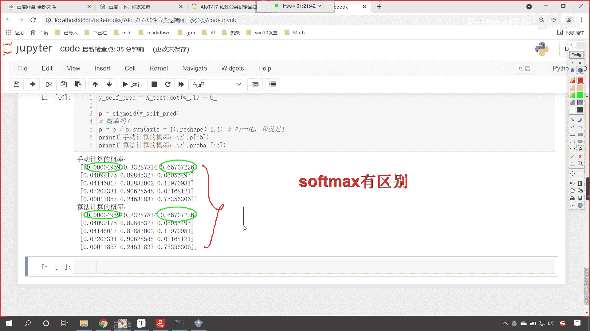

来回到咱们的课件当中，那我们就看一下咱们的soft max多分类，那soft max soft max回归，这个它也是一种计算多分类的方式，那在这个里边呢啊我们就介绍了一下。

对于这个soft max多分类，咱们进行了这个相应的理论介绍啊，在这呢会有这个广义线性回归，那对于各位而言，暂时呢，我们对于这个我们了解线性回归就可以了，广义线性回归是线性回归的一种推广模式。

你就像爱因斯坦的叫做这个广义相对论，是不是还有叫这个狭义相对论，是不是他其实是对于理论的一个升华，那这个里边这个相应的这个推导过程，相应的这个概率表示，如果你要能看明白是吧。

那就恭喜你看不明白也没关系啊，咱们呢直接使用soft max所对应的公式，因为这个里边我有相应的这个公式推导，这个里边儿它就涉及到了广义线性回归，那广义线性回归呢就涉及到咱们的正态分布呀。

涉及到咱们的这个二项分布呀，还涉及到咱们的这个多项分布呀，嗯还涉及到伯努利分布呀等等，数学家对他们经过研究之后发现，唉，原来呢，你这些分布其实都是从线性回归衍生出来的，那我们知道这个基础知识之后呢。

唉就可以了啊，比如说咱们的投硬币，它是它呢就是二项分布，我们掷骰子，那么它就是多项分布，因为投硬币只会出现两种结果，要么是正面，要么是反面，咱们的掷骰子呢是1~6，它是不是出现六种结果。

所以这种就叫多项式分布，那对于我们上面这个是它的一个soft max的证明啊，上面是他的一个证明，这个里边你看这个公式就复杂一些了，是不是我们跳过这部分。

咱们看一下这个soft max回归它的方程是什么样的，看啊soft max回归它所对应的概率方程，就是这样的一个公式，看它所对应的方程就是这样的一个公式，因为我们对应多分类，是不是啊，那你既然是多分类。

那么咱们的类别是啥样的呀，看类别就是一就是二，就是k那每一个类别它的概率如何计算呢，那就是通过咱们这种公式来进行计算，看到了吧，这个是y等于一它的概率计算，这个是y等于二，它的它的概率计算。

这个是y等于k它的概率计算，那到这儿有可能咱们小伙伴还不明白，说这公式到底是啥呀，完全看不懂，看不明白，我们再往下看，给你一个更简单的。

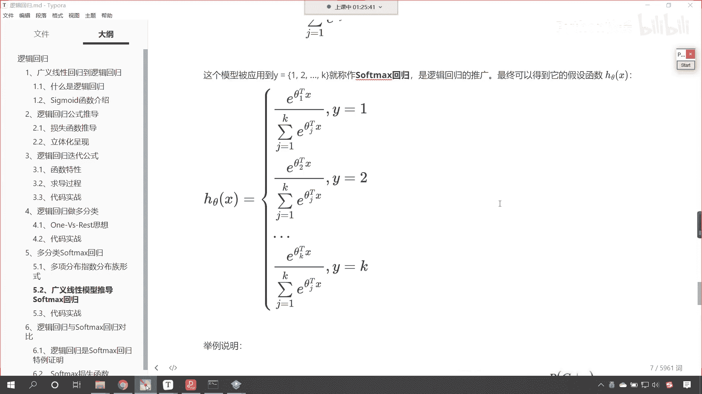

咱们举例说明好不好。

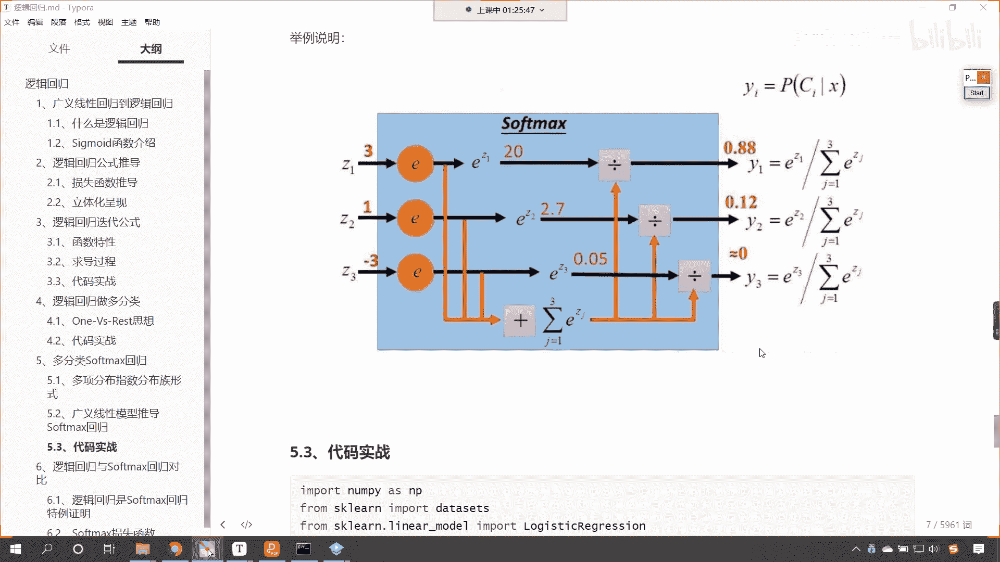

刚举例说明，假设说我们有数字三一-3，你看我们可以通过soft max咱把它变成概率，那概率把它变成概率，原来的数字越大，那么他所求得的概率值就越大，原来的数字越小，那么咱们所求得的概率值就越小。

原来我们的概率是三，那么咱们求得的原来咱们的值是三，那么咱们转换成概率之后，咱们的概率值就是0。88，大家看啊，那既然我们要计算概率，那是不是就有分子和分母呀，对不对。

这个soft max它其实也进行了归一化，你能够看到咱们转换成概率之后，咱们得到的结果是不是0。88+0。12，再加上后面这个零，因为我们这儿进行了四舍四舍五入，保留位数。

你看它加出来的和是不是也等于一呀，对不对，和咱们之前在代码里边所讲到的，归一化也是类似的啊，只不过它的公式不一样，有哪些不一样呢，那我们看一下这个公式，你看这个是计算三的概率公式。

这个是计算数值一的概率公式，下面这个是计算咱们数值-3的概率公式，那我们就研究一下分子和分母，看咱们的分子上分子比较简单，咱们分子上是不是进行了e的多少次幂呀，对不对，看分子上是啥，是不是就是e的。

比如说我们要计算三是吧，那是不是就是e的三次幂呀，这个就是咱们的分子，那分母呢，你能够看到分母上是不是一个累加和呀，它是j等于一，一直到3e的这个z j次幂是不是，那这不就相当于e的几次幂。

是不是e的三次幂，然后再加上谁是不是e的一次幂，然后再加上谁是不是咱们e的-3次幂，你想以此类推，我们在计算z2 z3 的时候，你想分母上是不是就变成了e的一次幂，e的-3次幂，那你想你这三个数加起来。

它的和能不是一吗，为啥因为你看啊，我如果要画出来，你看咱们这个就是e3 ，是不是，然后加上e1 ，然后再加上e的-3，是不是，那你这个分子上是不是就是e的一次幂，对不对，那以此类推啊。

你看你要再加上是吧，咱们z3 的概率嗯，分子上哎一样啊，分子上一样是吧，那咱们的分母上一样，咱们的分子上是不是就变成了e的-3，这个时候你一相加看到了吧，嗯e的三三次幂，e的一次幂，e的-3次幂。

所以说它们的和等于多少，它们的和是不是就等于概率一啊。

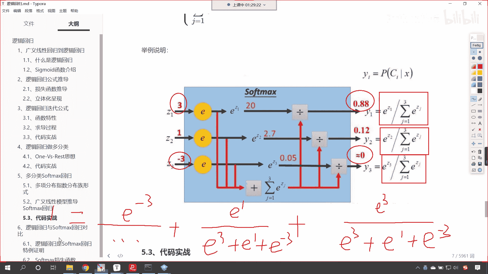

对不对，好那么简单不简单好，那么咱们现在呢我们就进行一个代码实战。

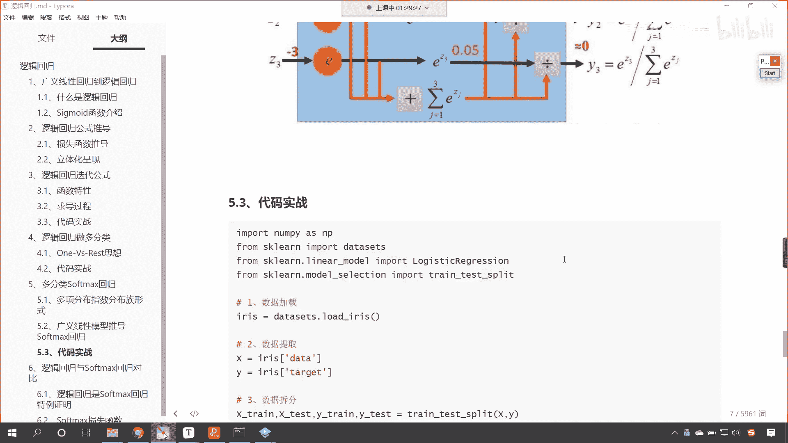

好不好，刚才咱们little小伙伴说这么搞和soft max没区别是吧，它是有区别的，计算出来的概率值是不一样的。

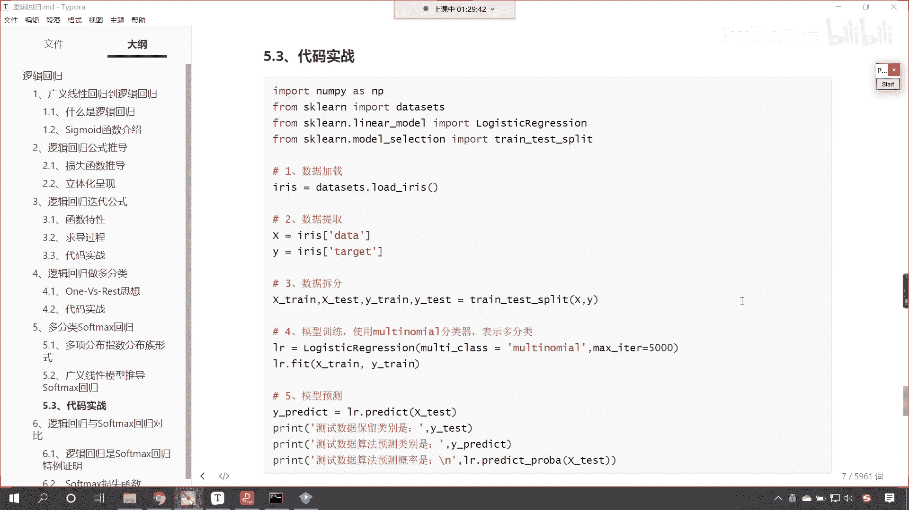

咱们刚才说这个one这个one vs rest，他们的这个模式它可以进行计算，它有优点，普适性比较广，相相同时呢这个效率也比较高，有多少个类别，我们就训练多少个分类器，但是它也有缺点。

是不是容易让咱们的样本不平衡呀，对不对，你看这是它的缺点非常明显。

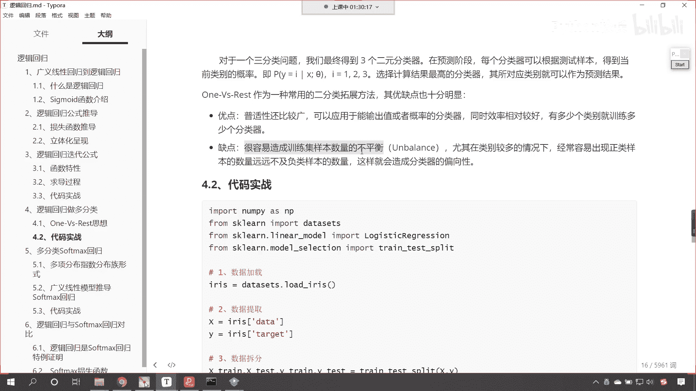

是不是，那所以才会有soft max这种模式的出现嘛。

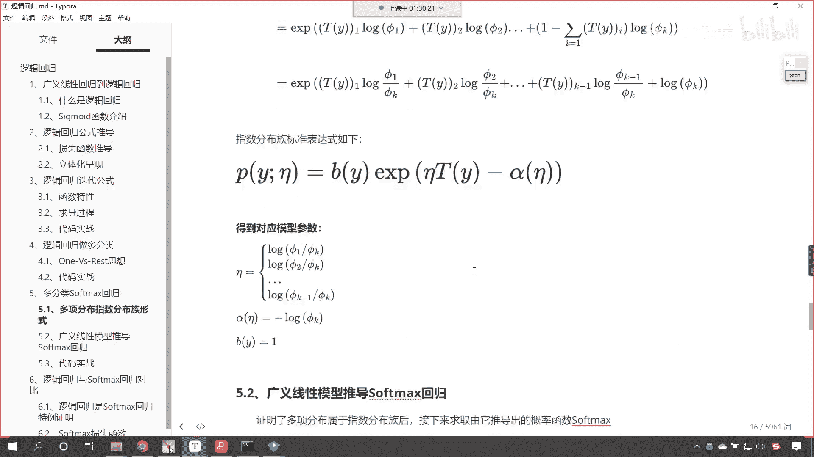

对不对，来咱们现在回到代码当中，我们操作一下啊。

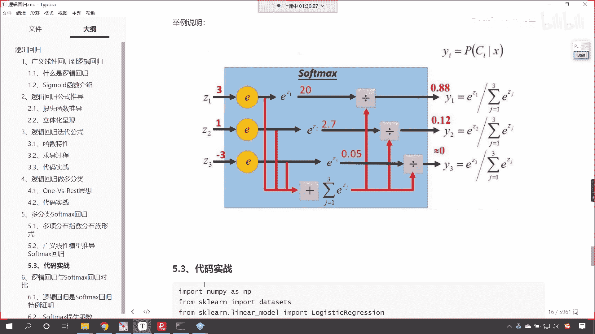

好现在的话我们就介绍了一下soft max，我们在代码当中咱们手写一下这个soft max好不好。

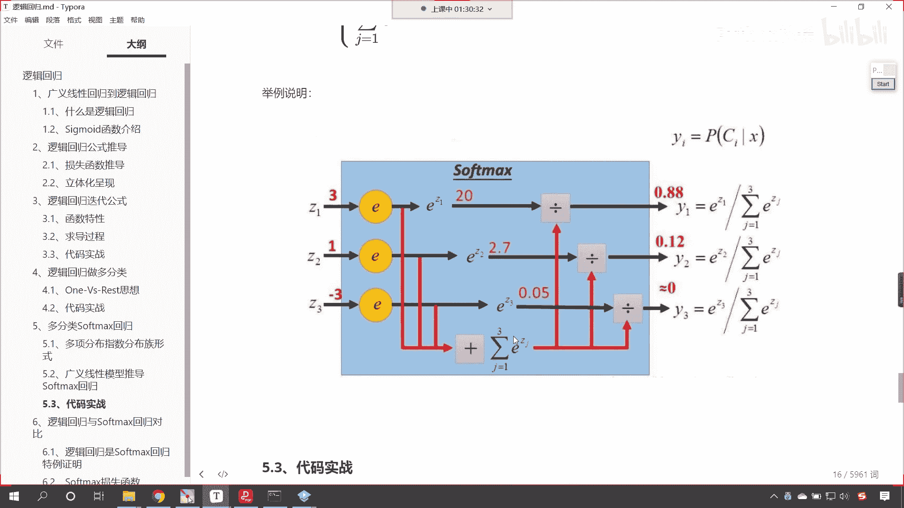

来回到代码当中嗯，那接下来呢我们就再来一个三级标题，叫做soft max，这个叫什么呢，翻译成中文叫做软最大，看到了吧，soft max叫软最大，这软最大呢就是把数据变成概率啊。

就是把数据给它变成概率是吧，概率大，那么它就大，根据咱们刚才那个公式，咱们就定义一个soft max好不好，传一个参数x咱们传一个z吧，我们对于z来进行相应的计算，那这个z咱们要进行这样的计算。

首先嗯咱们np。e x p，要对于z进行一个以自然底数为，以自然底数e为底的幂运算，然后除以除以谁，是不是除以这个幂运算的和呀，e x p z。sum，看这个是不是就是咱们刚才看到的公式。

然后我们就return一下啊，return一下好，这个函数定义好了，定义好了之后呢，咱们就计算一下数据啊，我们定一个z z呢就等于三一-3，那我们就计算一下吧，soft max，咱把z放进去。

你看我执行一下，看咱们执行一下，发现咱们就报错了，看到了吧，为什么给报错了呀，看一下为什么给哦，看咱们return这个地方是不是不小心写成等号了呀，把等号去掉再来执行诶。

大家现在就能够看到结果是不是就求解出来了，看到了吧，结果求解出来了吧，求解出来之后，你就发现是不是0。87，如果我们要保留两位小数，它会是怎么样的，看咱们这个时候呢。

我们调用一个rain给他保留一个两位小数，看到了吧。

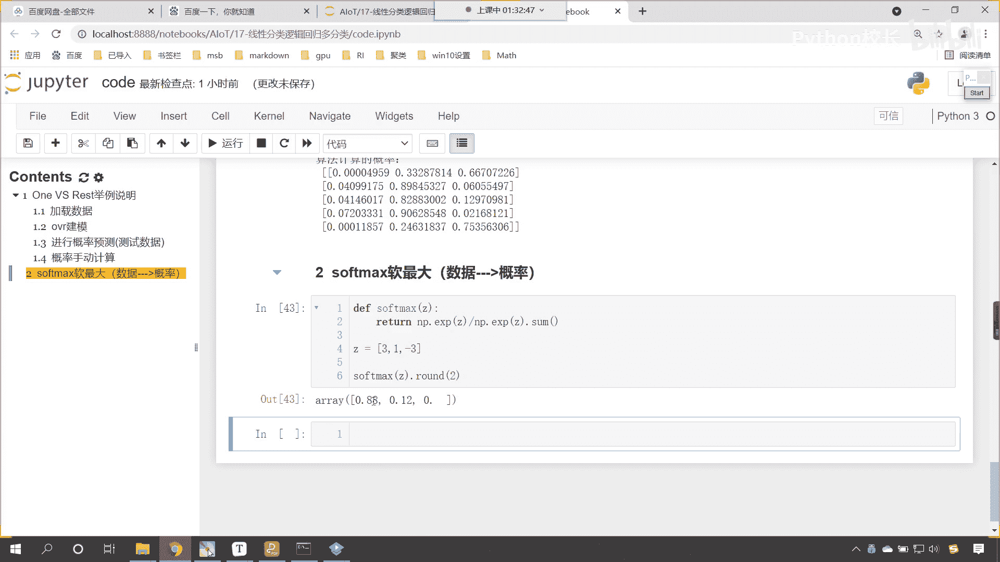

0。880。120，是不是和咱们这个课件当中，求解出来的概率是一样的呀。

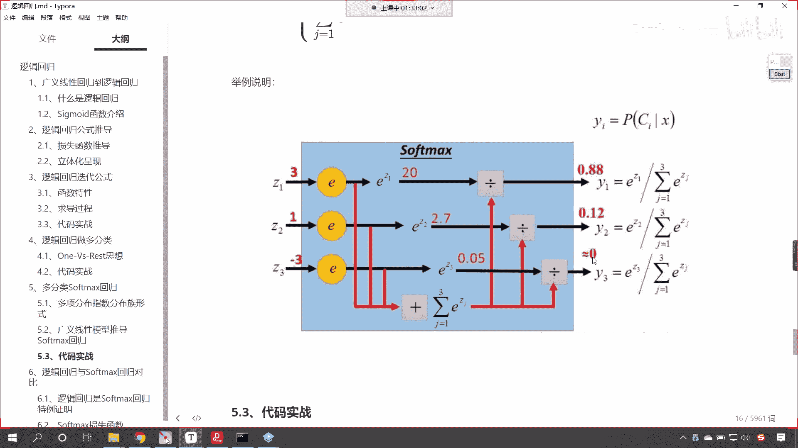

好那么咱们回来啊。

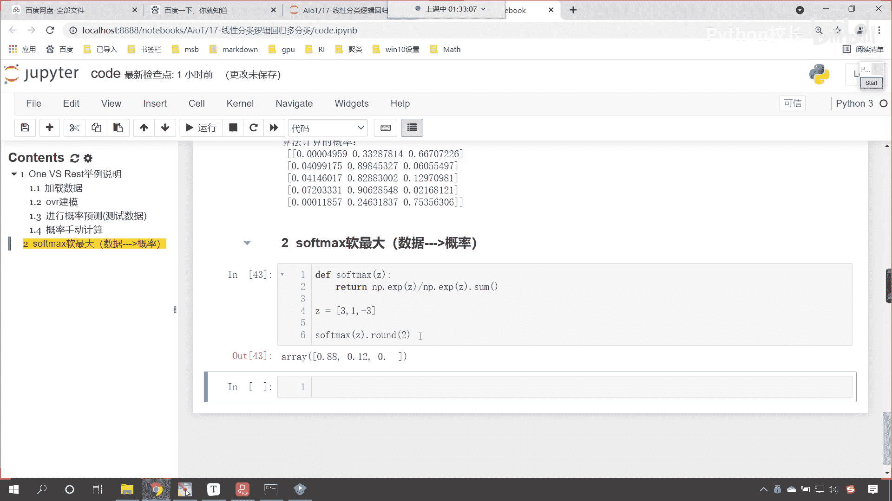