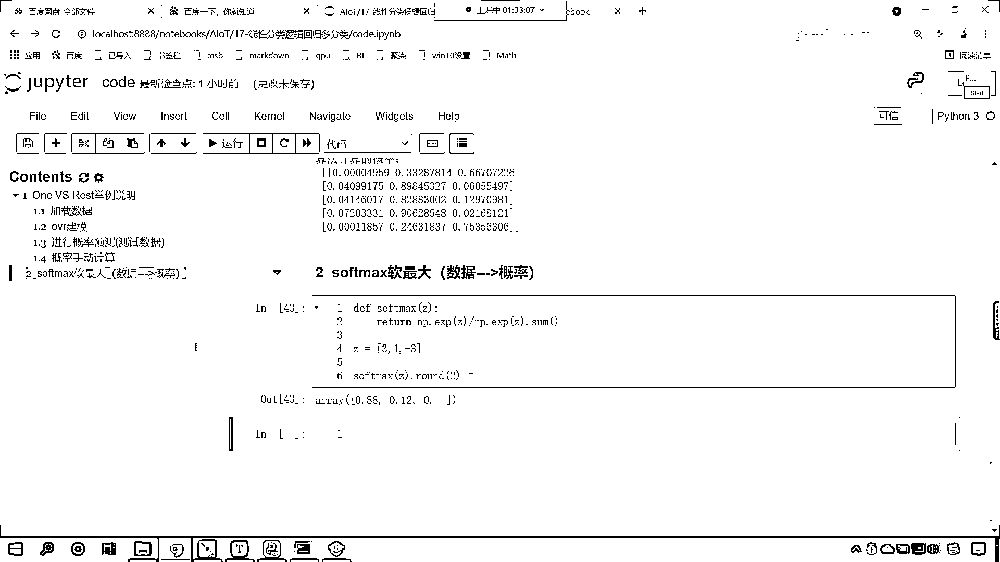

# 7天爆肝整理！AI量化交易-机器学习全套教程，从入门到项目实战保姆级教程！（数据挖掘分析／大数据／可视化／投资／金融／股票／算法） - P111：5-Softmax函数与概率计算 - Python校长 - BV1KL411z7WA

回到咱们的课件当中，咱们就看一下softmax多分类，softmax回归也是一种计算多分类的方式，在这里我们就介绍了一下对于softmax多分类，咱们进行了相应的理论介绍，在这里会有广义线性回归。

对于各位而言，暂时我们了解线性回归就可以了，广义线性回归是一种推广模式，就像爱因斯坦的广义相对论，还有狭义相对论，它其实是对于理论的一个升华，这个里边相应的推导过程，相应的概率表示，如果你要能看明白。

那就恭喜你，看不明白也没关系啊，咱们直接使用softmax所对应的公式，因为这里边我有相应的公式推导，这里边就涉及到了广义线性回归，那广义线性回归就涉及到正态分布，二项分布，多项分布，伯努利分布等等。

数学家对他们经过研究之后发现，原来这些分布其实都是从线性回归衍生出来的，那我们知道这个基础知识之后呢，就可以了啊，比如说咱们的投硬币，它就是二项分布，我们制色子，那么它就是多项分布。

因为投硬币只会出现两种结果，要么是正面，要么是反面，咱们的制色子呢是1到6，它是不是出现六种结果，所以这种就叫多项式分布，那对于我们，上面这个是它的一个softmax的正名，上面是它的一个正名。

这个里边你看这个公式就复杂一些了，是不是啊，我们跳过这部分，咱们看一下这个softmax回归，它的方程是什么样的，看啊，softmax回归，它所对应的概率方程就是这样的一个公式。

它所对应的方程就是这样的一个公式，因为我们对应多分类，是不是啊，那你既然是多分类，那么咱们的类别是啥样的呀，看类别就是1，就是2，就是k，那每一个类别它的概率如何计算呢。

那就是通过咱们这种公式来进行计算，看到了吗，这个是y=1，它的概率计算，这个是y=2，它的概率计算，这个是y=k，它的概率计算，那到这儿有可能咱们小伙伴还不明白，说这公式到底是啥呀，完全看不懂。

看不明白，我们再往下看，给你一个更简单的，咱们举例说明好不好，举例说明，假设说我们有数字3，1，-3，你看我们可以通过softmax，咱把它变成概率，原来的数字越大，那么它所求得的概率值就越大。

原来的数字越小，那么咱们所求得的概率值就越小，原来我们的概率值是3，那么咱们转换成概率之后，咱们的概率值就是0。88，大家看啊，那既然我们要计算概率，那是不是就有分子和分母呀，对不对。

这个softmax它其实也进行了规划，你能够看到，咱们转换成概率之后，咱们得到的结果是不是0。88+0。12，再加上后面这个0，因为我们这进行了四捨五入保留位数，你看它加出来的和是不是也等于1啊。

对不对，和咱们之前在代码里边所讲到的规一化也是类似的，只不过它的公式不一样，有哪些不一样呢，那我们看一下这个公式，你看啊，这个是计算3的概率公式，这个是计算数值1的概率公式。

下面这个是计算咱们数值-3的概率公式，那我们就研究一下分子和分母，看咱们的分子上，分子比较简单，咱们分子上是不是进行了e的多少次me啊，对不对，看分子上是啥，是不是就是e的，那我们就要计算3是吧。

那是不是就是e的3次me啊，这个就是咱们的分子，那分母呢，你能够看到分母上是不是一个累加和呀，它是j=1一直到3，e的j次me是不是，那这不就相当于e的几次me，是不是e的3次me，然后再加上谁。

是不是e的1次me，然后再加上谁，是不是咱们e的-3次me啊，你想，e次累推，我们在计算z2z3的时候，你想，分母上是不是就变成了e的1次me，e的-3次me，那你想，你这三个数加起来。

它的和能不是1吗，为啥，因为你看啊，我如果要画出来，咱们这个就是e3，是不是，然后加上e1，然后再加上e的-3，那你这个分子上是不是就是e的1次me，对不对，那e次累推啊，你看你要再加上咱们z3的概率。

分子上一样啊，分子上一样，那咱们的分母上一样，咱们的分子上是不是就变成了e的-3，这个时候你一相加，看到了吗，e的3，3次me，e的1次me，e的-3次me，所以说它们的和等于多少。

它们的和是不是就等于概率1啊，对不对，好，那么简单不简单，好，那么咱们现在呢，我们就进行一个代码实战，好不好，刚才咱们later小伙伴说这么高和softmax没区别是吧，它是有区别的。

计算出来的概率值是不一样的，咱们刚才说这个one vs rest，他们的这个模式它可以进行计算，它有优点，普适性比较广，同时呢，这个效率也比较高，有多少个类别我们就训练多少个分类器，但是它也有缺点。

是不是容易让咱们的样本不平衡呀，对不对，你看这是它的缺点，非常明显，是不是，那所以才会有softmax这种模式的出现嘛，对不对，来，咱们现在回到代码当中，我们操作一下，好。

现在的话我们就介绍了一下softmax，我们在代码当中咱们手写一下这个softmax好不好，来回到代码当中，那接下来呢，我们就再来一个三级标题，叫做softmax，这个叫什么呢，翻译成中文叫做软最大。

softmax叫软最大，软最大呢就是把数据变成概率，就是把数据给它变成概率，是吧，概率大，那么它就大，根据咱们刚才那个公式，咱们就定义一个softmax好不好，传一个参数x，咱们传一个z吧。

我们对于z来进行相应的计算，那这个z咱们要进行这样的计算，那咱们np。exp要对于z进行一个以自然底数e为底的密运算，然后除以，除以谁，是不是除以这个密运算的和呀，expz。sum。

看这个是不是就是咱们刚才看到的公式，然后我们就return一下，好，这个函数定义好了，定义好了之后呢，咱们就计算一下数据啊，我们定义一个z，z呢就等于3e-3，那我们就计算一下吧。

softmax咱们把z放进去，你看，我执行一下，咱们执行一下，发现咱们就报错了，看到了吧，为什么给报错了呀，看一下为什么给，看咱们return这个地方是不是不小心写成等号了呀，把等号去掉，再来执行。

大家现在就能够看到，结果是不是就求解出来了，看到了吧，结果求解出来了吧，求解出来之后你就发现是不是0。87，如果我们要保留两位小数，它会是怎么样的，咱们这个时候呢，我们调用一个rowen的。

给它保留一个两位小数，看到了吧，0。88，0。120，是不是和咱们这个科技当中求解出来的概率是一样的呀，好，那么咱们回来啊，好。

这个就是咱们softmax函数的一个使用。

