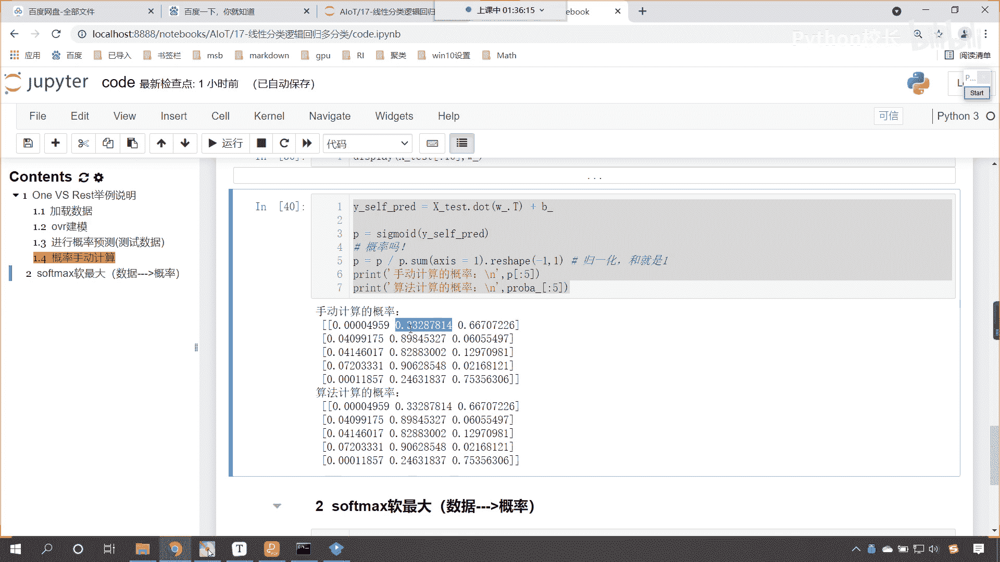
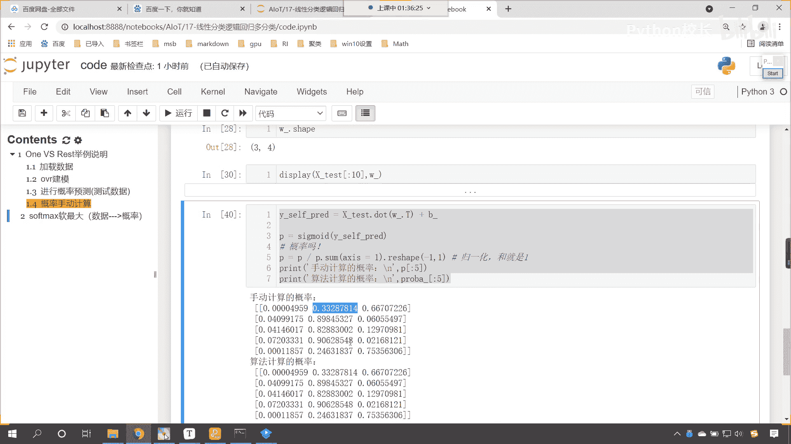
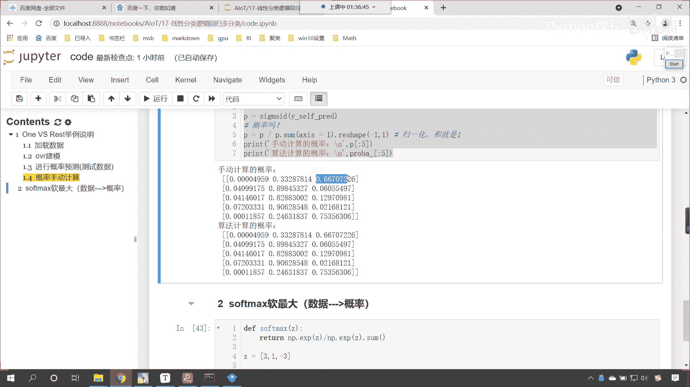
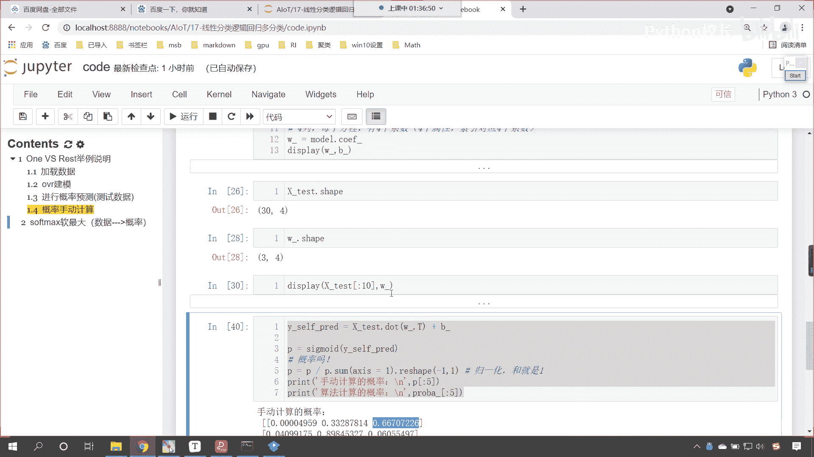
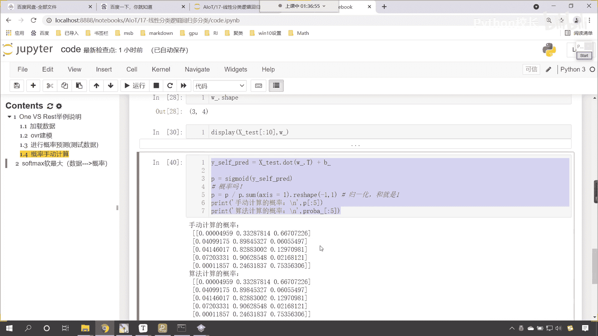
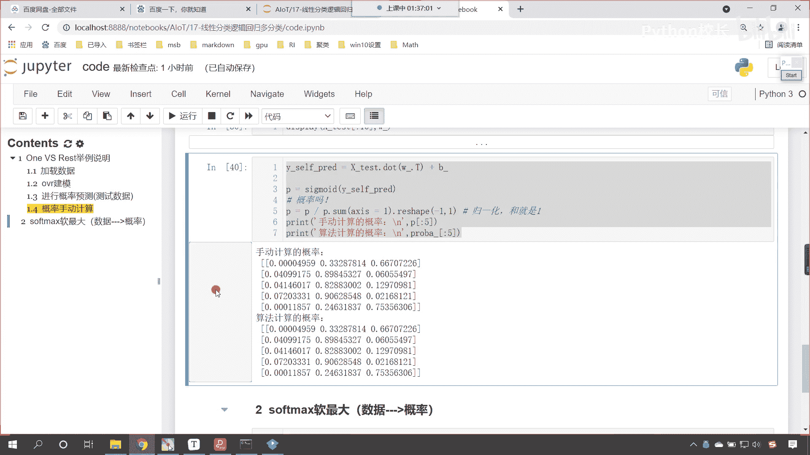
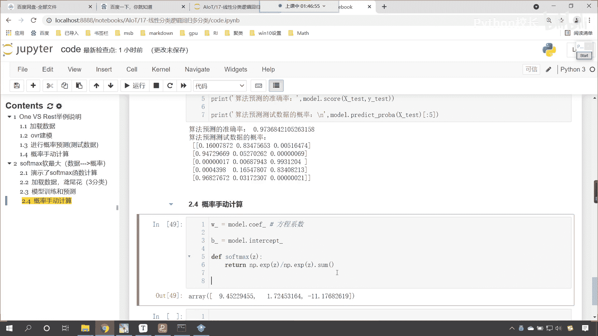
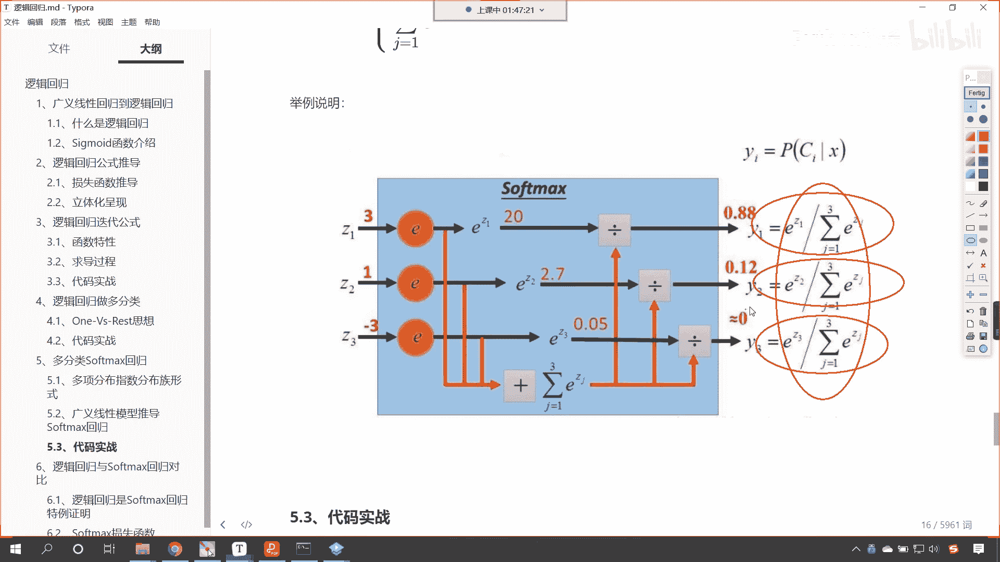
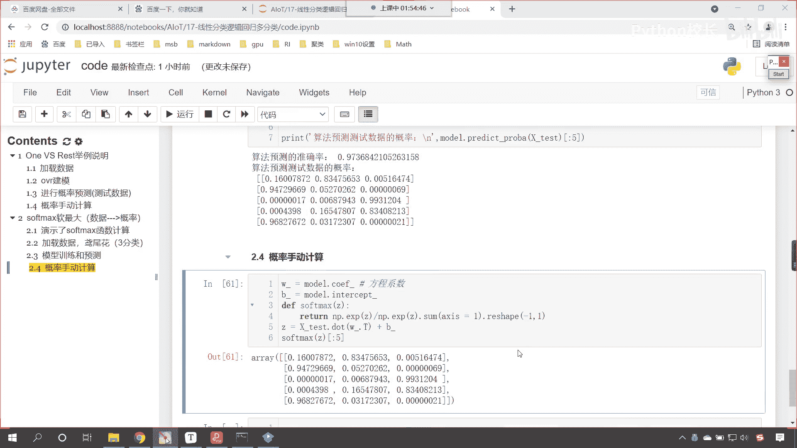

# P112：6-代码实现逻辑回归softmax概率计算 - 程序大本营 - BV1KL411z7WA

啊咱们刚才有小伙伴在群里边问了一个问题，是吧，呃这个little说o a r是不是可以算，业务类别之间有交叉，soft max直接给出概率分布，业务类别之间没有交叉，还是没有明白你所要表达的意思啊。

就无论是o v r还是soft max，其实它都是进行了规划，规划之后呢，这个比较概率，我们的o vr也好，还是soft max也好，最后它都是给出了三条方程，知道吧，只不过呢这个在进行梯度下降的时候。

这个公式略有不同啊，公式略有不同，这个可以算业务类别之间有交叉，你这个我们little小伙伴在群里边问的ovr，是不是可以算业务类别之间有交叉呃，这什么叫类物业别类物，这个什么叫业务类别之间有交叉呢。

嗯这个没有，这个没有明白你所要表达的这个意思啊，那rest这个o a r它呢是一种思想，我们的r就表示rest啊，就相当于是我们把它划归成其他的类别了，那因为我们的算法在进行分类的时候。

咱们其实很想要通过一个方程把咱们的o找到，把咱们的one找到，你看你这个o vr，你看它就是万vs rest，那找到了一个特定的方程，那我们希望这个方程呢把这个类别，我们希望这个方程求解出来的值尽量大。

方程的值尽量大，这样的话咱们才可以突出咱们的万，那我们有三个方程，每一个方程突出的是不是不同的类别呀，对不对，你看每一个方程突出的是不同的类别，那我们把这三个方程咱们进行这个归一化啊。

咱们进行这个概率计算，然后呢归一咱们进行概率计算，然后归一化哪个概率大，就说明它属于是哪个类别是吧，你就像这个，你看这个是0。33，这个是0。66是吧，那为什么计算出来是0。33呢。

是因为这第二个方程它在进行划分的时候。

你想方程是不是都有一个目标值，我不管你的目标值是多少是吧，反正我们在进行算法拟合的时候。

咱们有这样的一个原则，就是ovr他要突出这个one，你看这个one one vs rest，他要突出这个one，也就是说你的特征越明显，那么你想一下，咱们根据方程计算出来的值是不是越大呀。

根据方程计算出来的值越大，把它放到咱们的sigmoid的函数当中。

计算出来的概率是不是就越大。

概率越大，最后呢就得以划分了啊，它是这样的一个情况好。

那么接下来呢咱们就看一下咱们的这个soft max，它是如何划分的啊，好那么这个时候呢咱们同样也导一下包啊，import numpy as np，呃，然后呢咱们，from sk learn。

咱们import data sets from sk learn，咱们将算法导进来，linear model，咱们import logistic regression，把这个导进来好，那么导进来之后呢。

from s可以learn点啊，咱们从这个model selection当中，从这个模块下，import train test split，在这儿简单介绍一下它为什么是model selection。

叫模型选择呢，因为模型选择我们就是要评判咱们模型的好坏，想要评判模型的好坏，你想一下，是不是就得需要训练数据和测试数据的，一个对比呀，对不对，所以说这个模块下有一个数据的拆分好，那么咱们现在呢执行代码。

然后我们加载数据，咱们data，size load eris，这个时候呢这个数据呢它依然是三分类的，return x y，我们给一个true，那这个时候咱们这个代码就可以写的，快一些了啊。

x和y在这儿咱们就使用train test split，把咱们的数据一分为二，我们同样也给他一个random state，那这个random state呢就等于1024，这个呢是我的幸运数字。

好划分一下，那就是x trax下划线test y下划线tra，然后y下划线test，这个时候我们执行一下这个数据嗯，咱们执行展示一下，那就是display，我们简单的查看一下这个数据。

那就是x下划线train。ship嗯，然后呢再查看一下咱们x下划线test。ship，同时呢咱们查看其中的一部分数据好不好，那就是x下划线test中光冒号，咱们查看前五个数据执行好。

大家现在就能够看到咱们的数据，是不是就出现了，那有了这个数据之后呢，咱们声明算法，那就是model嗯，咱们同样呢我们在上面是吧，咱们也给他来一个这个插入一个标题啊，来一个四级标题。

那下面这部分代码咱们就演示了，那咱们就演示了soft max这个函数的计算，好那么接下来呢我们就是导包创建数据，是不是这个呢就是加载数据，那这个数据呢就是咱们圆微花的数据，它呢是一个三分类，有了三分类。

更多的分类它都是一样的啊，好，那么创建model就等于logistic regression，这个时候呢咱们修改一下他的mute class，我们介绍music class，它是不是就只有两种情况呀。

我们往下滑啊，看往下滑，你看是不是就有一个叫auto，另一个叫o v r，还有一个叫mutational，是不是，那么这个auto是自动的意思，看auto是自动的意思，如果我们要给了auto看啊。

那么这个嗯你的数据如果是binary，如果是二分类，那么默认他就会选择o v r otherwise，如果你的数据是多分类，那么默认情况下它会选择mutational。

所以说呢现在我们如果要不修改mutational class，那么它默认就使用soft max来进行划分，这个时候呢咱们给他特别指明一下啊，叫mutational mute，时候呢就是多分类。

那他就表示使用咱们的soft max来进行概率的划分，好model就有了，然后呢咱们就调用model。feat，将数据x train放进去，y下划线train放进去，那这一步呢就是咱们的训练，有了训练。

咱们就就调用model点，在这儿呢，咱们就查看一下它的准确率啊，sc x下划线test放进去，y下划线test放进去来打印输出一下，好那我们就print输出，这个时候呢单引号。

那这就是咱们算法预测的准确率，冒号来一个小括号，那么我们不仅要预测准确率，同时咱们也要预测一下它的概率，这个时候呢我们就print输出一下，这个时候咱们算法的这个预测的概率。

嗯这个时候那这个就是算法预测，咱们测试数据的概率是啊，这个时候就是逗号，英文的逗号调用model。predict probe，那它还有一个方法看是不是叫做predict log，problem呀。

log其实就是对它求了对数啊，log就是其实就是就是啊求了这个对数，那我们不需要看对数的，咱们只需要看problem，把它转换成百分比的就可以了，x下划线test放进去。

中括号咱们也查看它的前五个就可以了啊，好那么换行一下啊，不然的话这一行这个看着不太方便是吧，来一个换行反斜杠n，这个时候一直行好，现在你能够看到我是同样的电脑，是不是啊，咱们你看这个预测出来的情况。

是不是就不一样呀，哎你看看到了吧，这个是0。16，0。83，0。005，我们使用soft咱们的准确率是不是0。97呀，它是不是比咱们原来的那个使用ovr的概率，是不是要高一点，来我们往上看啊。

看咱们上面这个概率是多少，你看上面这个是不是0。966呀，现在是不是稍微提升了一点儿，我们就能够发现方法不一样是吧，这个概率也就不一样了，好那么到这儿之后呢，嗯咱们在这儿也上方插入一行，来一个四级标题。

这个呢就是咱们模型的训练和预测，我们看到这个结果了，那这个数据是怎么算的呀，来咱们现在呢算一下，添加一个四级标题，这个呢咱们就概率手动计算，想要手动计算概率，那咱们首先呢我们得把相应的这个数据。

咱们得给他拿到好，那么相应的数据其实就是斜率和截距了，那我们就调用model。coif，你想一下，无论我们使用vr进行划分也好，还是使用咱们的soft max划分也好，咱们是不是都是一个三分类问题。

对不对，那三分类问题你想一下，你看是不是就得需要三条线呀，对不对，你看它就得需要三条线三条线，所以说咱们的扣if它就是三行四列接收一下，那这个就是w杠是吧，这个就是咱们的看这个就是方程的系数。

啊这个就是方程系数，同样咱们再给一个截距b啊，model。intercept，截距是几个哎，三个123，因为它是三条方程嘛，是不是接收一个叫b格，这个时候我们再定义一下咱们的soft。

再定义一下咱们soft max这个方程好，那这个里边给一个z，然后呢咱们就return一下，对它进行计算，np。e x p，我们把z放进去，这个就是咱们的分子，那分母就是它的求和，那就是np。ex p。

咱们将z放进去点来一个sum，这个时候就搞定了，看这个公式。

就是咱们就是咱们对应的这个看到了吗，它就对应着它就对应着这个，那我们我们平时在写概率的时候，看平时在写概率的时候，其实呢都是一个一个写开了，对不对，你看嗯这个是三的，这个是一的，这个是-3的。

是不是写开了，而我们代码当中大家看啊，你看代码当中咱们是不是都写到一块儿了呀，你看一行是不是就搞定了，这是为什么呀，因为咱们的z它是一个嗯它是一个数组，因为这个z在此时呢它表示数组，所以说我们南派数组。

可以进行非常方便的计算是吧，那这个数组就可以数组当中的每一个数值，一个一个进行计算是吧，进行相应的广播机制，z表示数组表示数组，那么它就可以通过广播机制来进行计算啊。

那它就可以通过广播机制来批量的进行计算，反正你的公式是不是都是一样的呀，对不对，公式都一样，所以说咱们写一个就行，然后传数组进去就ok了，好那么嗯数据得到了，咱们接下来就构建这个方程吧是吧。

那同样是x test点，咱们进行矩阵运算，把w杠放到这儿，是不是来一个t这个时候是不是得需要转置，那么转制之后看转制之后，咱们现在呢现在呢我们就来一个这个呃加法啊，咱们就来一个加上b加上b之后。

咱们得到的这个结果就是z查看一下咱们的z，你看我一执行啊，这个b is not define，因为我们定义的是b盖，是不是执行一下来，现在你来看怎么样，这个数据是不是就有了，对不对，好。

有了这个数据之后，咱们就计算一下z的soft max，现在我们把它带进去啊，现在咱们的z是几维的，看z。sheep，你看它是几维的，它是不是38和三呀，那我们上面这个公式就得稍微改一下。

你知道为什么要改吗，不改会怎么样，我们看一下啊，那咱们就调用soft max小括号，咱们就将z作为参数传进去，你看我一执行诶，大家看求解出来了，你看求解出来，你感觉怪不怪数据，对不对，来睁大眼睛。

你看一下，告诉我，对不对，很显然不对，是不是这个数据感觉咋就这么小呢，你看我们上面这个数据多大，0。16，0。83，0。00516，这个是不是特别小，计算出来的数据比较小，说明什么大。

我们上面是一个除法运算，是不是说明是不是咱们的分母变大了，那大家看啊，我们在进行计算的时候，咱们希望什么样，咱们希望怎么进行计算呢，你看这是z看到了吧，咱们希望呢这三个数据进行规划。

也就是说这三个数据看这三个数据，他们呢这个进行e x p运算，然后除以它们的e x p的和，对不对，而如果我们在默认二维数据求和的时候，你想是不是所有的数据都求和了，对不对，大家看啊，np。ex p。

咱们将z放进去，你看形状是不是依然是这样，那如果我要求和，你看这个时候一执行，是不是所有的数据都求和了，这个不行，咱们求和的时候，我们希望嗯怎么求和呢，我们希望这一行数据求和，看到了吗。

这一行数据求和求和的这个结果，咱们作为分母看到了吧，作为分母，咱们假设说求和之后这个结果啊，求和之后这个结果咱们叫s，那么这个s呢，它应该作为咱们的分母分别除以谁呢，看到了吧，就是1。811除以s，9。

4459除以s，0。058除以s应该是这么样的一个运算，而不是点sum，这是如果要点sum的话，它呢就是所有数据的求和了，那样是不对的，关系也不对应，是不是啊，那怎么办，咱们点sum可以指定轴。

我们让这个轴等于一，你看一是什么，是不是就是计算方向呀，外边这个中国二是零，里面这个中国二是一，如果我们要给一的话，它呢就是1。89。4，这个进行计算，加合起来是十点多，你看啊，加合起来是11点多。

看到了吧，是不是就是11点多呀，我们让它等于一，这个时候再执行，一执行还报错，你想一下为什么你看又错了对吧，我们看一下他报的错啊，叫value error，为什么不能进行广播，为啥形状不对应。

你前面是38和三，后面是38是吧，前面是二维，后面是一维怎么办，和咱们刚才在计算概率的时候，你看是不是一样呀，咱们刚才计算概率的时候，是不是也是遇到了形状不匹配，所以咱们进行了一个reshape。

那这里同样的道理，来咱们在这也来进行一个reshape，r e s h a p e给一个-1，给一个一，这个时候你看过一执行诶，大家看对比一下咱们的概率啊，来我们概率很多，查看前五个执行对比一下。

下面这个演示的咱们就删除掉了啊，看看咱们对比一下对比，那我们就和上面的对比对不对嗯，唉大家看上面是咱们算法预测的，你来看一样不一样，是不是这个时候就完全一样了，看到了吧，1。6是吧，嗯到最后八位872。

这个是不是也是872是吧，这个看也是完全一样对吧，那我们看这个0。03和这个也是完全一样，这个是9。682是吧，完全一样，所以到这里你就知道我们的soft max是吧，它是怎样的一个计算过程了吧。

对不对。