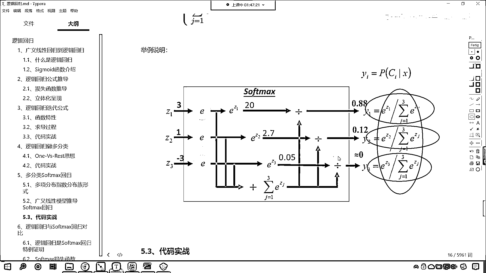
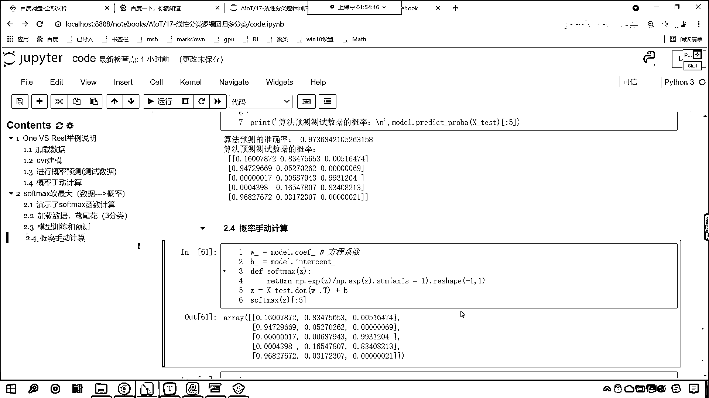

# 7天爆肝整理！AI量化交易-机器学习全套教程，从入门到项目实战保姆级教程！（数据挖掘分析／大数据／可视化／投资／金融／股票／算法） - P112：6-代码实现逻辑回归softmax概率计算 - Python校长 - BV1KL411z7WA

咱們剛才有小夥伴在群裡邊問了一個問題，Lytle說OVR是不是可以算業務類別之間有交叉，Softmax直接給出概率分布 業務類別之間沒有交叉，還是沒有明白你所要表達的意思。

無論是OVR還是Softmax 都是進行了規劃之後比較概率，我們的OVR也好還是Softmax也好 最後都是給出了三條方程，只不過在進行梯度下降的時候 公式略有不同，可以算業務類別之間有交叉。

我們Lytle小夥伴在群裡邊問的OVR是不是可以算業務類別之間有交叉，什麼叫業務類別之間有交叉呢，這個沒有明白你所要表達的意思，REST OVR是一種思想。

我們的R就表示REST 就相當於是我們把它劃歸成其他的類別了，因為我們的算法在進行分類的時候，咱們其實很想要通過一個方程把咱們的O找到，把咱們的1找到 OVR就是1 VS REST。

找到了一個特定的方程，我們希望這個方程把這個類別，我們希望這個方程求解出來的值盡量大，這樣的話咱們才可以突出咱們的1，我們有三個方程，每一個方程突出的是不是不同的類別，你看每一個方程突出的是不同的類別。

那我們把這三個方程進行規劃，咱們進行概率計算，然後規劃，哪個概率大就說明它屬於哪個類別，就像這個0。33這個0。66，為什麼計算出來是0。33呢，是因為第二個方程在進行劃分的時候。

方程是不是都有一個目標值，我不管你的目標值是多少，反正我們在進行算法擬合的時候，咱們有這樣的一個原則，就是OVR它要突出這個1，你看這個1 VS REST它要突出這個1，也就是說你的特徵越明顯。

那麼你想一下，咱們根據方程計算出來的值是不是越大，根據方程計算出來的值越大，把它放到咱們的SIGMOID函數當中，計算出來的概率是不是就越大，概率越大最後就得以劃分了，它是這樣的一個情況。

好 那麼接下來咱們就看一下，咱們的SOFTMAX它是如何劃分的，好 那麼這個時候咱們同樣也導一下包，import numpy as np，然後咱們from sklearn。

咱們import datasets，from sklearn咱們將算法導進來，linear model，咱們import logistic regression，把這個導進來，好 那麼導進來之後。

from sklearn 點，咱們從這個model selection當中，從這個模塊下，import trunstest split，在這簡單介紹一下。

它為什麼是model selection叫模型選擇呢，因為模型選擇我們就是要評判咱們模型的好壞，想要評判模型的好壞，你想一下是不是就得需要訓練數據，和測試數據的一個對比。

對不對 所以說這個模塊下有一個數據的拆分，好 那麼咱們現在執行代碼，然後我們加載數據，咱們data sets load arith，這個時候這個數據它依然是三分類的。

return x y 我們給一個true，那這個時候咱們這個代碼就可以寫的快一些了，x和y在這咱們就使用trunstest split，把咱們的數據一分為二，我們同樣也給它一個random state。

那這個random state就等於1024，這個是我的幸運數字，好 劃分一下那就是xtrun x下滑線test y下滑線trun，然後y下滑線test，這個時候我們執行一下這個數據。

咱們執行展示一下那就是display，我們簡單的查看一下這個數據，那就是x下滑線trun。shap，然後再查看一下咱們x下滑線test。shap，同時咱們查看其中的一部分數據好不好。

那就是x下滑線test中關冒號，咱們查看前五個數據執行，好 大家現在就能夠看到，咱們的數據是不是就出現了，那有了這個數據之後呢，咱們聲明算法那就是model，咱們同樣呢，我們在上面是吧。

咱們也給它來一個這個，插入一個標題啊，來一個四級標題，那下面這部分代碼咱們就演示了，softmax這個函數的計算，好 那麼接下來呢，我們就是導包創建數據是不是，這個呢就是加載數據。

那這個數據呢就是咱們原微花的數據，它呢是一個三分類，有了三分類，更多的分類它都是一樣的啊，好 那麼創建model就等於logistic regression，這個時候呢。

咱們修改一下它的multiclass，我們介紹multiclass，它是不是就只有兩種情況呀，我們往下滑啊，看往下滑，你看是不是就有一個叫auto，另一個叫ovr，還有一個叫mutational是不是。

那麼這個auto呢是自動的意思，看auto是自動的意思，如果我們要給了auto，那麼這個你的數據如果是binary，如果是二分類，那麼默認它就會選擇ovr，otherwise如果你的數據是多分類。

那麼默認情況下它會選擇mutational，所以說呢，現在我們如果要不修改multiclass，那麼它默認就使用softmax來進行劃分，這個時候呢，咱們給它特別指名一下啊，叫multiclass。

multiclass就是多分類，那它就表示使用咱們的softmax，來進行概率的劃分，好model就有了，然後呢咱們就調用model。fit，將數據x寸放進去，y下滑線寸放進去。

那這一步呢就是咱們的訓練，有了訓練咱們就調用model。，在這呢，咱們就查看一下它的準確率啊，score，x下滑線test放進去，y下滑線test放進去，來打印輸出一下，好那我們就print輸出。

這個時候呢單一號，那這就是咱們算法預測的準確率，來一個小括號，那麼我們不僅要預測準確率，同時咱們也要預測一下它的概率，這個時候呢，我們就print輸出一下，這個時候咱們算法的這個預測的概率。

這個時候那這個就是算法預測，咱們測試數據的概率是，這個時候就是逗號，英文的逗號，調用model。predictprobe，那它還有一個方法，看是不是叫做predictlogprobe。

log其實就是對它求了對數，log其實就是求了對數，那我們不需要看對數的，咱們只需要看probe，把它轉換成百分比的就可以了，x下滑線test放進去，中國號咱們也查看它的前五個就可以了，好那麼換行一下。

不然的話這一行這個看著不太方便是吧，來一個換行，反斜槓n這個時候一執行，好現在你能夠看到，我是同樣的電腦是不是啊，咱們你看這個預測出來的情況，是不是就不一樣呀，哎你看，看到了吧這個是0。16，0。83。

0。005，我們使用soft，咱們的準確率是不是0。97啊，它是不是比咱們原來的那個使用ovr的概率，是不是要高一點，來我們往上看啊，看咱們上面這個概率是多少，你看上面這個是不是0。966呀。

現在是不是稍微提升了一點，我們就能夠發現方法不一樣，是吧這個概率也就不一樣了，好那麼到這之後呢，咱們在這也上方插入一行來一個四級標題，這個呢就是咱們模型的訓練和預測，我們看到這個結果了。

那這個數據是怎麼算的呀，來咱們現在呢算一下，添加一個四級標題，這個呢咱們就概率手動計算，想要手動計算概率，那咱們首先呢，我們得把相應的這個數據咱們得給他拿到，好那麼相應的數據其實就是斜率和截據了。

那我們就調用model。coif，你想一下，無論我們使用ovr進行劃分也好，還是使用咱們的softmax劃分也好，咱們是不是都是一個三分類問題，對不對，那三分類問題你想一下你看，是不是就得需要三條線呀。

對不對你看他就得需要三條線，三條線所以說咱們的coif他就是三行四列，接受一下那這個就是w-，是吧這個就是咱們的，看這個就是方程的系數，啊這個就是方程系數，同樣咱們再給一個截據b啊，model。

intercept，截據是幾個，哎三個1 2 3，因為他是三條方程嘛，是不是接受一個叫b-，這個時候我們再定義一下咱們的soft，再定義一下咱們softmax這個方程，好那這個裡邊給一個z。

然後呢咱們就return一下，對他進行計算，np。exp我們把z放進去，這個就是咱們的分子，那分母就是他的求和，那就是np。exp，咱們將z放進去點來一個sum，這個時候就搞定了。

看這個公式就是咱們就是咱們對應的這個，看了吧他就對應著他就對應著這個，那我們我們平時在寫概率的時候，平時在寫概率的時候，其實呢都是一個一個寫開了，對不對你看。

這個是3的這個是1的這個是-3的。

是不是寫開了，而我們代碼當中大家看啊，你看代碼當中咱們是不是都寫到一塊了呀，你看一行是不是就搞定了，這是為什麼呀，因為咱們的z他是一個，他是一個數組，因為這個z在此時呢他表示數組。

所以說我們南派數組可以進行非常方便的計算，是吧那這個數組就可以數組當中的每一個數值，一個一個進行計算，是吧進行相應的廣播機制，在表示數組表示數組，那麼他就可以通過廣播機制來進行計算。

那他就可以通過廣播機制來批量的進行計算，反正你的公式是不是都是一樣的呀，對不對公式都一樣，所以說咱們寫一個就行，然後傳數組進去就ok了，好那麼數據得到了，咱們接下來就構建這個方程吧。

是吧那同樣是xtest的底兒，咱們進行矩陣運算，把w-放到這兒是不是來一個t，這個時候是不是得需要轉制，那麼轉制之後，轉制之後，咱們現在呢，現在呢我們就來一個這個加法啊，咱們就來一個加上b。

加上b之後咱們得到的這個結果就是z，查看一下咱們的z你看我一執行，這個b is not defined，因為我們定義的是b-是不是執行一下，來現在你來看，怎麼樣這個數據是不是就有了。

對不對好有了這個數據之後，咱們就計算一下z的softmax，現在我們把它帶進去啊，現在咱們的z是幾維的，看這一點shape你看它是幾維的，它是不是38和3呀，那我們上面這個公式就得稍微改一下。

你知道為什麼要改嗎，不改會怎麼樣，我們看一下啊，那咱們就調用softmax小括號，咱們就將z作為參數傳進去，你看我一執行，哎大家看求解出來了，你看求解出來你感覺怪不怪，數據對不對。

來睜大眼睛你看一下告訴我對不對，很顯然不對是不是，這個數據感覺咋就這麼小呢，你看我們上面這個數據多大，0。16 0。83 0。00516，這個是不是特別小，計算出來的數據比較小，說明什麼大。

我們上面是一個儲法運算是不是，說明是不是咱們的分母變大了，那大家看啊，我們在進行計算的時候，咱們希望什麼樣，咱們希望怎麼進行計算呢，你看這是z看到了吧，咱們希望呢，這三個數據進行歸一化。

也就是說這三個數據，看這三個數據，他們呢這個，進行exp運算，然後除以他們的exp的和對不對，而如果我們，在默認二維數據求和的時候，你想是不是所有的數據都求和了，對不對，大家看啊，np。exp。

咱們將這放進去，你看形狀是不是依然是這樣，那如果我要求和，你看這個時候一執行，是不是所有的數據都求和了，這個不行，咱們求和的時候，我們希望怎麼求和呢，我們希望這一行數據求和，看到了吧，這一行數據求和。

求和的這個結果，咱們作為分母看到了吧，作為分母，咱們假設說求和之後，這個結果求和之後，這個結果咱們叫s，那麼這個s呢，它應該作為咱們的分母，分別除以誰呢，看到了吧，就是1。811除以s，9。

4459除以s，0。058除以s，應該是這麼樣的一個運算，而不是。s，這是如果要。s的話，它就是所有數據的求和了，那樣是不對的，關係也不對應，是不是，那怎麼辦，咱們。s可以指定軸，我們讓這個軸等於1。

你看1是什麼，是不是就是計算方向，外邊這個中光是零，裡面這個中光是1，如果我們要給1的話，它就是1。89。4，這個進行計算，加和起來是10點多，你看加和起來是11點多，看到了吧，是不是就是11點多。

所以我們求和的時候修改一下，axis我們讓它等於1，這個時候再執行，一執行還報錯，你想一下為什麼，你看又錯了，對吧，我們看一下它報的錯，叫value error，為什麼，不能進行廣播，為啥，形狀不對應。

你前面是38和3，後面是38，是吧，前面是二維，後面是一維，怎麼辦，和咱們剛才在計算概率的時候，你看，是不是一樣，咱們剛才計算概率的時候，是不是也是遇到了形狀不匹配，所以咱們進行了一個reshape。

那這裡同樣的道理，來，咱們在這也來進行一個reshape，re shape，給一個-1，給一個1，這個時候你看我一執行，大家看對比一下咱們的概率，來我們概率很多，查看前5個執行，對比一下。

下面這個演示的，咱們就刪除掉了，看到咱們對比一下，對比，那我們就和上面的對比，對不對，大家看，上面是咱們算法預測的，你來看一樣不一樣，是不是這個時候就完全一樣了，看到了嗎，1。6，是吧，到最後8位。

872，這個是不是也是872，是吧，這個看也是完全一樣，對吧，那我們看這個0。03和這個也是完全一樣，這個是9。682是吧，完全一樣，所以到這裡，你就知道我們的softmax，是吧。

它是怎樣的一個計算過程了吧。

對不對，它就是這種方式來進行計算的。