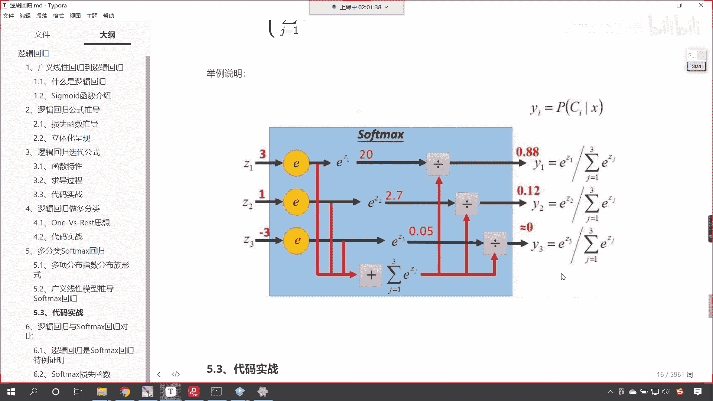
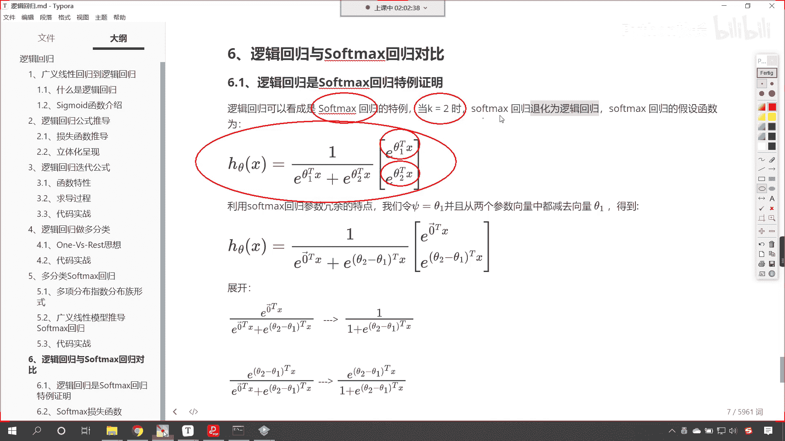
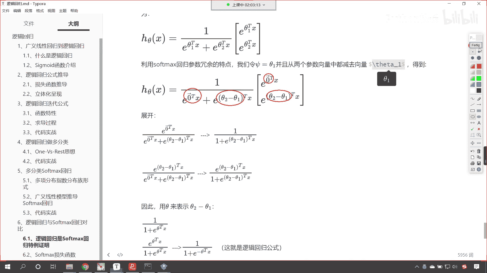
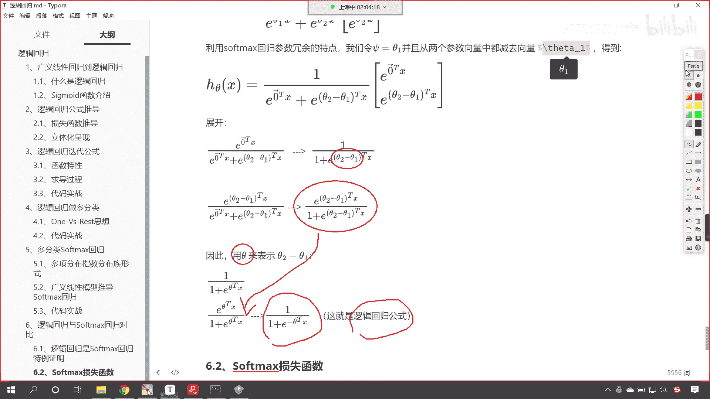
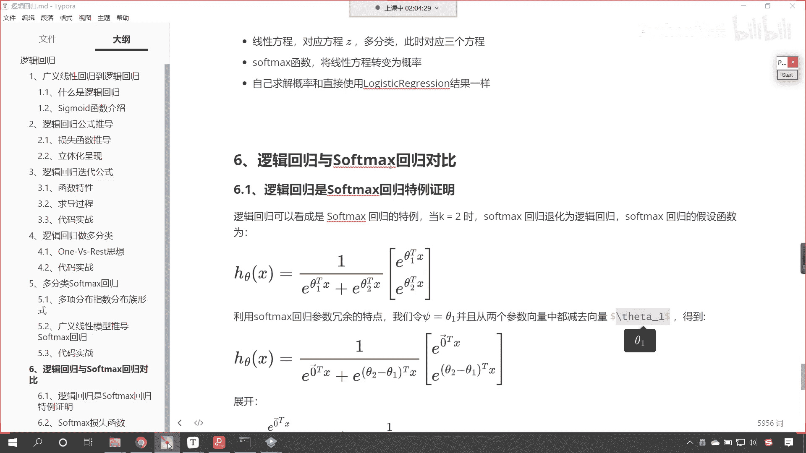
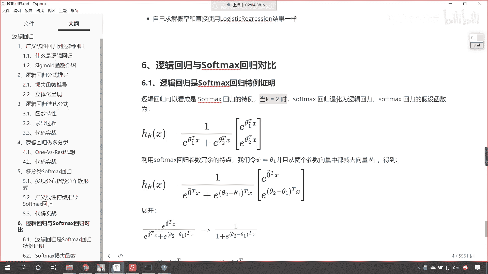
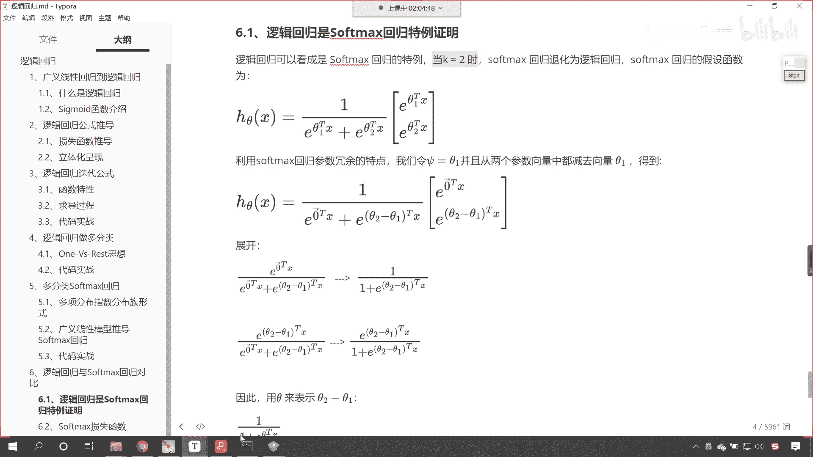
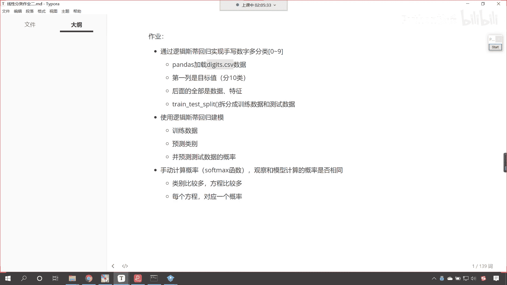
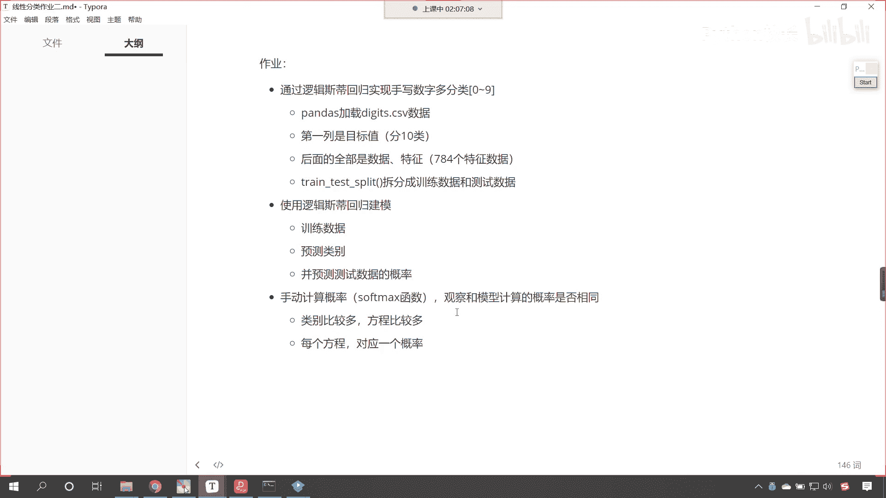
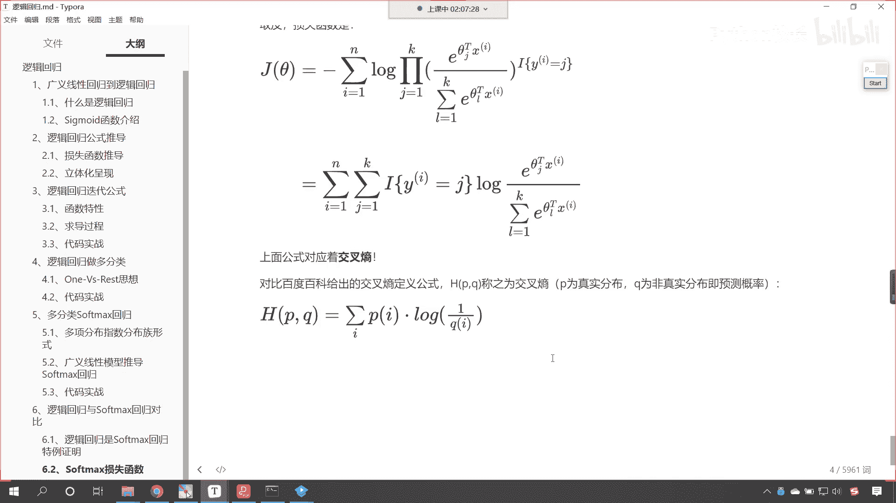

# P113：7-Sigmoid与Softmax异同 - 程序大本营 - BV1KL411z7WA

好那么我们就看最后一部分啊，嗯逻辑回归与咱们的soft max回归，他俩呢是同根同源，当我们的k等于二的时候，soft max回归它就退化为逻辑斯蒂回归了，看下面是我的证明过程，看到了吗。

下面是我的证明过程，你看我现在写的这个，看咱们现在写的这个soft max回归，你看是不是，看咱们的分母上是不是e的多少次幂，e的多少次幂啊，对不对，而分子上是谁呢，看到了吧。

一个两个这个是不是就是分别计算概率呀，看到了吧，这个就是咱们的soft max回归啊，那如果当k等于二呢。

你看这就是咱们写了两个，是不是写了两个，它下面呢进行了一个转换，因为这些都是向量向量的话，咱们可以怎么做，看我们可以从两个向量当中都减c塔一，同时减c塔一，减完西塔一之后。

你看这个是不是就变成零向量乘以它了对吧，然后你都减ca一都是不变的，看到了吧，thea 2减ca 1，c塔二减c塔一，这个是不是变成零了，对不对。

同时减，那么我们这个方程依然成立，然后我们展开你上面是吧，你这个树干里边就表示这个分子同时展开，你看这就是一呗，因为你e的零次幂不就是一吗，然后下下面这个就是e的c塔二减theta 1，t的x是吧。

这是tx，那我们在上面的公式当中，咱们西塔二减c塔一，它是不是一个新的变量呀，这个新的变量咱们就用sa来表示，看新的变量，咱们就用c塔来表示，我们可以用c塔来表示，大家看啊。

把theta带到这个公式当中，c他带到这个公式当中，它就演变成了这种形式，演变演变成了这种形式，我们一化简得到的，这个是不是就是咱们逻辑回归的公式呀，所以说呢我们刚才在代码当中计算的时候。

咱们的逻辑回归和soft max回归计算方式不一样。

但是他们两个是吧，当我们soft max回归，当k等于二的时候，soft max回归就退化为逻辑回归了。

好它呢是这样的一个它是这样的一个关系啊，好那么这个呢就是咱们今天所有的内容。

我们一起来看一下咱们的作业啊，好那么咱们今天呢介绍了多分类，是不是今天介绍了多分类，那这个是我们上一节课的啊，嗯上一节课咱们是不是给各位介绍了，葡萄酒分类，是不是上一节，那我们这一节课咱们的作业呢。

哎大家看啊，这个就类别就有点多了，你在算的时候呢，你就得好好算一下，咱们使用逻辑斯蒂回归实现手写数字多分类，这个手写数字多分类它就是01231直到九，数据呢已经为各位准备好了，在咱们digital。

csv百度网盘当中。

我们有这个数据看啊，这是今天的这个数据，看这个数据里边数据还不少呢，73。2兆，我们一共是42000个数据。

你需要使用咱们嗯所讲的代码是吧，把这个数据拆分，这第一列呢是目标值，它是分十类，后面全部是数据和特征，这个数据特征比较多啊，咱们是784个特征数据，使用train test split。

咱们拆分成训练和测试数据，然后使用逻辑回归建模训练，预测并预测类别，然后我们手动计算概率，这次咱们计算概率的时候，咱们就使用soft max这个函数这个方式来进行计算，那你就要对比一下。

你手动计算的和上面预测的准确率，它应该完全一样才对，知道吗，我们的类别比较多，所以说这个方程也就比较多，每一个方程它都对应着一个概率，每个类别也都对应着一个概率，因为我们是多分类，是十个类别。

是不是十个类别对应多少个方程，根据咱们今天所讲的三种圆为花，对应三个方程，十种数字是不是就对应十个方程呀，对不对，哎所以这就是咱们今天要完成的作业啊。

好那么今天晚上咱们讲课的内容呢，我们就到这里了啊，啊其实我们课程当中有一部分咱们没有讲，我们相应的这个推导公式都在这里，你可以自己去研究，可以自己去看一下。

