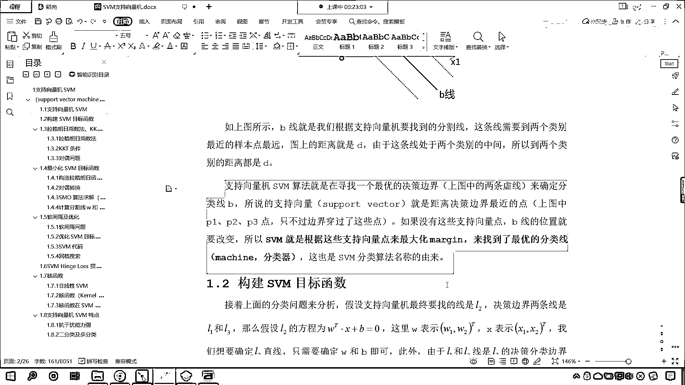

# 7天爆肝整理！AI量化交易-机器学习全套教程，从入门到项目实战保姆级教程！（数据挖掘分析／大数据／可视化／投资／金融／股票／算法） - P114：1-支持向量机SVM概念 - Python校长 - BV1KL411z7WA

我们就开始我们的课程，上两节课呢 我们看了一下逻辑回归，逻辑4D回归呢 它其实也是在线性回归当中的 对不对，既然是线性回归当中的 它其实呢 拟合出来的也是线性的一个方程，只不过呢 我们根据这个线性方程。

咱们根据sigma的函数 或者说呢 我们根据softmax函数，咱们将线性方程转换成了概率 转换成了概率 这个时候就不得了了，概率呢 其实就是比大小 那比大小的话 我们就可以进行分类了。

所以说 你看这就是一个非常巧妙的转变 是吧 那我们变成了概率 咱们就由这个，线性回归 咱们就变到了分类问题，你想一下 咱们所生活在这个世界上 我们所有的问题是不是都可以。

把它变成最基础的回归问题和分类问题啊，那回归问题就是它的函数方程是怎样的，它是怎样的一个走势 是怎样的一个趋势 是不是，那咱们的分类问题呢 哎 就是把它分成男和女。

对不对 比如说我们把它这个植物分成不同的类别，咱把这个动物也分成不同的类别 这个就是分类问题，好 那么分类问题呢 咱们往往就是根据概率来进行划分，今天呢 咱们继续向前进一步，咱们看一下这个支持限量机。

在咱们看之前呢 来 我们呢 先给大家看一下咱们百度网盘当中的，我们的作业，好 大家看 咱们17杠线性分类 逻辑4D回归多分类。

我们的答案呢 已经为各位小伙伴 已经为各位小伙伴准备好 并且呢 进行了相应的上传，那你就参考我的视频以及咱们上课所学的知识点 你就可以把咱们这个作业来完成，好 那么。

逻辑4D回归呢 咱们就告一段落 那接下来我们看一下这什么是知识限量机，对吧 那啥是知识限量机呢 它的缩写就叫做SVM，那这肯定是三个英语单词的缩写 对不对啊 这叫做support。

vector machine翻译成中文就叫做支持限量机，那这个S呢就是support，它呢support叫support v呢是vector m呢是machine，那大家看这个。

support它指的是什么意思啊 哎 咱们回车一下啊 你看这个support指的是什么意思呀，它呢指的是支持的意思 这个vector指的是什么意思啊 向量。

这个machine指的是什么意思 机器 如果我们要把这三个英语单词进行翻译 那么它就是支持限量机，那首先 咱们说一下什么是machine 这什么是机器呀 这里讲的机器呢就是咱们的分类器。

咱们在机器学习当中，咱们需要把任务 是吧 我们需要完成一个分类任务 或者说咱们需要完成一个回归任务，那么我 我们把训练出来的这个模型 咱们把它叫做机器 你知道机器可以干嘛吗。

咱们人制造出来各种各样复杂的机器 是不是就是帮助我们人类完成任务呀，在机器学习当中 咱们造出来的这个机器是什么呢 哎 咱们造出来这个机器就是，对应的算法 那vector就是向量 那什么是向量呢。

这个呢 是咱们线性代数当中的一个概念啊，那这个support就是支持的意思 待会下面有具体的这个，图形 那我们在看具体图形的时候 那我告诉你什么是这个支持向量。

这个支持向量 你可以把它当成特定的一个数据，来 那我们一起来看一下咱们支持向量机它的概念，大家现在呢能看到下面这个图形，那这个图形呢 有两类底 一个是红色的 一个是蓝色的。

现在呢 我想要把这两类底对它进行一个划分 那，我们如果想要把红色的底和蓝色的底进行划分 你想一下是不是会有多种方案呀，你就能够看到咱们的A线 B线和C线是不是都可以将这两类点进行分开呀。

没问题吧 对不对 好 那么咱们现在的问题是，哪一条线它划分的最合适 划分的最完美呢，哎 那我们讨论区里边有小伙伴已经回复了，那你看 根据我们的经验 咱们也知道咱们的B线 B这条线它划分的是不是最好呀。

因为它划分的最开，虽然咱们的A线和C线也能划分开，但是我们能够看到这两处红色的底和咱们蓝色的底 他们的规律呢 你看，他们最大的间隔是不是就是咱们B这条线呀。

因为呢 红色的这些点距离B这条线的距离是不是比较远呀，蓝色的点距离B这条线距离是不是也比较远呀，那我们今天要学习的知识项量机呢 哎 他要做的事情，就是以最优的方式将咱们红色的底和蓝色的底 哎 把它进行。

拆分 所以这里边呢就有一个分割的原则呢 咱们是间隔最大化，那为什么间隔最大化 它最优秀呢 因为呢，我们对于这两类点进行了划分，咱们不仅仅期望把这两类点给它拆分开。

咱们还期望着 如果有其他的一些点 比如说啊 咱们给你举一个例子 比如说，看 比如说在这个地方 比如说在这个地方有一个点 那我们给它换一个颜色啊，比如说咱们给它换成黑色的 你看啊 在这个地方。

是吧 出现了一个点 请问这个黑色的点它属于是哪个类别呢，你看这个黑色的点它属于哪个类别呀，你看 按照咱们的规律来讲 按照咱们最优的这条线b来划分的话，你想b它是不是在这条线的上方呀 那么。

那么咱们黑色的这个点是不是应该被划归到咱们红色的区域呀，对不对 但是如果说我要选择c这条线，但是如果说你要选择c这条线作为咱们分类的这个学习器 那么你看，黑色的这个点是不是在c这条线的下面呀。

它既然在c这条线的下面 那么黑色的这个点是不是应该被划归到咱们蓝色的区域呀，那很显然这个和咱们，数据的规律是不是不相符呀 所以说c这条线它呢就不是最好的。

那这样也就印证了b这条线 你看它不仅仅可以把当前的这些点很好的划分，咱们b这条线是不是还可以将未知的点进行很好的划分呀 未知的点就是咱们给的这个黑色的点啊。

因为我们的机器学习 咱们不仅仅是要预测咱们当前的数据，我们机器学习更重要的作用 咱们呢是希望预测未来的数据 所以说呢，咱们分割的原则呢就是让它间隔最大化，那知识项量机呢。

它的作用知识项量机呢 它就是要去找咱们最大的这个间隔，如果咱们对应的样本特征少 一个普通的svm，就是一条线将咱们的样本进行隔开 但是要求，咱们的线到两个类别最近样本底的距离 我们需要让它最大。

也就是说你看b这条线是不是距离咱们红色的底和蓝色的底 你看它们的距离是不是同时都是最大的呀，好 那么我们继续往下看啊，大家现在就能够看到，你看刚才呢 我们是abc三条线 现在的话我们就筛选了其中。

最这个划分最合适的b这条线 那我们就能够看到b这条线，你看b这条线呢 就是我们根据知识项量找到的分割线，刚才我们介绍了这个知识项量是什么 那在这里呢 咱们有了具体的案例。

那我给各位介绍一下这什么是知识项量，那在咱们这些底当中 大家看红色的底当中有p1和p2 蓝色底当中是吧 我们选择了一个p3，那我们之所以能够找到中间这条。

中间这条分割线 咱们呢 其实就是根据这个p1点 p2点以及呢 根据咱们的p3点，咱们进行划分的 为什么呀 因为这个p1点和p2点属于是咱们红色区域的边界点，你看我们其他的红色的底是不是都靠上呀。

那只有这个p1和p2点 它是不是离咱们中间这条分割线是不是最近呀，同样的道理 你看咱们蓝色的区域，蓝色区域咱们的p3这个底它是不是距离，它是不是最外侧的这个底呀 它是不是距离咱们b这条线最近呀。

对不对 那么我们就将p1 p2 p3，我们就将这样的底 咱们把它称为知识项量 你看为啥把它叫做知识项量，那正是因为这几个点是不是就确定了咱们中间这条。

类别的划分线呀 对不对 你看它就确定了中间咱们b线 所以说呢，那现在呢 咱们已经知道什么是知识项量了，也就是说咱们SVM这个算法在寻找 再寻找这个最佳。

最佳的这个分裂线的时候呢 它会从这两处点当中寻找支持项量，有了支持项量了 咱们就可以根据支持项量来构建中间这条黑色的线，所以说呢 这个知识项量呢 这个知识项量机SVM算法就是寻找一个最优的。

决策边界 咱们上图当中的两条虚线来确定咱们的分类线B，那什么是决策边界呢 现在你就能够看到，咱们这个地方呢 有两条虚线 看到了吧 这个地方有两条虚线。

这两条虚线就是咱们的分类边界 那么这个分类边界是如何确定的呀 就是根据支持项量来确定的，所以咱们所说的支持项量呢 就是距离决策边界最近的点，那也就是上图当中的P1 P2 P3。

只不过这个边界穿过了这些点 因为它是边界嘛 所以说它正好在咱们边界这条线上，如果没有这些支持线量点 咱们B线的位置呢 它就要改变了。

所以咱们支持项量机呢 就是根据这些支持项量来最大化咱们的marking，这什么是marking呢 marking就是咱们的距离呀 marking就是咱们的这个边界。

那我们只有最大化了这个边界 那咱们找到最优的分类线，我们把这个分类线就叫做machine，这个也就是咱们支持项量机这个算法的由来。

上面你看我们是不是进行了介绍呀 叫support vector machine 是吧，支持项量机 现在你知道它是怎么一回事了吧 那通过咱们这个图形 那我们就发现，咱们中间这条黑色的B线确实。

以最优的方式是不是将红色的底和咱们蓝色的底进行了一个分割呀，所以说这个支持项量机呢，自从这个算法一出来 那这个算法呢就在全世界范围内风靡了很长时间，直到是吧这个前几年这个深度学习人工神经网络的兴起。

那这个支持项量机它的风头呢 它才会这个稍微就稍微过去一点，但是呢支持项量机它依然是非常优秀的一个算法啊，就是在解决很多问题的时候 我们使用支持项量机就可以得到很好的答案。

那我们知道这个现在正在兴起方性vi的是这个深度神经网络人工智能 对不对呀，那这些算法呢 它其实是用于解决超级复杂的问题 是吧 那对于我们一般的问题。

咱们使用支持项量机 这就足够了。

