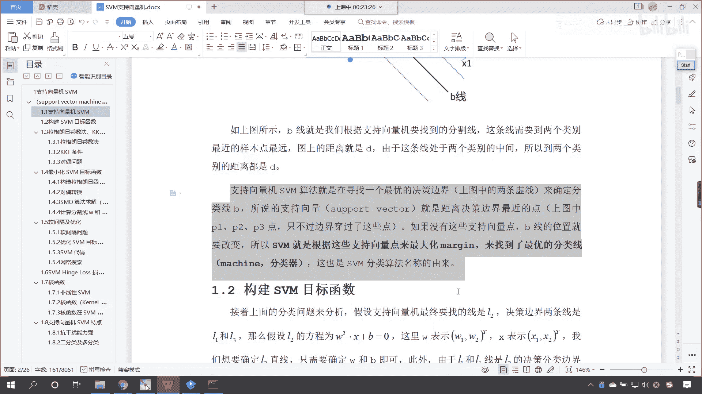
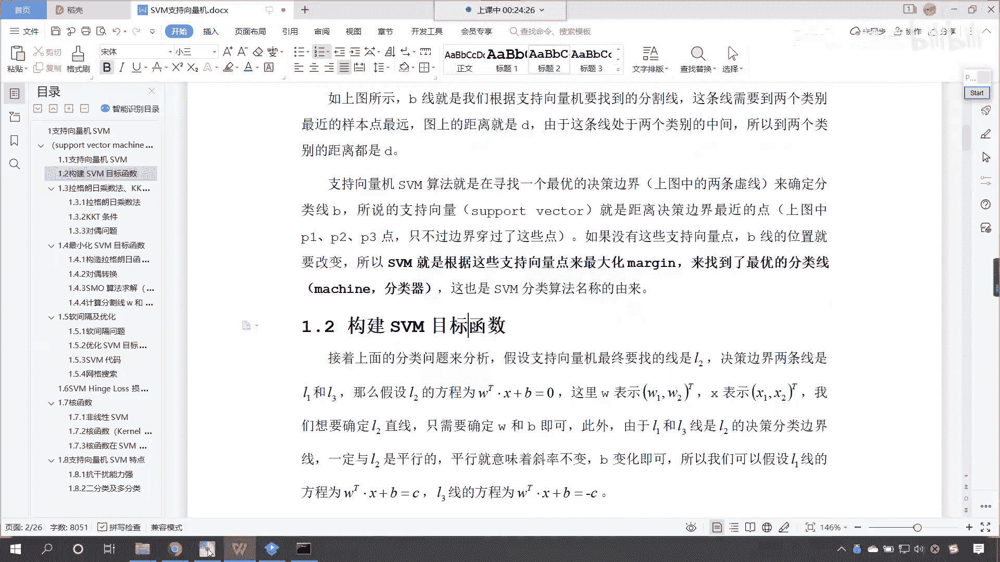
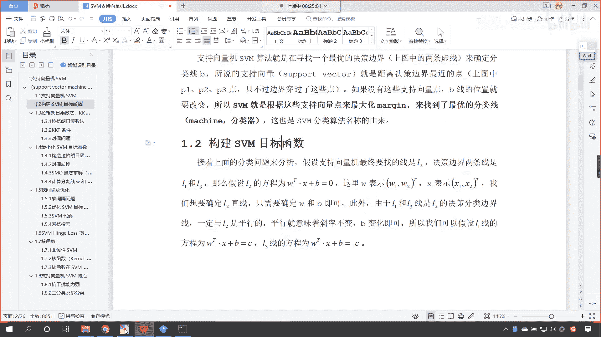
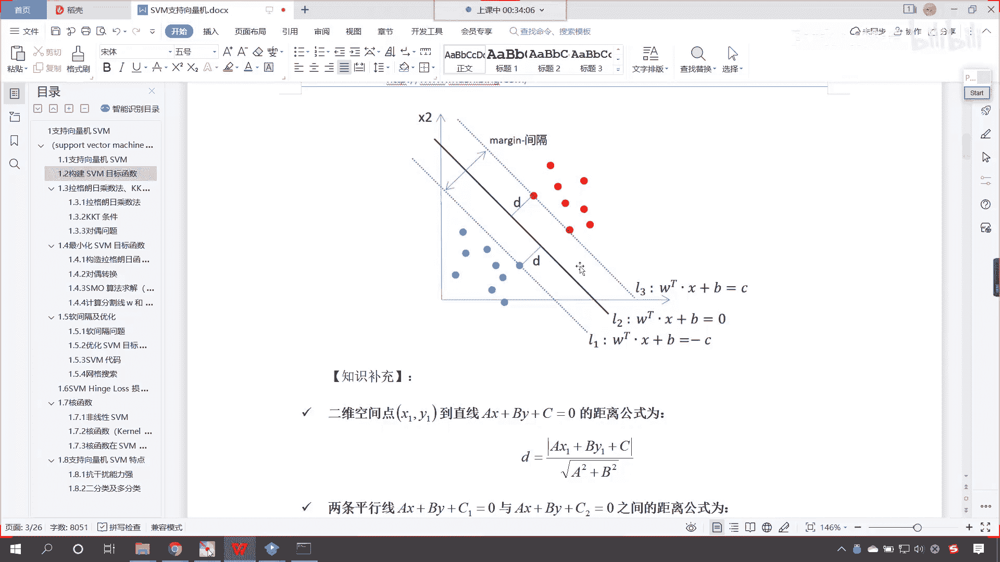
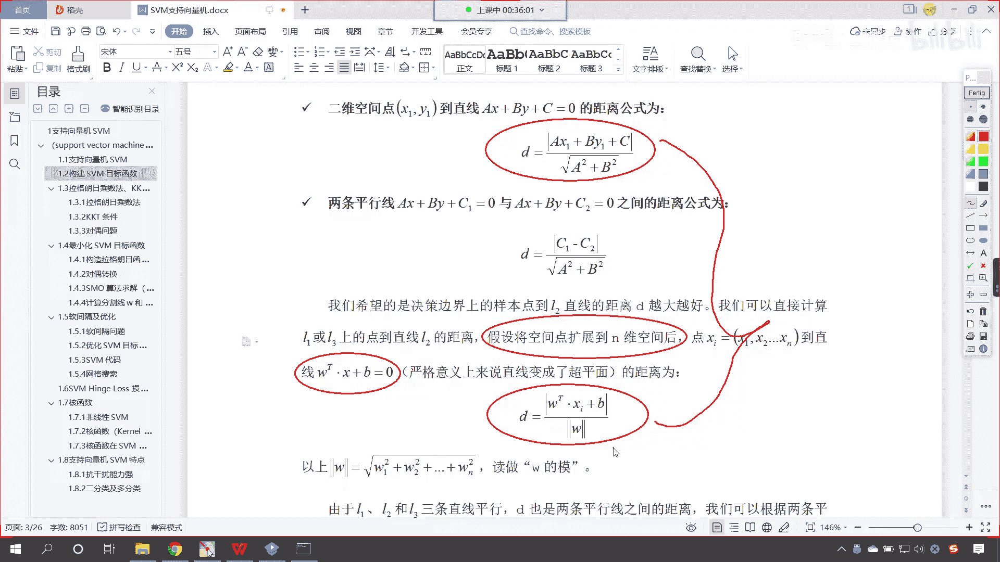
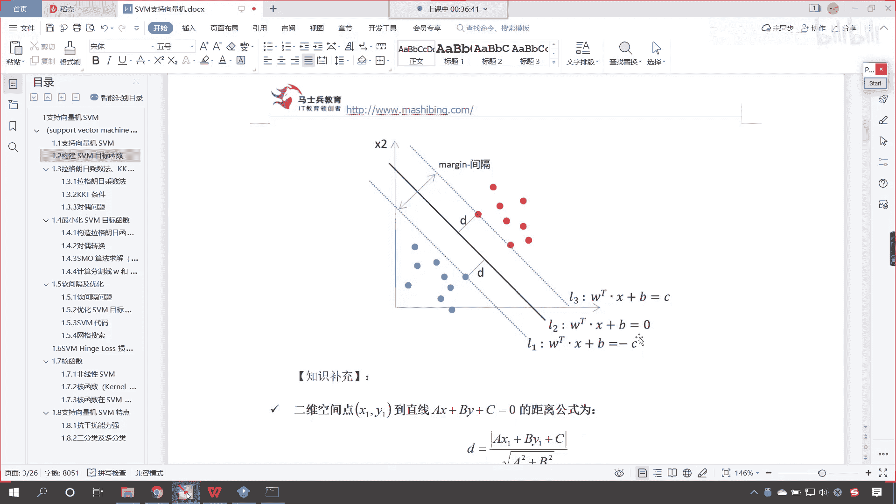
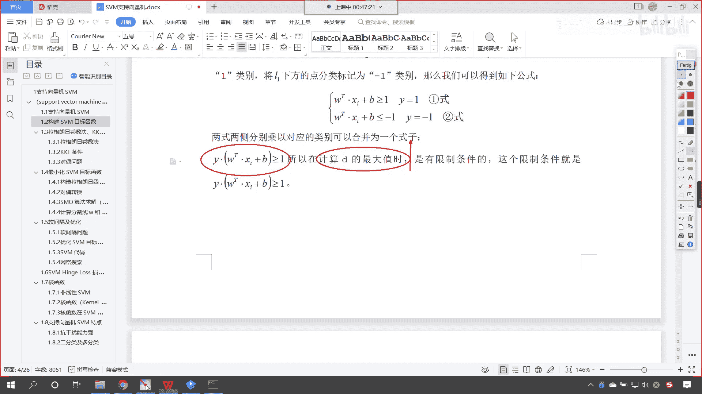
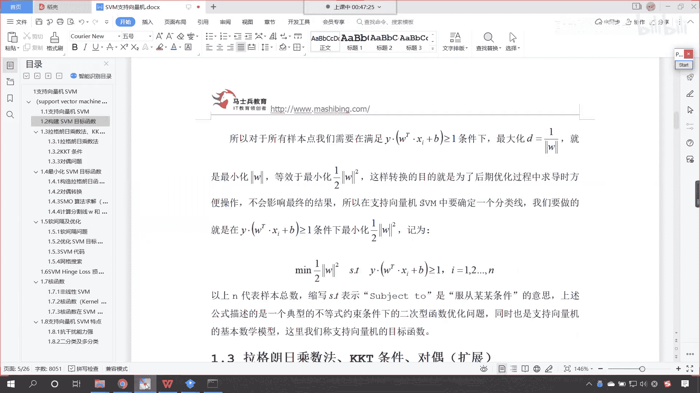
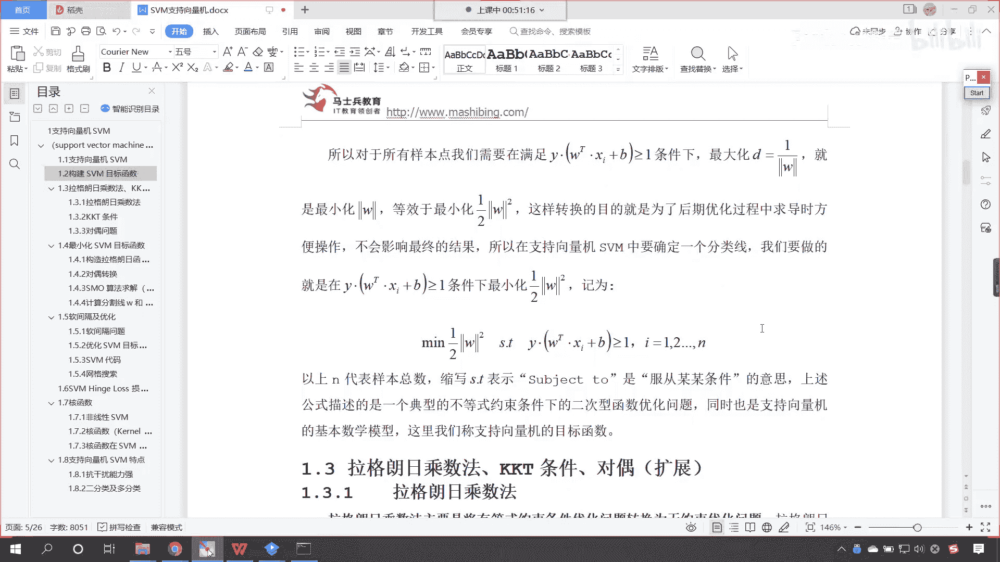

# P115：2-支持向量机SVM目标函数推导 - 程序大本营 - BV1KL411z7WA

好那么接下来呢我们继续往下看啊。

那咱们就看一下，我们如何去构建svm的目标函数，咱们在学习线性回归的时候是吧，咱们用到的都是高斯，是数学家高斯所提出来的最小二乘法，对不对，那我们就根据高斯的最小二乘法。

咱们是不是就进行了问题的解决呀是吧，以及咱们这个领回归是吧，领回归是加了这个l2 这个正则化项啊，螺丝回归，还有咱们前两节课所讲的这个逻辑斯蒂回归，是不是逻辑斯蒂回归呢，啊我们的目标函数当中是吧。

咱们里面有咱们sigmoid的函数等等，所以我们想要解决任何问题，咱们都有一个目标函数，只要有了目标函数，那么我们是不是就可以根据目标函数来进行，相应的求解呀，好那么接下来呢咱们看一下这个知识向量机。

它是如何把它转换成一个数学问题的啊，那我们构建目标函数，是不是就是要把咱们这个现实生活当中的问题，给它转换成数学问题来进行求解呀，咱们接着上面的分类，我们继续来进行分析，咱们假设支持向量机。

咱们最终要找的这条线是l2 ，那么决策边界的两条线呢，我们令它是l一和l3 ，那咱们假设说啊，既然是方程，那么方程是不是系数加系数和截距。

的一个这个组合呀，那假如说咱们方程呢，看我们是不是就可以把它表示成这种形式呀，对不对啊，我们要求解的不就是w和b吗，对不对，这里的w呢表示w一和w2 ，那我们为什么要进行一个转置呢，你看咱们进行了转置。

是不是前面这个方程是不是就表示矩阵运算啊，对不对，那我们的x呢表示x1 x2 ，所以说呢它是这样的一种形式啊，转置之后咱们的行和列这个进行了颠倒，那我们在进行矩阵运算的时候，其实就是行合力相乘。

那咱们想要确定咱们的l2 直线，咱们只需要确定w和b即可，你想这个和咱们之前解线性方程是不是类似了，对不对，你看非常类似啊，因为我们现在所学习的知识向量机，它呢依然是一个线性问题。

你看我们现在所学的这个大章节，是不是叫做这个线性分类啊，对不对啊，所以说s v m呢它依然是这个范围之内的啊，既然是这个范围之内的，那么它所要求解的这个问题呢也是w和b，此外呢。

由于l一和l3 这两条线呢，是l2 的决策分类边界线，那么所以说这个l1 l3 和l2 ，它们呢一定是平行的，平行也也就意味着斜率不变，对不对，平行的话就意味着斜率不变。

那这个我们只需要让这个b变化即可，对不对，你看咱们刚才所介绍的这条啊，你看上面这条虚线和下面这条虚线，是不是和咱们中间这条黑色线是平行的呀，如果是平行，那么这三条线的斜率都是一样的。

这块各位小伙伴能理解吗，也就是咱们这里所提到的，这个意味着斜率不变是吧，如果说这块你能理解，那么你就在咱们的讨论区扣一个，扣一个666好不好，好那么我们的斜率不变，但是呢咱们这三条线呢又各不相同。

那也就是说他们的节律是不一样的，所以说这就提到了咱们的b呢，它是变化的，所以那我们就可以假设咱们l一线的方程式嗯，这个我们让它加上什么呀，我们我们让他加上c咱们l2 的方程呢，看我们让它加上正的c。

咱们l3 的方程呢，我们让它减去c哎你看为什么要这样来操作呀，因为咱们往下看啊，因为你看咱们往下看啊，是吧，你看这个上面是l3 ，对不对呀，啊上面是l3 ，那这个l3 你就能够看到。

你看他是不是这个相当于向上移动了，那向上移动的话，那你看这个是不是就是加了个c呀，那我们的这个l一呢，它是不是向下移动了，向下移动的话，咱们是不是就相当于给他减了个c啊，这个很好理解，对不对。

所以说呢你看咱们的这个方程变形，咱们是不是就变成了嗯这样的一种形式了，对不对，到这儿大家应该也能够看明白吧，好这叫做这个等距离偏移，那为什么咱们的l3 和l1 ，你看我们向下移也好，咱们向上移也好。

咱们得到的这个结果，你看这个是副c，这个是c，为什么他们移动的是一样的呢，因为呢咱们中间的这条线l2 ，它距离咱们上面的这条虚线和距离，下面这条虚线它的距离是不是一样的呀，对不对，因为我们支持向量机。

咱们要找的是不是最大的这个间隔呀，也就是说我到上面这个点的距离是d是吧，你看到上面的这个距离是d，那咱们到下面的距离呢也是d是吧，这两个相同，咱们才能够做到算法的不偏不倚是吧，因为你上面是一类。

下面是一类，那我再进行划分的时候，我尽量怎么样呀，唉让它分得更加均匀，让它分得更加平等，在咱们人世间的平等是吧，这个是相对的，但是在算法当中呢，咱们这个平等呢是绝对的哈，我们可以能够严格的保证是吧。

咱们距离上边这个d和，距离下边这个d它一定能够相同，这个时候呢这个两边都开心了，两边都能够很好地分开好，那么我们再来看一下啊，那这个时候呢咱们涉及到距离了，对不对呀，那我们给大家补充一下。

咱们距离相应的公式好不好，好，那么在咱们二维空间当中啊，在咱们这个二维空间当中，假如说我们有一个点是x一和y1 ，那一个点到一个直线的距离公式是怎样的呀，看点儿到咱们线的距离公式，大家看就是咱们这样的。

那我们只需要将咱们点的坐标，带入到咱们方程当中，然后呢我们除以分母，那咱们这个分母呢就是a的平方加b的平方，看这个就是咱们的一个距离公式，这个距离公式呢嗯应该是咱们初中，应该是咱们初中数学当中学到的。

点到线的距离公式，看到这个你熟悉吗，我先问一下啊，看到这个公式，你是不是已经遗忘了呀，有没有遗忘，好只要咱们熟悉就行啊，忘了也没关系，熟悉嘛嗯似曾相识，是不是啊，这个肯定记得是吧。

你记得最好忘了也没关系，只要你看到他是吧，只要你看到他，你知道有这么一个公式就行，咱们呢我们不是为了考数学，你只要记得有这么一个公式就可以了啊，你只要对这个公式有一定的印象就行了。

那我们在进行这个距离计算的时候，咱们也不要求你手动的把这个背下来是吧，因为没有这个必要是吧，我们想要去理解这个支持向量机这个算法，那我们知道这个公式它呢是其中的一部，其实在我们以后的工作当中。

这个公式呢它属于是我们的这个啊，它属于是我们众多知识当中的，一个非常小的一个知识点，那这个知识点呢哎你有一个概念就行了啊，你就像这个两点之间是不是直线最短啊，对不对，那这个这个呢距离公式呢。

呃点到线的距离公式，你看一下，记住就可以了，那我们这求的是绝对值是不是，然后我们接下来再来看啊，嗯咱们看了这个点到线的距离，那我们再来说一下，如果两条平行线，那么它们的距离是怎样的呀。

你看两条平行线是不是说的，就是咱们的这个这个ax b x，它既然是两条平行线，那么它们的截距不一样，那么两条平行线之间的距离该如何算呢，其实呢就是咱们截距的差，看分子上就是截距的差，然后再除以谁呢。

a的平方加上b的平方来一个开根号是吧，哎这个公式，这个公式呢是两条平行线之间的之间的距离好，那么你有一个概念就行了啊，好，那么我们希望呢是决策边界上的点儿，到咱们决策边界上的点。

样本点到l2 直线的距离呢越大越好看，咱们希望呢决策边界上的点到l2 直线的距，距离d越大越好，那你看这个什么是决策边界呢，你看红色的点儿，红色的这个点我们把它叫做p1 ，这个点叫p2 ，蓝色的点。

我们给它起个名叫p3 ，这个是不是就是边界上的点呀，我们希望边界上的点，是不是到咱们这个分类边界的点，是不是距离越大越好呀，对不对好，那么这个时候呢咱们就可以写相应的公式了。

我们呢可以直接计算l一或l3 上的点，到l2 的距离，对不对，你看既然要计算距离，那咱们可以通过距离呢来度量一下，咱们这个两条线之间它的距离是多少，那我们上面咱们给的数据呢可以画图画出来。

这个数据比较简单，它属于是二维空间的点。

那这个地方呢我们又多说了一句。

看这个地方多说了一句，假设说咱们将空间点扩展到n维空间，也就是说数据复杂了，数据复杂了，没关系，咱们的公式不变，你看这个时候咱们这个点就变成什么样了，就是x1 x2 省略号一直到x n。

这个是不是就是n维空间呀，对不对，那它的方程咱们依然可以写成这样的形式，那咱们的距离呢大家看啊，距离还不变，但距离还不变，那在这个当中，你看这个d和上面这个d你看看一样不一样，看到了吗。

这个d和上面这个一样不一样，大家要注意啊，它是一样的啊，为什么说是一样的呢，你现在就能够看到咱们的分母上，是不是a的平方加b的平方开根号呀，而咱们下面这个我们是不是来了两个竖杠，竖杠来了一个w呀。

这个叫做什么呀，看这个叫做w的模，我们也叫做我们也叫做这个第二范数，知道吗，也叫做第二范数，也就是说w一的平方的平方一直到w n的平方，是不是再给他来一个开平方呀，对不对，所以说你二维空间的点是怎样的。

计算公式，知道吗，就像咱们普通人，我们是不是吃吃这个大馒头白米饭呀，对不对，那高层你好比马云，马化腾，他们不也吃白米饭，不也吃这个这个大馒头吗，是不是都一样呀，都得摄取蛋白质，都得摄取维生素，是不是啊。

可能他们吃的稍微好一点，是不是嗯。

但是公式都一样啊，好那么我们继续往下看啊，由于l1 l2 l3 这三条线是平行的，那么d呢也是两条平行线之间的距离，那我们就可以根据两条平行线之间的距离，咱是不是就可以得到d的值如下呀是吧。

那我们的距离d该如何算呢，看到了吗，看咱们就c减零，负c减零，是不是，因为你看啊，咱们在进行距离计算的时候，那你看l3 和l2 是l一和l2 是吧，这两条他们是互相平行的，那我们在算距离的时候。

咱们是不是就可以让截距相减呀。

唉你看到了吧，大家看啊，这个地方咱们操作的。

其实就是线和线之间的距离，平行线和平行线之间的距离，你看我圈起来的不就是截距之间进行相减吗，是吧，那不就是这个你看你减了个零，是不是就相当于c除以w呀，那这个c相当于什么，看到这个c。

c不就相当于w t乘以x a加上b吗，因为你看中间这条线看到了吧，是不是w t看到了吗，是不是w t x加b等于零，上面这条线是不是w t x加b等于c啊对吧，所以说那我们的这个距离公式呢。

唉咱们就可以写成这种形式，看写成了这种形式之后，咱们继续往下看，那么我们呢可以看到，无论咱们的计算点到直线的距离，还是两个平行之间的距离，结果是一样的，对不对，因为你这个边界上的点。

就是支持向量到咱们分类边界的距离，或者说咱们这个两条平行线之间的距离，其实他说的是一回事儿是吧，最终的结果是一致的，那么对于l一的，对于l一直线是吧，咱们的这个方程的是wt乘以x加b等于c。

我们进行一个系数缩减的操作啊，我们可以将相对应，我们可以把它这个相对应的比例，缩小各项的系数，例如咱们就变成你看上面这个方程，变成下面这个方程，你看它所表示的这个方程是不是一模一样呀，对不对。

这所有的系数是不是，所有的这个项是不是都除了个二啊，那这条直线还是原来的直线本身，那我们可以把它变成这样的形式，大家看啊，就是上面这个方程，你看能不能把它演变成下面这种形式呀。

我们让方程的左右两边同时除以c，你看这是没问题的吧，看这是没问题的吧，对不对，那么那么我们除以c之后是吧，你看咱们除以c之后，那c除以c是不是就等于一呀，那我们就发现咱们前面的w除了个c。

咱们的b是不是也除了个c呀，那么咱们对它进行一个改写啊，那改写之后呢，就是w tx加上b等于一，那至于为什么我们要把它变成这种形式呢，唉为了方便计算，因为这个c呢你可以理解成它是一个常数。

那这个c你可以理解成是一个常数，既然是常数，咱们在计算的时候，那么我们把它变成一，这个时候计算起来就更加容易，咱们这个支持向量机呢难度稍微大一点，大家呢要仔细听，咱们刚才在讨论区里边。

有一个小伙伴就说了一下是吧，叫做邓文康说好戏是吧，那当然好戏了，咱们的课程都是物超所值的啊，就是从底层原理是吧，一点点剖析到它的应用，其实支持千万级的应用呢很简单啊对吧，对于个人而言是吧。

以各位的聪明才智，天赋异禀是吧，使用它那简直是手到擒来，那关键是什么呢，关键就是它的这个原理嗯，这一点呢我们得讲清楚，弄明白，这样的话你出去找工作面试是吧，才能够这个所向披靡是吧，那阿里巴巴和腾讯是吧。

人招人的时候之所以要求那么高是吧，这个区别在哪呀，区别不就是原理吗对吧，我们的这个芯片，咱们其实花大价花大价钱也可以买到，但是呢你看美国一制裁是吧，说不卖了是吧，这个不赚钱了，生意不做了。

现在是不是就很难买到了，华为你看就没有芯片了，所以说呢这个华为他在招聘这个科学家的时候，都会开很高的工资，那这就这就得要求你得抠的细是吧，你像芯片那个那个东西是吧，太小了是吧，我们就是在这个非常小的。

非常小的一个面积上做文章是吧，这就得抠是吧，这就得抠的越细越好好，那么同理呢对于l3 直线，这个也是一样的哈，咱们l3 直线就可以变成-1是吧，l一直线你变成正一了，那么l3 就可以变成-1。

那咱们就可以用下图来表示，现在你就能够看到，你看l2 呢就是w tx加b等于零，咱们的l3 直线呢上边是正一，l一直线呢下面是-1，那么变换之后咱们的距离d啊，变换之后。

咱们的距离d就可以根据两条平行线之间的距，离来得到，那这个我们要求解的这个d它就等于多少呢，是不是就是一除以咱们w的模呀，是不是就是咱们这个二范数呀，我们希望决策边界上的点儿啊。

就是咱们红色的这个p1 p2 ，以及咱们蓝色的这个p3 ，我们希望这个点到咱们超平面，你看这个地方他给了一个概念叫什么呀，是不是叫做超平面l2 啊，那这里呢咱们具体讲一下什么是超平面啊。

看对于我们现在这条l2 ，对于我们现在这个分割线，其实这个l2 它是不是就是一条线呀，那你想一下，如果说我们的数据维度比较高，现在咱们这个点变成三维空间了对吧，你看它变成三维空间了，如果要是到三维空间。

三维空间的点，那你想想要把三维空间的点分开，那么我们一条线是不是就搞不定了，咱们是不是就必须得来一个超平面呀，是不是三维空间当中，是不是通过m把数据分成两类啊，左和右，或者说上和下，对不对。

那既然我们的数据不仅仅是二维数据这么简单，所以说呢咱们很多书上，咱们就把这个l2 这条线我们把它叫做什么呢，就叫做超，我们就把它叫做超平面，其实它表达的意思就是咱们的这个分割线好，那么决策边界上的点。

当然是到这个超平面的距离，也就是说这个距离d当然是越大越好，对不对呀，越大是不是说明我们的分离效果越好呀对吧，我们将l3 上方的点我们标记为一类，我们将l一下发生的点，咱们标记为-1。

这个类别既然要分两类，那么我们就用，那么咱们就用正负来表示，其实我们用零一表示也可以对吧，你看我们用零一表示也可以，那这个地方咱们为什么用正一和-1呀，唉就是因为你看咱们上面在进行操作，转换的时候。

看这个地方我是不是给了个一呀，这个地方咱们是不是给了个-1啊，所以说咱们用正一-1来表示是吧，那我们这个公式推导就更加的方便和容易，这个时候大家看啊，咱们关键的一个公式就出来了。

看了关键的一个公式就出来了，现在你就能够看到，那如果咱们w txi加b大于等于一，那么它就属于是y一类，w t x i加b小于等于-1，那么它就属于是-1类，你看这个地方是不是有大于等于。

这个地方是不是有小于等于啊，那请问等于的时候表示什么，等于的时候是不是就是表示咱们这条线呀，是不是是不是就表示这两条虚线呀，那如果他要是大于，是不是就是表示咱们在这条线外面的这些点呀。

你看这条线外面的这些点，看和咱们这条线是什么关系啊，它是不是在它外面还有咱们蓝色的这些点是吧，也一样，所以说一旦我们确定了这个边界线啊，一旦我们确定了边界线，那么它所有所有的点都有这样的特征。

就是说你如果这个方程要是大于等于一，那么它就属于类别一，如果你要小于等于-1，那么你就属于类别-1，咱们这两个式子是吧，咱们可以对它进行合并，咱们给它合成一个式子，咱们说数学家都喜欢做的一件事。

就是简洁，你看你上面不是正一吗，对不对，下边不是-1吗，咱们进行一个合并，那你看啊，你这个y是不是一这个y是不是-1，那么我们把它乘进去，你看啊，现在咱们把它乘进去，因为它这有一个正负。

是不是看咱们如果要乘进去的话，你看因为你上面是正一，上面是正一乘进去，这个符号是不是不变呀，对不对呀，那你下面是-1，如果要乘进去的话，这个符号要怎么办，这个符号是不是要颠倒方向呀。

颠倒方向你看它是不是就变成这种符号呀，原来小于等于，现在是不是就变成啊这个大于等于啊，对不对，所以说我们的公式合并成一个这样的，它是不是就是y乘y乘以w t x，y加b是不是大于等于一呀，对不对。

那这个呢就是咱们的限制条件，看这个就是咱们的限制条件，看到没，这就是限制条件，那在这个限制条件下，咱们希望希望怎么样呀，看咱们希望咱们的d最大啊，这个是限制条件，我们希望它越大越好，当然你越大越好。

你不能给1000，也不能给1万，他是不是得满足某些条件下的最大呀，那这个条件就是谁，就是咱们这个乘以w t x加b大于等于一，就是这个条件满足这个条件。

你这个d越大越好是吧。

那这个所以呢对于所有的样本点，我们需要满足在这个的条件下，咱们最大化啊，d等于一除以w，那如果我们想要让这个最大化，大家看啊，想要让它最大化，咱们是不是就是最小化w呀。

因为你看w是不是在分母上想要让这个值最大，那是不是就是w最小，它呢等效于1/2 w的平方，你看你最小化w是不是，就等效咱们1/2 w的平方呀，那为什么这个地方带1/2呢，就是为了后期咱们优化的过程当中。

求导时方便操作，看看咱们为了求导时方便操作是吧，因为你看你这个e求导看到了吧，咱们这个e求导导数二和这个1/2，是不是就约掉了呀，对不对，所以说这个有了平方是吧，咱们就是为了便于求导。

不会影响咱们最终的结果，就是你一次幂也好，二次幂也好是吧，其实都是对它进行一个这个最小化，他们的这个函数的单调性是不变的哈，所以知识向量机svm就是要确定一个分类线，我们要做的就是看啊，在这个条件下。

哎咱们现在呢换一种颜色啊，就是在这个条件下，咱们要最小化谁，唉咱们要最小化1/2 w，那么我们把它写成对应的这个公式看，那这个公式呢就是如此，咱们m2 分之1w的平方。

s t y乘以w t x加b大于等于一，上面的n就表示咱们样本的总数，这个s st呢它是英文subject to，就是服从某某条件的意思，上述的公式描述的就是一个典型的不等式，约束条件下。

二次型函数的优化问题，同时呢也是支持向量机的基本数学模型，这里我们称知识向量积的目标函数之前，咱们在进行优化的时候，你像咱们的这个线性回归，或者说咱们逻辑斯蒂回归，我们没有约束条件，和之前有什么区别呢。

这和之前的区别就是咱们没有这个约束条件，看到了吧，没有这个约束条件，咱们也是求某一个的最小值，那没有约束条件，咱们求最小值，这个就比较方便，求导令导数等于零，是不是一种方式呀，或者说咱们使用梯度下降。

是不是也是另一种方式呀，现在咱们支持向量机呢就稍微有点不一样了，它的不一样之处就在于，它多了咱们这个约束条件，那么带约束条件的最优化问题该如何求解呢，是吧，你看这是不等式约束条件下的。

这个叫做二次型函数的优化问题，这二次型函数就表示这个上面带平方啊，就这个意思啊，那我们如果要是没有这个，要是没有这个约束是吧，这个就很简单，知道吗，非常非常简单，但是现在带约束了是吧。

嗯这个就是咱们支持向量机它的目标函数，到这里你现在就明白了，咱们支线量级的目标函数是怎样的，一个公式了吧是吧，我们从上面最开始是吧，到推出这个公式，咱们呢都是一步一步来的啊。

