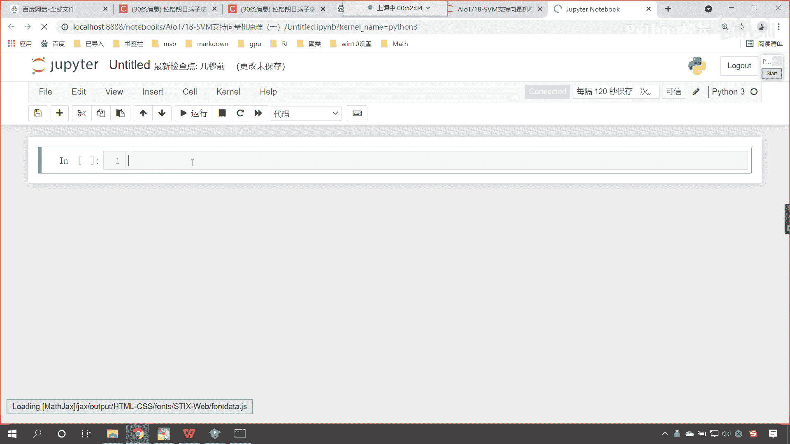
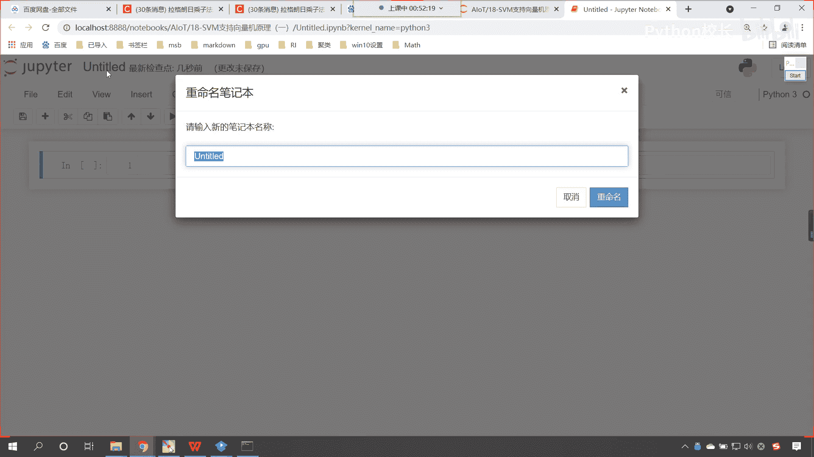
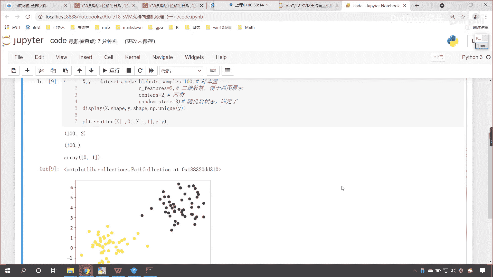
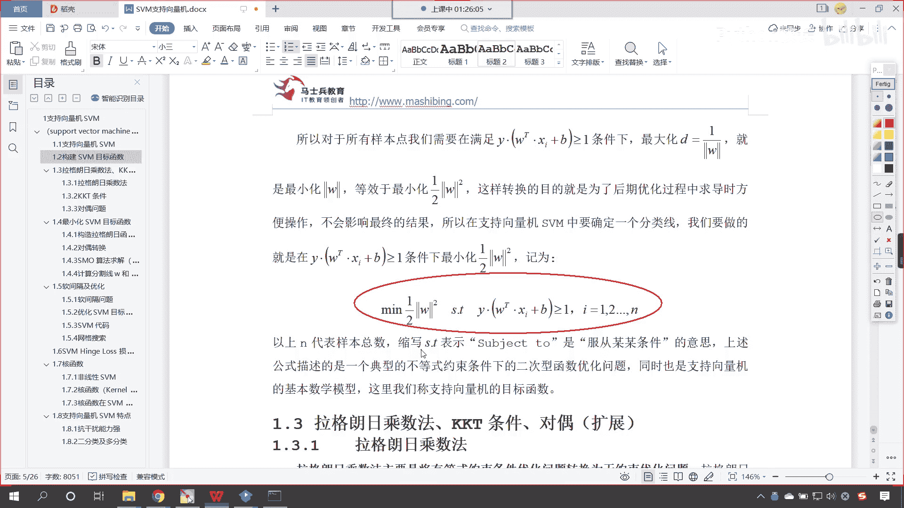

# P116：3-SVM二分类最大间隔线绘制 - 程序大本营 - BV1KL411z7WA

好那么我们在代码当中进行演示一下啊，来现在咱们回到代码当中，咱们进行一个操作和演示，对于知识向量机呢，咱们进行一个简单的使用，那我们就创建一个代码，咱们创建代码的时候。

有的时候呢咱们发现这个地方一直在转圈，看到了吧，我们把它拆掉，重新刷新一下就行了。

这个就是因为呢咱们浏览器和咱们的这个内核，它在沟通的时候是吧，这个通信不畅，所以说呢我们叉掉重新再让它连接就可以了，我们把这个改个名叫code。

现在呢我们演示一下，咱们刚才所讲的这个这个过程是吧，我们刚才所讲到的这个是吧，这到底是怎么计算出来的，是不是啊，它怎么进行划分的，我们使用支持向量机来为各位演示一下，好，那么首先呢咱们导一下包。

import numpy as np，那咱们需要画图演示一下import嗯，mat plot，lib piplot，给它起一个别名，那这个就是as plt，然后呢我们导一个包。

from sk learn，咱们从svm当中咱们导一个包，import，咱们在导包的时候呢，支持向量机，它既有回归问题，也有分类问题，那我们课件当中所演示的它是一个分类问题，所以说咱们将s vc导进来。

现在各位小伙伴，你能够看到这，咱们导导包tab键提示是不是有一个s vc，另一个是s vr啊，s v c表示classifier，s v r r表示regression，一个是分类问题，一个是回归问题。

现在呢咱们将s v c导进来，在这进行一个说明和注释，这个呢就是咱们的分类分类算法，然后呢我们再导一个包啊，咱们就from sk learn，咱们import data sets。

那这个data sets呢就是咱们的数据集，那我们把这个数据集呢咱们给它导进来，那执行一下这个代码，咱们在上面我们呢就插入一行，咱们呢就来一个这个三级标题，这第一个呢就是咱们的导包。

然后呢咱们再来一个三级标题，接下来呢我们就创造一下数据好，那么咱们创造数据呢，咱们使用data sets来进行创建，这个里边有一个方法叫做make blobs。

那这个make blobs呢它可以帮助我们生成几簇点，生成多少点呢，n samples就表示数量，咱们让它生成100个，然后呢我们给它一个n features，我们让它生成两个特征，看这个注释一下。

这个就是咱们的样本量，那这个n features就是咱们的特征数量，为什么我们要给它一个二呢，咱们再给一个center啊，这个center等于二，那为什么我们要给一个二呢，我们给它一个这个二维的数据。

这样的话主要是为了便于咱们画图展示，然后我们再给一个center，这个center呢就表示咱们的中心，那中心呢是二，也就是表示我们生成两类，你看咱们生成两类点，然后呢我们给一个random state。

我们让它等于三好，那么这个random state呢就表示它的随机状态，这个二呢就表示两类，那两类点，咱们不就可以通过中间的这条svm支持向量机，把它划分开吗，对不对好，那么咱们回来啊两类。

那么我们的random state呢，哎就是咱们的随机数状态，这个时候呢我们给它固定了，看这个时候固定了，那固定了有一个好处，咱们所生成的数据呢，不会随着咱们每一次代码运行而发生改变。

这个时候咱们给一个x给一个y啊，给一个x给一个y，那我们就画出来，咱们就执行一下，看咱们这个数据长什么样啊，咱们display一下x。shy。ship，你看我一执行这个100。

是不是就代表着咱们的样本量是100呀，那这个二代表什么，是不是就代表着咱们的这个二啊，两个特征，那这个100当中，大家看看咱们的y当中啊，咱们调用np。uni q，我们将y放进去，你看我再一执行。

大家现在就能够看到，这是不是零和一啊，这零和一表示什么，就代表咱们的两类，那我们画图画出来展示一下，那prt咱们调用sc咱们绘制它的散点图，那x放进去，x是二维的，咱们其中的一维作为横坐标。

另一为咱们作为纵坐标，然后我们给一个颜色c呢，就跟咱们的目标值对应，这个时候你看过一执行，大家现在就能够看到这两类点，它的形状是不是就出来了，我再次执行，大家就能够看也是一样的啊。

我在执行这个数据都是一样的，如果要没有这个random state，你看一下它会是怎么样的，看咱们执行，现在你来看数据形状是不是就发生了变化呀，你看我再执行数据，数据是不是又变了。

所以咱们为了让咱们这个演示效果更加好一些，咱们将它的随机状态给它固定执行好，那么数据咱们就创建好了，你看到这个数据如果要让你进行划分，让你来画一条线，你想一下你是不是也会这样画呀，对不对。

互相混合的那个那就分不开了，知道吗，很多时候呢对于这个数据能不能分开，你得先想一下咱们世界上最聪明的是吧，最好的分类器其实是我们人类自身，如果人都不能分开，那你再强的计算机，再强的算法也没有办法分开。

是不是算法你再强大，是不是也没有办法超过咱们人类啊，好那么咱们到了这儿之后呢，咱们继续往下看啊，好那么呃咱们现在呢啊。

我们课间先休息五分钟啊，咱们放一首歌啊。

素胚勾勒出青花，笔锋浓转淡，瓶身描绘的牡丹一如你初妆，冉冉檀香，透过窗心事，我了然，宣纸上走笔至此，搁一半釉色渲染仕女图，韵味被私藏，而你嫣然的一笑如含苞待放，你的美一缕飘散，去到我去不了的地方。

静静在等烟雨，而我在等你，炊烟袅袅升起，隔江千万里，在瓶底书汉隶，仿前朝的飘逸，就当我为遇见你伏笔，天青色等烟雨，而我在等你，月色被打捞起，晕开了，结局如传世的青花瓷，自顾自美丽，你眼带笑意。

色白花青的锦鲤跃然于碗底，临摹宋体，我反思，却惦记着你，隐藏在窑烧里，千年的秘密，极细腻，犹如绣花针落地，因为芭蕉惹骤雨，永恒的铜绿，而我路过那江南小镇的等你，彩虹墨山水画里，你从墨色深处被隐去。

青青色等烟雨，而我在等你，炊烟袅袅升起，隔江千万里，在瓶底书汉隶，仿前朝的飘逸，就当我为遇见你伏笔，天青色等烟雨，而我在等你，月色被打捞起，晕开了结局如传世的青花瓷，自顾自美，满眼的笑意，天青色等烟雨。

而我在等你，炊烟袅袅升起，隔江千万里，在瓶底书刻隶仿前飘了飘逸，就当我为遇见你伏笔，天青色等烟雨，而我在等你，月色被打捞起，晕开了结局如传世的青花瓷，自顾自美味迷人的笑意，来来来，各位小伙伴。

咱们现在呢继续回来啊，好那么我们现在呢创造了数据，那咱们现在呢就用算法来对它进行训练，好不好，那就是svc，咱们就让它等于svc小括号，那在这个里边儿呢，我们给他一个kernel。

这个kernel呢叫和的意思，我们给它一个linear，这个linear呢就表示它是线性的，咱们在这儿来一个注释啊，kerne，嗯kernel呢这个表示核函数，这个linear呢就表示它是线性的。

你现在能够看到，如果说我想要将咱们黄色的点，和咱们紫色的点分开，咱们是不是一条直线就可以分开了呀，那我们的kernel呢还有这个多项式，还有呢高斯核函数，后面我们会进行相应的介绍，你就能够看到是吧。

在1。7这儿呢有非线性核函数，还有这个其他的这个核函数好，那么我们后面呢会进行相应的介绍啊，现在呢来咱们给他指定一个线性的核函数，然后呢我们s v c点，咱们feat一下，咱们将数据x和y放进去。

这个时候我一执行，现在呢咱们的算法就进行了建模，咱们来一个三级标题，这个呢就是算法建模嗯，那算法建完模了，咱们suv咱们的这个s vc呢，肯定已经将这两类数据分开了，我们看一下它分开的效果啊。

svc点死sc，这个是不是就看一下他的得分啊，如果我要将xy放进去，你看我一执行咱们的分数超级高一点零，这个是不是就相当于满分啊，对不对，那到底是哪条线把这个数据分开了呀，咱们上面既然给了个线性的。

那么它一定对应着斜率和截距的数据，是不是啊，在这儿呢咱们就嗯绘制咱们的，绘制咱们的分割线，那我们获取一下系数，咱们调用svc扣if，这个时候你看过一执行，大家看这个系数是不是就有了，看到了吧。

svc扣一一个是负的6。9，一个是负的1。0095，现在你想一下啊，现在你想一下为什么，那现在你想一下，那为什么咱们的斜率是两个呢，看现在你想一下，为什么这个斜率是为什么。

咱们的这个写这个系数它是两个呢，来各位小伙伴，我们在讨论区回复一下啊是吧，你想一下他为什么是两个，咱们接收一下啊，我们就叫做w杠是吧，哎对了啊，因为呢我们的特征看咱们的特征呢是两个嗯。

你看为啥说特征是两个，你看一下x。sh看到了吧，一直行，因为它是100和二，所以说呢它是不是两个呀，好那么，咱们得到的这个w杠，那我们就有了，那我们还是不是还有截距叫b杠呀，对吧。

你看我执行一下咱们这个b杠，我们来复制一下啊，那就是s v c。intercept，咱们将b杠打印输出，我们看一下这个截距b是多少，大家看这个是不是就是负的0。907，那我们有了这个斜率和有了这个结局。

咱们如何把这条线给它画出来呢，看到了吧，咱们如何把这条线画出来呢，那你想咱们如果想要画出来这条线，因为我们现在所在的这个平，咱们现在所在的这个面，它是不是属于是一个平面呀，那么我们红色的这条方程。

你想一下他该怎么写，红色的这个方程，看咱们红色的这个方程，它是不是就是y等于，是不是w x加上咱们的b呀，对不对，你看是不是对应了它对吧，而咱们现在呢我们所求解出来的这个w1 w2 。

你看咱们可以这样认为啊，看咱们现在我们所求解出来的w盖，它是不是两个呀，看看它是二维的啊，里边儿呢有两个系数分别呢，我们叫w一和w2 ，好不好，你看它是这样的，那这个w一呢对应咱们的特征一。

这个w2 呢对应咱们的特征二，那么我们如果要写一个方程的话，你想是不是就是w一乘以咱们的x1 ，然后加上w2 是不是乘以咱们的x2 啊，然后是不是再加上b呀，你看它是不是对应这样的一个方程。

你看我们把这个方程起个名就叫fx，你看是不是对应这样的一个fx，我们让它等于你看是不是对应这样一个方程，那大家想一下啊，对于我们的方程而言，咱们的x一和咱们的x2 ，是不是都是咱们的特征呀。

那这个特征它是不是就对应咱们平面当中的，你看是不是就对应咱们平面当中的这个，这个是我们把它当成是x1 ，那咱们把它当成x1 ，那上面这个是不是就可以当成x2 ，对不对，所以说你想这个x1 。

是不是就相当于对于我们平面而言，那这个x2 它是不是就相当于y对不对，那咱们的x1 ，咱们是不是就可以把它简化成x呀，对不对，所以咱们的方程fx，你看我是不是就可以把它写成叫做w1 ，咱们这个乘以x。

然后加上咱们的w2 是不是乘以y，然后再加上b呀，你看我是不是可以写成这样，那我如果要写成这样，因为我们是在平面当中，那平面当中的话，那零就等于w1 x加上咱们的w2 y。

然后再加上b你看是不是就可以写成这样，那写成了这样之后，咱们的方程y等于多少呀啊写成了这样之后，咱们往中间写啊，这时候你看y它是不是就等于负的w1 ，是不是除以咱们的w2 ，然后乘以x。

然后再再减去b是不是除以咱们的w2 ，你看方程是不是就可以写成这种形式，看到了，因为我把b是吧，对它移动，这个把它移动到方程的左边，那这是不是就带了一个负号，咱们是不是可以把负的w2 除到方程的右边。

那你看方程y是不是就确定了，y就等于负的w一除以w2 ，x减去b除以w2 ，对不对，好大家看啊，这个方程很重要，那根据这个在我们w杠当中看，在咱们的w杠当中，那么你看咱们的负的0。6919。

是不是就相当于咱们的w一负的1。0095，是不是就相当于咱们的w2 啊，那咱们这个你看这个负b嗯，这个b杠是不是就相当于咱们的这个截距呀，那么我们就可以根据刚才那个公式，咱们进行相应的一个转化啊。

咱把上面写出来的公式呢，我们用markdown的这个格式给它写出来，来一个mark down是吧，那这个公式呢不就相当于y就等于负的，咱们来一个反斜杠frank是吧，反斜杠frank当中来一个花括号。

再来一个花括号，那分子上呢就是w1 ，分母上呢就是w2 是吧，那我们让它乘以x然后再减去嗯，frank花括号，那这个分子上就是b，咱们的分母上就是w下划线二，这个时候你看过一执行。

看它是不是就是这样的一个公式呀，对不对，那这个字体有点小，咱们把它放大一些啊，font size咱们来一个六，在这儿呢来一个反斜杠font哎，这个时候你看我一直行。

大家看公式是不是就是咱们上面推导的一个，这种形式呀，好那么这个时候呢，你看x前面的系数是不是就是负的，w一除以w2 ，咱们的截距是不是就是截距是不是就是负的，b除以w2 ，那么我们就计算一下啊。

w就等于w1 ，你看就等于负的，我们把w一取出来，w一是不是从咱们w杠当中取，因为你看w杠当中，你看它是二维的啊，怎么把这个w一取出来呢，唉来一个中括号，那就是把这个来一个y再把它表示成代码。

那就是w杠啊，咱们来一个零逗号零，这w一取出来了，除以w杠中括号零，来一个1w2 就取出来了，好这个时候你看我们的系数就有了，哎就是负的0。685，那么咱们的b呢，我们再来一个截距啊。

那这个b呢就等于负的，咱们来一个b盖，因为这个上面的b是吧，就代表着我们求解出来的b格，我们让b杠除以咱们的w2 ，那就是w杠中括号零，再来一个一打印输出一下咱们的b哎，各位小伙伴你就能够看到。

这个时候咱们求解出来的b是不是零点，看到了吧，是零点，这个呃0。8987，是不是咱们这个时候呢看我来一个逗号啊，看来一个逗号，你看这个时候奇迹就发生了，看到了来一个逗号，刚才咱们得到的是列表。

现在有一个逗号，我是不是就将列表当中的这一个数，给它取出来了，看到了吧，这就是逗号，它强大的作用啊，python当中有这样的语法，咱们可以直接把列表当中的数据取出来，有了w有了b你想方程画出来。

咱们这个线画出来，那是不是就是这个很简单了来，那么我们如果要画这条线的话，诶大家看啊，咱们如果想要画这条线，你看我们是不是大概就是画到这儿啊，那我们是从哪里到哪里啊，大家看啊。

这个横坐标你看是不是大概就是-5的地方呀，那纵坐标呢咱们就让他到这个一或二啊，咱们让他到一吧，所以呢咱们给一个数据来，这个时候咱们给一个x小x呢，表示咱们数据的范围，np。lin space。

我们让他从-5，咱们让他到正一，咱把它分成100份，有了x了，那咱们就给一个y啊，咱们这个y呢和咱们上面这个y呢，我们要进行一个区分，咱们这个这个y呢我们给它起个名。

就叫做这个这个就叫y result吧，那这个呢就等于w乘以咱们的x，然后加上咱们的b，有了有了x和咱们计算出来这个结果了，那咱们就plt。scanner，我们进行画图，先将原来的那些点画出来。

x0 冒号x1 ，然后呢给一个颜色就等于y，这个时候你看是不是出来了，然后我们把线画出来啊，看这条分割线，那划线咱们调用plot方法，x放进去，y杠result放进去，我们给一个颜色。

咱们让这个颜色等于red，这个时候你看过一执行，现在你来看这条线，红色的这条线，它是不是刚好可以将咱们上面紫色的点，和咱们下面这个黄色的点是不是分割分割开啊，对不对，那我们在讲原理的时候。

咱们在讲原理的时候，我们就能够看到，其实呢它有上面这条虚线，是不是还有下面这条虚线呀，对不对，咱们将上面这条虚线和下面这条虚线，我们也画出来，好不好，那支持向量机，大家看支持向量机。

它里边有一个说法叫支持向量，那我们在上面呢获得他的支持向量，如何获得知识向量呢，s vc点咱们得到它的support vector，这个就是支持向量，你看我一执行，咱们现在有几个知识向量呀。

有三个知识向量看了吧，有三个支持向量，那我们就接收一下啊，这个起个名就叫做sv，看sv就是咱们的知识向量，你想支持向量，如果想要画出来，你看一下上面这条知识向量，是不是就是过这个点儿的呀。

下面这个知识向量，是不是就是经过这个黄色点的呀，看咱们这样画的不是不是特别好是吧，待会儿咱们用嗯，待会儿呢咱们用这个直线把它画出来啊，斜率是相同的，这个没错吧，只有截距是不一样的，对不对，对不对。

只有截距是不一样的，那么我们现在呢就得到它的截距就可以了啊，来咱们再画两条线，那这两条线呢，就是咱们的上边界和咱们的这个下边界，那该如何画呢，我们现在已经知道支持向量是什么了。

支持向量它是不是一定在咱们的，你看咱们的支持向量，是不是一定在咱们这个边界上呀，那咱们根据方程，你看咱们的方程是这样的啊，dollar dollar，那我们将方程写出来，y是不是就等于w x加上b呀。

你看这是咱们的方程，那么我们知道咱们的斜率是一样的，截距不同，那这个截距该如何求呢，dollar dollar，咱们的截距b是不是就等于y减去，w和x相乘呀，看到了吧。

截距b是不是就等于y减y减去w乘以x呀，好，那么咱们现在呢就计算它的这个，上边界和下边界啊，好那么因为咱们的知识向量它是分两类的，所以说上面这个是一个类别，最后面这个点它呢属于是另外一个类别。

那咱们取的时候，咱们在计算这个b的时候，咱们从上边取一个点，计算它的一个b截距，下面取一个点计算它的另一个结局，那么咱们就取一下吧，根据咱们这个公式是吧，那我们的b1 。

他呢就等于咱们先把这个点取出来啊，那就是s v中括号，咱们来一个零是吧，那假设说这个是上边界，那取得了上边界之后，咱们是不是得得到y啊，对不对，如何得到它的y值呢，咱们来一个中括号一。

这个就是它的y值看，然后减去w我们让它乘以啊，w乘以谁x，那就是sv中光二零，然后再来一个中国二零，这就是它的x x相当于它的横坐标，你看这个b一就有了笔，有了之后咱们就画这条线吧，那就是plt。

plot横坐标x放进去，那接下来咱们就计算它的这个纵坐标，那我们就根据公式啊，那就是w乘以咱们的x，然后让它加上b1 ，然后逗号，咱们这个时候我们给它一个颜色，我们让color等于blue。

然后呢我们给它一个这个ls s，我们给它一个线的状态，杠杠，这个时候你看我一执行，现在你有没有发现这条虚线，咱们是不是就画出来了，上边界是不是就有了，来到这里，各位小伙伴能看懂的。

在我们的讨论区扣一个一啊，好你就能够发现是吧，因为这个公式很朴素是吧，咱们在计算的时候就是根据这个公式，你要明白是吧，咱们的支持向量代表的是什么，是不是代表的就是这个点呀。

然后呢咱们再把它的下边界b2 ，我们给它画出来，那就是s v中括号，咱们来一个-1，这个-1呢就表示它最下面这个点儿，上面这个点它表示两个点，这两个点呢都是你看因为我们紫色的这个点儿。

咱们的支持向量是不是有两个点呀，对不对，你看这个点和这个点，那么咱们下面黄色的这个点，它的支持向量其实就一个，那就是咱们最后这一个是吧，所以说我们来个-1，然后来一个中括号一，这就是它的y。

然后减去w我们让它乘以s v中国号一个-1，然后再来一个中括号零好，那么下边界它的截距就计算出来了，咱们plt。plot x放进去，这个是横坐标，让w乘以x，然后再加上咱们的b2 。

那么这个时候呢我们也给一个color，我们让这个color也等于blue，也给一个l s杠杠，这个时候你看我一执行，现在你就能够发现看咱们上边界和下边界，我们是不是都绘制出来了呀，中间这条红色的线。

你有没有看到它距离上边界和距离下边界，它的距离是不是一样的呀，那这不就是咱们刚才讲的，构建svm目标函数当中的这个对不对，所以说这个p1 p2 它呢是决定咱们的斜率啊，你要注意啊。

有的时候呢我们的这个边界呢，它可能就只有两个点，那么有的时候咱们就可能只有两个点，那么具体决定具体这个斜率是怎么决定的，它不一定是p1 p2 决定的，你要注意啊，看啊，因为我们有了目标函数。

咱们其实呢是可以求解出来的啊，看啊假设说这个是p1 ，这个是p2 ，是不是啊，这个是p2 ，那么这个是不是p3 ，那因为现在咱们的支持向量机它正好是p1 ，p2 是三个，对不对。

你看它正好是p1 p2 ，而p一和p2 连起来，是不是就可以有一个斜率呀，但是呢有的时候我们的支持向量机算出来会少，你看啊，有的时候咱们的支持向量积它不一定是三个，知道吗，有可能是两个。

看它有可能是两个啊，那是两个的时候，就是一边一个知道吧，咱们d的值有没有不相等的情况，d的值必须得相等，知道吗，这个d的值必须得相等，也就是说我们看，也也就是说咱们这个的距离是吧。

咱们就用这个箭头来表示了啊，和这儿的距离它呢必须得相等，你知道为什么吗，因为我们的推导公式看，因为咱们的推导公式，你看因为我们就是基于这个间隔，我们让它相等，咱们是不是推导出来的。

咱们是不是推导出来这个公式呀，对吧，我们根据这个来写出来的这个公式，而咱们又根据这个公式，我们求解出了其中的斜率和截距，所以说它一定是相等的啊。

