# P117：4-拉格朗日乘子法介绍 - 程序大本营 - BV1KL411z7WA

好那么接下来呢咱们继续往下看啊。

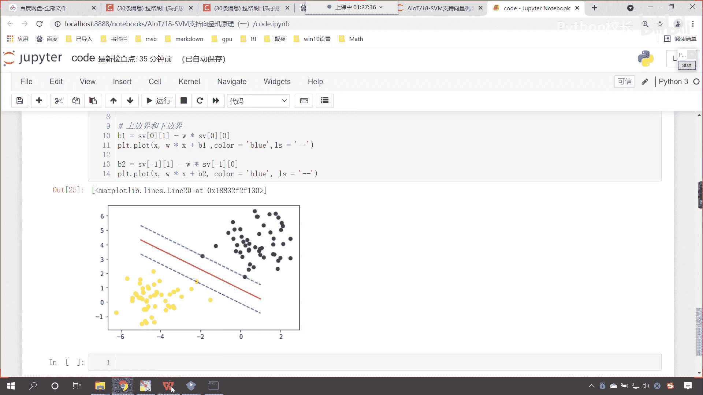

好，那么这个你看现在呢我们已经有了这个不等式，约束的求二次型的这个优化问题，那这个问题呢你看那这个问题呢，咱们得需要对它进行一个转化，就是说你有约束条件的，咱们在进行操作的时候。

这个约束条件往往他是碍手碍脚的，没有办法直接进行操作，那这个该怎么办呢，好那咱们接下来呢嗯这个就讲一些干货，讲一些数学上的应用，这一部分呢大家要仔细听啊，有可能会这个有可能会枯燥一些。

有可能对你来说稍微难一些，我尽量把这一部分讲得通俗易懂好。

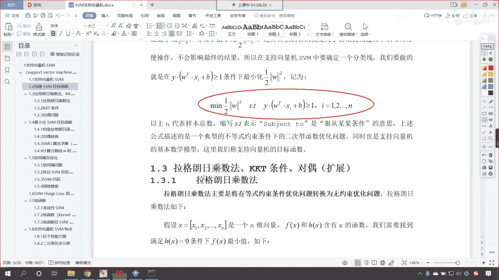

那么我们就看一下，在咱们这部分呢，我们一共有三，我们一共有三部分知识点，一个是拉格朗日乘数法，另一个是kk t条件，还有就是队友问题。

那我们先看一下拉格朗日乘子法，咱们这个地方是吧，它是拉格朗日乘子法，和咱们拉格朗日中值定理是吧，这个还有一点不一样啊，拉格朗日乘子法，主要是将由等式约束条件的优化问题，转化为无约束优化问题。

唉现在你就能够看到看咱们拉格朗日乘子法，它是转化什么呀，是不是有等式约束的条件优化呀，对不对，看啊有等式约束的条件优化。

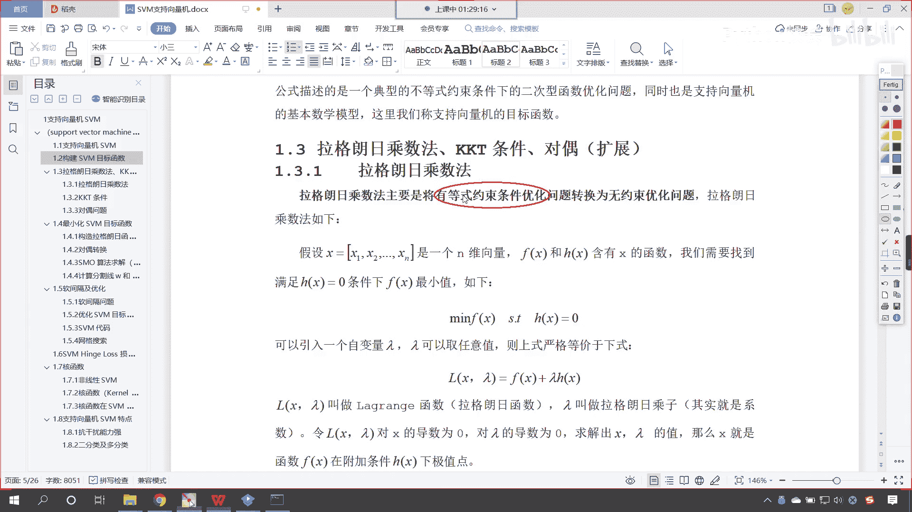

我们支持向量机，你看一下它是什么样类型的约束问题，咱们支持向量机，你就能够发现咱们的约束条件，它是不是大于等于一呀，唉我们有同学总结了一下，这个是不等式约束，对不对呀，那不等式约束呢它比等式约束更复杂。

那对于更复杂的这个问题呢，咱们得先从等式约束说起，所以说我们先讲拉格朗日乘子法。

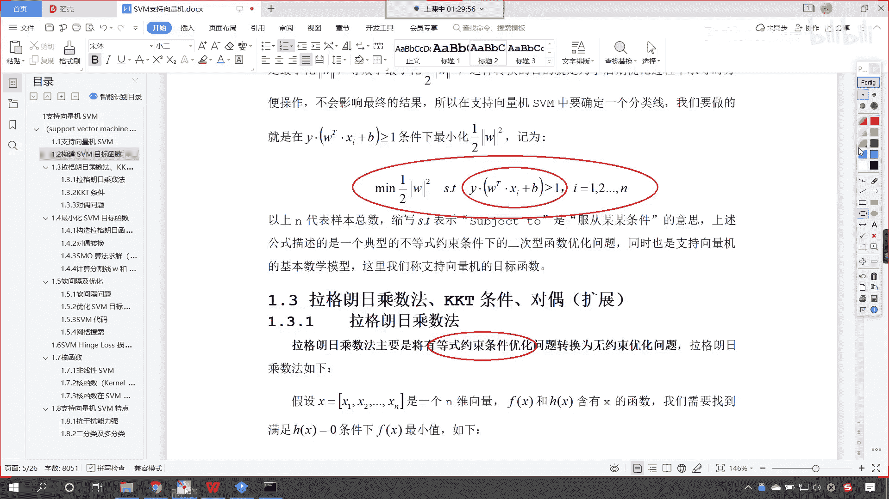

那么既然它是等式约束，那么我们的等式约束，咱们的形式我们就可以写成这种形式，你现在能够看到我们想要求fx的最小值，那么我们的约束条件呢就是hx等于零，我们把这个就叫做等式约束，那你看到这个没有问题吧。

看到了吧，看到这个没有问题吧，没有问题，你就扣一个一，也就是说对于拉格朗日乘数法，咱们的这个等式约束，我们相应概念的一些定义到这里，如果你没有问题，那你就扣个一啊，那就扣个一，有问题的话，我们扣个二啊。

好那么拉格朗日呢。

他这个人非常聪明是吧，他说你既然带约束的不好算嘛是吧，带约束的不好算，怎么办呢，我们可以引入一个自变量朗姆达，拉姆达是可以取任意值，上面严格等价于下士，现在你就能够看到看到了吧，我们增加了一个朗姆达。

上面这个问题求解，咱们就变成了下面这个问题求解，那就是fx加上朗姆达乘以h x，你求解上面的就等价于求解下面的，你看神奇不神奇，那到了下面你就发现这个方程它还有，你看下面这个方程它还有约束条件吗。

上面这个它呢是有约束的啊，上面这个是有约束的，下面这个是无约束的，无约束的求解比有约束的求解，那这个就方便多了，知道吗，那么我们lx拉姆达这个就叫做拉格朗日函数，朗姆达呢就叫做拉格朗日乘子。

这什么是橙子呢，其实就是系数，咱们另l x lambda对x求导，让这个导数为零，咱们对lambda的导数求导，令它为零，求解出的x lambda的值，那么x就是咱们fx在附加条件hx下的极值点，你看。

方程就进行了一个转化，有约束的就变成了无约束，是不是就方便多了呀，那这就是天才之举，知道吗，原来你是有约束的，有约束你的求解往往就不好求，你知道吧，有这个约束，你得时时考虑这个约束，你求导令导数为零吧。

还不太方便是吧，因为我们知道咱们其实求极值，咱们往往是不是就是令导数为零，求一下它的这个值呀，但是这个时候呢你是有约束的，你得时时考虑约束对他的影响，也就是说，你求出来这个极值不一定是你想要的答案。

因为它存在约束，那拉格朗日这个数学家呢，他就把上面那个他就把上面这个函数，它就严格等价于下市，那我们有同学可能会想唉老师为什么呀，对不对，我们往下看啊。

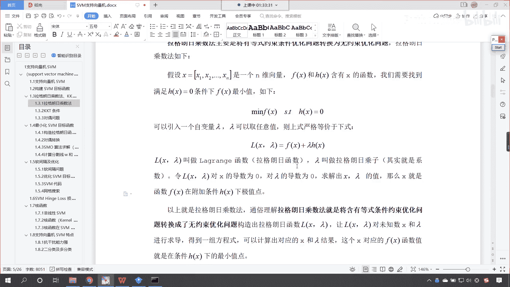

看以上就是拉格朗日乘数法，那通俗理解拉格朗日乘数这个乘数法呢，咱们就是将含有等式条件约束这个优化问题，咱们把它转换成无约束的这个优化问题，咱们构造出拉格朗日函数，这个拉格朗日函数它多了一个系数，没关系。

在我们解方程的时候，多一个系数少一个系数，这个都不是问题啊，问题是啥呀，嗯你像上面这个约束。

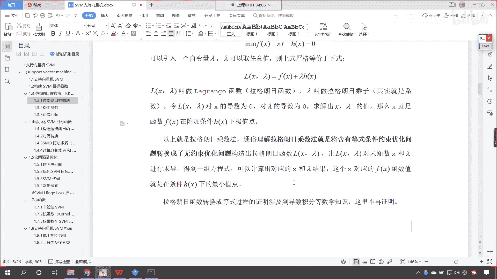

它就是一个大碗饭，它呢就是一个大问题，因为你有约束是吧，时时限制着你，时时他就没有办法让你自由自在地，通过数学当中的公式去求导数，令导数为零是吧。

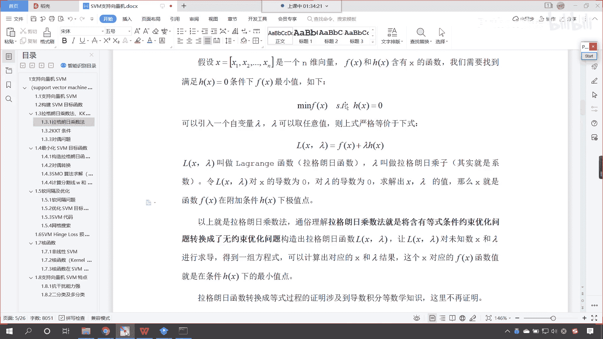

来求解，而构造出来这个拉格朗日函数和上面完全等价，所以说咱们就可以这个很方便很自由地求导，令导数为零，那咱们让咱们构造出来的拉格朗日函数，咱们对未知数x和朗姆达进行求导，咱们就可以得到一组方程。

有了这组方程。

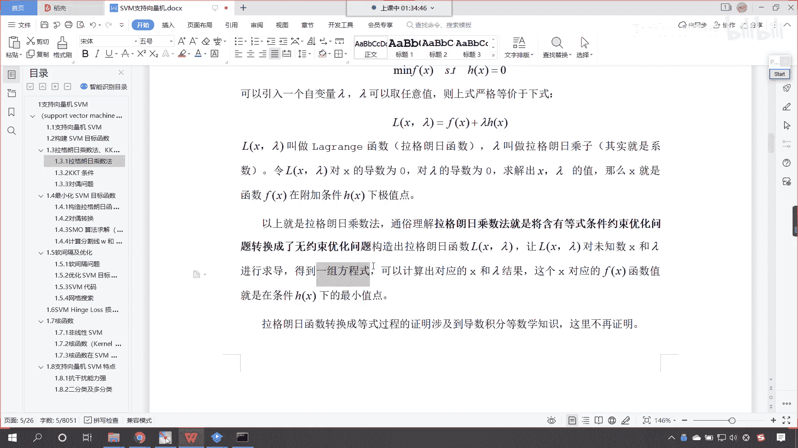

我们就可以计算出对应的x和朗姆达。

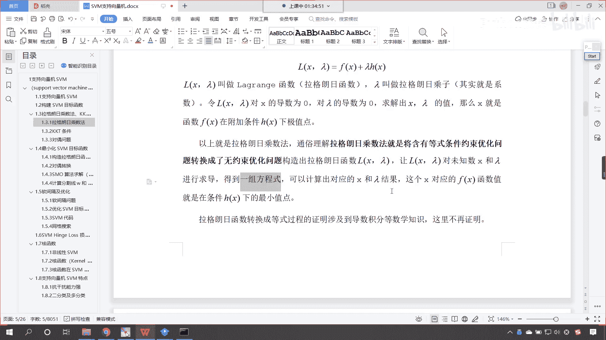

那么这个x就是咱们对应的fx函数的这个这个。

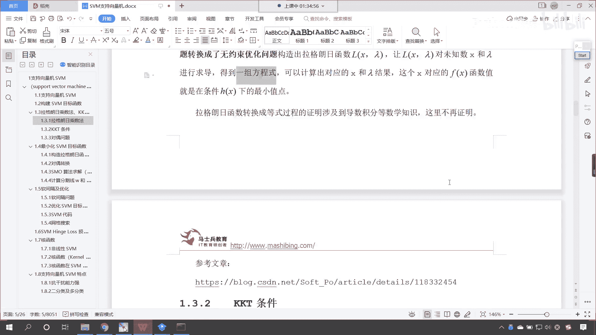

极最小值点，拉格朗日函数转换成等式，这个过程的证明呢，它涉及到导数的微积分等数学知识。

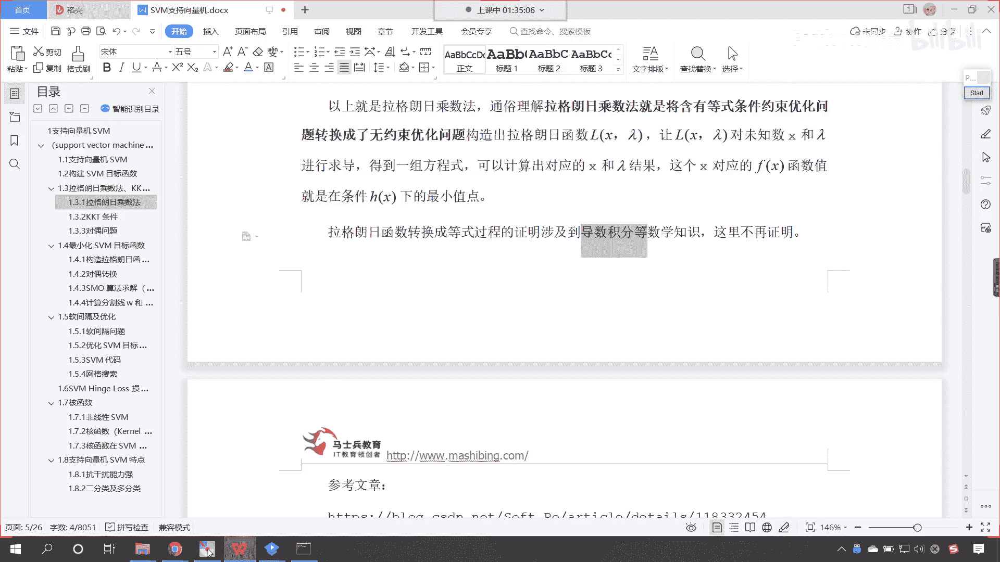

那这里呢不再进行详细的证明，但是呢我为你写了一篇文章，咱们将这篇文章的链接地址来给各位发过去啊，这个是我写的一篇文章，咱们呢先将刚才所讲的知识点儿啊。

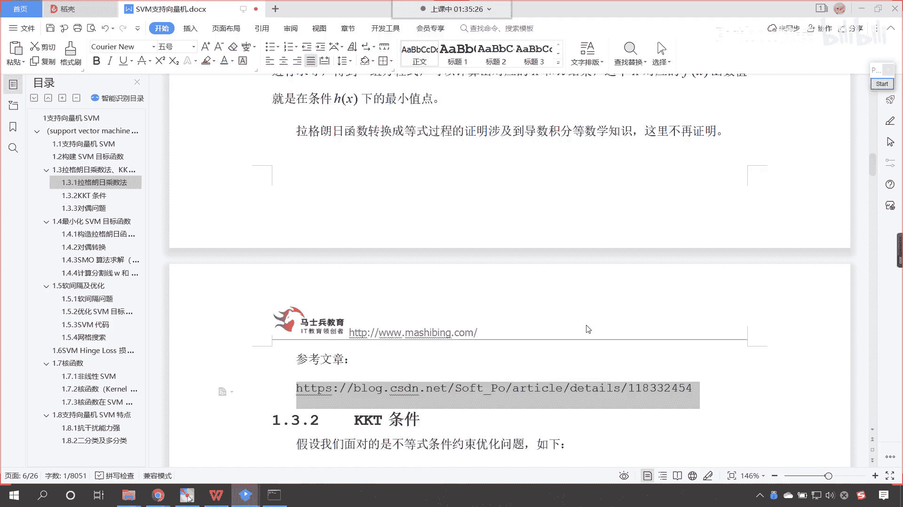