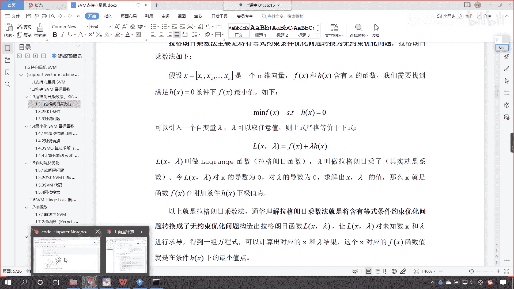
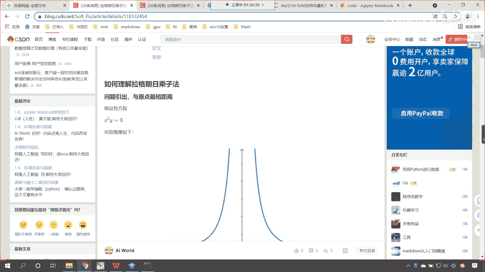
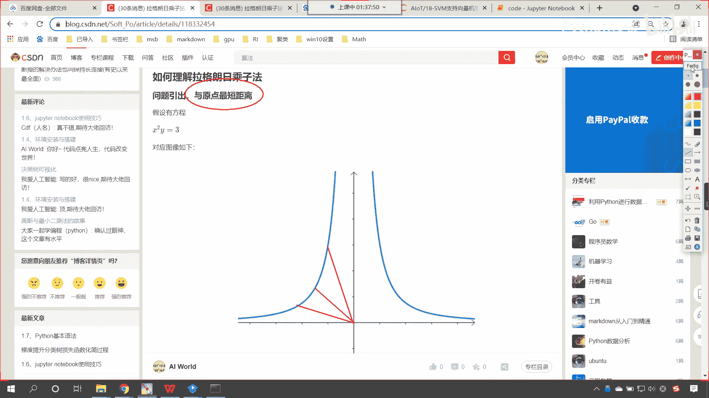
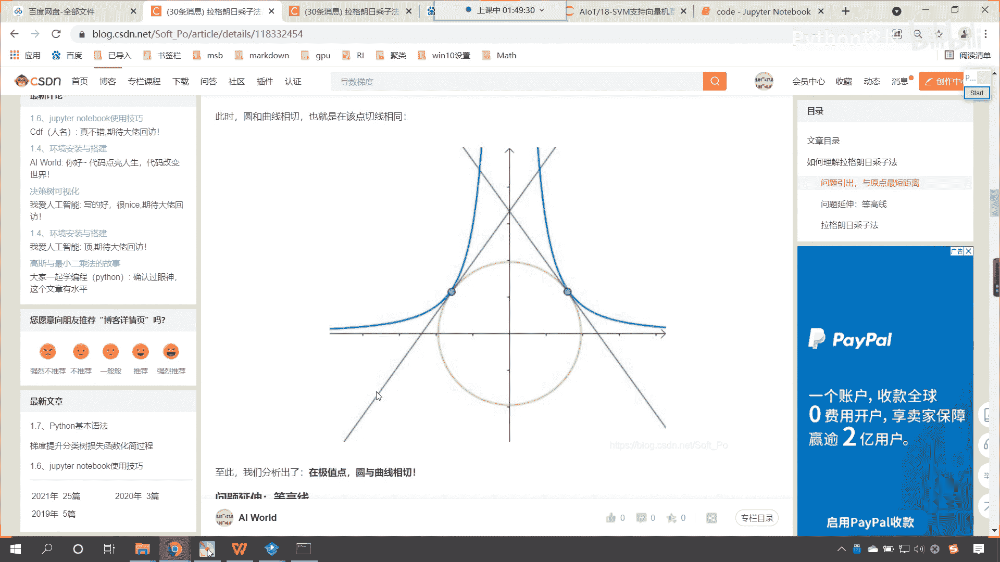
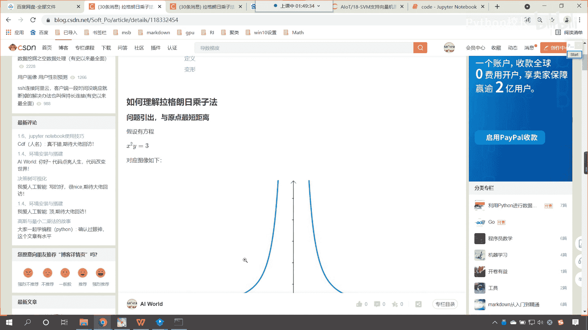
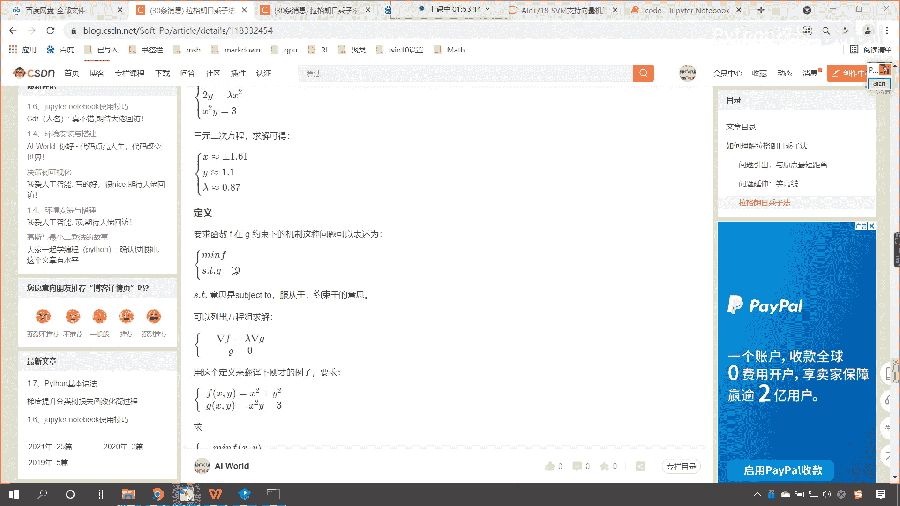
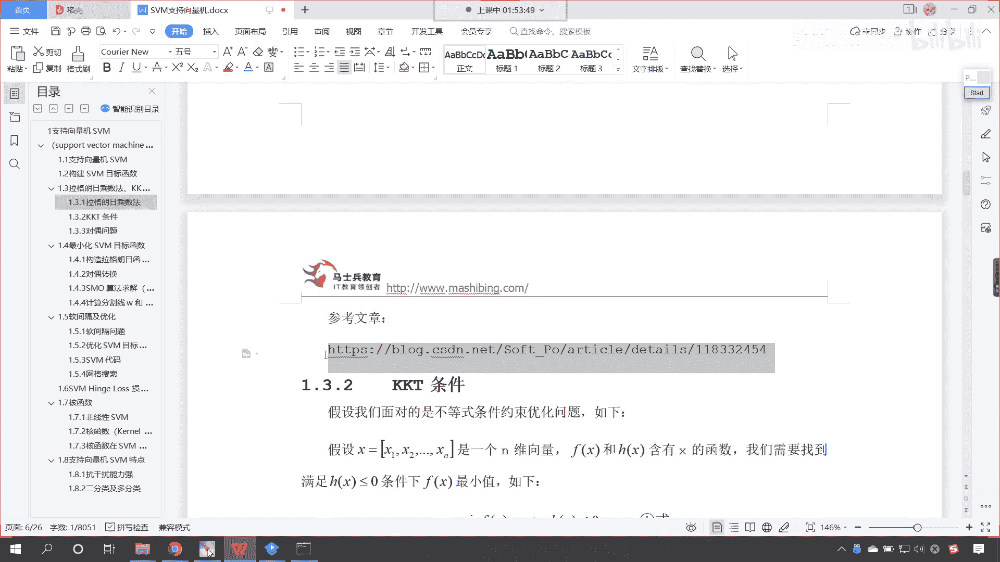
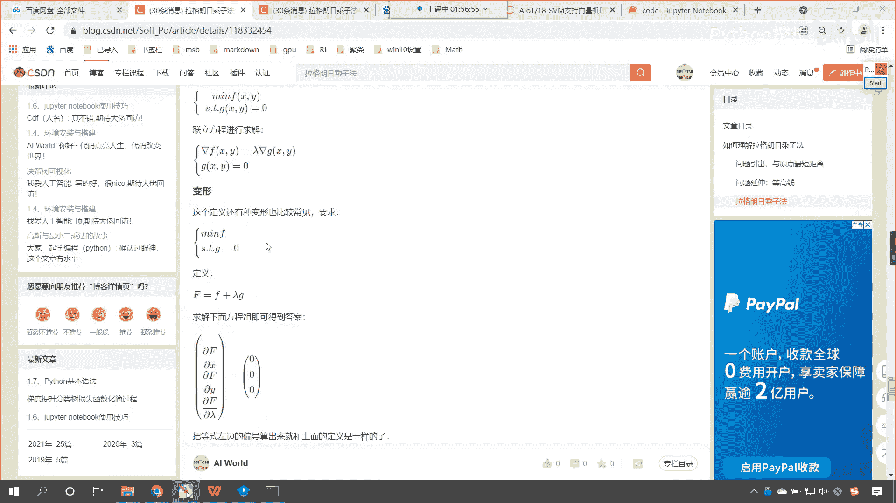
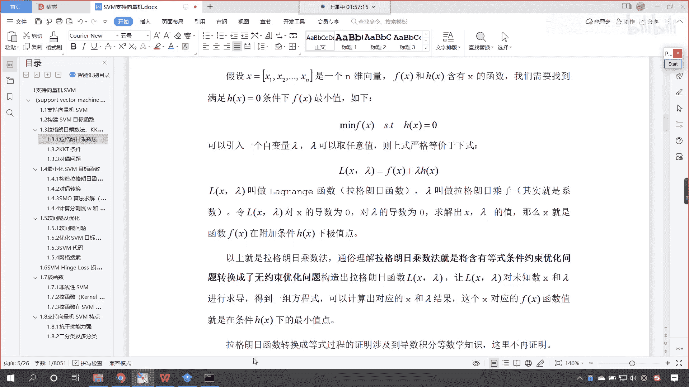
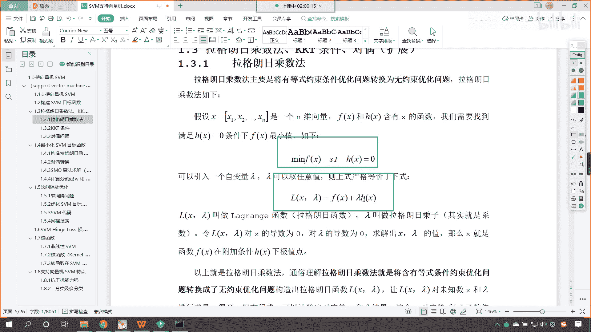

# P118：5-拉格朗日乘子法原理推导 - 程序大本营 - BV1KL411z7WA

好，那么接下来呢，我们一起来看一下这个拉格朗日乘子法是吧，这个到底怎么是吧，它由这个不等式约束是吧，你看呃拉格朗日怎么有咱们的等式约束，变成了无约束的一个求最小值的问题，好你想知道吗是吧。

那你想知道为什么上市，它可以写成下式这种形式吗，来现在的话咱们就回到啊。

回到我们这个里边，我们一起来看一下咱们拉格朗日乘子法，看从0~1好，那么呃在这里呢。

嗯就我们如何理解拉格朗日乘子法呢，看如何理解，那我们呢嗯这个把问题咱们引出一下啊，那我们有一个方程看x的平方y等于三。

这个方程对应的图像呢大概是这样的啊，这个方程对应的图像大概是这样的好，那么你就能够看到，因为咱们是x的平方加y等于三，所以说你随着x和y是吧，你无论越正越好还是越负越好，咱们的y是不是都是越小呀。

你越接近于零，这条线是不是就是特变得特别特别大了，对不对，好，那么我们的问题引出呢，咱们要看一下，就是这个函数上它与原点的最短距离看啊，就是我们蓝色的这条线，它是不是有与原点最短的距离。

你看就是蓝色的这条线是吧，嗯这个函数它哪个距离咱们的原点距离最近呢，看到了吗，是这条线吗，还是上面这条线，还是咱们这条线呢，你想一定有一条线，是不是离远点距离最近呀，对不对，好。

那么我们该如何求这个问题呢。

哎你看啊，那我们现在呢想要求其上的点与原点的距离，你看咱们在这儿呢给了个动图，你看到了吧，它从最远到最近是不是会有一个变化，是不是，那这里呢咱们就介绍一种思路啊，你看想要求远点的距离。

那我们是不是可以这个绘制绘制一个圆呀，咱们假设说与原点距离为阿尔法，它是不是就全部落在半径为阿尔法的圆上了，看到了吧，你这是圆底，是不是啊，那你看那么我们逐渐扩大半径，这个时候你就能够发现啊。

这个时候你就能够发现，那什么时候咱们所画出来的这个圆，我们和咱们这条蓝色的线它的距离最近呢，是不是咱们正好相切的时候呀，看到了吧，显然第一次与x的平方y等于三相切的点，你想一下它是不是就是距离最近的点。

好，那我们到这儿之后呢，我们稍微暂停一下，你能够理解咱们得到的第一个结论吗，就是第一次与x的平方y等于三相交的点，咱们所画出来这个圆啊，它的半径就是咱们最近的这个距离，能够理解咱们相切。

这个点是最近距离的小伙伴来，我们在讨论区里边儿，咱们扣一波666好不好，我们在讨论区里边儿好，看来大家的这个数学是吧，确实很棒啊，你的这个直观感觉是吧，告诉你没问题啊。

好那么你看此时呢咱们继续再往下看啊，咱们的圆和曲线它是不是就相切了呀，看到了吧，我们专门是不是画了一个切线呀，看到了圆和咱们的这个曲线，它就是一个相切关系，看至此我们就分析出这样的一个结论。

在咱们的极值点，咱们的圆是不是与曲线相切呀，对吧，看再极致点这个圆和咱们的曲线相切，那接下来呢我们再进行一个问题的延伸是吧，那我们就引入一个等高线，你想咱们刚才在画圆的时候，咱们是不是一圈一圈的画呀。

对不对，你看我们是一圈一圈的画，对不对，好，那么这个时候呢咱们就引入等高线，那这些等高线你就能够发现它是不是同心圆呀，完了一个圈一个圈一个圈是吧，只要是圈上的啊，只要是同一个圈上的。

那么我们可以认为它呢是等高线，看咱们现在给一个方程，你看上图可以看成x的平方加y平，加上y的平方，它的等高线x的平方和y的平方，如果我想要把图形画出来，那么其实咱们就是在三维空间当中画出来。

其实就是绿色的，这个看到了吧，就是绿色这个那我们画圈圈，你看越往上是吧，这个圈圈是不是就越大呀，对不对，越往上这个圈就越大是吧，那么它的等高线是不是值就越大呀，那么根据梯度的性质看啊。

根据咱们梯度的性质，上面这个方程就是x的平方加y平方是吧，你看他的这个一系列的等高线，看他的一系列的等高线是不是就相当于这个呀，对不对，你看它的等高线就相当于这个啊，好那么接下来呢咱们往下看啊。

那么根据梯度的性质看，根据咱们梯度的性质上面，我们对于x我们对于这个函数进行求梯度是吧，我们求偏导，那这个是不是2x2 y看到了吧，他就是2x2 y，因为你是x的平方呀，因为你是y的平方呀。

如果我要对于这个方程对x求偏导，得到的结果是2x对于y求偏导，是不是就是y好，那大家看那这个是偏导，我们这个偏导呢它就是等高线的法线看啊，我们的这个梯度它就是等高线的法线，咱把它画出来。

你就能够看到看它是向外发散的，有没有发现咱们的这些向外发散的箭头，它和咱们的等高线是不是一个垂直关系，你看它和咱们的线是什么关系，看我们的咱们的导数和咱们的等高线，你看它们是不是一个垂直关系啊，对不对。

因为导数呢是它最快的一个方向啊，看它是一个垂直关系好，那么这个是咱们法向，这个是咱们等高线它的一个这个求导之后，咱们得到的一个结果，对不对，那咱们另一个函数，看另一个函数x的平方y。

它的等高线是什么样的呀，看到了吗，它的等高线是这样的一个一个画，是不是一个一个画，那么我们要求的那个函数是不是x的平方，y等于三，是不是就是其中值为三的这个等高线，看到了吗，就是这个蓝色的，是不是啊。

你其他的只要你把三的值给它改大或改小，我们画出来的是不是，就是这个不同的这个线条呀，因此咱们这个函数它是不是也有等高线啊，我们看一下它的等高线啊，咱们是不是可以对它进行进行梯度求解呀，一样的啊。

看2x y x的平方是不是，你看我们如果要对它求导数的话是吧，那大家看他就是2x y x的平方，那么这些等高线，看咱们这个梯度和这些等高线它是什么关系啊，同样也是垂直关系，对不对，因为你求导之后。

它和这个函数自身，它的关系呢就是一个垂直关系，那么，梯度向量呢就是咱们等高线的法线，更准确的描述，就是咱们的梯度与等高线的切线是垂直的看，因为你等高线的切线呢，上面我们是给了一个切线，看到了吗。

这个绿色的就是它的切线，等高线和切线是一个垂直关系，好，那么这个里边儿呢，咱们很多都涉及到了咱们数学当中的知识啊，看到这么优美的图是吧，你有感触就行啊，好那么得到了这个结论之后，咱们紧接着呢。

我们就看一下这个拉格朗日乘子法是吧，他到底是咋回事，好那么我们现在呢就对它进行一个求解啊，那根据咱们刚才所观察的规律，咱们说这个距原点最近的点儿，它是不是和咱们粉色的这个圆，是不是进行了相切呀。

等高线是曲线怎么垂直，你往上看，你看啊，嗯等高线是曲线，咱们的这个咱们的这个法，看看咱们的这个法向啊，咱们梯度向量是等高线的这个法线，那这个法线呢和谁垂直呀，和咱们等高线的切线垂直。

那么它和等高线的切线垂直，那什么是切线呢，你看我给你画一个啊，你比如说咱们这个地方啊，看看咱们这个地方看，比如说这个点看到了吗，这个点它的切线是不是就是红色的呀，那我们所说的垂直呢是看啊。

是这个法线和咱们这个切线它俩是垂直的啊，唉所以说呢好，那么接下来呢我们继续往下看啊，那么咱们刚才以，咱们刚才呢是介绍了这个法线是吧，那接下来呢我们继续再回来，咱们知道如果说我们想要求这条曲线。

蓝色的曲线，它距离圆心的最近距离，咱们是不是就是从圆心开始画圆，一点儿一点儿画等高线，他们俩第一次相切的时候，是不是就是咱们最近的距离呀，你看一下最近的距离有一个特点，看你看一下最近的距离，有一个特点。

你有没有发现这个最近的距离，你看我们现在呢分别求的是，我们这个浅蓝色的这条箭头，它是咱们函数x平方y的法线，我们浅咱们这个浅红色的这个箭头，它是谁的法线呀，它是不是咱们圆的法线呀，当他俩距离最近的时候。

当他俩第一次相切的时候，你有没有发现咱们圆的梯度向量，和曲线的梯度向量，它们俩这个时候是不是就变成平行了，看到了吧，一点一点靠近，是不是靠近靠近靠近看平行了吧，重合了吧，是不是哎我们就根据这个特点。

咱们就可以进行相应的求解，也就是梯度向量平衡，梯度向量平行，那么我们用数学公式如何去表达呢，这个时候呢就是德尔塔f就等于拉姆达，德尔塔j，你看这个德尔塔f是不是咱们这个方程。

这个德尔塔g是不是就是咱们的等高线啊，看到了吧，这个德尔塔g就是咱们的等高线啊，我们往上滑啊，你看啊，咱们这个f x呢看这个fx就是咱们的等高线，是不是咱们这个g呢，看看咱们这个g是什么啊。

我们把g呢就定义成了咱们这个函数啊。

就是g就定义成咱们这个函数，所以说呢这两个函数啊，我们另一个函数就是即g x y就等于x的平方，加y它的这个等高线，所以当它们当他们俩是最小值的时候，那么它们重合重合的话，也就是平行，平行的话。

也就是这个d这个德尔塔f就等于拉姆达，德尔塔g，大家注意啊，这个地方是不是表示导数呀，看到了吧，这个德尔塔f是不是表示导数呀，这个lambda表示乘以合适的系数，是咱们方程左右相同。

你这个拉姆达可正可负是吧，这都可以哈，那我们还必须引入条件，x的平方y等于三这个条件，否则你看有这么多的等高线，咱们是不是不知道指的是哪一条呀，对不对，你看啊，这个时候呢来咱们现在呢把这个f看。

你看这个fx是吧，它是不是代表着咱们的等高线，是不是就代表着x的平方，是不是加上y的平方呀对吧，那么我们的g呢看咱们的方程g呢就等于啥，是不是就等于x的平方，然后乘以y对不对。

哎这个确实绕了一个好大的圈子啊，不然的话，你可能永远也不知道这个拉格朗日乘子法，它到底是怎么来的，然后呢我们有一个约束条件，看到了吧，这个约束条件是什么呀，是咱们的x的平方y是吧，它等于三这个约束条件。

因为你想我这个方程是吧，嗯这个等这个等高线是吧，它有很多呀是吧，它可以有取很多值呀，到底哪一条呀，是不是，就是咱们x的平方y对它进行了一个约束，有了这个约束，咱们是不是就回到了。

咱们刚才最初始的那个问题呀，对不对，好那么嗯到此呢咱们就继续往下看啊，好那么我们就联立方程看到了吧，因此联立方程德尔塔f等于拉姆达，这个德尔塔g x的平方，加y等于三，咱们对它进行展开。

这展开之后呢看到了吧，2x2 y等于拉姆达2x y x的平方，那我们对它进行化简，化简之后，咱们就得到了这个三元二次方程，看到了吧，化简之后咱们就可以得到三元二次方程，这个三元二次方程你也可以解出来。

我把解出来的答案都已经告诉你了，x x就等于约等于正-1。6，y约等于1。2，朗姆达约等于0。87，你看是不是就解出来了呀，对不对好，那么咱们接下来再来看啊，看，那我们就对咱们拉格朗日乘子法。

进行一个定义吧，看要求函数f在g约束下的机制，这种问题是不是就可以描述为，mf s t g等于零呀，看到了吗，这个时候到这里。

像不像咱们的拉格朗日乘子法呀，看到了吗，你看来我们回到咱们拉格朗日乘子法啊，看回到拉格朗日乘子法，看到了吗，mf x s。t h x等于零，是不是看是不是拉格朗日乘子法，只不过拉格朗日乘子法。

他告诉你说其他的你不用管，你把它带带进去就就能求解对吧，但是我们现在给大家这个博客呢，就是告诉你为什么可以带进去。

看为啥可以带进去啊，看看这个st呢，就表示subject to就是服从于约束于的意思，那咱们就可以列出方程组，是不是，咱们就是这个德尔塔f等于拉姆达这个g，然后这个g呢是不是等于零。

这个g就是咱们的约束条件啊，这个g呢就是看这个g就是等于啥，看这个g呢，看这个g呢，就等于看咱们的方程x的平方y是吧，加三是吧，它等于零对吧，看它就等于这个啊，这个就是等这个就是咱们这个方程好，那么。

用这个定义翻译一下刚才的例子是吧，看咱们刚才的例子，就是fx就等于x平方加y gx，就等于x平方y减三，求灭fxy这个t。gx y等于零，看了吗，我们是不是就把刚才的这个问题。

是不是把它转换成了咱们这个问题啊，看是不是把它转换成这个问题，这个是不是就是等式约束的求极值问题啊，这个呢就是咱们等式约束求极值，对不对，我们刚才求解出来了吧，看等式等式约束是不是咱们求了极值呀。

我们刚才已经求解出来了，对不对呀，我们是怎么做的呀，咱们是不是联立方程求它的，是不是求了个这个，对不对，好，那么大家看啊，咱们紧接着呢我们就进行一个变形啊，你看啊嗯我们讲原理，这部分快结束了。

看咱们紧接着来一个变形，咱们怎么变形呢，我们定义新的方程，f大的f就等于f加上朗姆达g，看到了吗，f加上兰姆达g，那么我们求解下面方程组即可得到答案啊，求解下面方程组即可得到答案，好那么这个时候呢看啊。

就是pf乘以这个p x，p f乘以偏y偏x乘以偏狼的，那你就能够看到咱们所构成的这个f这个函数，它是不是就增加了一个变量朗姆达呀，lm b da是不是，对不对好，那么我们就顺着这个增加的这个公式向下看。

你看f等于f加上兰姆达g是不是就相当于。

咱们在课件当中所说到的这个呀，看相不相当于它对不对，那课件当中告诉你了，说你构造这个方程直接求解即可是吧。

那我们在这儿呢还告诉你为什么啊，看那咱们就操作一下呗，看我们拼接了这个咱们构造的这个方程是吧，令导数为零，看这个导数都给你求解出来了是吧，你看构造出来这个新的方程，看啊咱们根据拉格朗日乘子法。

这个是根据拉格朗日乘子法构造出来的方程，看在这咱们说明一下啊，这个呢就是拉格朗日乘子法嗯，咱们构造方程，构造了方程之后呢，我们求导数令导数为零啊，那就是求导令导数为零，我们就求解这个方程嗯。

现在你就能够看到求解出来的方程，看到了吗，求解出来这个方程和上面一模一样，只不过这个拉姆达，咱们求解出来的是-0。87，那这个朗姆达是引入的系数，你求解出来是正的也好，是负的也好，不影响。

因为我们真实求解的，我们其实就是要求x和y对不对，我们是在拉姆达的帮助下求解出来了，x和y巧妙，所以说你看这个是不是就成立呀，对不对，你看到这儿，你就能够明白这个拉格朗日乘子法是吧，为什么要这样写。

他为什么这样写是成立的，是可以的，妙不妙是吧，这就非常巧妙啊，看最后我还告诉你了，咱们上面求解的结果略有差异是吧，朗姆达是引入的，它的正负是无关紧要的，你只需要调整gx就可以了。

因为我们上面的gx你能够发现是x的平方，y减三，你只需要把啊这个x的平方减三调整成三，减x的平方，把它调整成这个，那么你求解出来的拉姆达它就是正的0。87，所以咱们这个博客是吧，你好好的去观看一下啊。

天才吧是吧。

拉格朗日他确实是一个天才是吧，那我们呢就站在天才，站在巨人的肩膀上去。

直接使用就行了，现在呢嗯你终于明白这个拉格朗日乘子法，它到底是怎么一回事儿了是吧，如果是等式约束，那么我们直接写成这样。

