# P119：6-支持向量机SVM作业介绍 - 程序大本营 - BV1KL411z7WA

好咱们现在呢对于我们今天的作业，咱们进行一个介绍，那我们使用逻辑回归，咱们对手写数字进行了分类，这个呢是咱们上一节课所留的作业，使用逻辑回归，对于手写数字进行分类，那么它花费的时间呢是比较长的啊。

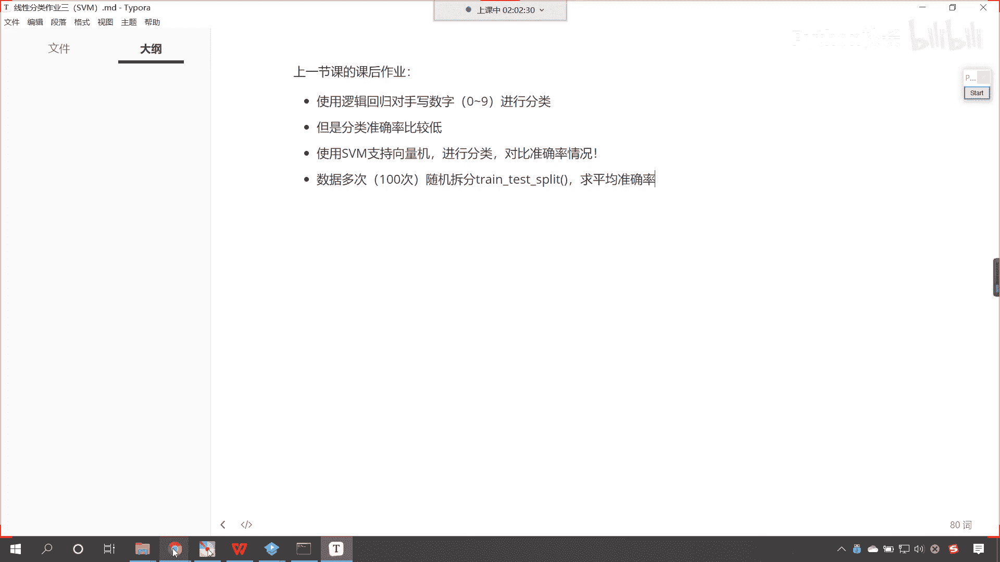

现在我给你看一下啊。

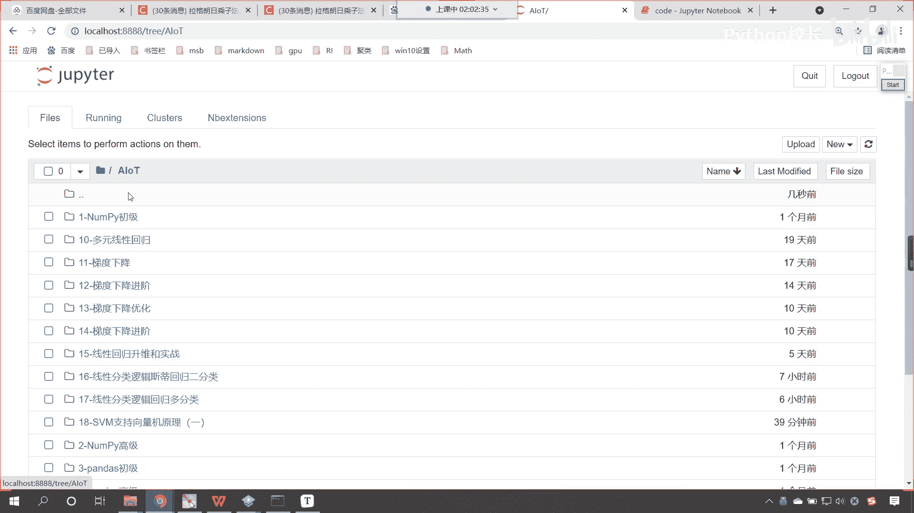

上一节课是17，这个homework。

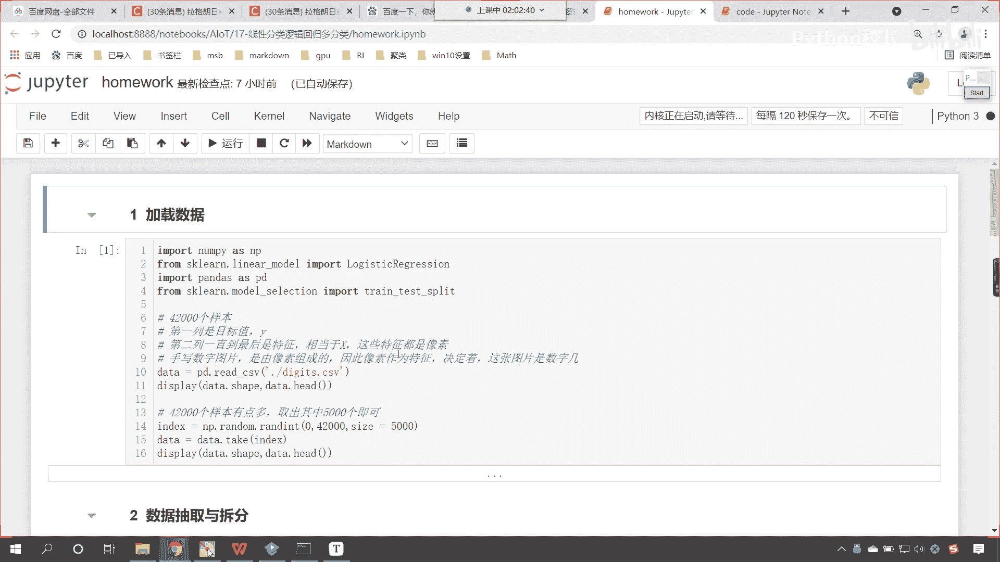

那因为这个呃视频当中都有详细的介绍啊。

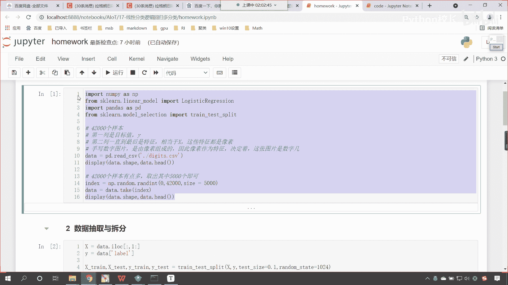

大家看咱们视频就行了啊，样本量比较多，42000个特征也比较多，所以我在这儿进行了抽样，咱们抽取其中的5000个，然后拆分是吧，这个测试数据的比例是0。1。

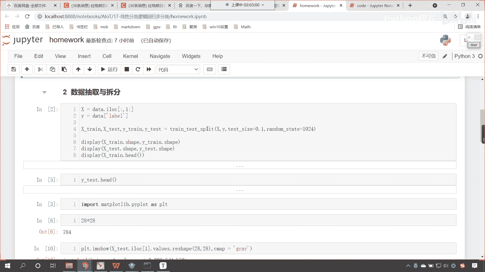

那这个代码当中都有演示啊。

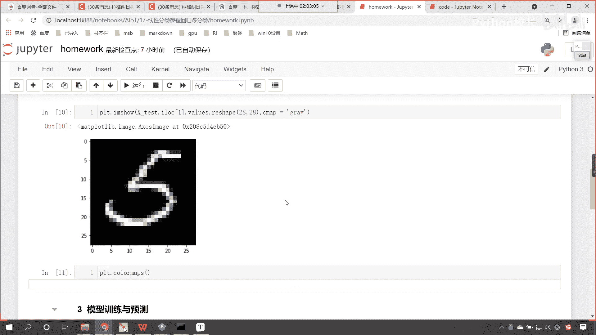

好你能够看到啊，咱们对于这个4500个数据进行训练的时候。

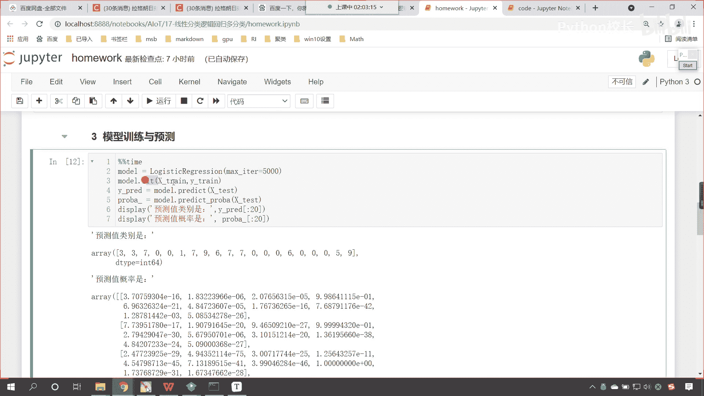

我们花费的时间呢，这个大概是14。5秒嗯，你的电脑性能不一样，这个时间长短可能会略有差异。

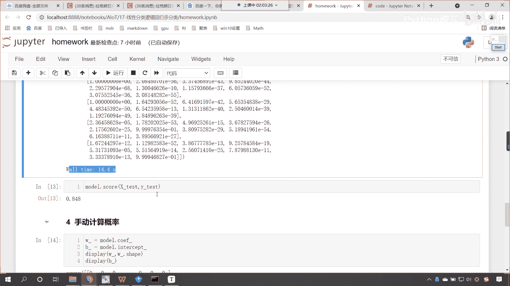

大家注意啊，这是我给了多长时间呢啊。

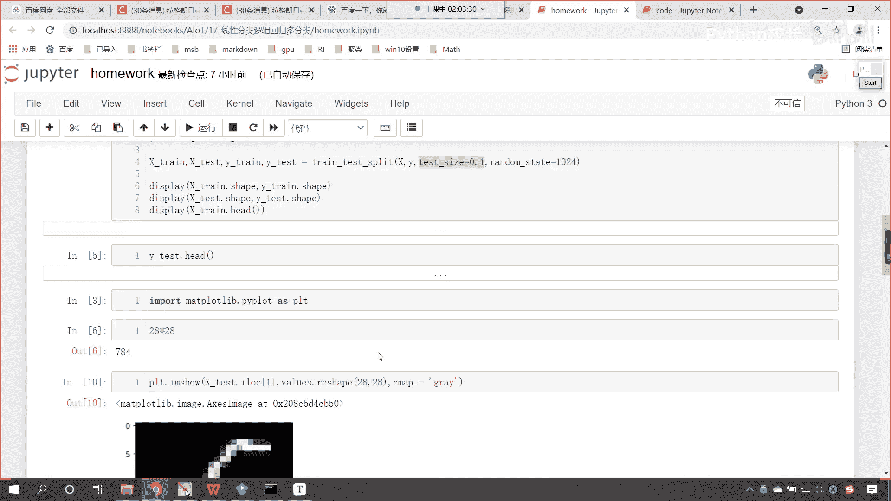

这我给了多少数据啊，这个42000个当中取了5000个，如果你42000个数据全部交给他进行训练，那么这个花的时间会更长，可能得十几分钟，所以说我才取其中的5000个样本。

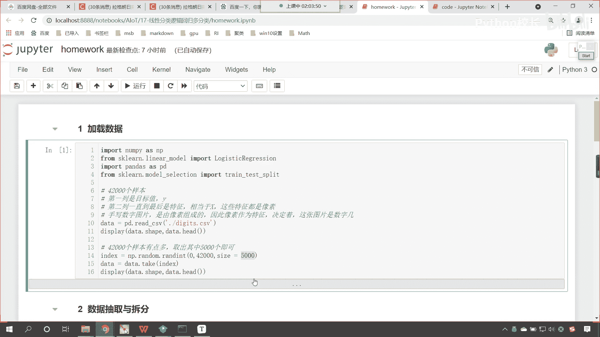

作为咱们的这个训练，那这个准确率怎么样呀，这个准确率是吧，逻辑斯蒂回归的准确率只有0。848，看到了吧，它只有0。848，那不太高，咱们今天呢我们不是学了这个支持向量机吗。

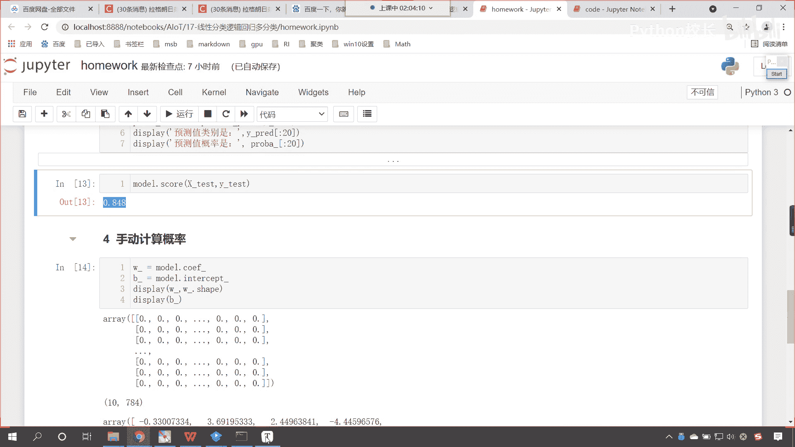

对不对，大家呢使用支持向量机，咱们进行分类，咱们对比一下准确率的情况，那么我们不仅仅是对比一次，咱们怎么样对比100次，咱们数据多次随机拆分是看啊，数据多次随机拆分是吧，这个咱们求平均准确率。

这个时候呢我们就可以比较一下，咱们的这个支持向量机和咱们的这个逻辑，斯蒂回归，对于我们手写数字，咱们这个呃样本数据，看一下，支持向量机和咱们手写数字哪个更加优秀啊。

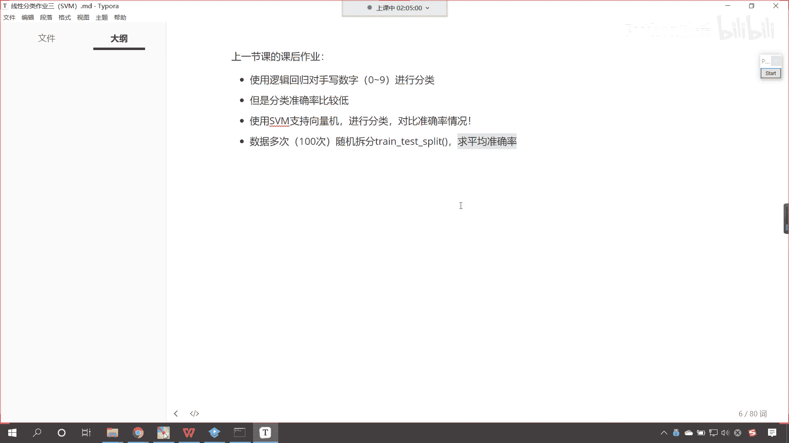