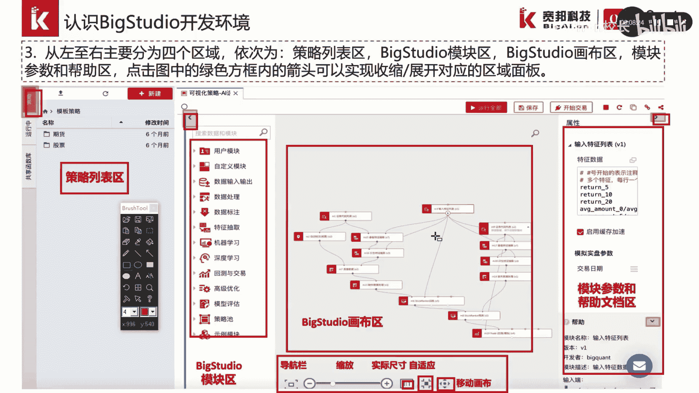

# P12：2.2.1-可视化坏境BigStudio - 程序大本营 - BV1KL411z7WA

这一节我们介绍一下big studio，被框提供的可视化编程界面。

首先我们通过登录网站3w点被框的点com，注册账号并登录，我们通过点击右侧的免费注册，可以进行账号的申请，申请账号后我们可以进行登录，随后我们点击编写策略按钮，进入策略开发界面。

在策略开发界面中，我们可以点击新建按钮，在弹窗中我们选择可视化ai策略，我们可以进入big studio的策略开发环境，那观察我们的网页页面，可以发现我们的页面从左至右分为四个区域，依次为策略列表区。

big studio的模块区，fix studio的画布区以及模块参数和帮助文档区，我们通过点击模块参数，可以实现参数的修改，在页面中我们可以发现，图中绿色的方块内有一些箭头。

我们可以通过点击这些按钮和箭头，来实现这四个面板区域的展开或者收缩，在画布的下方，我们可以看到这里有一个导航栏，我们可以通过加号和减号，来进行画布的缩放或扩扩大，我们可以通过一比一这样一个按钮。

实现实际尺寸的显示，此外我们还可以实现画布的移动。

