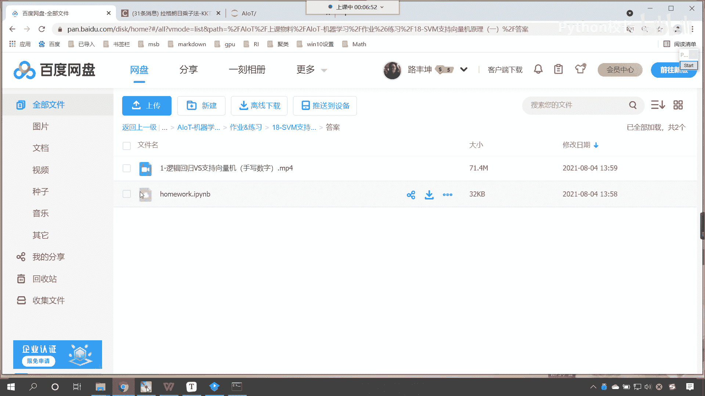
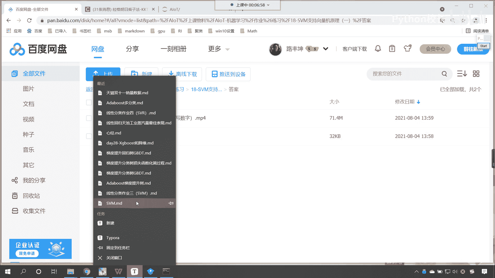
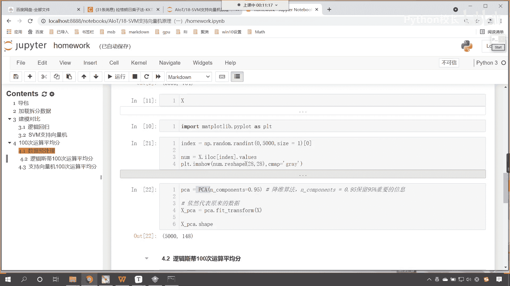
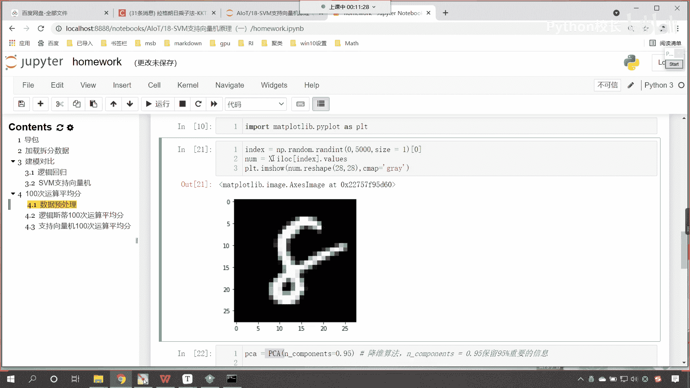
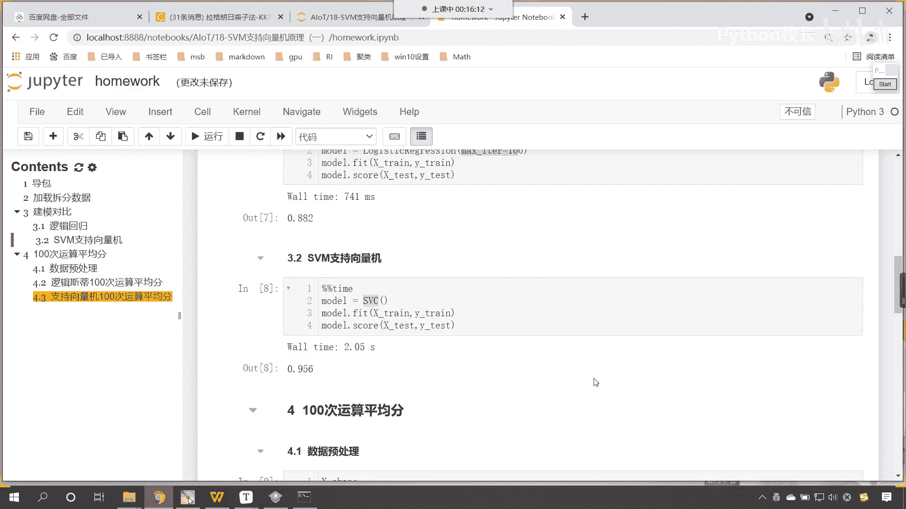
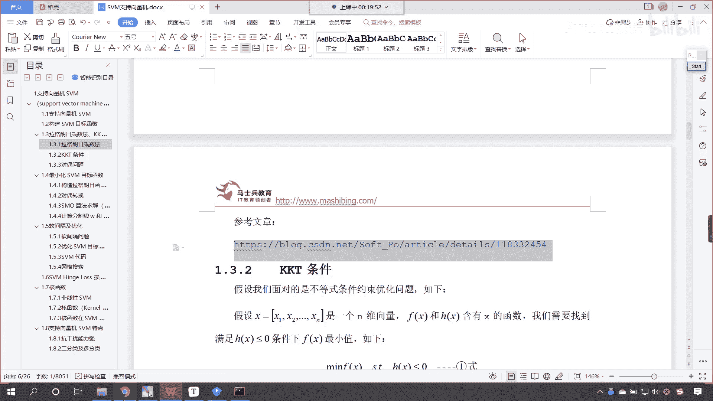
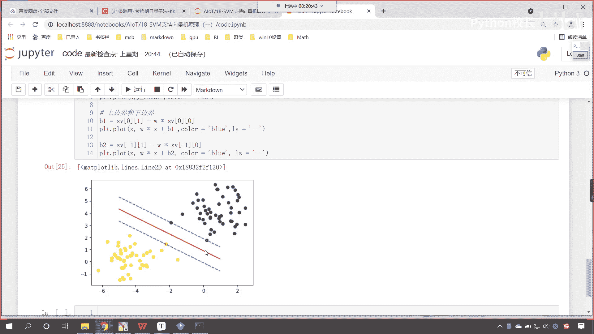

# P120：1-作业讲解和知识点回顾 - 程序大本营 - BV1KL411z7WA

好大家能够看到啊，在咱们的呃这个百度网盘当中，我们已经上传了相应的答案，咱们这个答案呢是以视频的形式进行了录制，同时呢我们也将代码进行了上传。

那咱们首先看一下咱们这个作业，它是怎样的一个要求啊。

好那么我们能够看到啊，咱们的作业要求呢，我们使用逻辑回归和支持向量机呢，对于咱们手写数字是不是进行一个分类啊，那最后呢我们提了一个这样的作业要求，就是我们数据多次运行，多次拆分。

咱们求一下它平均的准确率，对不对，今天下午呢，我看到咱们小伙伴在群里边儿反馈的，这个你的运行结果，咱们有的小伙伴运行时间可能是十几分钟啊，你想这个运行时间太长了，对不对。

那我们呢在代码当中进行了相应的处理，来咱们一起过一下啊，打开这个homework好，那么我们把目录打开，在这儿呢你能够看到咱们导包，并且加载了相应的数据，对不对，首先呢我们来这个1v一的这个pk。

咱们呢就执行一轮比赛，那在这个地方呢，你能够看到咱们逻辑斯蒂回归是吧，这个地方有一个参数叫max eer，默认情况下是100，那么我们可以把这个数据给他提高之后呢，这个就相当于是他梯度下降的次数。

那我们执行咱们就发现，最后呢我们得到的分数是0。882，也就是说它是88%的准确率，那接下来呢我们替换成咱们的知识向量机，咱们就发现同样的数据，我们的准确率是不是95。6呀，这个比上面是不是高很多呀。

对不对，那嗯在单次咱们进行训练和进行评分的时候，我们也进行了这个时间的这个统计，上面是741ms，下面的话我们就运行花的时间是两秒，那最后一步呢就是咱们第四，就是咱们这个100次运算，我们求平均分。

那在这个地方呢咱们进行了一个数据的处理，我们进行了数据的一个转换啊，这个地方呢我们介绍一下p ca，那这个p c a呢，大家看咱们导包我们是不是来自于decomposition。

那这个pca呢它叫principal，component analysis，我们把这三个英语单词，咱把它翻译成中文，这个呢就叫做主成分分析，那什么是主成分呀，那我们知道咱们点菜吃饭的时候。

这个上面是不是会有主菜啊，这个主菜是不是也就是我们所说的硬菜啊，对不对，那其他的一些这个呃餐后的餐前的甜点呀，餐后的这个嗯这个汤呀，那那些是不是都是次要的呀，对不对，那嗯嗯一在我们吃饭当中。

你想这个主菜，这个硬菜它的价值是不是最大的呀，那在我们的数据当中也有同样的这个道理啊，那数据当中我们有很多特征，有一些特征是不是不重要，那有一些特征呢它比较明显，那这些特征呢便于我们进行分类。

所以说我们就可以通过pca，这叫做principal component analysis，主成分分析，咱们呢取其精华，去其糟粕，咱们把次要的特征给它删除掉，这样的话咱们所保留下来的特征呢。

都是主要的特征，都是主菜，所以说呢这个pca，咱们现在呢在这里就使用了一下，因为呢咱们的数据有784个像素，也就相当于它有784个特征，那这个特征是相当庞大的啊，有一些特征呢它根本就不重要。

所以说呢我们使用pca对它进行操作和处理，那么咱们的这个pca呢，在我们下一个阶段我们讲聚类和降维的时候，这个算法的原理我们会带着大家一步一步，咱们把它搞定，在这里呢咱们就先使用一下，先睹为快。

看一下它的强大作用好，那么我们在进行数据预处理的时候，各位就能够看到啊。

这个里边这个代码，咱们在今天上传的视频里面都有详细的讲解啊，我在这给你演示了一下咱们的数据长什么样，咱们的数据呢你能够看到它就是一个手写数字。

看到了吧，就是这样的好，那么在我们这个作业回顾这儿呢，知识点回顾这作业，这个回回顾这我们速度就快一些，这里你就能够看到咱们声明了一个pca对吧，那里边有一个重要的参数叫n components。

这个呢是啥意思呢，它可以是整数，也可以是小数，如果我们给了0。95，那也就意味着咱们就保留95%，重要的信息，嗯咱们原来的数据不是很多吗，784例，对不对，咱们经过这个pca对它进行训练和转换之后。

你看我一执行，咱们得到转换之后的数据，咱们就能够看到它是不是148维呀，和原来的784维相比，咱们是不是减少了600多个不重要的特征呀，对不对好，那么你看你的这个特征少了之后，那我们xp ca这个数据。

它依然可以代表咱们原来的数据，这就是取其精华，弃其糟粕之后咱们得到的数据，那么咱们现在呢就使用逻辑回归运行100次，咱们求平均分，在这儿呢，各位小伙伴，你你就能够看到我来了一个for循环里面。

是不是将咱们的数据大家看啊，注意这个数据是我们转换之后数据处理之后的，xp ca这个数据咱们是不是把它拆分成了100份，你要注意这个方法，咱们之前介绍过他是不是随机拆分呀。

那随机拆分是不是就意味着它会打乱顺序啊，对不对，打乱顺序之后呢，声明模型训练预测，那我们在这去查看它分数的时候，那我们是不是除了个100，为什么要除以100啊，因为for循环100次吗。

那么每一次咱们让它的权重是不是0。01啊，这个时候就除以呗，然后让我们for循环之前声明的这个变量杠，是不是让它每次加等一啊，最后咱们是不是就可以得到一个平均分啊，看执行100次，咱们的平均分是0。

85，那么我们用了多长时间呢，28。7秒，如果说我们要不进行数据处理，大家注意啊，不进行数据处理，咱们在上面加载数据的时候，我们还进行了一个处理，咱们在加载数据，这你能够看到我们是不是进行了随机抽样呀。

原数据有多少个，42000个，其实咱们从这个当中抽出500个数据，注意啊，抽出500个数据，那么我们就可以总结这些图片当中，这些数据当中的规律，是不是你数据再多，其实它就没有意义了，就好比你现在是吧。

你有薪资啊，你现在你的财产是一个亿是吧，你的这个钱再多也没有意义，因为你这一辈子你也花不完，明白这个意思吗，所以说咱们的数据也一样，知道吧，你看这个数据是吧，够用就行，多的话是吧，反而不好是吧。

你想你的钱太多，那你是不是就得雇保镖啊，各种各样的事啊，所以说咱们这个数据呢取5000个，对于我们的算法而言，那这个就足够了，足够了之后呢，数据少了，你想我们的代码在运行在计算的时候。

那么它所花费的时间是吧，就会少一些，咱们就不用等那么久了，哎各位小伙伴就能够看到逻辑回归执行100次，我只用了28。7秒，是不是，那咱们看一下支持向量机啊，那这个支持向量机呢它运行的时间稍微长一点。

它运行了这个呃一分19秒，那我们最后能够看到支持向量机平均100次，他的这个得分呢是0。957是吧，也就是95。7，那这个表现还是相当不错的，对不对，那在这里我们就可以得到这样的一个结论。

就是咱们知识计算机对比，咱们逻辑回归，它对于我们手写数字这个案例来说，是不是效果要好很多呀，但是你要注意啊，这单纯的一个案例并不能说明，支持向量机就比逻辑斯蒂回归好，因为他们俩着重解决的问题是不一样的。

那逻辑回归呢，很多时候我们用它解决二分类问题，在咱们工业界就是说你进入公司当中是吧，真正去使用的时候，咱们再进行分类的时候，那逻辑回归呢是很好用的啊，这个在我们公司，在工业界就流传着这样的一句话。

叫一招逻辑私立打天下，可见它的效果是非常非常好的啊，好这个呢就是咱们上一节课作业的一个介绍。

那么接下来呢，我们看一下咱们上一节课所讲的内容，咱们呢简单进行一个回顾啊，那么在上一节课呢，我们介绍了支持向量机，对不对，那知识向量机是什么呢，支向量机呢我们嗯入手介绍这个地方，咱们讲到的是分类。

今天呢我们还会介绍到回归，也就是说呃一些算法呢它既可以用于分类，又可以用于回归，那么支持向量机它在进行分类的时候，他找的是最大的间隔，就是咱们b这条线是吧，我们希望把数据以最优的形式咱们给它分开。

那我们得到就是b这条线，那我们介绍了知识向量基于它的概念，那，我们还构建了知识向量积，它的目标函数，咱们呢是一步一步是吧，向下推进的，最后呢咱们的目标函数呢，哎各位小伙伴就能够看到。

最后咱们的目标函数呢，那我们用红色的圈，咱们给它标记出来啊，你看这个就是咱们最后得到的这个目标函数，我们就根据这个函数进行求解，那么我们就可以解除合适的一个w，这个上一节课呢咱们还介绍了拉格朗日乘数法。

有的时候也叫拉格朗日乘子法，这两个其实是意思一样的啊，那拉格朗日乘子法讲的是什么呀，嗯讲的是我们将有约束的方程，咱们将它转换成无约束的方程，那有约束的方程就如咱们上面这个方程所示。

你能够看到这个里边有一个约束，就是s t h x等于零，那我们转换之后呢，大家看咱们变成了一个大一点的方程，这个方程呢就是fx加上朗姆达h x，那变成这个之后，咱们就方便进行求解了，大家注意啊。

变成了这个之后就方便进行求解了，我们该求导数，求导数，咱们是不是就可以将这个方程进行计算求解，得到咱们合适的一个数值x呀，对不对，咱们就可以得到合适的数值x，那拉格朗日乘子法它到底是怎么一回事啊。

为什么上面这个方程是吧，为什么上面这个嗯，不等式可以写成下面的等式呢，咱们昨天在课堂上，我们是不是也进行了这个说明呀，在这里呢我专门写了一篇文章，那这篇文章呢你要好好的看一看，他讲到了嗯。

咱们从这个直观的这个数学问题引出，最后咱们怎么一步一步下了定义，最后怎么一步一步把方程进行了组合，那这个是不是就是拉格朗日乘子法呀，对不对，之前我们可能没有想到是吧。

因为这个单纯的数学公式它确实就比较枯燥，比较难了，你看这就是单纯的一个数学公式，为什么上面可以写成下面是吧，如果我现在问你，你肯定也是一头雾水是吧，为啥上面可以写成下面呀。

那咱们写的这篇博客里边儿有详细的说明介绍，我们是不是就是通过它进行了一个说明介绍，对不对，所以大家呢这篇文章要好好的去看一看。

好，那么昨天咱们在讲课的时候，我们代码当中，咱们是不是就演示了，咱们支持向量机，是如何对这两处数据进行划分的，是不是，那我们求解出了它的斜率，求解出了它的截距，咱们将最大几何间隔是吧。

我们将中间这条红色的线咱们是不是会出来了，好那么在这儿呢你就要搞明白是吧，这个知识向量机它到底是怎么进行划分的，那我们这个里边儿是不是就有支持向量呀，对不对，有了支持向量的这个帮助。

咱们呢就可以将它的分割线，我们就可以确定出来好。

