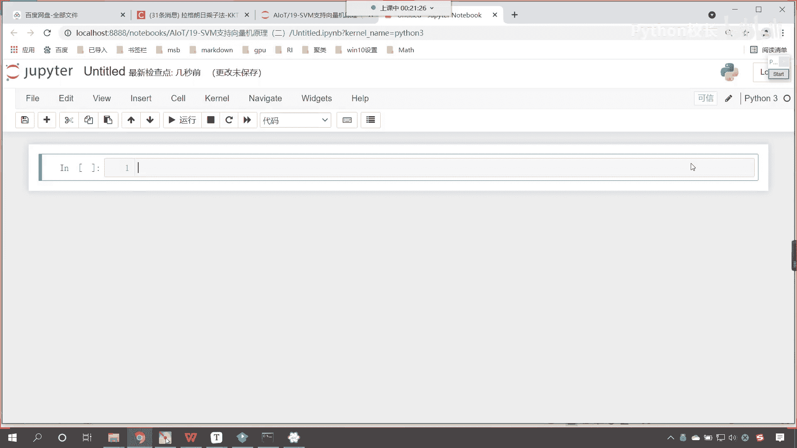
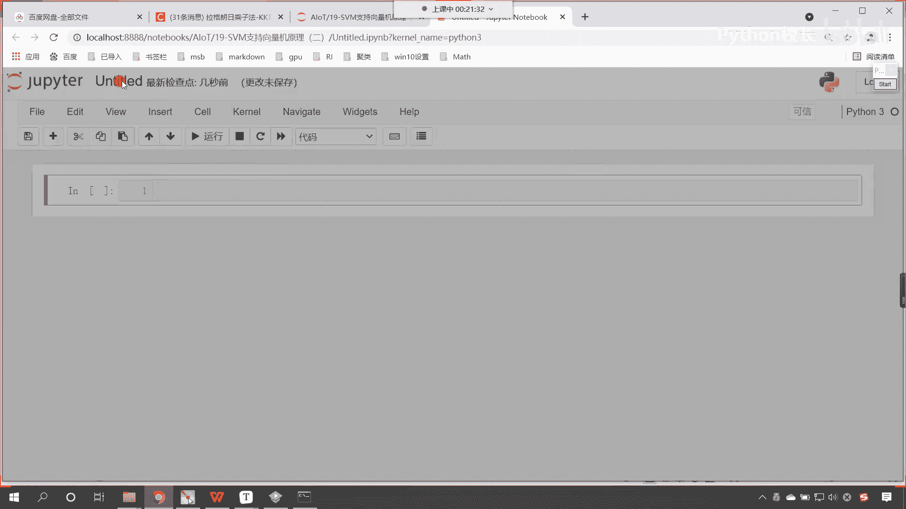
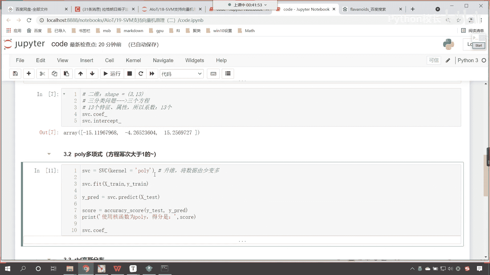

# P121：2-SVC支持向量机分类不同核函数差异 - 程序大本营 - BV1KL411z7WA

嗯首先呢我们来介绍一下支持向量机的核函数。

嗯咱们给这个改个名儿，那我们就导一下包啊，咱们就import numpy as np from sklearn，从这个当中咱们import data sets，然后呢导入算法from sk learn。

点s vm，从这个当中咱们import一个s vc，这个就是咱们的知识向量机，把知识向量机导进来之后呢，咱们在from sklearn，我们从model selection当中。

咱们导入train test split，然后呢我们再导一个包，from mask learn matrix，下面咱们导一个包，这个包呢咱们计算accuracy score，导进来好，那么导进来之后呢。

咱们在上面插入一行，来一个三级标题，那这个呢就是导包，咱们执行一下这个代码，接下来呢选中它，再来一个三级标题，那我们在这里呢，咱们来一个加载数据，好那么这里呢咱们就去调用data sets。

咱们点lol a l o a d，里边呢有一个葡萄酒的数据，那我们在加载葡萄酒的数据呢，我们给首先执行一下，给各位演示一下，咱们知道这个葡萄酒是吧，有便宜的，是不是也有比较贵的呀。

那所以说这个葡萄酒根据等级的划分，它就划分了三类，叫class 0 class 1 class 2，那我们知道咱们的葡萄酒它的好坏，它跟什么有关系呢，那大家现在能够看到啊。

这个里边呢它进行了相应的特征的一个提取，我们在看电影的时候，经常能够看到这个82年的拉菲，是不是啊，这个82年的拉菲是不是很值钱呀，那在这儿呢你就能够看到啊，l口号就是葡萄酒当中。

它所含有的酒精度是怎么样的，还有叫做malic acid是吧，这是一种酸，还有ash ash的话应该是他的这个ash，咱们看一下啊，这个ash的话看一下这个英语单词，它表示什么啊，看ash是什么意思。

ash是不是就是它的灰烬，那葡萄酒呢它的酿造过程当中呢啊，也就意味着它可能会有一些灰烬，还有我们看一下咱们的mi的啊，看这个是什么酸，就是在酿造葡萄酒的时候呢，因为葡萄酒它是一个混合物，对不对。

那我们看一下这个是什么酸呀，这个是不是就是苹果酸呀，在酿造酿造葡萄酒的时候呢，它会产生一种苹果酸，对不对，那我们再来看啊，比如说还有这个ctrl c，我们复制一下，看一下这个flavor noise。

这个表示什么是吧，咱们ctrl v哎一回车，这个时候我们就会发现，这个是不是就是黄酮类呀，那也就是说这个葡萄酒呢，葡萄酒当中的这些物质它的多和少，是不是就决定了咱葡萄酒的品质呀。

所以说这个葡萄酒被划分成了012是吧，那这个数字越大，这个应该这个品质就越好，那么价钱呢就越高，我们对于这些数据有了一定的了解，咱们呢这个在加载数据的时候。

return x y直接给一个true就可以了，接收一下咱们的数据xy，我们对这个数据咱们进行一个展示，看一下x。shape它是多少，这个时候你看过一执行咱们的数据，是不是178条呀。

这个13是不是就是表示13个类别呀，现在咱们将这个数据给它进行一个拆分，xy放进去，我们给一个test size，咱们让它是0。2，然后呢我们就接收一下x trax下划线，test y下划线。

春y下划线，test执行一下，在划分完之后呢，咱们x train它的形状呢大家来看一下啊，这个时候咱们是不是就取出了，142条数据，咱们来进行训练好，那么接下来呢数据准备好了。

咱们接下来呢就开始这个建模好，大家还记得咱们在写代码之前，我们说我们要探讨什么样的问题吗，咱们是不是要探讨知识向量积的核函数量，在上一节课当中，大家看啊，在上一节课当中。

咱们呢给我们的算法声明了一个和函数，对不对，我们看一下啊，上一节课当中，来我们打开咱们的18，打开咱们的code，看一下咱们建模，你看这个地方是不是有一个kernel呀。

这个kernel呢它就表示和函数上一节课的时候，咱们声明的这个核函数是linear，什么是linear，linear是不是就是表示线性的意思呀，对不对，那什么是线性呀，咱们之前讲的线性回归。

它呢都是线性的啊，嗯那么现在呢，咱们回到今天的代码当中，咱们对它进行一个详细的探索和说明好，那么建模这个地方呢，首先咱们呢给他来一个四级标题，我们常用的这个模，咱们常用的这个核函数呢。

首先呢第一个是线性的，线性的这个叫linear，好，那我们执行一下，那我们就声明一个s vc，我们看一下不同的核函数，它的处理结果怎么样，那就是s v c在这儿呢我们给一个kernel。

咱们让这个kernel呢就等于linear，那然后呢s vc我们调用feat，咱们进行一个训练，那就是x下划线，它所对应的目标值是外传，这个时候呢咱们就建模了，建模之后呢，咱们s v c点。

咱们调用它的，这个时候我们这个调用svc点，咱们调用它的predict方法，那么我们将x下划线test放进去，他只要一预测他的预测返回值，咱们起个名就叫做y gupredict。

这个就表示预测值有了预测值了，咱们接下来就可以计算一下它的准确率，上面导包的时候，咱们导了一个accuracy，那你看这回我们之所以把这个accuracy导进来，咱们呢就是为了让大家知道。

我们所有的评价指标都在咱们matrix当中是吧，不仅仅在方法当中，它进行了这个封装，matrix这个模块下也有各种各样的模型评价指标，那咱们在这儿呢就调用accuracy小括号。

那么第一个参数呢是咱们的外出，那我们保留的数据是y test，那这个y test就是咱们保留数据的真实值，现在呢咱们算法预测出来的是y predict，我们得到这个分数呢，咱们接收一下叫scr。

然后呢我们就打印输出一下print，那这个呢就是咱们使用核函数，linear l i n e a r，那么我们的得分是冒号，然后来一个逗号，咱们将计算出来的scr放作为参数，放到print当中。

这个时候一执行来，各位小伙伴，你能够看到准确率是不是92。7啊，是不是，那这个准确率是比较高的啊，那咱们接下来呢调用svc，咱们调用它调用一下他的call if，你知道什么是call if吗。

看你知道什么是扣if吗，扣if是不是就是咱们的系数呀，对不对，那大家能够看到咱们的扣一，你看咱们的扣if结果出来了，你看一下它的形状，咱们的形状它是不是二维的呀，对不对，它是二维的，那么我们这个形状呢。

它的二维它的形状具体是多少呢，他的ship就等于三逗号13，那我来告诉你，为什么你想一下他为什么是三呢，因为咱们这个是不是一个三分类问题啊，对不对，你看啊，为什么是三，因为呢我们首先呢是一个三分类问题。

所以说它对应几个方程，所以说它就对应三个方程，那么还有一点儿，咱们的特征数量是多少个，咱们的特征数量，大家想我们刚才在进行数据查看的时候，咱们能够看到这是不是142和13呀，也就是说咱们那些这个乙醇呀。

咱们那些铜呀，咱们苹果酸呀，它的含量是不是还有它的这个黄酮类呀，它的特征是不是13个呀，看咱们是13个特征，13个属性，所以所以呢我们的系数它的个数就是13个好，那么我们可以查看它的call if。

同样咱们是不是也可以查看它的intercept，那大家想他的这个intercept截距，你看我一执行是几个，是不是三个方程对应三个截距呀，大家注意啊，线性的，你看你现在明白为什么这个核函数叫线性了吧。

看到了吧，为什么这个核函数叫linear是吧，就在于此啊，那么有了线性之后呢，咱们接下来再来一个4g标题，咱们呢来一个polly，polly呢就是它就叫做多项式。

这个多项式呢咱们之前在讲天猫双11的时候，在那里我们也用到过多项式，那这个多项式呢，大家想咱们方程方程它的幂次啊，方程我们的幂次它是不是就是大于一呀，对不对，你看方程咱们的幂次呢它是大于一的好。

那么现在呢咱们就操作一下上面的代码，咱们进行一个复制啊，看ctrl c来在这里我们粘贴一下，那我们给他一下叫polly，那有小伙伴就说了，老师我记不住呀，来shift tab光标放到小括号当中。

点开咱们这个加号，你现在就能够看到默认情况下，这个核函数是不是r b f呀，对不对，那么它有哪些可选值呢，咱往下滑啊，你看是不是在这个地方就出来了，在这里你就能够看到是不是有linear，有polly。

有r b f，还有sigmoid，那sigmoid我们知道它是什么样的函数，polly，咱们也知道他是多项式啊，就相当于是方程的幂次大于一，那这个rbf是什么呢，这个r b f呢它是高斯和函数。

就是很多数据，它的分布是不是这个是正态分布呀，所以说呢这个里边的r b f是吧，它叫镜像积函数，也叫做高斯核函数，也就是说我们的高斯分布呢，它有一个基准是不是就是有有一个均值。

那我们所有的数据其实都是在均值的左和右，是不是有有一定程度的分布呀，好那么改成这个之后呢，你看其他的都不用改，我们使用核函数，这是吧，这个打字输出，这咱们对它进行一个小小的修改，那就是polly是吧。

得分这个时候你看我一执行，大家现在就能够发现我们使用核函数，polly多项式，咱们的得分是不是0。66呀，那你能够看到核函数对它的影响是不是很大，它的这个得分呢就大大的降低了啊。

来咱们再来看一个ctrl c，我们再来一个四级标题哈，那这个刚才使用polly多项式不行，这说明了一个什么样的问题呀，是不是说明咱们葡萄酒这个数据，它的这个数据的划分。

咱们是不是使用线性就是一个很好的选择呀，而我们如果把这个数据对它进行升维是吧，polly叫多项式，我们也可以理解成是升维，那这个时候它的效果其实是不好的，升维的话咱们呢其实是将数据看看。

咱们是将数据由少变多，这个是升为它不太好，那对于最最起码对于这个数据来说不太好，那你想我们的数据是不是千变万化的呀，对不对，对于咱们葡萄酒这个数据，polly的这个核函数不好，那说不定对于其他的数据。

这个polly多项式效果就出奇的好，这个也未可知，这就是为什么你看开发算法的这个人，是不是给了我们提供了多个选择呀，对不对，所以说存在即合理，那这个polly多项式是吧，嗯大家需要掌握。

需要知道它一定有它合理的这个理由好，那么接下来呢我们看一下r b f这个呃，这个呢叫做镜像机，那么这个呢呃它呢也叫高斯分布，好那么我们把上面这个代码咱们给它复制一下，ctrl c ctrl v。

咱们将这个polly呢改成r b f，那这个rbf它是默认的啊，默认的默认的就说明通常情况下它比较好啊，一般，这种核函数它的效果会好一些，那么这个正态高斯分布呢又叫正态分布，因为我们的很多特征。

它呢都属于我们的正态分布，那这个时候是吧，咱们现在呢嗯和函数是r b f，咱们看一下它的得分唉，大家现在就能够看到，使用核函数为r b f的得分，是不是0。6388呀，那这个效果是不是也不好。

那我们最后还有一种呢啊，咱们来一个四级标题，咱们是不是还有sigmoid的啊，是不是还有sigma的这种和函数呀，是吧，咱们把这种核函数也来给它修改一下啊。

那这个r b f呢就是咱们的sigmoid和函数，那这个sigmoid咱们在哪里用过呀，你想一下，熟悉不熟悉这个sigmoid是不是逻辑斯蒂啊，损失函数当中的这个一部分呀。

sigmoid是不是可以将数据转换到0~1之间的，这个概率，对不对，葡萄的葡萄酒的价格呢，跟年份呢有极大的这个关系，唉你要注意啊，那你说的那个酒是珍藏，对不对，你说的酒是珍藏。

咱们嗯现在我们对于葡萄酒进行评比，它呢是葡萄酒酒厂是吧，同一次同一批次酿造出来的葡萄酒，是不是也存在着不一样呀，对不对，所以说我们对于啊，这个同一批次出来的这个葡萄酒，咱们呢对它进行了类别的划分。

所以这里边呢嗯我们没有，咱们没有说这个葡萄酒的这个这个呃，考虑更多的因素，那你想葡萄酒还跟什么有关呀，是不是还跟国家有关呀，对不对，是不是还跟地区有关呀，对不对，各种因素其实都有很大的一个影响。

那假如说这个葡萄酒是吧，嗯是当年牛顿是吧，酿造的一个葡萄酒，他没有舍得喝，一直存到现在，你想这个葡萄酒到现在得值多少钱是吧，那这就是无价之宝了，嗯所以说呢咱们不考虑，那么多啊，不考虑那么多好。

现在的话我们看一下，修改成sigmoid的和函数之后，哎我们看一下它怎么样啊，执行哎，大家看sigma和函数的得分是不是更差呀，那么综上所述，咱们逻辑斯蒂嗯，咱们的这个知识向量机对于我们葡萄。

对于我们葡萄酒类别这个数据划分，是不是线性划分的得分最高呀，poly多项式呢它的这个得分不行，现在呢我们还有一个问题，看现在还有一个问题，那么我们如果使用多项式，它有没有扣if呢。

看一下看一下他有没有扣衣，扣，if是不是就是方程的系数呀，你看我一直行，来各位小伙伴，你有没有发现它就报错了呀，看到了吧，报了一个什么错呀，call if is only available。

when using a linear ko，唉你有看到吧，因为这个扣if呢它是方程的系数，而我们如果要使用多项式，那么它所对应的那个，其实呢就不是一个线性方程，那如果要不是线性方程的话。

它所对应的就没有一个固定的系数，那这个多项式这个方程的肯定是更加的复杂啊，好那么你想一下这个高斯分布呢，来咱们也执行一下s v c。coe是吧，下划线，你看这个时候一直行，大家看是不是也给报错了是吧。

这回这个错，咱们再看一下啊，is only available when using a linear kneo，是不是依然是对于这个线性核函数而言，那这个sigmoid咱们也不用看了，肯定不行。

只有咱们上面，只有咱们上面这个和函数是linear的时候，咱们是不是才可以获得呀，那就是s v c。coif，这个时候你看过一直行，唉，现在你就能够看到，咱们是不是就可以得到一个和函数呀。

好那么经过咱们这个案例呢，你就知道了，咱们在进行数据划分的时候，我们是不是就可以调整和函数，让它适应不同类型的数据啊，那么我们做机器学习，咱们很大的一部分工作，我们就是要调整咱们模型的参数。

找到最佳的参数，咱们才能够得到比较高的分数哈，那你能够发现咱们这个核函数，这个开发算法的作者，他为我们提供了多个选择，那这就说明不同的数据类型。

